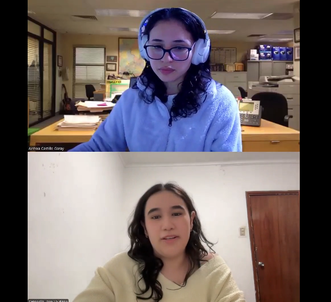

# Entrevistas — Auxilio Inteligente (AuxIA)

Este documento consolida las entrevistas realizadas a los dos segmentos objetivo del proyecto: ciudadanos afectados por desastres y autoridades responsables de atender desastres. Cada entrevista incluye los datos del entrevistado, un resumen narrativo y el enlace al video correspondiente.

---

## Segmento 1: Ciudadanos afectados por desastres

### Entrevista 1 — Andrés Torres

**Entrevistador:** Iker Gabriel Barturen Panez 
**Edad:** 20 años | **Distrito:** Chosica

Andrés es estudiante y vive en Chosica, una zona expuesta a huaicos, lluvias fuertes, inundaciones y terremotos. Comentó que su familia ya ha pasado por emergencias donde el agua afectó viviendas cercanas, hubo problemas para movilizarse y se hizo difícil conseguir alimentos.

Vive con tres familiares más. Durante una emergencia se organizan entre ellos: algunos buscan alimentos y agua, otros se quedan en casa y otros intentan averiguar qué está pasando. Su mayor preocupación es no saber si tendrán agua, comida o una forma segura de salir de la zona.

En cuanto a canales y tecnología, usa bastante el celular para revisar noticias, hablar con familiares, revisar WhatsApp y redes sociales. Sin embargo, no siempre confía en esos canales porque la información puede llegar incompleta, repetida o falsa. No se identificó un navegador específico ni marcas de dispositivos en la entrevista.

Le preocupa la incertidumbre y la falta de información clara sobre cuándo llegará la ayuda. Busca una herramienta sencilla, rápida, con pocos botones y que pueda funcionar aunque la conexión falle. Para confiar en una solución, necesita saber quién registró la ayuda, dónde se entregó y cuándo llegó, y espera que la información esté respaldada por una institución confiable.

**Video:** Microsoft Stream · Inicio: pendiente · Duración: pendiente

---

### Entrevista 2 — Fabrizzio Gionti

**Entrevistador:** Alex Tomio Nakamurakare Teruya  
**Edad:** 23 años | **Distrito:** Arequipa

Fabrizzio vivió en Arequipa en una zona vulnerable a huaicos, derrumbes e inundaciones. Mencionó que la familia tuvo que resolver los problemas por su cuenta para evitar daños mayores en su propiedad.

Vive con sus padres, hermano y abuelos. Los abuelos y padres, por su experiencia previa, se encargan de improvisar soluciones frente a imprevistos (como cierre de carreteras), mientras que él y su hermano apoyan en las tareas físicas. Su prioridad es la integridad física de sus familiares y la conservación de su vivienda.

Utiliza principalmente el celular para llamadas y WhatsApp, coordinando el estado de sus familiares. Considera que las redes sociales tradicionales no son útiles durante las emergencias.

Su principal esfuerzo fue lidiar con inundaciones (limpiar/sacar agua fría en dos ocasiones) y el corte de servicios básicos; recordó que en una ocasión la luz demoró una semana en restablecerse. Le frustra la incertidumbre y la desinformación de las noticias, las cuales suele percibir como exageradas o falsas. Su método para saber si una zona fue atendida es salir a consultar con los vecinos o llamar a los bomberos.

Espera una plataforma transparente estilo noticia/informativo que desglose los detalles reales de la emergencia, ofreciendo un canal de contacto directo con especialistas o equipos de socorro (como los bomberos).

**Video:** Microsoft Stream · Inicio: pendiente · Duración: 8:13

---

### Entrevista 3 — Antonella Urro

**Entrevistador:** Ainhoa Lucía Castillo Garay  
**Edad:** 20 años | **Distrito:** Huarochirí

Antonella es una joven de 20 años que actualmente reside en Lima, pero que vivió previamente en Huarochirí, una zona expuesta a huaicos y deslizamientos ocasionados por fuertes lluvias que inundaban las carreteras. Aunque ya no habita en esa zona, tiene familiares que aún residen allí, por lo que se mantiene al pendiente cada vez que ocurren este tipo de eventos climáticos y desastres naturales.

Su núcleo familiar está compuesto por sus padres, sus abuelos, su hermana mayor y ella. Durante el transcurso de una emergencia, sus padres asumen el rol principal en la toma de decisiones para asegurar el bienestar de todos en el hogar, mientras que ella y su hermana se encargan de la búsqueda de información y la comunicación con su entorno social, priorizando siempre la asistencia y el cuidado de sus abuelos por ser personas de la tercera edad.

El teléfono móvil resulta ser una herramienta fundamental durante las emergencias para comunicarse con su familia, buscar noticias, informarse en redes sociales y recibir alertas oficiales de las autoridades. Ante un problema, acude primero a sus familiares o conocidos cercanos a la zona afectada, y luego verifica la situación en páginas oficiales. Prefiere utilizar aplicaciones que destaquen por ser sencillas, de búsqueda rápida y con información directa, evitando herramientas que requieran navegar por demasiadas opciones porque el tiempo apremia durante una crisis.

La situación que le genera mayor esfuerzo y preocupación es la incertidumbre de no saber con exactitud la gravedad del evento, cuánto tiempo durará el bloqueo de vías o cuándo se solucionará el problema, lo cual interrumpe su rutina y le obliga a cancelar planes familiares de forma abrupta. Asimismo, experimenta frustración al recibir múltiples versiones contradictorias de la situación a través de vecinos o redes sociales, lo que le genera desconfianza respecto a qué información es verídica sobre la llegada de ayuda y retrasa su objetivo principal de conseguir bienes básicos para reponerse rápidamente.

Espera disponer de una herramienta tecnológica clara, transparente y confiable que detalle explícitamente el origen de los datos y que se actualice en tiempo real, mostrando el momento exacto del último reporte. Para confiar plenamente en la solución propuesta, considera indispensable que la plataforma visibilice sin ambigüedades qué zonas ya recibieron ayuda humanitaria y cuáles permanecen pendientes, permitiéndole comprobar la veracidad de la información y calmar la incertidumbre de su familia.

**Video:** [Microsoft Stream](https://upcedupe-my.sharepoint.com/:v:/g/personal/u202311701_upc_edu_pe/IQDi6Yh0M4O2SIi3XjYR3N8XAS_K431JU2pElYpoCeIICGs?e=B3FXF5&nav=eyJyZWZlcnJhbEluZm8iOnsicmVmZXJyYWxBcHAiOiJTdHJlYW1XZWJBcHAiLCJyZWZlcnJhbFZpZXciOiJTaGFyZURpYWxvZy1MaW5rIiwicmVmZXJyYWxBcHBQbGF0Zm9ybSI6IldlYiIsInJlZmVycmFsTW9kZSI6InZpZXcifX0%3D) · Inicio: 00:00 · Duración: 08:01

---

### Entrevista 4 — Pendiente

**Edad:** Pendiente | **Distrito:** Pendiente

Pendiente de registrar resumen de entrevista.

**Video:** Pendiente · Inicio: pendiente · Duración: pendiente

---

## Segmento 2: Autoridades responsables de atender desastres

### Entrevista 1 — Alexis Encalda Sarazar

**Entrevistador:** Iker Gabriel Barturen Panez   
**Edad:** 28 años | **Distrito:** Jesús María

Alexis es ingeniero civil. Empezó en 2013 como brigadista voluntario y desde 2019 trabaja como subgerente de gestión de riesgos de desastres. Ha participado en emergencias como el Niño Costero de 2017 y el ciclón Yaku de 2023.

Su labor incluye prevención, respuesta en campo, coordinación del COER, apoyo como secretario técnico del grupo de trabajo y reportes a entidades como INDECI. Explicó que muchas veces actúa primero y regulariza documentos después, porque en una emergencia la respuesta no puede esperar.

Los primeros reportes suelen llegar por WhatsApp, radio, llamadas, serenazgo o dirigentes. Luego se verifican en campo, se levantan fichas EDAN, se consolida información, se revisa almacén, se empadrona por DNI y se entrega ayuda con actas. También usa Excel, papel, SIMPAD, padrones, PECOSA y fotos tomadas por brigadistas.

Su principal problema es no tener una sola fuente de verdad. La información llega por varios canales y muchas veces no coincide. También hay duplicidad de beneficiarios, pérdida de fotos, actas mojadas, fichas que demoran en digitalizarse y cambios de turno donde se pierde el seguimiento.

Para adoptar una herramienta, necesita que funcione sin internet, sincronice después, corra en celulares de gama baja y se aprenda rápido. También espera que exporte actas y padrones, registre fotos con geolocalización, proteja datos personales y deje trazabilidad para auditorías.

**Video:** Microsoft Stream · Inicio: pendiente · Duración: pendiente

---

### Entrevista 2 — Claudio Romero

**Entrevistador:** Alex Tomio Nakamurakare Teruya  
**Edad:** 25 años | **Distrito:** Ate

Claudio reside en el distrito de Ate y cuenta con 2 años de experiencia participando como voluntario en la recolección, traslado y entrega de víveres, ropa y ayuda humanitaria en zonas vulnerables y provincias, coordinando con iglesias, ONGs y municipalidades.

Labora en turnos rotativos de fin de semana (48 horas intensivas). Se encarga de recibir donaciones, trasladarlas a zonas asignadas, verificar necesidades críticas (como falta de agua potable o riesgo vital) y entregar la ayuda directamente a las familias empadronadas.

Utiliza formatos físicos en papel, notas de voz o mensajes de WhatsApp, fotos tomadas con el celular e intercambios verbales entre compañeros. En campo sufren por la falta de señal/conectividad en áreas remotas.

Enfrenta severas inconsistencias al conciliar la información de entregas con los equipos que cubren los turnos de lunes a viernes. Le frustra la burocracia excesiva de la directiva (exigencia de firmas y sellos antes de liberar insumos urgentes), la duplicidad de entregas a personas que se reincorporan a las colas, y la pérdida o deterioro de actas de papel. Esto provoca que familias vulnerables queden sin apoyo.

Requiere una herramienta intuitiva que exija una curva de aprendizaje mínima debido al agotamiento físico del equipo tras las jornadas en campo. Desea que la solución funcione sin señal constante para luego enviar evidencias de forma rápida (como fotografías e información de DNI/huella digital) y mantener trazabilidad entre los distintos turnos de trabajo.

**Video:** Microsoft Stream · Inicio: pendiente · Duración: 17:15

---

### Entrevista 3 — Pendiente

**Edad:** Pendiente | **Distrito:** Pendiente

Pendiente de registrar resumen de entrevista.

**Video:** Pendiente · Inicio: pendiente · Duración: pendiente

---

### Entrevista 4 — Pendiente

**Edad:** Pendiente | **Distrito:** Pendiente

Pendiente de registrar resumen de entrevista.

**Video:** Pendiente · Inicio: pendiente · Duración: pendiente