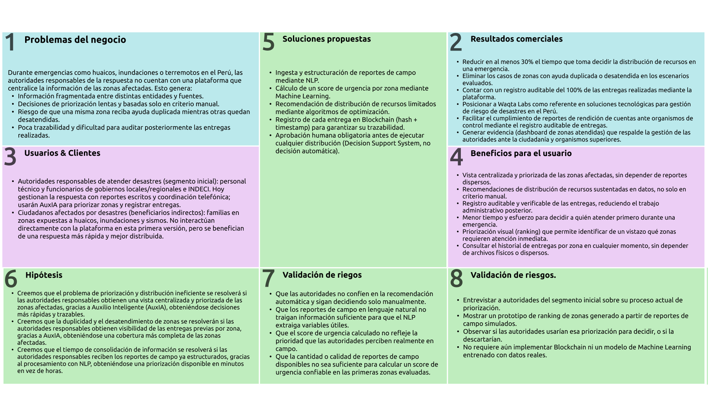

# Capítulo I: Introducción

## 1.1. Startup Profile

### 1.1.1. Descripción de la Startup

**Waqta Labs** es una startup tecnológica orientada al desarrollo de soluciones digitales que aplican tecnologías emergentes Inteligencia Artificial y Blockchain para resolver problemas de alto impacto social.

Su primer producto es **Auxilio Inteligente (AuxIA)**, una plataforma orientada al sector de gestión de emergencias y ayuda humanitaria en el Perú. AuxIA atiende la dificultad que enfrentan los responsables de la respuesta ante desastres (huaicos, inundaciones, terremotos) para priorizar qué zonas afectadas deben recibir ayuda primero, distribuir recursos limitados de forma eficiente y mantener un registro trazable y verificable de las entregas realizadas.

La orientación tecnológica e innovadora de Waqta Labs se sustenta en tres pilares: procesamiento de lenguaje natural (NLP) para estructurar reportes de campo, machine learning y optimización para calcular la urgencia de cada zona y recomendar la distribución de recursos, y Blockchain para garantizar la integridad y trazabilidad de cada entrega, manteniendo siempre la aprobación humana como paso final antes de ejecutar cualquier distribución.

### 1.1.2. Perfiles de integrantes del equipo

| Foto del estudiante | Nombres y apellidos | Código de estudiante | Carrera | Descripción |
|---|---|---|---|---|
|  | Barturen Panez, Iker Gabriel | U202312629 | Ingeniería de Software | Estudiante de Ingeniería de Software con conocimientos en backend, arquitectura de software, bases de datos, APIs REST, Git/GitHub y Docker. Puedo aportar principalmente en el diseño técnico de la solución, desarrollo backend, integración de servicios, gestión de datos y organización del proyecto. |
| [PENDIENTE] | Castillo Garay, Ainhoa Lucia | u202311701 | Ingeniería de Software | [PENDIENTE] |
| [PENDIENTE] | Nakamurakare Teruya, Alex Tomio | u20201f855 | Ingeniería de Software | [PENDIENTE] |
| [PENDIENTE] | Trillo Hernandez, Anghel Melanie | [PENDIENTE] | Ingeniería de Software | [PENDIENTE] |

## 1.2. Solution Profile

Esta sección presenta el Solution Profile de Waqta Labs. Primero se desarrollan los Antecedentes y Problemática, que consolidan el enunciado del problema, los objetivos y las restricciones del proyecto a partir de la técnica 5W + 2H. Luego se desarrolla el Lean UX Process, que traduce este análisis en el Problem Statement, las Assumptions, las Hypothesis Statements y el Lean UX Canvas del modelo de negocio de Auxilio Inteligente (AuxIA).

### 1.2.1. Antecedentes y problemática

#### Aplicación de la técnica 5W + 2H

**Who (¿Quién?):** el problema involucra, en primer lugar, a las autoridades y equipos responsables de la gestión de emergencias, como gobiernos locales, gobiernos regionales, plataformas de Defensa Civil, personal técnico que levanta información en campo y entidades articuladas al SINAGERD. También involucra a organizaciones de ayuda humanitaria que entregan recursos y a las familias damnificadas o afectadas, especialmente cuando incluyen niños, adultos mayores, personas con discapacidad u otros grupos vulnerables. Para el alcance inicial de Auxilio Inteligente (AuxIA), los usuarios directos serán las autoridades y responsables operativos que registran zonas, revisan necesidades, administran inventario y aprueban entregas; las comunidades afectadas serán beneficiarias directas del impacto de la solución.

**What (¿Qué ocurre?):** durante una emergencia, la información sobre daños, necesidades, población vulnerable, rutas de acceso, recursos disponibles y entregas previas suele llegar desde diferentes fuentes y en distintos momentos. Esta información puede estar en reportes de campo, llamadas, mensajes, formularios o registros institucionales, por lo que no siempre se encuentra lista para comparar zonas de manera rápida. Como consecuencia, los responsables de la ayuda deben tomar decisiones bajo presión con información incompleta, cambiante o fragmentada. El problema no es solo "repartir ayuda", sino priorizar zonas afectadas, evitar duplicidades, reducir zonas desatendidas y mantener evidencia verificable de lo entregado.

**Where (¿Dónde?):** el alcance del problema se ubica en el Perú, país expuesto a fenómenos como huaicos, inundaciones, lluvias intensas, deslizamientos y sismos. El proyecto no se limita a Lima Metropolitana, porque la afectación por emergencias ocurre en costa, sierra y selva, y puede involucrar zonas urbanas, periurbanas y rurales. Para el MVP se usará un escenario controlado basado en una emergencia tipo huaico o inundación, con varias zonas afectadas y recursos limitados, manteniendo la lógica aplicable a otros contextos del país.

**When (¿Cuándo?):** el problema aparece principalmente durante la respuesta inicial y la rehabilitación temprana de una emergencia. En esas etapas se debe recopilar información de daños, estimar necesidades, identificar población vulnerable, revisar inventario, decidir qué zonas atender primero, ejecutar entregas y dejar constancia de lo realizado. También continúa después de la entrega, cuando se necesita auditar qué recursos fueron distribuidos, a qué zona, en qué cantidad y en qué momento.

**Why (¿Por qué?):** la dificultad surge porque los recursos disponibles suelen ser menores que la demanda inmediata, las zonas afectadas no tienen el mismo nivel de urgencia y la información operativa cambia rápidamente. Además, cuando los registros no están centralizados, puede ser difícil saber si una zona ya recibió ayuda, si otra sigue pendiente o si una entrega fue modificada posteriormente. Esto genera una brecha entre la información recolectada en campo y la toma de decisiones logísticas, afectando la oportunidad, transparencia y trazabilidad de la ayuda humanitaria.

**How (¿Cómo se gestiona actualmente?):** en el Perú, la atención de emergencias se articula mediante el Sistema Nacional de Gestión del Riesgo de Desastres (SINAGERD). En este proceso participan entidades como INDECI, COEN, gobiernos regionales, gobiernos locales y plataformas de Defensa Civil. La información de daños y necesidades se levanta desde campo y puede registrarse en sistemas como SINPAD, además de circular mediante reportes, coordinaciones institucionales y comunicaciones operativas. Aunque este esquema permite organizar la respuesta, todavía existe una oportunidad de mejora en la consolidación rápida de datos, la priorización explicable de zonas y la trazabilidad verificable de entregas. AuxIA propone actuar como un sistema de apoyo a la decisión: no reemplaza a la autoridad responsable, sino que estructura reportes, calcula urgencia, recomienda distribución y registra evidencias verificables.

**How Much (¿Qué magnitud tiene?):** la magnitud del problema se sustenta en la recurrencia e impacto de emergencias en el país. El Compendio Estadístico 2023 de INDECI publica información oficial de emergencias y desastres ocurridos en el territorio nacional; en sus series recientes se registran miles de emergencias y más de un millón de personas afectadas en el periodo 2019-2022. Además, CENEPRED advirtió que, para el periodo abril-junio de 2024, 1,365,310 personas se encontrarían en riesgo muy alto por movimientos en masa y/o inundaciones ante lluvias previstas. En el Fenómeno El Niño Costero 2017, según reportes de SINPAD citados por OPS/OMS, al 17 de mayo de 2017 se registraron 231,874 damnificados, 1,129,013 afectados y 143 fallecidos. Estas cifras muestran que la coordinación de ayuda humanitaria no es un caso aislado, sino una necesidad recurrente en contextos donde se debe priorizar con rapidez, recursos limitados y alto impacto social.

#### Enunciado del problema

¿Cómo puede mejorarse la priorización, distribución y trazabilidad de la ayuda humanitaria durante emergencias en el Perú, cuando la información de campo llega de forma fragmentada, los recursos son limitados y las autoridades necesitan decidir qué zonas atender primero sin perder control sobre las entregas realizadas?

#### Puntos que debe resolver la solución

- Consolidar información proveniente de reportes de campo, zonas afectadas, población vulnerable, necesidades e inventario disponible.
- Transformar reportes en lenguaje natural en datos estructurados que puedan ser comparados entre zonas.
- Priorizar zonas afectadas según variables como gravedad del daño, familias afectadas, población vulnerable, necesidades críticas, tiempo sin atención y entregas previas.
- Recomendar una distribución de recursos limitada por el inventario real disponible, evitando asignaciones que excedan el stock.
- Mantener aprobación humana antes de ejecutar cualquier distribución recomendada por el sistema.
- Registrar entregas reales y asociarlas con evidencia verificable mediante hashes registrados en Blockchain, sin almacenar datos personales sensibles.

#### Objetivos

- Apoyar a las autoridades responsables en la priorización de zonas afectadas durante emergencias.
- Reducir el tiempo necesario para consolidar información operativa antes de decidir la distribución de recursos.
- Mejorar la visibilidad sobre recursos disponibles, zonas atendidas y zonas pendientes.
- Disminuir el riesgo de duplicidad de entregas o desatención de zonas críticas.
- Garantizar que las entregas registradas puedan verificarse y auditarse posteriormente.
- Demostrar el uso de Inteligencia Artificial, optimización y Blockchain en una arquitectura multicomponente aplicable a un problema de impacto social.

#### Restricciones

- La decisión final sobre la distribución de recursos se mantiene a cargo de una persona responsable; la Inteligencia Artificial solo emite recomendaciones (Decision Support System).
- No se debe almacenar información personal sensible de la población afectada en Blockchain.
- El alcance inicial (MVP) se limita a un escenario de demostración controlado, no a la totalidad de emergencias registradas en el país.
- Las fuentes de datos reales para entrenamiento de Machine Learning, como INDECI, SINPAD o EM-DAT, deben verificarse antes de afirmar disponibilidad completa de variables.
- Si no se cuenta con datos reales suficientes durante el prototipo, se podrá usar un dataset sintético basado en estructuras oficiales, indicándolo como supuesto de validación académica.
- La solución no promete eliminar por completo errores humanos o problemas de corrupción; su alcance es apoyar la decisión, mejorar trazabilidad y facilitar auditoría posterior.

### 1.2.2. Lean UX Process

A partir de los Antecedentes y Problemática, se aplica Lean UX Process sobre el dominio de gestión y distribución de ayuda humanitaria durante emergencias, para definir la visión del modelo de negocio que soportará Auxilio Inteligente (AuxIA): primero el Problem Statement, luego las Assumptions y las Hypothesis Statements, y finalmente el Lean UX Canvas que consolida todo lo anterior.

#### 1.2.2.1. Lean UX Problem Statements

- **Domain:** gestión y distribución de ayuda humanitaria durante emergencias y desastres en el Perú.
- **Customer Segments:** autoridades responsables de atender desastres como usuarios directos; ciudadanos y familias afectadas como beneficiarios del proceso de ayuda (ver sección 1.3).
- **Pain Points:** dificultad para consolidar información proveniente de distintas fuentes, priorización bajo presión temporal, recursos insuficientes frente a la demanda, poca visibilidad de las entregas ya realizadas, riesgo de duplicidad y dificultad para auditar posteriormente lo entregado.
- **Gap:** los procesos actuales no siempre ofrecen una vista integrada que conecte reportes de campo, priorización de zonas, inventario disponible, asignaciones, entregas y verificación posterior en un mismo flujo digital.
- **Vision/Strategy:** consolidar la información de campo, apoyar la priorización y distribución de recursos mediante Inteligencia Artificial, y garantizar la trazabilidad de las entregas mediante Blockchain, manteniendo siempre la decisión final en manos de un responsable humano.
- **Initial Segment:** autoridades responsables de atender desastres, por ser quienes interactuarían directamente con la plataforma para priorizar y distribuir recursos (los ciudadanos afectados son beneficiarios de la solución, no necesariamente usuarios directos).

El estado actual de la gestión y distribución de ayuda humanitaria durante emergencias en el Perú evidencia que las autoridades responsables de atender desastres enfrentan dificultades para priorizar zonas afectadas y distribuir recursos limitados cuando la información de campo se encuentra fragmentada, cambia rápidamente o no está conectada con el inventario y las entregas previas.

Esta situación puede generar decisiones más lentas, riesgo de duplicidad, zonas críticas sin atención o menor capacidad de auditoría posterior. Los procesos existentes presentan una brecha entre la recolección de información en campo y la toma de decisiones logísticas trazables. Nuestra visión consiste en desarrollar Auxilio Inteligente (AuxIA), una plataforma que utilice Inteligencia Artificial para estructurar reportes y calcular urgencia, optimización para recomendar distribución de recursos y Blockchain para verificar la integridad de las entregas registradas, manteniendo siempre la aprobación humana antes de ejecutar la ayuda.

Inicialmente nos enfocaremos en autoridades responsables de atender desastres para validar la siguiente pregunta de negocio: ¿una plataforma que consolide reportes, inventario, priorización y entregas verificables puede ayudar a tomar decisiones de distribución de ayuda de manera más rápida, sustentada y trazable durante una emergencia?

#### 1.2.2.2. Lean UX Assumptions

**Business Assumptions**

- Existe valor en disponer de una vista consolidada de zonas, necesidades e inventario durante una emergencia.
- La trazabilidad de las entregas puede aportar valor a las autoridades responsables.
- Las recomendaciones automáticas de distribución pueden ayudar a analizar múltiples variables a la vez.

**User Assumptions**

- Las autoridades responsables necesitan identificar rápidamente las zonas más urgentes.
- Las autoridades responsables necesitan conocer qué recursos ya fueron entregados a cada zona.
- Las autoridades responsables necesitan registrar cambios durante el transcurso de una emergencia.

**Technology Assumptions**

- Los reportes de campo redactados en lenguaje natural pueden contener información suficiente para ser procesados con NLP.
- Es posible construir un score de urgencia a partir de variables disponibles sobre cada zona afectada.
- Es posible registrar hashes de las entregas en Blockchain sin almacenar datos personales sensibles de la población afectada.

#### 1.2.2.3. Lean UX Hypothesis Statements

1. Creemos que ofrecer una vista consolidada de zonas, necesidades e inventario para las autoridades responsables logrará decisiones de distribución más rápidas y sustentadas. Sabremos que esto es cierto cuando el tiempo promedio para decidir la distribución de recursos en una emergencia simulada se reduzca en al menos un 30%.
2. Creemos que permitir consultar las entregas previas por zona para las autoridades responsables logrará reducir el riesgo de duplicidad o desatención de zonas. Sabremos que esto es cierto cuando, en un escenario de prueba con múltiples zonas, ninguna reciba ayuda duplicada mientras otra queda sin atender.
3. Creemos que estructurar automáticamente los reportes de campo mediante NLP para las autoridades responsables logrará reducir el tiempo que toma consolidar la información antes de priorizar una zona. Sabremos que esto es cierto cuando el procesamiento de un reporte de campo pase de tomar minutos de revisión manual a segundos de forma automatizada.

#### 1.2.2.4. Lean UX Canvas

## 1.3. Segmentos objetivo

#### Segmento 1: Ciudadanos afectados por desastres

**Descripción:** personas y familias que residen en zonas expuestas a huaicos, inundaciones o terremotos en el Perú, y que requieren asistencia humanitaria (agua, alimentos, abrigo, atención médica) durante y después de una emergencia.

**Características demográficas:** familias de distintos niveles socioeconómicos, con mayor incidencia en zonas periurbanas y rurales ubicadas en laderas, quebradas o riberas de ríos; el grupo incluye niños, adultos mayores y personas con discapacidad como poblaciones de especial atención.

**Necesidades generales:** recibir ayuda de forma oportuna, que su zona sea evaluada de acuerdo con su nivel real de afectación, evitar quedar fuera de la distribución por falta de visibilidad y tener mayor confianza en que los recursos destinados a su comunidad fueron registrados correctamente.

**Características relevantes para el dominio:** suelen encontrarse en situación de vulnerabilidad y con acceso limitado a conectividad durante la emergencia, lo que dificulta que reporten directamente su situación y dependen de terceros (autoridades, personal de campo) para ser atendidos.

**Información estadística:** este segmento representa a la población expuesta a eventos recurrentes de origen natural en el país. Como referencia, durante el Fenómeno El Niño Costero 2017, SINPAD reportó 231,874 personas damnificadas, 1,129,013 personas afectadas y 143 fallecidas al 17 de mayo de 2017, según la OPS/OMS. Asimismo, CENEPRED estimó que 1,365,310 personas se encontrarían en riesgo muy alto ante movimientos en masa y/o inundaciones por lluvias previstas para abril-junio de 2024. Estas cifras sustentan la necesidad de priorizar adecuadamente a la población afectada y vulnerable.

#### Segmento 2: Autoridades responsables de atender desastres

**Descripción:** personal de instituciones encargadas de coordinar la respuesta ante emergencias (por ejemplo, gobiernos locales/regionales y organismos de gestión de riesgo de desastres), que debe decidir cómo priorizar zonas y distribuir recursos limitados.

**Características demográficas:** personal técnico y funcionarios de gobiernos locales y regionales, así como de organismos como INDECI y plataformas de Defensa Civil, generalmente vinculados a gestión del riesgo de desastres, ingeniería, administración pública, logística, seguridad ciudadana o respuesta operativa.

**Necesidades generales:** contar con información centralizada y actualizada de las zonas afectadas, transformar reportes de campo en datos útiles, priorizar la distribución de recursos de forma sustentada, conocer inventario disponible, registrar entregas reales y mantener evidencia auditable de las decisiones tomadas.

**Características relevantes para el dominio:** opera bajo presión temporal, con recursos limitados y con necesidad de coordinar entre diferentes niveles de gobierno. Además, debe justificar sus decisiones ante superiores, organismos de control, comunidades afectadas y otros actores involucrados en la respuesta.

**Información estadística:** de acuerdo con el Directorio Nacional de Gobiernos Regionales, Municipalidades Provinciales, Distritales y de Centros Poblados 2024 del INEI, el Perú cuenta con 196 municipalidades provinciales y 1,695 municipalidades distritales, además de gobiernos regionales con competencias territoriales. Esta distribución institucional evidencia que la gestión de emergencias involucra múltiples responsables y niveles de coordinación, por lo que una solución de apoyo a la decisión debe facilitar una vista compartida de zonas, recursos, priorización y entregas.

---
