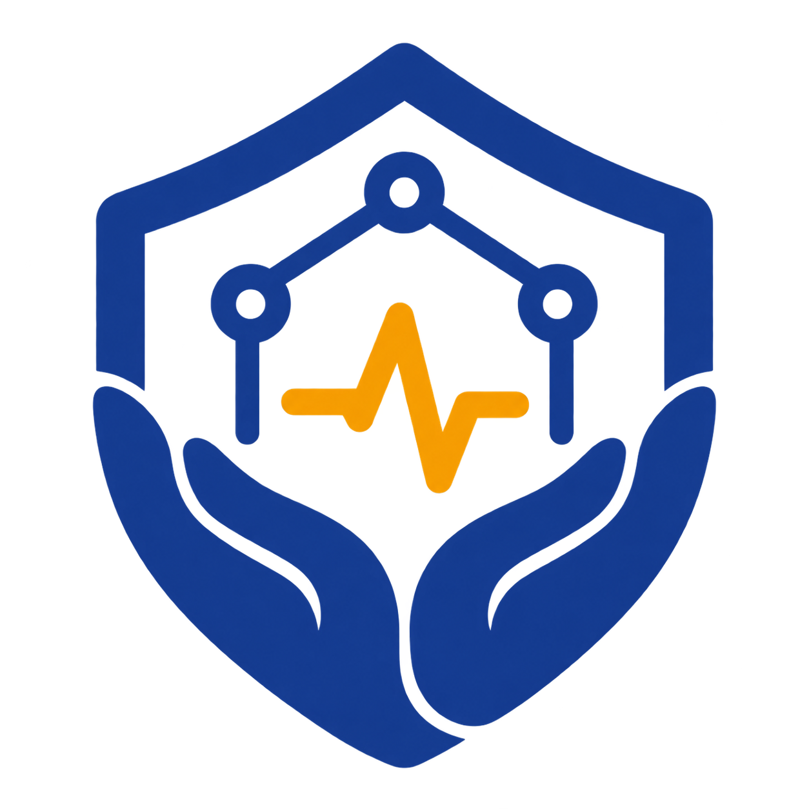
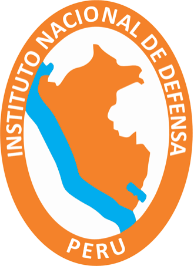
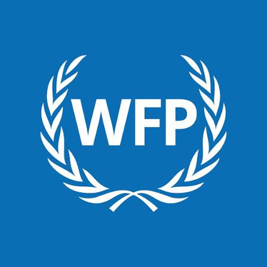
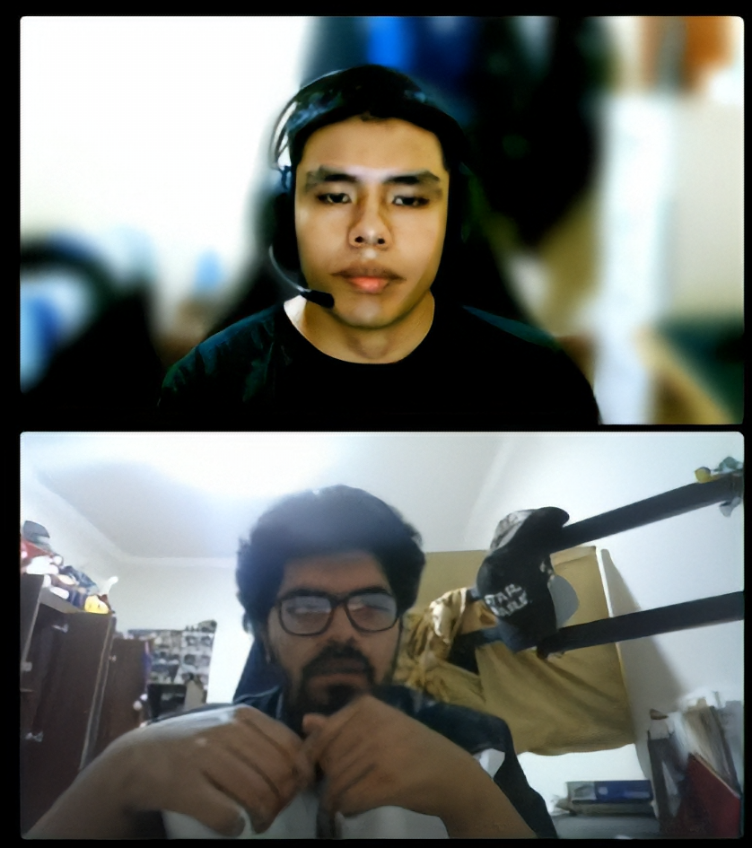
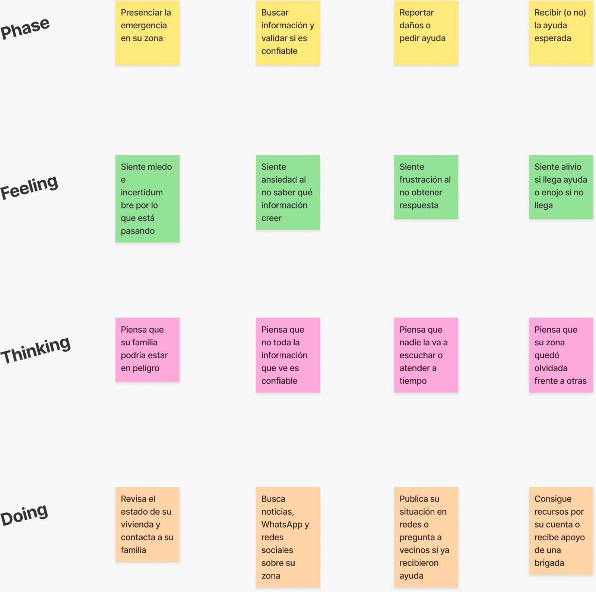
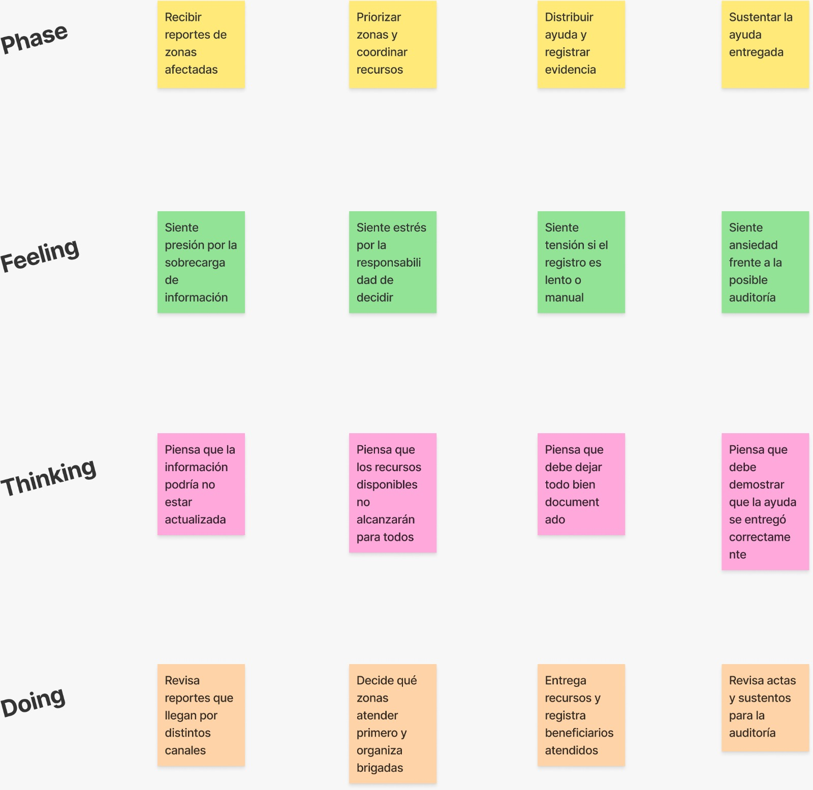

# Capítulo II: Requirements Elicitation & Analysis

## 2.1. Competidores

Esta sección identifica y analiza las soluciones existentes relacionadas con la gestión de emergencias, la distribución de ayuda humanitaria y el uso de tecnologías emergentes (Inteligencia Artificial y Blockchain) en ese dominio. Dado que **Auxilio Inteligente (AuxIA)** combina priorización explicable mediante IA, optimización de la distribución de recursos y trazabilidad mediante Blockchain, no se identificó una solución que ofrezca exactamente esta misma combinación para el contexto peruano. Por ello, el análisis distingue entre **competidores directos**, instituciones que ya gestionan información de emergencias y ayuda humanitaria en el Perú, y **competidores indirectos**, plataformas o iniciativas internacionales que resuelven parcialmente el mismo problema (gestión de desastres, mapeo colaborativo o trazabilidad blockchain de asistencia humanitaria) y que sirven como referencia para posicionar a AuxIA.

### 2.1.1. Análisis competitivo

Se revisaron soluciones existentes de gestión de emergencias y ayuda humanitaria a nivel nacional e internacional, incluyendo sistemas oficiales del Estado peruano (SINPAD y SIGBAH de INDECI), frameworks internacionales de gestión de desastres (Sahana Eden) y plataformas de referencia en trazabilidad Blockchain para ayuda humanitaria (WFP Building Blocks). También se revisó Ushahidi, plataforma de mapeo colaborativo de incidentes, la cual se descartó del análisis profundo por no abordar priorización ni distribución de recursos. A partir de esta revisión se elaboró el siguiente Competitive Analysis Landscape.

<table>
  <tbody>
    <tr>
      <th colspan="2">Competitive Analysis Landscape</th>
    </tr>
    <tr>
      <td><strong>¿Por qué llevar a cabo este análisis?</strong></td>
      <td>Conocer cómo las soluciones existentes de gestión de emergencias y ayuda humanitaria abordan hoy la priorización de zonas, la distribución de recursos y la trazabilidad de las entregas, para identificar brechas reales y definir una ventaja competitiva sostenible para Auxilio Inteligente (AuxIA) en el contexto peruano.</td>
    </tr>
  </tbody>
</table>

<table>
  <thead>
    <tr>
      <th></th>
      <th></th>
      <th>Su startup <strong>Waqta Labs — AuxIA</strong> </th>
      <th>Competidor 1 <strong>INDECI — SINPAD / SIGBAH</strong> </th>
      <th>Competidor 2 <strong>Sahana Eden</strong> </th>
      <th>Competidor 3 <strong>WFP Building Blocks</strong> </th>
    </tr>
  </thead>
  <tbody>
    <tr>
      <td rowspan="2"><strong>Perfil</strong></td>
      <td><strong>Overview</strong></td>
      <td>Plataforma que prioriza zonas afectadas por desastres mediante NLP y Machine Learning, optimiza la distribución de recursos limitados y registra las entregas de forma trazable e inmutable en Blockchain, manteniendo la aprobación humana como paso final.</td>
      <td>Sistemas oficiales del Estado peruano operados por INDECI dentro del SINAGERD: SINPAD para el registro de emergencias y daños, y SIGBAH para la gestión de bienes de ayuda humanitaria.</td>
      <td>Framework de software libre para la gestión integral de información en desastres (incidentes, organizaciones, recursos, inventario, albergues), usado por gobiernos y ONGs desde 2004.</td>
      <td>Red basada en Blockchain del Programa Mundial de Alimentos (WFP) de la ONU para coordinar y registrar la entrega de asistencia entre múltiples agencias humanitarias.</td>
    </tr>
    <tr>
      <td><strong>Ventaja competitiva</strong> ¿Qué valor ofrece a los clientes?</td>
      <td>Priorización explicable (SHAP), distribución matemáticamente óptima ante inventario limitado y evidencia verificable de cada entrega, integradas en una sola plataforma adaptada al contexto institucional peruano.</td>
      <td>Respaldo institucional, legal y de alcance nacional; es la fuente oficial de datos de emergencias en el Perú.</td>
      <td>Flexibilidad para adaptarse a distintos contextos de emergencia, respaldada por una comunidad open source de larga trayectoria.</td>
      <td>Evita la duplicidad de asistencia entre agencias mediante una cuenta blockchain única por beneficiario; según cifras publicadas por el WFP, evitó gastos no intencionados por USD 288 millones.</td>
    </tr>
    <tr>
      <td rowspan="2"><strong>Perfil de Marketing</strong></td>
      <td><strong>Mercado objetivo</strong></td>
      <td>Gobiernos regionales y locales, plataformas de Defensa Civil y entidades del SINAGERD en Perú como usuarios directos; ciudadanos y familias afectadas como beneficiarios.</td>
      <td>Entidades públicas integrantes del SINAGERD (gobiernos regionales/locales, sectores, COEN).</td>
      <td>Gobiernos y ONGs internacionales que requieren un sistema de gestión de información de desastres personalizable.</td>
      <td>Agencias humanitarias internacionales (ONU, ONGs) que operan en campamentos de refugiados y crisis de gran escala.</td>
    </tr>
    <tr>
      <td><strong>Estrategias de marketing</strong></td>
      <td>Validación mediante entrevistas y pilotos con autoridades de gestión de riesgo de desastres; posicionamiento como capa de apoyo a la decisión complementaria a los sistemas oficiales existentes, no como reemplazo institucional.</td>
      <td>Adopción por mandato normativo dentro del SINAGERD; difusión mediante canales institucionales del Estado.</td>
      <td>Difusión mediante la comunidad de software libre y adopción institucional respaldada por organizaciones como la Agencia Sueca de Cooperación, IBM y la National Science Foundation de EE. UU.</td>
      <td>Difusión mediante publicaciones oficiales del WFP y alianzas con otras agencias de la ONU (ACNUR, UNICEF) y donantes internacionales.</td>
    </tr>
    <tr>
      <td rowspan="3"><strong>Perfil de Producto</strong></td>
      <td><strong>Productos &amp; Servicios</strong></td>
      <td>Registro de emergencias/zonas, motor de priorización (NLP + ML), motor de optimización de distribución (OR-Tools) y módulo de trazabilidad Blockchain.</td>
      <td>Registro de emergencias y daños (SINPAD); gestión y control de inventario de bienes de ayuda humanitaria (SIGBAH).</td>
      <td>Registro de incidentes, organizaciones, recursos humanos, inventario, albergues y mapeo geoespacial.</td>
      <td>Registro blockchain de transacciones de asistencia monetaria y en especie; verificación biométrica de beneficiarios en algunos despliegues.</td>
    </tr>
    <tr>
      <td><strong>Precios &amp; Costos</strong></td>
      <td>[PENDIENTE] Modelo de precios y costos aún no definido; al ser un MVP académico no se ha establecido un modelo comercial.</td>
      <td>No aplica un modelo comercial; financiado con presupuesto público.</td>
      <td>Gratuito y de código abierto; los costos recaen en la implementación y el mantenimiento propios de cada adoptante.</td>
      <td>No aplica un modelo comercial; financiado con fondos humanitarios de la ONU y donantes.</td>
    </tr>
    <tr>
      <td><strong>Canales de distribución</strong> (Web y/o Móvil)</td>
      <td>Aplicación web para autoridades y personal técnico, con posible extensión móvil para reportes de campo en fases posteriores.</td>
      <td>Plataforma web institucional; aplicaciones móviles de uso interno para personal de INDECI.</td>
      <td>Plataforma web autoalojada por cada institución adoptante.</td>
      <td>Infraestructura blockchain propia integrada a los puntos de canje/entrega de asistencia del WFP.</td>
    </tr>
    <tr>
      <td rowspan="4"><strong>Análisis SWOT</strong></td>
      <td><strong>Fortalezas</strong></td>
      <td>Combinación única de NLP + ML + optimización + Blockchain; explicabilidad de las recomendaciones; diseño pensado para complementar, no reemplazar, a la autoridad institucional.</td>
      <td>Autoridad institucional, cobertura nacional, integración con el marco normativo SINAGERD.</td>
      <td>Alta flexibilidad, comunidad activa, componentes geoespaciales robustos.</td>
      <td>Escala probada (millones de transacciones), respaldo de una agencia de la ONU, ahorro documentado en comisiones bancarias.</td>
    </tr>
    <tr>
      <td><strong>Debilidades</strong></td>
      <td>Producto en etapa de MVP, sin datos históricos propios de entrenamiento ni validación en campo real; depende de la disponibilidad de reportes estructurables.</td>
      <td>Según la información pública revisada, no se identifica priorización automatizada de zonas ni trazabilidad inmutable de entregas; el registro depende en gran medida de la digitación manual de reportes de campo.</td>
      <td>Según la documentación pública revisada, no incorpora priorización automatizada con IA/ML ni registro en Blockchain; requiere capacidad técnica propia para implementarlo y mantenerlo.</td>
      <td>Orientado a asistencia monetaria/alimentaria entre agencias, no a la priorización de zonas afectadas ni a la optimización de inventario físico limitado.</td>
    </tr>
    <tr>
      <td><strong>Oportunidades</strong></td>
      <td>Falta de soluciones peruanas que integren IA explicable con trazabilidad verificable; posibilidad de interoperar con SINPAD/SIGBAH; interés creciente en blockchain humanitario.</td>
      <td>Podría integrarse con capas de IA y Blockchain complementarias, como AuxIA, para reforzar priorización y trazabilidad.</td>
      <td>Podría integrarse como fuente de datos operativos para un motor de priorización externo.</td>
      <td>Valida que el registro blockchain de asistencia humanitaria es viable a gran escala, lo que respalda la propuesta de valor de AuxIA en un contexto más pequeño (gobiernos subnacionales).</td>
    </tr>
    <tr>
      <td><strong>Amenazas</strong></td>
      <td>Resistencia al cambio institucional, requisitos de conectividad en zonas rurales y posible desarrollo de funcionalidades similares por parte de INDECI u organismos con mayor presupuesto.</td>
      <td>(Para AuxIA) Su carácter oficial y obligatorio limita cualquier reemplazo directo; una solución nueva debe justificar su valor como complemento, no como sustituto.</td>
      <td>(Para AuxIA) Su carácter gratuito y flexible podría motivar a que una institución opte por extenderlo en lugar de adoptar una solución nueva.</td>
      <td>(Para AuxIA) Si el WFP u otra agencia internacional decidiera operar en el Perú, ya cuenta con infraestructura blockchain probada a gran escala.</td>
    </tr>
  </tbody>
</table>

### 2.1.2. Estrategias y tácticas frente a competidores

- **Diferenciación por combinación de tecnologías:** ninguno de los competidores identificados integra en un mismo flujo la estructuración de reportes con NLP, la priorización explicable con Machine Learning y la trazabilidad inmutable con Blockchain. AuxIA se posiciona como una capa de apoyo a la decisión que conecta estas tres capacidades, en lugar de competir con una única funcionalidad aislada.
- **Estrategia de complementariedad, no de reemplazo:** frente a SINPAD y SIGBAH, AuxIA no busca sustituir a los sistemas oficiales de INDECI ni a la autoridad institucional del SINAGERD, sino ofrecer una capa de priorización y trazabilidad que pueda interoperar con la información que dichas entidades ya registran. Esta táctica reduce la resistencia al cambio identificada en las entrevistas con autoridades, para quienes reemplazar procesos formales establecidos representa un riesgo institucional.
- **Explicabilidad como táctica de confianza:** a diferencia de SINPAD/SIGBAH (basados en registro manual) y de plataformas sin priorización automatizada, AuxIA utiliza SHAP para mostrar qué variables explican el score de urgencia de cada zona. Esta táctica responde directamente a la necesidad, identificada en las entrevistas, de que las autoridades puedan sustentar y auditar sus decisiones ante superiores y organismos de control.
- **Diseño adaptado a condiciones de campo limitadas:** las entrevistas evidenciaron la necesidad de herramientas que funcionen con conectividad intermitente y en dispositivos de gama baja. Esta es una oportunidad frente a plataformas como Sahana Eden y Ushahidi, cuyo funcionamiento depende en mayor medida de conectividad estable para el registro y consulta de información.
- **Blockchain adaptado a la escala de gobiernos subnacionales:** a diferencia de WFP Building Blocks, orientado a grandes operaciones internacionales de asistencia monetaria/alimentaria entre agencias de la ONU, AuxIA utiliza Blockchain únicamente para registrar el hash de cada entrega (sin almacenar datos personales sensibles), permitiendo una implementación más ligera y adecuada para gobiernos regionales y locales en el Perú.
- **Transparencia hacia el ciudadano como diferenciador indirecto:** SINPAD, SIGBAH, Sahana Eden y Ushahidi están orientados principalmente al uso institucional. AuxIA plantea, como línea de evolución futura, habilitar mecanismos de verificación pública de entregas para las comunidades afectadas, en línea con la necesidad de confianza identificada en las entrevistas con ciudadanos.

## 2.2. Entrevistas

## 2.2.1. Diseño de entrevistas
Las entrevistas se adaptan a cada segmento con el fin de obtener información relevante para comprender sus necesidades y expectativas.

#### Segmento Objetivo #1: Ciudadanos afectados por desastres
1. Para comenzar, ¿podría describir su trayectoria viviendo en una zona expuesta a huaicos, inundaciones o terremotos y qué tipo de emergencias ha enfrentado su familia?
2. ¿Cómo está compuesto su círculo familiar cercano y qué rol desempeña cada miembro durante una emergencia?
3. En su día a día durante una emergencia, ¿cuál es la tarea o situación que le demanda mayor esfuerzo o preocupación y cómo afecta esto a su calidad de vida?
4. ¿Cuáles son sus metas principales para recuperarse después de una emergencia y qué importancia tiene recibir ayuda oportuna para el futuro de su familia?
5. ¿Qué criterios o señales utiliza actualmente para saber si su zona ya fue atendida o si aún necesita ayuda y qué tan seguro se siente de esa información?
6. Cuéntenos sobre la última vez que una demora o falta de ayuda afectó sus planes familiares; ¿qué fue lo que más le afectó de esa situación?
7. ¿De qué manera integra actualmente el uso del teléfono móvil en sus actividades diarias durante una emergencia?

    a. Si lo utiliza: Basado en las aplicaciones que ya conoce, ¿qué características hacen que una herramienta le resulte fácil de usar y cuáles le generan tanta complicación que prefiere dejar de usarlas?

    b. Si NO lo utiliza: ¿A qué factores atribuye el no utilizar su teléfono para informarse y de qué manera prefiere enterarse de dónde y cuándo llegará la ayuda hoy en día?

8. Cuando necesita información sobre la ayuda disponible o tiene un problema que no sabe resolver, ¿a quién o a qué medios acude primero para buscar apoyo?
9. ¿Qué factores o condiciones tendrían que cumplirse para que usted confíe plenamente en una herramienta que le informe de forma transparente qué zonas ya fueron atendidas y cuáles siguen pendientes?
10. ¿Ha evaluado anteriormente la posibilidad de recibir información más clara sobre las entregas de ayuda en su zona? ¿Qué impedimentos o desconfianzas ha encontrado?

#### Segmento Objetivo #2: Autoridades responsables de atender desastres
1. ¿Podría describir su trayectoria y rol en la atención de emergencias y desastres?
2. ¿De qué manera logra usted equilibrar el cumplimiento de los protocolos establecidos con la necesidad de tomar decisiones rápidas durante una emergencia? ¿Cuáles son las resistencias más comunes que encuentra en ese proceso?
3. ¿Cómo es el proceso que realiza actualmente para coordinar y supervisar la atención de las distintas zonas afectadas desde que recibe el primer reporte hasta que se entrega la ayuda?
4. ¿Cuáles son sus metas principales al coordinar la entrega de ayuda y qué importancia tiene lograr una distribución oportuna y equitativa?
5. ¿Qué criterios utiliza hoy en día para decidir qué zonas deben ser atendidas primero y cómo prioriza los recursos disponibles?
6. ¿Cuáles son las principales limitaciones o vacíos de información que enfrenta al intentar monitorear el estado de las zonas afectadas de forma centralizada?
7. ¿Podría describirnos una situación en la que la falta de información oportuna haya afectado la entrega de ayuda o la relación con la población afectada?
8. ¿A través de qué medios o formatos suele registrar y comunicar que la ayuda fue entregada y cómo demuestra que se hizo de forma correcta?
9. ¿Qué criterios específicos prioriza usted al momento de evaluar una nueva herramienta o tecnología para mejorar la coordinación y distribución de ayuda?
10. En su experiencia, ¿cuáles son las resistencias más comunes que usted o su equipo manifiestan cuando se propone cambiar la forma tradicional de gestionar y distribuir la ayuda?

## 2.2.2. Registro de entrevistas

Las entrevistas se realizaron para conocer de primera mano cómo viven y gestionan una emergencia los usuarios relacionados con el problema. A partir de estas respuestas se identifican necesidades, frustraciones, hábitos de comunicación y expectativas frente a una solución digital para la coordinación de ayuda.

<table>
  <thead>
    <tr>
      <th>Segmento objetivo</th>
      <th>Datos</th>
      <th>Resumen</th>
      <th>Video</th>
    </tr>
  </thead>
  <tbody>
    <tr>
      <td rowspan="4"><strong>Ciudadanos afectados por desastres</strong></td>
      <td><strong>Entrevista 1</strong>  <strong>Entrevistado:</strong> Andrés Torres <strong>Edad:</strong> 20 años <strong>Distrito:</strong> Chosica  <strong>Screenshot:</strong> </td>
      <td><strong>Datos generales:</strong> Andrés es estudiante y vive en Chosica, una zona expuesta a huaicos, lluvias fuertes, inundaciones y terremotos. Comentó que su familia ya ha pasado por emergencias donde el agua afectó viviendas cercanas, hubo problemas para movilizarse y se hizo difícil conseguir alimentos.  <strong>Contexto familiar:</strong> Vive con tres familiares más. Durante una emergencia se organizan entre ellos: algunos buscan alimentos y agua, otros se quedan en casa y otros intentan averiguar qué está pasando. Su mayor preocupación es no saber si tendrán agua, comida o una forma segura de salir de la zona.  <strong>Canales y tecnología:</strong> Usa bastante el celular para revisar noticias, hablar con familiares, revisar WhatsApp y redes sociales. Sin embargo, no siempre confía en esos canales porque la información puede llegar incompleta, repetida o falsa. No se identificó un navegador específico ni marcas de dispositivos en la entrevista.  <strong>Necesidades y frustraciones:</strong> Le preocupa la incertidumbre y la falta de información clara sobre cuándo llegará la ayuda. Busca una herramienta sencilla, rápida, con pocos botones y que pueda funcionar aunque la conexión falle.  <strong>Expectativas:</strong> Para confiar en una solución, necesita saber quién registró la ayuda, dónde se entregó y cuándo llegó. También espera que la información esté respaldada por una institución confiable.</td>
      <td><strong>URL:</strong> Microsoft Stream <strong>Inicio:</strong> <strong>Duración:</strong></td>
    </tr>
<tr>
        <td><strong>Entrevista 2</strong>  <strong>Entrevistado:</strong> Fabrizzio Gionti <strong>Edad:</strong> 23 años <strong>Distrito:</strong> Arequipa  <strong>Screenshot:</strong> </td>
         <td><strong>Datos generales:</strong> Fabrizzio vivió en Arequipa en una zona vulnerable a huaicos, derrumbes e inundaciones. Mencionó que la familia tuvo que resolver los problemas por su cuenta para evitar daños mayores en su propiedad.  <strong>Contexto familiar:</strong> Vive con sus padres, hermano y abuelos. Los abuelos y padres, por su experiencia previa, se encargan de improvisar soluciones frente a imprevistos (como cierre de carreteras), mientras que él y su hermano apoyan en las tareas físicas. Su prioridad es la integridad física de sus familiares y la conservación de su vivienda.  <strong>Canales y tecnología:</strong> Utiliza principalmente el celular para llamadas y WhatsApp, coordinando el estado de sus familiares. Considera que las redes sociales tradicionales no son útiles durante las emergencias.  <strong>Necesidades y frustraciones:</strong> Su principal esfuerzo fue lidiar con inundaciones (limpiar/sacar agua fría en dos ocasiones) y el corte de servicios básicos; recordó que en una ocasión la luz demoró una semana en restablecerse. Le frustra la incertidumbre y la desinformación de las noticias, las cuales suele percibir como exageradas o falsas. Su método para saber si una zona fue atendida es salir a consultar con los vecinos o llamar a los bomberos.  <strong>Expectativas:</strong> Espera una plataforma transparente estilo noticia/informativo que desglose los detalles reales de la emergencia, ofreciendo un canal de contacto directo con especialistas o equipos de socorro (como los bomberos).</td>
         <td><strong>URL:</strong> Microsoft Stream <strong>Inicio:</strong> <strong>Duración:</strong> 8:13</td>
      </tr>
     <tr>
       <td><strong>Entrevista 3</strong>  <strong>Entrevistado:</strong> Pendiente <strong>Edad:</strong> Pendiente <strong>Distrito:</strong> Pendiente  <strong>Screenshot:</strong> Pendiente</td>
       <td>Pendiente de registrar resumen de entrevista.</td>
       <td><strong>URL:</strong> Pendiente <strong>Inicio:</strong> Pendiente <strong>Duración:</strong> Pendiente</td>
     </tr>
     <tr>
       <td><strong>Entrevista 4</strong>  <strong>Entrevistado:</strong> Pendiente <strong>Edad:</strong> Pendiente <strong>Distrito:</strong> Pendiente  <strong>Screenshot:</strong> Pendiente</td>
       <td>Pendiente de registrar resumen de entrevista.</td>
       <td><strong>URL:</strong> Pendiente <strong>Inicio:</strong> Pendiente <strong>Duración:</strong> Pendiente</td>
     </tr>
     <tr>
       <td rowspan="4"><strong>Autoridades responsables de atender desastres</strong></td>
      <td><strong>Entrevista 1</strong>  <strong>Entrevistado:</strong> Alexis Encalda Sarazar <strong>Edad:</strong> 28 años <strong>Distrito:</strong> Jesus Maria  <strong>Screenshot:</strong> </td>
      <td><strong>Datos generales:</strong> Alexis es ingeniero civil. Empezó en 2013 como brigadista voluntario y desde 2019 trabaja como subgerente de gestión de riesgos de desastres. Ha participado en emergencias como el Niño Costero de 2017 y el ciclón Yaku de 2023.  <strong>Trabajo y responsabilidades:</strong> Su labor incluye prevención, respuesta en campo, coordinación del COER, apoyo como secretario técnico del grupo de trabajo y reportes a entidades como INDECI. Explicó que muchas veces actúa primero y regulariza documentos después, porque en una emergencia la respuesta no puede esperar.  <strong>Canales y tecnología:</strong> Los primeros reportes suelen llegar por WhatsApp, radio, llamadas, serenazgo o dirigentes. Luego se verifican en campo, se levantan fichas EDAN, se consolida información, se revisa almacén, se empadrona por DNI y se entrega ayuda con actas. También usa Excel, papel, SIMPAD, padrones, PECOSA y fotos tomadas por brigadistas.  <strong>Necesidades y frustraciones:</strong> Su principal problema es no tener una sola fuente de verdad. La información llega por varios canales y muchas veces no coincide. También hay duplicidad de beneficiarios, pérdida de fotos, actas mojadas, fichas que demoran en digitalizarse y cambios de turno donde se pierde el seguimiento.  <strong>Expectativas:</strong> Para adoptar una herramienta, necesita que funcione sin internet, sincronice después, corra en celulares de gama baja y se aprenda rápido. También espera que exporte actas y padrones, registre fotos con geolocalización, proteja datos personales y deje trazabilidad para auditorías.</td>
      <td><strong>URL:</strong> Microsoft Stream <strong>Inicio:</strong> <strong>Duración:</strong></td>
    </tr>
<tr>
        <td><strong>Entrevista 2</strong>  <strong>Entrevistado:</strong> Claudio Romero <strong>Edad:</strong> 25 años <strong>Distrito:</strong> Ate  <strong>Screenshot:</strong> </td>
         <td><strong>Datos generales:</strong> Claudio reside en el distrito de Ate y cuenta con 2 años de experiencia participando como voluntario en la recolección, traslado y entrega de víveres, ropa y ayuda humanitaria en zonas vulnerables y provincias, coordinando con iglesias, ONGs y municipalidades.  <strong>Trabajo y responsabilidades:</strong> Labora en turnos rotativos de fin de semana (48 horas intensivas). Se encarga de recibir donaciones, trasladarlas a zonas asignadas, verificar necesidades críticas (como falta de agua potable o riesgo vital) y entregar la ayuda directamente a las familias empadronadas.  <strong>Canales y tecnología:</strong> Utiliza formatos físicos en papel, notas de voz o mensajes de WhatsApp, fotos tomadas con el celular e intercambios verbales entre compañeros. En campo sufren por la falta de señal/conectividad en áreas remotas.  <strong>Necesidades y frustraciones:</strong> Enfrenta severas inconsistencias al conciliar la información de entregas con los equipos que cubren los turnos de lunes a viernes. Le frustra la burocracia excesiva de la directiva (exigencia de firmas y sellos antes de liberar insumos urgentes), la duplicidad de entregas a personas que se reincorporan a las colas, y la pérdida o deterioro de actas de papel. Esto provoca que familias vulnerables queden sin apoyo.  <strong>Expectativas:</strong> Requiere una herramienta intuitiva que exija una curva de aprendizaje mínima debido al agotamiento físico del equipo tras las jornadas en campo. Desea que la solución funcione sin señal constante para luego enviar evidencias de forma rápida (como fotografías e información de DNI/huella digital) y mantener trazabilidad entre los distintos turnos de trabajo.</td>
         <td><strong>URL:</strong> Microsoft Stream <strong>Inicio:</strong> <strong>Duración:</strong> 17:15</td>
      </tr>
     <tr>
       <td><strong>Entrevista 3</strong>  <strong>Entrevistado:</strong> Pendiente <strong>Edad:</strong> Pendiente <strong>Distrito:</strong> Pendiente  <strong>Screenshot:</strong> Pendiente</td>
       <td>Pendiente de registrar resumen de entrevista.</td>
       <td><strong>URL:</strong> Pendiente <strong>Inicio:</strong> Pendiente <strong>Duración:</strong> Pendiente</td>
     </tr>
     <tr>
       <td><strong>Entrevista 4</strong>  <strong>Entrevistado:</strong> Pendiente <strong>Edad:</strong> Pendiente <strong>Distrito:</strong> Pendiente  <strong>Screenshot:</strong> Pendiente</td>
       <td>Pendiente de registrar resumen de entrevista.</td>
       <td><strong>URL:</strong> Pendiente <strong>Inicio:</strong> Pendiente <strong>Duración:</strong> Pendiente</td>
     </tr>
   </tbody>
</table>

## 2.2.3. Análisis de entrevistas

## 2.3. Needfinding

## 2.3.1. User Personas

Los user personas fueron elaborados a partir de los hallazgos recogidos en las entrevistas iniciales. Cada arquetipo representa a uno de los segmentos objetivo del proyecto y sintetiza sus objetivos, frustraciones, motivaciones, canales de interacción y necesidades principales.

#### Segmento Objetivo #1: Ciudadanos afectados por desastres

#### Segmento Objetivo #2: Autoridades responsables de atender desastres

## 2.3.2. User Task Matrix

En esta sección se presenta el User Task Matrix, que compara las tareas que realizan los User Personas para cumplir sus objetivos durante una emergencia. Se consideran los perfiles de **Carla Quispe**, representante del segmento de ciudadanos afectados por desastres, y **Luis Salazar**, representante del segmento de autoridades responsables de atender desastres.

Las tareas se plantean como actividades que los usuarios realizan actualmente, incluso sin la existencia de la solución tecnológica propuesta. Para cada tarea se evalúa la **Frecuencia (F)** y la **Importancia (I)** bajo una escala de **Baja**, **Media** y **Alta**.

| N° | Task Matrix | Carla Quispe | Carla Quispe | Luis Salazar | Luis Salazar |
| --- | --- | --- | --- | --- | --- |
|  |  | Frecuencia | Importancia | Frecuencia | Importancia |
| 1 | Buscar información sobre la emergencia en su zona | Alta | Alta | Alta | Alta |
| 2 | Confirmar si una zona ya recibió ayuda o sigue pendiente | Alta | Alta | Alta | Alta |
| 3 | Coordinar con familiares, vecinos o equipo de trabajo | Alta | Alta | Alta | Alta |
| 4 | Reportar daños, necesidades o estado de una zona afectada | Media | Alta | Alta | Alta |
| 5 | Priorizar qué zonas o personas requieren atención primero | Baja | Media | Alta | Alta |
| 6 | Conseguir o distribuir recursos básicos como agua, alimentos y abrigo | Alta | Alta | Alta | Alta |
| 7 | Validar si la información recibida es confiable | Alta | Alta | Alta | Alta |
| 8 | Registrar beneficiarios o personas afectadas | Baja | Media | Alta | Alta |
| 9 | Registrar evidencia de la ayuda entregada | Baja | Media | Alta | Alta |
| 10 | Consultar inventario o disponibilidad de recursos | N/A | N/A | Alta | Alta |
| 11 | Comunicar avances, retrasos o cambios en la atención | Media | Alta | Alta | Alta |
| 12 | Revisar documentos, actas o sustentos para auditoría | N/A | N/A | Media | Alta |

#### Análisis de la Matriz

Al analizar la matriz, se identifican coincidencias importantes entre ambos arquetipos. Tanto Carla como Luis necesitan buscar información, confirmar el estado de atención de las zonas afectadas y coordinar con otras personas durante la emergencia. Esto evidencia que la comunicación y la confianza en la información son tareas críticas para los dos segmentos.

En el caso de Carla, sus tareas se concentran en proteger a su familia, conseguir recursos básicos y reducir la incertidumbre. Ella depende de canales cercanos como familiares, vecinos, WhatsApp, redes sociales y noticias. Por eso, validar si la información es confiable tiene alta frecuencia e importancia para su perfil.

En el caso de Luis, las tareas tienen un enfoque más operativo y administrativo. Además de recibir información, debe priorizar zonas, coordinar brigadas, revisar recursos, registrar beneficiarios, generar evidencia y sustentar las entregas realizadas. Para este perfil, el registro y la trazabilidad son tareas críticas porque impactan en la distribución de ayuda y en la rendición de cuentas.

La principal diferencia entre ambos perfiles está en el nivel de responsabilidad sobre la gestión de la ayuda. Carla necesita saber qué ocurre y qué apoyo recibirá su zona, mientras que Luis necesita organizar la respuesta, distribuir recursos limitados y demostrar que la ayuda fue entregada correctamente. Esta matriz confirma que la solución debe atender tanto la necesidad de información clara para los ciudadanos como la necesidad de control operativo para las autoridades.

## 2.3.3. Empathy Mapping

Los empathy maps permiten organizar lo que cada arquetipo piensa, siente, ve, escucha, dice y hace frente al problema. A partir de estos mapas se identifican pains y gains que ayudan a entender mejor las necesidades de cada segmento objetivo.

#### Segmento Objetivo #1: Ciudadanos afectados por desastres

#### Segmento Objetivo #2: Autoridades responsables de atender desastres

## 2.3.4. As-Is Scenario Mapping

Para el As-Is Scenario Mapping usamos la plantilla de FigJam, una para cada persona (Carla y Luis). Antes de llenarla, repasamos las entrevistas y los empathy maps que ya teníamos, para no perder de vista lo que cada usuario vive realmente. Luego cada integrante hizo su propia lluvia de ideas por separado, anotando en post-its qué hace, qué piensa y qué siente el usuario en distintos momentos, antes de juntarnos a revisar todo en equipo.

Con todos los post-its puestos, los agrupamos según las fases que más se repetían y les pusimos nombre de acuerdo a lo que realmente pasa durante una emergencia. Ya con eso armado, marcamos qué partes del proceso le funcionan bien al usuario y cuáles no, y dejamos señalado en qué puntos todavía nos falta información para entender mejor su comportamiento (los blank areas).

#### Segmento Objetivo #1: Ciudadanos afectados por desastres

#### Segmento Objetivo #2: Autoridades responsables de atender desastres

## 2.4. Ubiquitous Language

---
