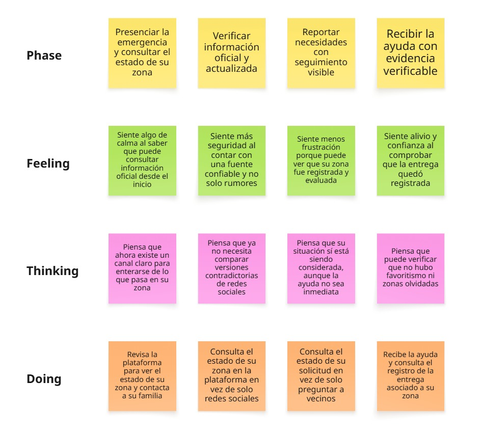
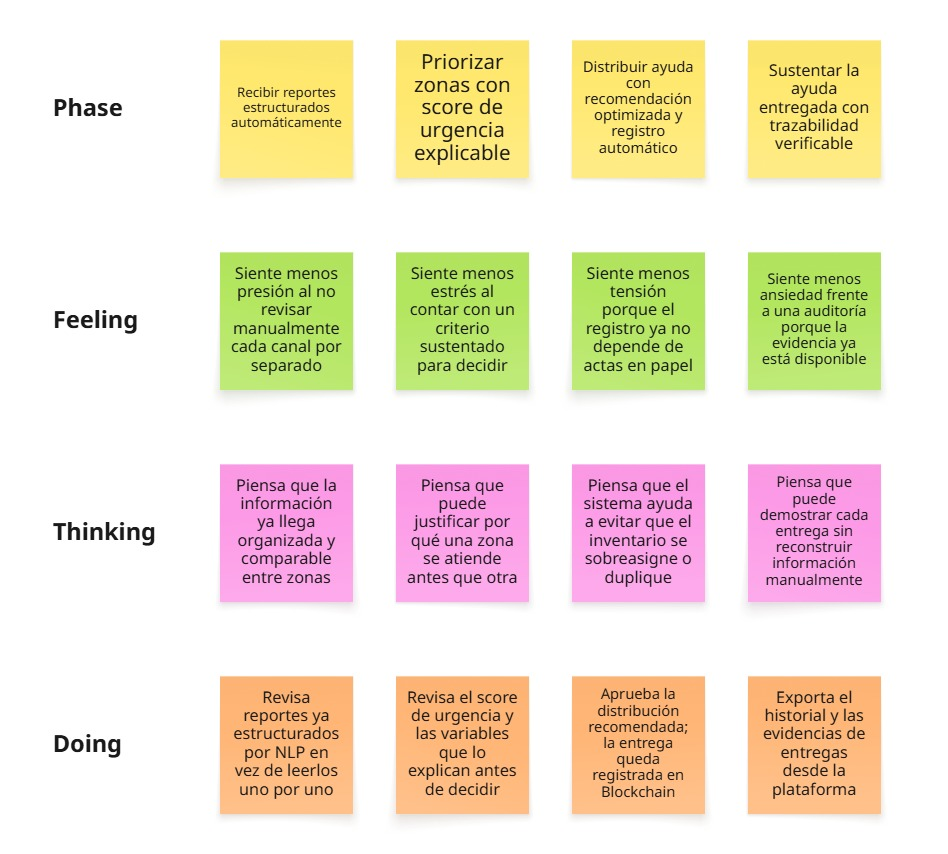
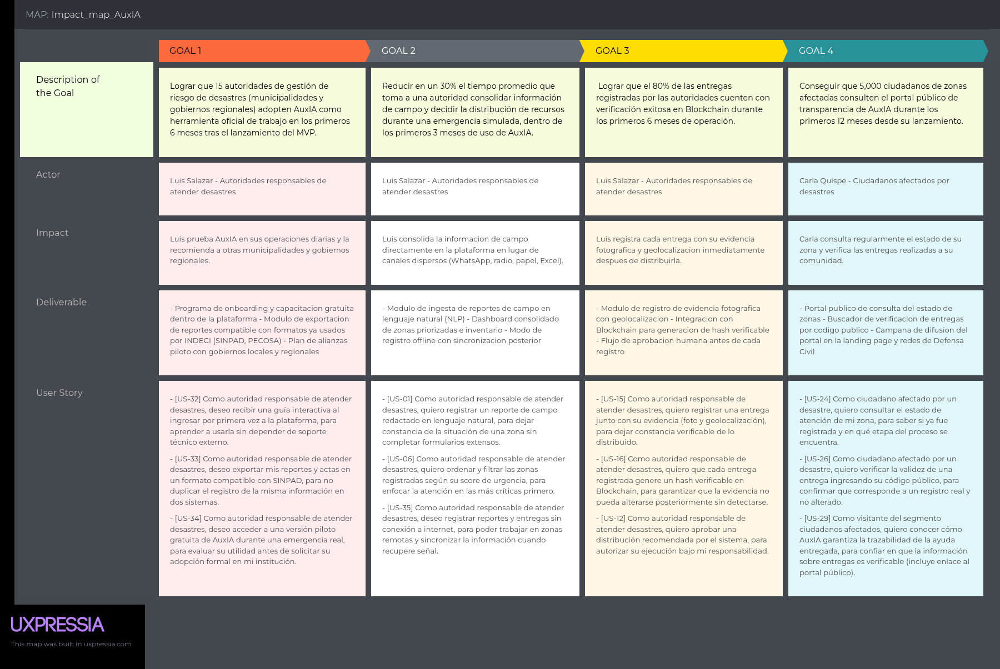
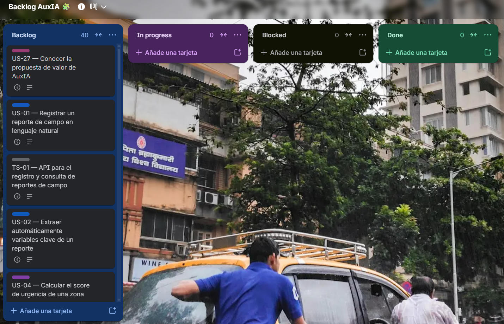

# Capítulo III: Requirements Specification

## 3.1. To-Be Scenario Mapping

Para el To-Be Scenario Mapping usamos la plataforma Miro, una plantilla para cada persona (Carla y Luis). El proceso comenzó con una etapa de preparación en la que el equipo repasó las entrevistas, los empathy maps y, sobre todo, el As-Is Scenario Mapping de cada persona, para tener claro qué partes del proceso actual generan fricción, desconfianza o pérdida de tiempo antes de imaginar cómo cambiaría ese recorrido con Auxilio Inteligente (AuxIA).

A partir de ahí, cada integrante realizó su propia lluvia de ideas individual, anotando en post-its qué haría, pensaría y sentiría el usuario en un escenario donde AuxIA ya forma parte de su día a día durante una emergencia. Luego nos reunimos para revisar todos los post-its en equipo, agrupamos las ideas repetidas y las que compartían un mismo momento del proceso, e identificamos esas agrupaciones como las fases (columnas) del mapa. A cada fase le pusimos un nombre que reflejara el nuevo comportamiento del usuario con la solución ya implementada.

Finalmente, comparamos el To-Be Scenario Mapping con el As-Is Scenario Mapping de la sección 2.3.4 para identificar qué cambia concretamente con AuxIA. En ambos segmentos, el cambio principal es el paso de una gestión fragmentada y dependiente de canales informales a un flujo centralizado, trazable y explicable, lo que se traduce en menos incertidumbre y ansiedad, y en mayor confianza y control sobre las decisiones tomadas.

El tablero completo del To-Be Scenario Mapping puede visualizarse en el siguiente enlace: https://miro.com/app/board/uXjVHnsm_Jw=/?share_link_id=721328137580

#### Segmento Objetivo #1: Ciudadanos afectados por desastres

Comparado con el As-Is, el To-Be de Carla mantiene las mismas cuatro fases del recorrido (presenciar la emergencia, buscar información, reportar su situación y recibir ayuda), pero cambia lo que ocurre dentro de cada una: pasa de depender de fuentes informales y contradictorias (WhatsApp, redes sociales, rumores de vecinos) a contar con una plataforma que le permite consultar el estado de su zona, el seguimiento de su reporte y la evidencia de la entrega recibida. Esto reduce directamente el miedo, la ansiedad y la frustración identificados en el As-Is, y los reemplaza por una sensación de mayor calma, seguridad y confianza en cada etapa.

#### Segmento Objetivo #2: Autoridades responsables de atender desastres

Comparado con el As-Is, el To-Be de Luis conserva la misma secuencia de fases (recibir reportes, priorizar zonas, distribuir ayuda y sustentar lo entregado), pero automatiza los puntos donde antes existía mayor fricción: los reportes llegan ya estructurados en vez de dispersos por distintos canales, la priorización se apoya en un score de urgencia explicable en vez de un criterio manual, y el registro de entregas y su sustento para auditoría se generan automáticamente en vez de depender de actas en papel. Esto no elimina la presión propia de una emergencia, pero sí reduce la sobrecarga de información, el estrés de decidir sin criterios claros y la ansiedad frente a una posible auditoría.

## 3.2. User Stories

### Introducción

A partir de los objetivos, restricciones, segmentos y Scenario Mapping definidos en los capítulos anteriores, el equipo elaboró el conjunto de Epics y User/Technical Stories que cubren los escenarios funcionales de AuxIA. El cuadro se organiza en 10 Epics: ingesta y estructuración de reportes de campo (NLP), priorización de zonas, gestión de inventario, recomendación y aprobación de distribución, registro y trazabilidad en Blockchain, auditoría, gestión de usuarios y accesos, portal público de transparencia para ciudadanos, landing page institucional y Technical Stories para las RESTful APIs que soportan el backend. 

### Epics y User Stories

<table>
<thead>
<tr>
<th>Epic / User Story ID</th>
<th>Título</th>
<th>Descripción</th>
<th>Criterios de Aceptación</th>
<th>Relacionado con (Epic ID)</th>
</tr>
</thead>
<tbody>
<tr>
<td>EP-01</td>
<td>Ingesta y estructuración de reportes de campo (NLP)</td>
<td>Agrupa las funcionalidades que permiten registrar reportes de campo en lenguaje natural y transformarlos automáticamente en datos estructurados y comparables entre zonas.</td>
<td>-</td>
<td>-</td>
</tr>
<tr>
<td>US-01</td>
<td>Registrar un reporte de campo en lenguaje natural</td>
<td>Como autoridad responsable de atender desastres, quiero registrar un reporte de campo redactado en lenguaje natural, para dejar constancia de la situación de una zona sin completar formularios extensos.</td>
<td><strong>Escenario 1: Registro exitoso de un reporte asociado a una zona</strong> Dado que la autoridad cuenta con acceso a la plataforma, cuando registra el texto de un reporte de campo, entonces el sistema guarda el reporte y lo asocia a la zona indicada.  <strong>Escenario 2: Reporte sin zona identificable</strong> Dado que el reporte registrado no incluye ninguna zona identificable, cuando el sistema intenta asociarlo, entonces se marca el reporte como pendiente de asignación de zona.</td>
<td>EP-01</td>
</tr>
<tr>
<td>US-02</td>
<td>Extraer automáticamente variables clave de un reporte</td>
<td>Como autoridad responsable de atender desastres, quiero que el sistema extraiga automáticamente variables clave del reporte (daños, población afectada, necesidades), para comparar zonas sin leer manualmente cada reporte.</td>
<td><strong>Escenario 1: Extracción exitosa de variables estructuradas</strong> Dado que un reporte fue registrado en lenguaje natural, cuando el sistema lo procesa mediante NLP, entonces se generan las variables estructuradas correspondientes.  <strong>Escenario 2: Reporte con información ambigua o incompleta</strong> Dado que el reporte contiene información ambigua o incompleta, cuando el sistema lo procesa, entonces las variables no identificadas quedan marcadas como no disponibles.</td>
<td>EP-01</td>
</tr>
<tr>
<td>US-03</td>
<td>Corregir manualmente un reporte estructurado</td>
<td>Como autoridad responsable de atender desastres, quiero corregir o completar manualmente las variables extraídas de un reporte, para asegurar que la información usada en la priorización sea precisa.</td>
<td><strong>Escenario 1: Conservación del valor corregido manualmente</strong> Dado que un reporte fue estructurado automáticamente, cuando la autoridad modifica una de sus variables, entonces el sistema conserva el valor corregido y lo utiliza en cálculos posteriores.  <strong>Escenario 2: Trazabilidad entre valor original y valor corregido</strong> Dado que una variable fue corregida manualmente, cuando se consulta el historial del reporte, entonces se distingue el valor original del valor corregido.</td>
<td>EP-01</td>
</tr>
<tr>
<td>EP-02</td>
<td>Priorización de zonas afectadas</td>
<td>Agrupa las funcionalidades relacionadas con el cálculo, explicación y ajuste del score de urgencia usado para priorizar la atención de las zonas.</td>
<td>-</td>
<td>-</td>
</tr>
<tr>
<td>US-04</td>
<td>Calcular el score de urgencia de una zona</td>
<td>Como autoridad responsable de atender desastres, quiero que el sistema calcule un score de urgencia por zona, para identificar rápidamente cuáles requieren atención prioritaria.</td>
<td><strong>Escenario 1: Cálculo del score con variables suficientes</strong> Dado que una zona cuenta con variables estructuradas suficientes, cuando el sistema calcula su score de urgencia, entonces se genera un valor numérico asociado a esa zona y a la fecha del cálculo.  <strong>Escenario 2: Zona sin variables suficientes para el cálculo</strong> Dado que una zona no cuenta con variables suficientes, cuando el sistema intenta calcular su score, entonces la zona se marca como "score no disponible".</td>
<td>EP-02</td>
</tr>
<tr>
<td>US-05</td>
<td>Visualizar la explicación del score de una zona</td>
<td>Como autoridad responsable de atender desastres, quiero conocer qué variables influyen más en el score de una zona, para sustentar la decisión de priorización ante terceros.</td>
<td><strong>Escenario 1: Visualización del detalle explicativo del score</strong> Dado que una zona tiene un score de urgencia calculado, cuando la autoridad solicita el detalle explicativo, entonces se muestran las variables que más influyeron en dicho score.  <strong>Escenario 2: Inclusión de la explicación en el reporte exportado</strong> Dado que el detalle explicativo fue generado, cuando se exporta un reporte de la zona, entonces la explicación del score queda incluida en el documento exportado.</td>
<td>EP-02</td>
</tr>
<tr>
<td>US-06</td>
<td>Ordenar y filtrar zonas según score de urgencia</td>
<td>Como autoridad responsable de atender desastres, quiero ordenar y filtrar las zonas registradas según su score de urgencia, para enfocar la atención en las más críticas primero.</td>
<td><strong>Escenario 1: Ordenamiento de zonas por score de urgencia</strong> Dado que existen varias zonas con score calculado, cuando la autoridad solicita el listado ordenado, entonces las zonas se presentan de mayor a menor urgencia.  <strong>Escenario 2: Filtrado de zonas según criterio específico</strong> Dado que la autoridad aplica un filtro por rango de score o tipo de necesidad, cuando el filtro se aplica, entonces solo se muestran las zonas que cumplen ese criterio.</td>
<td>EP-02</td>
</tr>
<tr>
<td>US-07</td>
<td>Ajustar manualmente la prioridad de una zona</td>
<td>Como autoridad responsable de atender desastres, quiero marcar manualmente una zona como prioritaria, para atender casos que el score no captura completamente (por ejemplo, riesgo inminente).</td>
<td><strong>Escenario 1: Registro de una prioridad manual con justificación</strong> Dado que una zona tiene un score calculado, cuando la autoridad la marca como prioritaria manualmente, entonces el sistema registra la prioridad manual junto con la justificación ingresada.  <strong>Escenario 2: Distinción visual entre priorización manual y automática</strong> Dado que una zona fue priorizada manualmente, cuando se consulta el listado de zonas, entonces se distingue visualmente de las priorizadas solo por el score del sistema.</td>
<td>EP-02</td>
</tr>
<tr>
<td>EP-03</td>
<td>Gestión de inventario de recursos</td>
<td>Agrupa las funcionalidades para registrar, consultar y controlar el inventario de recursos humanitarios disponibles para su distribución.</td>
<td>-</td>
<td>-</td>
</tr>
<tr>
<td>US-08</td>
<td>Registrar ingreso de recursos al inventario</td>
<td>Como autoridad responsable de atender desastres, quiero registrar el ingreso de recursos donados o adquiridos, para mantener actualizado el inventario disponible.</td>
<td><strong>Escenario 1: Registro exitoso del ingreso de recursos</strong> Dado que se recibe un lote de recursos, cuando la autoridad registra su ingreso, entonces la cantidad disponible del recurso se actualiza correspondientemente.  <strong>Escenario 2: Rechazo de un ingreso con cantidad inválida</strong> Dado que se registra un ingreso con una cantidad negativa o inválida, cuando el sistema valida el registro, entonces el ingreso es rechazado y el inventario no se modifica.</td>
<td>EP-03</td>
</tr>
<tr>
<td>US-09</td>
<td>Consultar el inventario disponible</td>
<td>Como autoridad responsable de atender desastres, quiero consultar en cualquier momento el inventario disponible por tipo de recurso, para decidir cuánto se puede distribuir sin exceder el stock real.</td>
<td><strong>Escenario 1: Consulta del inventario actualizado</strong> Dado que existen recursos registrados, cuando la autoridad consulta el inventario, entonces se muestra la cantidad disponible actualizada de cada recurso.  <strong>Escenario 2: Reflejo de recursos reservados como no disponibles</strong> Dado que un recurso fue reservado para una distribución aprobada, cuando se consulta el inventario, entonces la cantidad reservada se refleja como no disponible.</td>
<td>EP-03</td>
</tr>
<tr>
<td>US-10</td>
<td>Recibir alerta de inventario bajo</td>
<td>Como autoridad responsable de atender desastres, quiero recibir una alerta cuando el inventario de un recurso esté por agotarse, para gestionar su reposición a tiempo.</td>
<td><strong>Escenario 1: Generación de alerta por inventario bajo</strong> Dado que la cantidad disponible de un recurso cae por debajo de un umbral definido, cuando el sistema evalúa el inventario, entonces se genera una alerta asociada a ese recurso.  <strong>Escenario 2: Resolución automática de la alerta al reponer inventario</strong> Dado que una alerta ya fue generada, cuando el inventario se repone por encima del umbral, entonces la alerta se marca como resuelta.</td>
<td>EP-03</td>
</tr>
<tr>
<td>EP-04</td>
<td>Recomendación y aprobación de distribución de ayuda</td>
<td>Agrupa las funcionalidades que generan recomendaciones de distribución mediante optimización, y que permiten aprobar, modificar o rechazar dichas recomendaciones antes de ejecutarlas.</td>
<td>-</td>
<td>-</td>
</tr>
<tr>
<td>US-11</td>
<td>Generar una recomendación de distribución</td>
<td>Como autoridad responsable de atender desastres, quiero que el sistema recomiende una distribución de recursos entre las zonas priorizadas, para tomar decisiones más rápidas sin exceder el inventario disponible.</td>
<td><strong>Escenario 1: Generación de una recomendación dentro del inventario disponible</strong> Dado que existen zonas priorizadas y recursos disponibles, cuando la autoridad solicita una recomendación, entonces el sistema genera una propuesta que no excede el inventario disponible.  <strong>Escenario 2: Indicación de zonas desatendidas por inventario insuficiente</strong> Dado que el inventario es insuficiente para cubrir todas las zonas priorizadas, cuando se genera la recomendación, entonces el sistema indica qué zonas quedarían parcial o totalmente desatendidas.</td>
<td>EP-04</td>
</tr>
<tr>
<td>US-12</td>
<td>Aprobar una distribución recomendada</td>
<td>Como autoridad responsable de atender desastres, quiero aprobar una distribución recomendada por el sistema, para autorizar su ejecución bajo mi responsabilidad.</td>
<td><strong>Escenario 1: Aprobación exitosa de una distribución recomendada</strong> Dado que existe una recomendación generada, cuando la autoridad la aprueba, entonces la distribución queda habilitada para su ejecución y se registra qué autoridad la aprobó.  <strong>Escenario 2: Intento de aprobar una distribución ya aprobada</strong> Dado que una recomendación ya fue aprobada, cuando se intenta aprobar nuevamente, entonces el sistema indica que ya se encuentra aprobada.</td>
<td>EP-04</td>
</tr>
<tr>
<td>US-13</td>
<td>Modificar una distribución recomendada</td>
<td>Como autoridad responsable de atender desastres, quiero modificar las cantidades o zonas de una distribución recomendada antes de aprobarla, para ajustar la recomendación a información que el sistema no considera.</td>
<td><strong>Escenario 1: Modificación válida de una cantidad recomendada</strong> Dado que existe una recomendación generada, cuando la autoridad modifica una cantidad, entonces el sistema valida que la nueva cantidad no exceda el inventario disponible.  <strong>Escenario 2: Conservación de la recomendación original tras aprobar la versión modificada</strong> Dado que una distribución fue modificada, cuando se aprueba la versión modificada, entonces el sistema conserva tanto la recomendación original como la versión aprobada.</td>
<td>EP-04</td>
</tr>
<tr>
<td>US-14</td>
<td>Justificar el rechazo o modificación de una recomendación</td>
<td>Como autoridad responsable de atender desastres, quiero registrar una justificación cuando rechazo o modifico una recomendación del sistema, para sustentar la decisión ante una auditoría posterior.</td>
<td><strong>Escenario 1: Exigencia de justificación al rechazar o modificar una recomendación</strong> Dado que la autoridad rechaza o modifica una recomendación, cuando confirma la acción, entonces el sistema exige el registro de una justificación antes de continuar.  <strong>Escenario 2: Persistencia de la justificación en el historial de la zona</strong> Dado que una recomendación fue rechazada con su justificación, cuando se consulta el historial de la zona, entonces la justificación queda asociada a esa decisión de forma permanente.</td>
<td>EP-04</td>
</tr>
<tr>
<td>EP-05</td>
<td>Registro y trazabilidad de entregas (Blockchain)</td>
<td>Agrupa las funcionalidades que registran las entregas con su evidencia, generan su respaldo verificable en Blockchain y permiten consultar dicha verificación, sin almacenar datos personales sensibles.</td>
<td>-</td>
<td>-</td>
</tr>
<tr>
<td>US-15</td>
<td>Registrar una entrega realizada con evidencia</td>
<td>Como autoridad responsable de atender desastres, quiero registrar una entrega junto con su evidencia (foto y geolocalización), para dejar constancia verificable de lo distribuido.</td>
<td><strong>Escenario 1: Registro exitoso de una entrega con evidencia</strong> Dado que una distribución fue aprobada, cuando la autoridad registra la entrega con su evidencia, entonces el sistema asocia la evidencia a esa entrega y a la zona correspondiente.  <strong>Escenario 2: Bloqueo del registro de una entrega sin evidencia</strong> Dado que se intenta registrar una entrega sin evidencia asociada, cuando se confirma el registro, entonces el sistema no permite completarlo.</td>
<td>EP-05</td>
</tr>
<tr>
<td>US-16</td>
<td>Generar un hash verificable de la entrega en Blockchain</td>
<td>Como autoridad responsable de atender desastres, quiero que cada entrega registrada genere un hash verificable en Blockchain, para garantizar que la evidencia no pueda alterarse posteriormente sin detectarse.</td>
<td><strong>Escenario 1: Generación del hash verificable al registrar la entrega</strong> Dado que una entrega fue registrada con su evidencia, cuando el sistema procesa el registro, entonces se genera un hash de la evidencia y se almacena en Blockchain.  <strong>Escenario 2: Detección de alteración de la evidencia original</strong> Dado que la evidencia original de una entrega es modificada después del registro, cuando se recalcula su hash, entonces el nuevo hash no coincide con el hash almacenado.</td>
<td>EP-05</td>
</tr>
<tr>
<td>US-17</td>
<td>Consultar el estado de verificación de una entrega</td>
<td>Como autoridad responsable de atender desastres, quiero consultar si el hash de una entrega coincide con lo registrado en Blockchain, para confirmar que la evidencia no fue alterada.</td>
<td><strong>Escenario 1: Verificación exitosa de una entrega</strong> Dado que una entrega cuenta con un hash registrado en Blockchain, cuando se solicita su verificación, entonces el sistema indica si el hash actual coincide con el almacenado.  <strong>Escenario 2: Señalización de una entrega no verificable</strong> Dado que el hash de una entrega no coincide, cuando se realiza la verificación, entonces el sistema señala la entrega como no verificable.</td>
<td>EP-05</td>
</tr>
<tr>
<td>US-18</td>
<td>Excluir datos personales sensibles del registro en Blockchain</td>
<td>Como autoridad responsable de atender desastres, quiero que el sistema impida almacenar datos personales sensibles de la población afectada en Blockchain, para proteger su privacidad conforme a las restricciones del proyecto.</td>
<td><strong>Escenario 1: Exclusión de datos sensibles del registro en Blockchain</strong> Dado que se registra una entrega con evidencia, cuando el sistema genera el hash a almacenar en Blockchain, entonces solo se incluyen datos no sensibles (hash de evidencia, zona, fecha, cantidad).  <strong>Escenario 2: Exclusión de un campo con información personal detectada</strong> Dado que un campo del registro contiene información personal sensible, cuando el sistema prepara el dato a enviar a Blockchain, entonces dicho campo es excluido antes del envío.</td>
<td>EP-05</td>
</tr>
<tr>
<td>EP-06</td>
<td>Auditoría y exportación de evidencias</td>
<td>Agrupa las funcionalidades que permiten exportar y consultar el historial de decisiones y entregas para fines de auditoría y rendición de cuentas.</td>
<td>-</td>
<td>-</td>
</tr>
<tr>
<td>US-19</td>
<td>Exportar el historial de entregas de una zona o periodo</td>
<td>Como autoridad responsable de atender desastres, quiero exportar el historial de entregas de una zona o periodo determinado, para sustentar la ayuda entregada ante una auditoría.</td>
<td><strong>Escenario 1: Exportación exitosa del historial de entregas</strong> Dado que existen entregas registradas para una zona y periodo, cuando la autoridad solicita la exportación, entonces se genera un documento con el detalle de las entregas y su estado de verificación.  <strong>Escenario 2: Ausencia de resultados para el periodo solicitado</strong> Dado que no existen entregas registradas para el periodo solicitado, cuando se solicita la exportación, entonces el sistema indica que no hay resultados.</td>
<td>EP-06</td>
</tr>
<tr>
<td>US-20</td>
<td>Consultar el registro de cambios sobre una zona</td>
<td>Como autoridad responsable de atender desastres, quiero consultar el historial de decisiones tomadas sobre una zona, para reconstruir el proceso seguido ante una revisión posterior.</td>
<td><strong>Escenario 1: Consulta cronológica del historial de decisiones</strong> Dado que una zona tuvo decisiones registradas, cuando se consulta su historial, entonces se listan en orden cronológico junto con la autoridad responsable de cada una.  <strong>Escenario 2: Visibilidad del historial tras un cambio de turno</strong> Dado que ocurre un cambio de turno entre autoridades, cuando el nuevo responsable consulta el historial, entonces puede visualizar todas las decisiones del turno anterior.</td>
<td>EP-06</td>
</tr>
<tr>
<td>EP-07</td>
<td>Gestión de usuarios y accesos</td>
<td>Agrupa las funcionalidades relacionadas con la autenticación, autorización y continuidad operativa entre los responsables que usan la plataforma.</td>
<td>-</td>
<td>-</td>
</tr>
<tr>
<td>US-21</td>
<td>Iniciar sesión con credenciales institucionales</td>
<td>Como autoridad responsable de atender desastres, quiero iniciar sesión en la plataforma con mis credenciales institucionales, para acceder únicamente a la información que corresponde a mi rol.</td>
<td><strong>Escenario 1: Inicio de sesión exitoso</strong> Dado que la autoridad ingresa credenciales válidas, cuando el sistema las valida, entonces se concede acceso según el rol asignado.  <strong>Escenario 2: Denegación de acceso por credenciales inválidas</strong> Dado que la autoridad ingresa credenciales inválidas, cuando el sistema las valida, entonces se deniega el acceso sin revelar cuál dato fue incorrecto.</td>
<td>EP-07</td>
</tr>
<tr>
<td>US-22</td>
<td>Asignar roles y permisos según responsabilidad</td>
<td>Como administrador de la plataforma, quiero asignar roles y permisos a cada autoridad según su nivel de responsabilidad, para que cada usuario solo ejecute las acciones correspondientes a su función.</td>
<td><strong>Escenario 1: Restricción de acciones fuera del rol asignado</strong> Dado que un usuario tiene asignado un rol específico, cuando intenta ejecutar una acción fuera de los permisos de ese rol, entonces el sistema deniega la acción.  <strong>Escenario 2: Actualización de permisos tras modificar el rol</strong> Dado que se modifica el rol de un usuario, cuando vuelve a iniciar sesión, entonces sus permisos reflejan el nuevo rol asignado.</td>
<td>EP-07</td>
</tr>
<tr>
<td>US-23</td>
<td>Registrar el cambio de turno entre responsables</td>
<td>Como autoridad responsable de atender desastres, quiero registrar el cambio de turno con el siguiente responsable, para que no se pierda el seguimiento de las zonas en curso.</td>
<td><strong>Escenario 1: Asociación de zonas activas al nuevo responsable</strong> Dado que finaliza un turno con zonas en seguimiento, cuando la autoridad registra el cambio de turno, entonces el siguiente responsable queda asociado a esas zonas activas.  <strong>Escenario 2: Visualización del estado de zonas tras el cambio de turno</strong> Dado que un cambio de turno fue registrado, cuando el nuevo responsable inicia sesión, entonces visualiza las zonas a su cargo con su último estado registrado.</td>
<td>EP-07</td>
</tr>
<tr>
<td>EP-08</td>
<td>Portal público de transparencia</td>
<td>Agrupa las funcionalidades de consulta pública que permiten a la población afectada verificar el estado de atención de su zona y la validez de las entregas realizadas, sin exponer datos personales de terceros.</td>
<td>-</td>
<td>-</td>
</tr>
<tr>
<td>US-24</td>
<td>Consultar el estado de atención de una zona</td>
<td>Como ciudadano afectado por un desastre, quiero consultar el estado de atención de mi zona, para saber si ya fue registrada y en qué etapa del proceso se encuentra.</td>
<td><strong>Escenario 1: Consulta del estado de atención de una zona registrada</strong> Dado que una zona fue registrada, cuando un ciudadano consulta su estado, entonces se muestra la etapa actual del proceso sin exponer información sensible de terceros.  <strong>Escenario 2: Zona no registrada aún</strong> Dado que una zona no ha sido registrada aún, cuando un ciudadano intenta consultarla, entonces el sistema indica que no existe información disponible.</td>
<td>EP-08</td>
</tr>
<tr>
<td>US-25</td>
<td>Consultar el historial de entregas realizadas en una zona</td>
<td>Como ciudadano afectado por un desastre, quiero consultar el historial de entregas realizadas en mi zona, para verificar que la ayuda fue distribuida y no existen duplicidades evidentes.</td>
<td><strong>Escenario 1: Consulta del historial de entregas verificadas</strong> Dado que existen entregas verificadas para una zona, cuando un ciudadano consulta su historial, entonces se muestra la fecha, el tipo de recurso y el estado de verificación de cada entrega, sin datos personales de los beneficiarios.  <strong>Escenario 2: Entrega pendiente de verificación</strong> Dado que una entrega no cuenta con verificación en Blockchain, cuando se consulta el historial, entonces dicha entrega se muestra como "pendiente de verificación".</td>
<td>EP-08</td>
</tr>
<tr>
<td>US-26</td>
<td>Verificar la validez pública de una entrega mediante su código</td>
<td>Como ciudadano afectado por un desastre, quiero verificar la validez de una entrega ingresando su código público, para confirmar que corresponde a un registro real y no alterado.</td>
<td><strong>Escenario 1: Verificación válida mediante código público</strong> Dado que una entrega cuenta con un código público asociado a su hash en Blockchain, cuando un ciudadano ingresa dicho código, entonces el sistema indica si la entrega es válida o no.  <strong>Escenario 2: Código no correspondiente a ninguna entrega</strong> Dado que se ingresa un código que no corresponde a ninguna entrega registrada, cuando se realiza la consulta, entonces el sistema indica que el código no es válido.</td>
<td>EP-08</td>
</tr>
<tr>
<td>EP-09</td>
<td>Landing Page institucional</td>
<td>Agrupa las funcionalidades del sitio web estático de Waqta Labs dirigidas a distintos segmentos de visitantes, para dar a conocer la propuesta de valor, la problemática atendida y las funcionalidades de AuxIA.</td>
<td>-</td>
<td>-</td>
</tr>
<tr>
<td>US-27</td>
<td>Conocer la propuesta de valor de AuxIA</td>
<td>Como visitante del sitio web, quiero conocer de forma general qué es AuxIA y qué problema resuelve, para entender rápidamente el propósito de la plataforma.</td>
<td><strong>Escenario 1: Presentación de la descripción general en la sección de inicio</strong> Dado que el visitante ingresa a la sección de inicio, cuando la página carga, entonces se presenta una descripción general de AuxIA y del problema que atiende.  <strong>Escenario 2: Detalle de los pilares tecnológicos de la solución</strong> Dado que el visitante desea profundizar en la propuesta de valor, cuando accede a la sección correspondiente, entonces encuentra los tres pilares tecnológicos de la solución (NLP, optimización y Blockchain).</td>
<td>EP-09</td>
</tr>
<tr>
<td>US-28</td>
<td>Conocer la magnitud de la problemática atendida</td>
<td>Como visitante del sitio web, quiero conocer las cifras que sustentan la magnitud del problema de gestión de emergencias en el Perú, para dimensionar la relevancia de la solución.</td>
<td><strong>Escenario 1: Presentación de cifras oficiales de la problemática</strong> Dado que el visitante accede a la sección de problemática, cuando la página carga, entonces se muestran cifras oficiales sobre emergencias y personas afectadas en el país, con su fuente correspondiente.  <strong>Escenario 2: Trazabilidad de la fuente de las cifras mostradas</strong> Dado que el visitante desea validar el origen de una cifra presentada, cuando revisa el detalle de la sección, entonces encuentra la referencia bibliográfica correspondiente a dicha cifra.</td>
<td>EP-09</td>
</tr>
<tr>
<td>US-29</td>
<td>Conocer cómo funciona la trazabilidad de la ayuda</td>
<td>Como visitante del segmento ciudadanos afectados, quiero conocer cómo AuxIA garantiza la trazabilidad de la ayuda entregada, para confiar en que la información sobre entregas es verificable.</td>
<td><strong>Escenario 1: Explicación no técnica de la verificación por Blockchain</strong> Dado que el visitante accede a la sección de transparencia, cuando la página carga, entonces se explica en lenguaje no técnico cómo se verifica una entrega mediante Blockchain.  <strong>Escenario 2: Enlace hacia el portal público de consulta</strong> Dado que el visitante desea comprobar una entrega, cuando accede a la sección de transparencia, entonces encuentra un enlace hacia el portal público de consulta de entregas.</td>
<td>EP-09</td>
</tr>
<tr>
<td>US-30</td>
<td>Conocer las funcionalidades para autoridades</td>
<td>Como visitante del segmento autoridades responsables de atender desastres, quiero conocer las funcionalidades de AuxIA orientadas a mi labor, para evaluar si la plataforma es útil para mi institución.</td>
<td><strong>Escenario 1: Descripción de funcionalidades orientadas a autoridades</strong> Dado que el visitante accede a la sección dirigida a autoridades, cuando la página carga, entonces se describen las funcionalidades de priorización, distribución y auditoría orientadas a su rol.  <strong>Escenario 2: Medio de contacto para solicitar una demostración</strong> Dado que el visitante desea solicitar más información o una demostración, cuando accede a esta sección, entonces encuentra un medio de contacto directo con el equipo de Waqta Labs.</td>
<td>EP-09</td>
</tr>
<tr>
<td>US-31</td>
<td>Contactar al equipo de Waqta Labs</td>
<td>Como visitante del sitio web, quiero enviar un mensaje de contacto al equipo de Waqta Labs, para resolver dudas o solicitar más información sobre AuxIA.</td>
<td><strong>Escenario 1: Envío exitoso del formulario de contacto</strong> Dado que el visitante completa el formulario de contacto con datos válidos, cuando lo envía, entonces el sistema confirma que el mensaje fue enviado correctamente.  <strong>Escenario 2: Envío con campo obligatorio incompleto</strong> Dado que el visitante intenta enviar el formulario sin completar un campo obligatorio, cuando lo envía, entonces el sistema no procesa el envío e indica qué información falta.</td>
<td>EP-09</td>
</tr>
<tr>
<td>EP-10</td>
<td>Plataforma / Infraestructura — APIs</td>
<td>Agrupa las Technical Stories necesarias para exponer, mediante RESTful APIs, las funcionalidades de backend que soportan reportes, priorización, inventario, distribución y trazabilidad, sin interacción directa con el usuario final.</td>
<td>-</td>
<td>-</td>
</tr>
<tr>
<td>TS-01</td>
<td>API para el registro y consulta de reportes de campo</td>
<td>Como developer, quiero exponer un endpoint RESTful para crear y consultar reportes de campo estructurados, para que el frontend y otros servicios puedan integrarse con el módulo de NLP.</td>
<td><strong>Escenario 1: Creación exitosa de un reporte</strong> Dado que se envía una solicitud POST con el texto de un reporte válido, cuando el endpoint la procesa, entonces responde con código 201 y el reporte estructurado generado.  <strong>Escenario 2: Solicitud sin campo de texto del reporte</strong> Dado que se envía una solicitud POST sin el campo de texto del reporte, cuando el endpoint la procesa, entonces responde con código 400 indicando el campo faltante.</td>
<td>EP-10</td>
</tr>
<tr>
<td>TS-02</td>
<td>API para el cálculo del score de urgencia</td>
<td>Como developer, quiero exponer un endpoint RESTful que calcule y devuelva el score de urgencia de una zona junto con su explicación, para integrarlo con los módulos de priorización y visualización.</td>
<td><strong>Escenario 1: Cálculo exitoso del score de una zona existente</strong> Dado que se envía una solicitud GET con el identificador de una zona con variables suficientes, cuando el endpoint la procesa, entonces responde con código 200, el score calculado y sus variables explicativas.  <strong>Escenario 2: Solicitud sobre una zona inexistente</strong> Dado que se envía una solicitud GET con el identificador de una zona inexistente, cuando el endpoint la procesa, entonces responde con código 404.</td>
<td>EP-10</td>
</tr>
<tr>
<td>TS-03</td>
<td>API para consulta y actualización de inventario</td>
<td>Como developer, quiero exponer endpoints RESTful para consultar y actualizar el inventario de recursos, para que los módulos de distribución puedan validar disponibilidad en tiempo real.</td>
<td><strong>Escenario 1: Consulta exitosa del inventario</strong> Dado que se envía una solicitud GET de inventario, cuando el endpoint la procesa, entonces responde con código 200 y la cantidad disponible de cada recurso.  <strong>Escenario 2: Actualización que excede el inventario disponible</strong> Dado que se envía una solicitud PUT para reducir el inventario en una cantidad mayor a la disponible, cuando el endpoint la procesa, entonces responde con código 409 y no modifica el inventario.</td>
<td>EP-10</td>
</tr>
<tr>
<td>TS-04</td>
<td>API para generar la recomendación de distribución</td>
<td>Como developer, quiero exponer un endpoint RESTful que genere la recomendación de distribución de recursos entre zonas priorizadas, para integrarlo con el módulo de aprobación de la autoridad.</td>
<td><strong>Escenario 1: Generación exitosa de una recomendación</strong> Dado que se envía una solicitud POST con las zonas priorizadas y el inventario disponible, cuando el endpoint la procesa, entonces responde con código 200 y una propuesta que no excede el inventario recibido.  <strong>Escenario 2: Solicitud sin zonas priorizadas</strong> Dado que se envía una solicitud POST sin zonas priorizadas, cuando el endpoint la procesa, entonces responde con código 400.</td>
<td>EP-10</td>
</tr>
<tr>
<td>TS-05</td>
<td>API para registrar una entrega y su hash en Blockchain</td>
<td>Como developer, quiero exponer un endpoint RESTful que registre una entrega, genere su hash y lo envíe a Blockchain, para que el módulo de trazabilidad pueda verificar la evidencia posteriormente.</td>
<td><strong>Escenario 1: Registro exitoso de la entrega y su hash</strong> Dado que se envía una solicitud POST con la evidencia de una entrega válida, cuando el endpoint la procesa, entonces responde con código 201, el hash generado y la referencia de la transacción en Blockchain.  <strong>Escenario 2: Solicitud sin evidencia asociada</strong> Dado que se envía una solicitud POST sin evidencia asociada, cuando el endpoint la procesa, entonces responde con código 400 y no genera ningún hash.</td>
<td>EP-10</td>
</tr>
</tbody>
</table>

---

## 3.3. Impact Mapping

Para la elaboración del Impact Mapping se utilizó la herramienta UXPressia, en la cual previamente se registraron las fichas de los User Personas identificados en el capítulo 2 (Carla Quispe, para el segmento de ciudadanos afectados por desastres, y Luis Salazar, para el segmento de autoridades responsables de atender desastres). A partir de dichas fichas, el equipo definió cuatro Business Goals que cumplen con los criterios SMART, cada uno vinculado al Actor/Persona que más contribuye a alcanzarlo, el Impact que se espera generar en su comportamiento, los Deliverables que Waqta Labs debe construir para provocar ese cambio, y las User Stories que permitirán implementar dichos Deliverables.

Los Business Goals definidos fueron los siguientes:

1. **Adopción institucional:** lograr que 15 autoridades de gestión de riesgo de desastres (municipalidades y gobiernos regionales) adopten AuxIA como herramienta oficial de trabajo en los primeros 6 meses tras el lanzamiento del MVP.
2. **Eficiencia en la toma de decisiones:** reducir en un 30% el tiempo promedio que toma a una autoridad consolidar información de campo y decidir la distribución de recursos durante una emergencia simulada, dentro de los primeros 3 meses de uso de AuxIA.
3. **Trazabilidad verificable:** lograr que el 80% de las entregas registradas por las autoridades cuenten con verificación exitosa en Blockchain durante los primeros 6 meses de operación.
4. **Transparencia ciudadana:** conseguir que 5,000 ciudadanos de zonas afectadas consulten el portal público de transparencia de AuxIA durante los primeros 12 meses desde su lanzamiento.

Para los tres primeros Business Goals, el Actor principal identificado es Luis Salazar, dado que es quien opera directamente la plataforma durante la gestión de una emergencia y cuyo comportamiento determina si AuxIA logra consolidarse como herramienta oficial, agilizar la toma de decisiones y generar evidencia verificable de las entregas. Para el cuarto Business Goal, el Actor principal es Carla Quispe, pues es ella quien, como ciudadana afectada, necesita consultar y confiar en la información expuesta públicamente sobre su zona.

A partir de cada Impact esperado, se definieron los Deliverables (funcionalidades y acciones de negocio) que Waqta Labs debe implementar, y las User Stories asociadas a cada uno, redactadas en formato "Como... quiero/deseo... para...". Varias de estas User Stories corresponden directamente a historias ya definidas en el backlog de Epics (sección 3.X), mientras que otras surgieron como necesidades adicionales de adopción y difusión (US-32 a US-35), las cuales fueron incorporadas también al backlog general.

A continuación se presenta la captura del Impact Map elaborado en UXPressia:

## 3.4. Product Backlog

El Product Backlog consolida las 40 historias (35 User Stories y 5 Technical Stories) definidas en la sección de Epics y User Stories, ordenadas según el valor que aportan al negocio y no según su dependencia técnica. Por ello, las historias vinculadas al núcleo diferenciador de AuxIA (ingesta de reportes con NLP, priorización de zonas, distribución optimizada y trazabilidad en Blockchain) se ubican al inicio del backlog, mientras que las historias de autenticación y gestión de accesos (US-21, US-22, US-23) se posicionan más adelante, ya que por sí solas no generan valor de negocio directo sino que soportan a las demás funcionalidades. Asimismo, se incluyeron desde el primer sprint historias correspondientes al sitio web estático (Landing Page), dado que la comunicación de la propuesta de valor debe estar disponible desde las primeras etapas del proyecto.

El backlog se elaboró y gestiona en Trello. La captura y el enlace público de referencia se presentan al final de esta sección.

| # Orden | User Story ID | Título | Descripción | Story Points (1/2/3/5/8) |
|---|---|---|---|---|
| 1 | US-27 | Conocer la propuesta de valor de AuxIA | Como visitante del sitio web, quiero conocer de forma general qué es AuxIA y qué problema resuelve, para entender rápidamente el propósito de la plataforma. | 2 |
| 2 | US-01 | Registrar un reporte de campo en lenguaje natural | Como autoridad responsable de atender desastres, quiero registrar un reporte de campo redactado en lenguaje natural, para dejar constancia de la situación de una zona sin completar formularios extensos. | 5 |
| 3 | TS-01 | API para el registro y consulta de reportes de campo | Como developer, quiero exponer un endpoint RESTful para crear y consultar reportes de campo estructurados, para que el frontend y otros servicios puedan integrarse con el módulo de NLP. | 3 |
| 4 | US-02 | Extraer automáticamente variables clave de un reporte | Como autoridad responsable de atender desastres, quiero que el sistema extraiga automáticamente variables clave del reporte (daños, población afectada, necesidades), para comparar zonas sin leer manualmente cada reporte. | 8 |
| 5 | US-04 | Calcular el score de urgencia de una zona | Como autoridad responsable de atender desastres, quiero que el sistema calcule un score de urgencia por zona, para identificar rápidamente cuáles requieren atención prioritaria. | 8 |
| 6 | TS-02 | API para el cálculo del score de urgencia | Como developer, quiero exponer un endpoint RESTful que calcule y devuelva el score de urgencia de una zona junto con su explicación, para integrarlo con los módulos de priorización y visualización. | 5 |
| 7 | US-05 | Visualizar la explicación del score de una zona | Como autoridad responsable de atender desastres, quiero conocer qué variables influyen más en el score de una zona, para sustentar la decisión de priorización ante terceros. | 3 |
| 8 | US-06 | Ordenar y filtrar zonas según score de urgencia | Como autoridad responsable de atender desastres, quiero ordenar y filtrar las zonas registradas según su score de urgencia, para enfocar la atención en las más críticas primero. | 3 |
| 9 | US-09 | Consultar el inventario disponible | Como autoridad responsable de atender desastres, quiero consultar en cualquier momento el inventario disponible por tipo de recurso, para decidir cuánto se puede distribuir sin exceder el stock real. | 3 |
| 10 | US-08 | Registrar ingreso de recursos al inventario | Como autoridad responsable de atender desastres, quiero registrar el ingreso de recursos donados o adquiridos, para mantener actualizado el inventario disponible. | 3 |
| 11 | TS-03 | API para consulta y actualización de inventario | Como developer, quiero exponer endpoints RESTful para consultar y actualizar el inventario de recursos, para que los módulos de distribución puedan validar disponibilidad en tiempo real. | 3 |
| 12 | US-11 | Generar una recomendación de distribución | Como autoridad responsable de atender desastres, quiero que el sistema recomiende una distribución de recursos entre las zonas priorizadas, para tomar decisiones más rápidas sin exceder el inventario disponible. | 8 |
| 13 | TS-04 | API para generar la recomendación de distribución | Como developer, quiero exponer un endpoint RESTful que genere la recomendación de distribución de recursos entre zonas priorizadas, para integrarlo con el módulo de aprobación de la autoridad. | 5 |
| 14 | US-12 | Aprobar una distribución recomendada | Como autoridad responsable de atender desastres, quiero aprobar una distribución recomendada por el sistema, para autorizar su ejecución bajo mi responsabilidad. | 3 |
| 15 | US-13 | Modificar una distribución recomendada | Como autoridad responsable de atender desastres, quiero modificar las cantidades o zonas de una distribución recomendada antes de aprobarla, para ajustar la recomendación a información que el sistema no considera. | 5 |
| 16 | US-15 | Registrar una entrega realizada con evidencia | Como autoridad responsable de atender desastres, quiero registrar una entrega junto con su evidencia (foto y geolocalización), para dejar constancia verificable de lo distribuido. | 5 |
| 17 | US-16 | Generar un hash verificable de la entrega en Blockchain | Como autoridad responsable de atender desastres, quiero que cada entrega registrada genere un hash verificable en Blockchain, para garantizar que la evidencia no pueda alterarse posteriormente sin detectarse. | 8 |
| 18 | TS-05 | API para registrar una entrega y su hash en Blockchain | Como developer, quiero exponer un endpoint RESTful que registre una entrega, genere su hash y lo envíe a Blockchain, para que el módulo de trazabilidad pueda verificar la evidencia posteriormente. | 5 |
| 19 | US-18 | Excluir datos personales sensibles del registro en Blockchain | Como autoridad responsable de atender desastres, quiero que el sistema impida almacenar datos personales sensibles de la población afectada en Blockchain, para proteger su privacidad conforme a las restricciones del proyecto. | 3 |
| 20 | US-17 | Consultar el estado de verificación de una entrega | Como autoridad responsable de atender desastres, quiero consultar si el hash de una entrega coincide con lo registrado en Blockchain, para confirmar que la evidencia no fue alterada. | 3 |
| 21 | US-24 | Consultar el estado de atención de una zona | Como ciudadano afectado por un desastre, quiero consultar el estado de atención de mi zona, para saber si ya fue registrada y en qué etapa del proceso se encuentra. | 3 |
| 22 | US-26 | Verificar la validez pública de una entrega mediante su código | Como ciudadano afectado por un desastre, quiero verificar la validez de una entrega ingresando su código público, para confirmar que corresponde a un registro real y no alterado. | 3 |
| 23 | US-25 | Consultar el historial de entregas realizadas en una zona | Como ciudadano afectado por un desastre, quiero consultar el historial de entregas realizadas en mi zona, para verificar que la ayuda fue distribuida y no existen duplicidades evidentes. | 3 |
| 24 | US-29 | Conocer cómo funciona la trazabilidad de la ayuda | Como visitante del segmento ciudadanos afectados, quiero conocer cómo AuxIA garantiza la trazabilidad de la ayuda entregada, para confiar en que la información sobre entregas es verificable. | 2 |
| 25 | US-03 | Corregir manualmente un reporte estructurado | Como autoridad responsable de atender desastres, quiero corregir o completar manualmente las variables extraídas de un reporte, para asegurar que la información usada en la priorización sea precisa. | 3 |
| 26 | US-07 | Ajustar manualmente la prioridad de una zona | Como autoridad responsable de atender desastres, quiero marcar manualmente una zona como prioritaria, para atender casos que el score no captura completamente (por ejemplo, riesgo inminente). | 3 |
| 27 | US-14 | Justificar el rechazo o modificación de una recomendación | Como autoridad responsable de atender desastres, quiero registrar una justificación cuando rechazo o modifico una recomendación del sistema, para sustentar la decisión ante una auditoría posterior. | 2 |
| 28 | US-10 | Recibir alerta de inventario bajo | Como autoridad responsable de atender desastres, quiero recibir una alerta cuando el inventario de un recurso esté por agotarse, para gestionar su reposición a tiempo. | 3 |
| 29 | US-19 | Exportar el historial de entregas de una zona o periodo | Como autoridad responsable de atender desastres, quiero exportar el historial de entregas de una zona o periodo determinado, para sustentar la ayuda entregada ante una auditoría. | 5 |
| 30 | US-20 | Consultar el registro de cambios sobre una zona | Como autoridad responsable de atender desastres, quiero consultar el historial de decisiones tomadas sobre una zona, para reconstruir el proceso seguido ante una revisión posterior. | 3 |
| 31 | US-28 | Conocer la magnitud de la problemática atendida | Como visitante del sitio web, quiero conocer las cifras que sustentan la magnitud del problema de gestión de emergencias en el Perú, para dimensionar la relevancia de la solución. | 1 |
| 32 | US-30 | Conocer las funcionalidades para autoridades | Como visitante del segmento autoridades responsables de atender desastres, quiero conocer las funcionalidades de AuxIA orientadas a mi labor, para evaluar si la plataforma es útil para mi institución. | 2 |
| 33 | US-31 | Contactar al equipo de Waqta Labs | Como visitante del sitio web, quiero enviar un mensaje de contacto al equipo de Waqta Labs, para resolver dudas o solicitar más información sobre AuxIA. | 2 |
| 34 | US-32 | Recibir una guía interactiva de bienvenida | Como autoridad responsable de atender desastres, deseo recibir una guía interactiva al ingresar por primera vez a la plataforma, para aprender a usarla sin depender de soporte técnico externo. | 3 |
| 35 | US-33 | Exportar reportes en formato compatible con SINPAD | Como autoridad responsable de atender desastres, deseo exportar mis reportes y actas en un formato compatible con SINPAD, para no duplicar el registro de la misma información en dos sistemas. | 5 |
| 36 | US-34 | Acceder a una versión piloto gratuita | Como autoridad responsable de atender desastres, deseo acceder a una versión piloto gratuita de AuxIA durante una emergencia real, para evaluar su utilidad antes de solicitar su adopción formal en mi institución. | 2 |
| 37 | US-35 | Registrar reportes y entregas sin conexión a internet | Como autoridad responsable de atender desastres, deseo registrar reportes y entregas sin conexión a internet, para poder trabajar en zonas remotas y sincronizar la información cuando recupere señal. | 8 |
| 38 | US-21 | Iniciar sesión con credenciales institucionales | Como autoridad responsable de atender desastres, quiero iniciar sesión en la plataforma con mis credenciales institucionales, para acceder únicamente a la información que corresponde a mi rol. | 3 |
| 39 | US-22 | Asignar roles y permisos según responsabilidad | Como administrador de la plataforma, quiero asignar roles y permisos a cada autoridad según su nivel de responsabilidad, para que cada usuario solo ejecute las acciones correspondientes a su función. | 3 |
| 40 | US-23 | Registrar el cambio de turno entre responsables | Como autoridad responsable de atender desastres, quiero registrar el cambio de turno con el siguiente responsable, para que no se pierda el seguimiento de las zonas en curso. | 3 |

A continuación se presenta la captura del Product Backlog elaborado en Trello, junto con la referencia de su enlace público:

**Enlace público:** [Product Backlog de AuxIA](https://trello.com/invite/b/6aaccabc93ae4b133abb067d/ATTIf4cc07b1d09411a282996543071b99f48BD36272/backlog-auxia)

El tablero se organiza en las siguientes secciones:

- **BACKLOG:** historias pendientes, ordenadas por prioridad.
- **IN PROGRESS:** historias actualmente en desarrollo.
- **BLOCKED:** historias iniciadas pero detenidas por algún impedimento.
- **DONE:** historias terminadas y validadas.