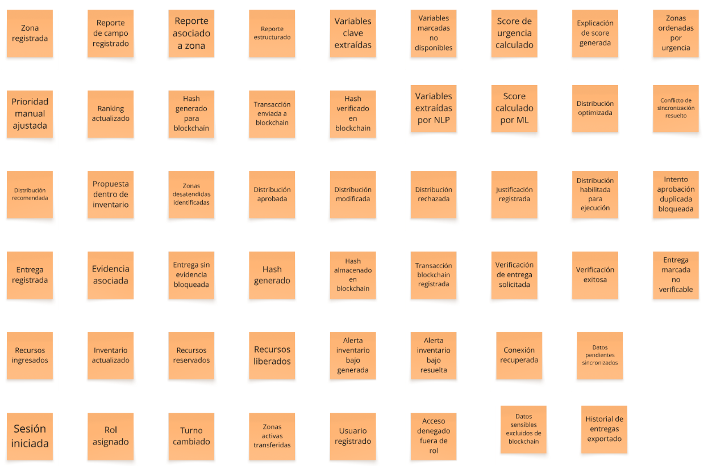
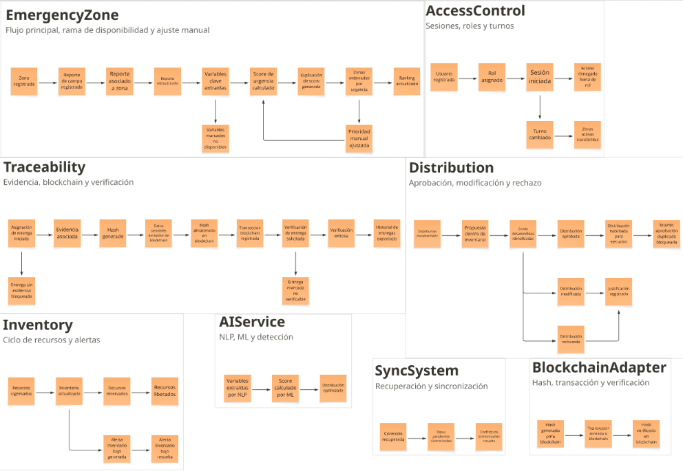
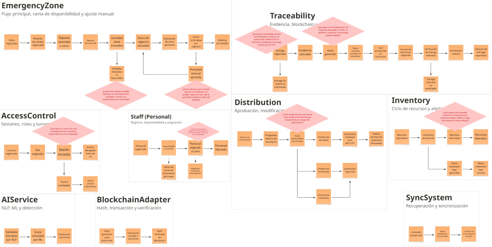
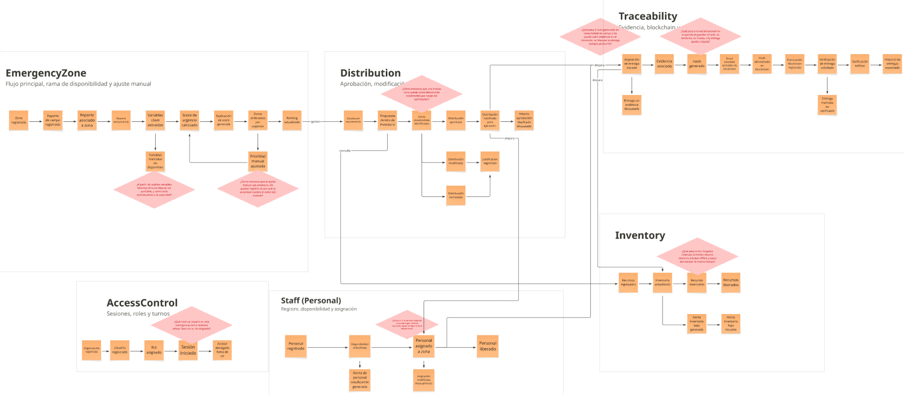
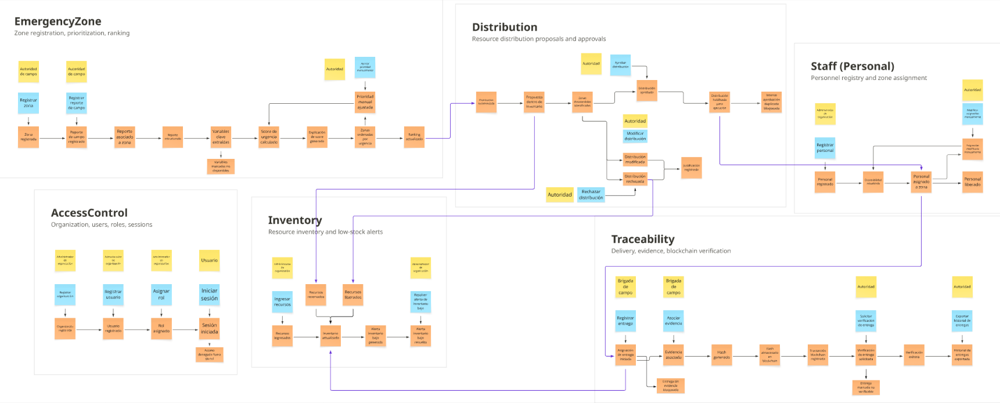
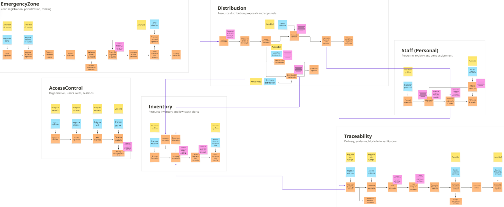
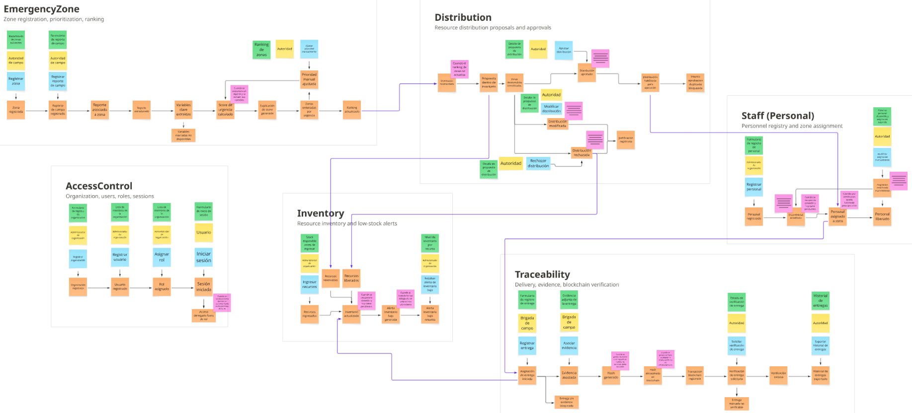
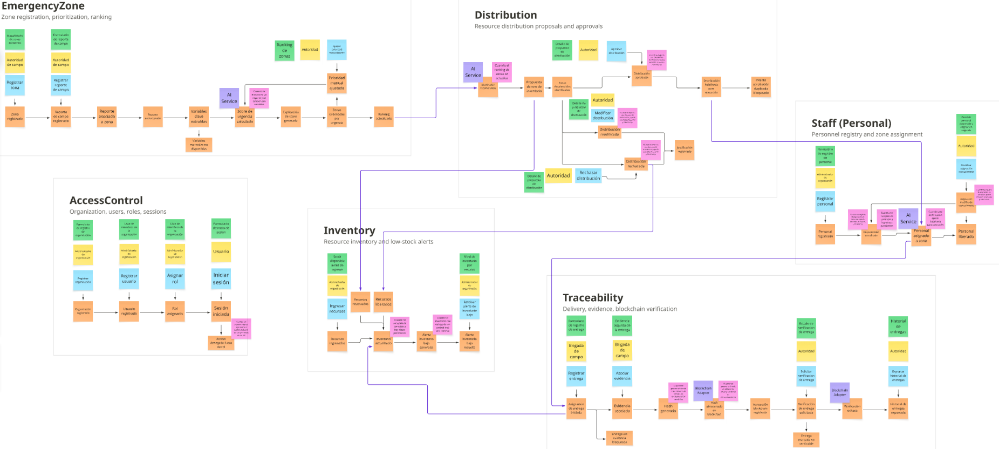
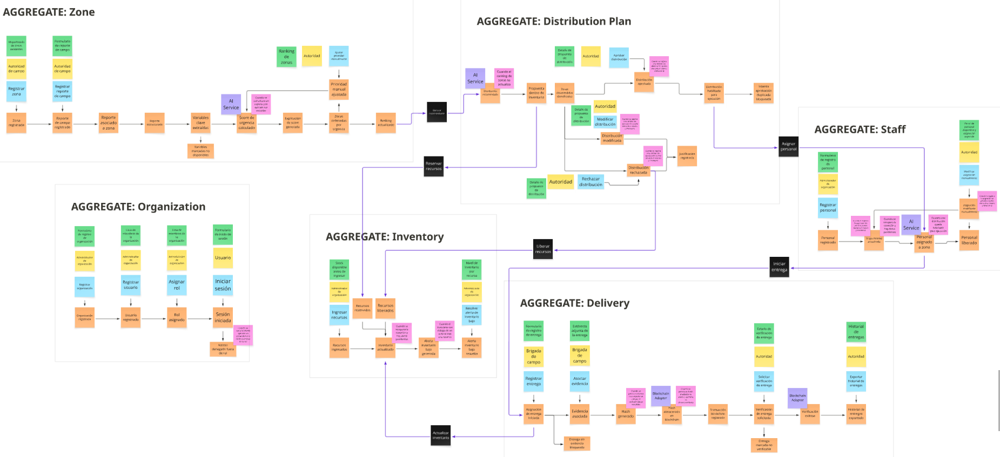
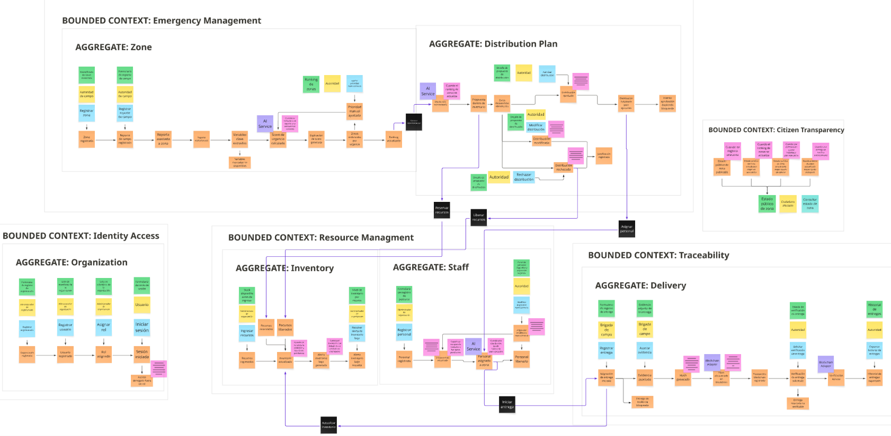

# Capítulo IV: Strategic-Level Software Design

## 4.1. Strategic-Level Attribute-Driven Design

## 4.1.1. Design Purpose

El proposito del diseno estrategico de AuxIA es definir una base arquitectonica que permita responder a los principales problemas identificados durante el needfinding: informacion dispersa entre canales, dificultad para priorizar zonas afectadas, riesgo de duplicidad en la entrega de ayuda, baja trazabilidad de evidencias y limitaciones para auditar decisiones tomadas durante una emergencia. Bajo el enfoque Attribute-Driven Design (ADD), estas necesidades se convierten en drivers arquitectonicos que orientan la seleccion de componentes, responsabilidades, integraciones y restricciones tecnicas del sistema.

AuxIA se plantea como un sistema de apoyo a la decision para la distribucion de ayuda ante desastres. Por ello, la arquitectura debe permitir registrar reportes de campo, estructurar informacion mediante NLP, calcular un score de urgencia, recomendar una distribucion de recursos, mantener inventario actualizado, registrar entregas con evidencia y generar trazabilidad verificable mediante Blockchain. Sin embargo, la decision final no debe quedar delegada completamente al algoritmo: la autoridad responsable conserva la capacidad de aprobar, modificar o justificar las recomendaciones del sistema.

El diseno tambien debe considerar el contexto operativo del producto. AuxIA sera utilizado por autoridades, voluntarios, entidades de ayuda, ciudadanos afectados y auditores, en escenarios donde puede existir presion de tiempo, conectividad limitada y necesidad de proteger informacion sensible. Por ese motivo, las decisiones arquitectonicas deben equilibrar rapidez de respuesta, explicabilidad de la priorizacion, seguridad, privacidad, mantenibilidad y trazabilidad verificable.

## 4.1.2. Attribute-Driven Design Inputs

Los insumos del proceso ADD se toman de los hallazgos del Capitulo II, las User Stories y Product Backlog del Capitulo III, y el alcance tecnico definido para AuxIA. A partir de estos insumos se identifican las funcionalidades primarias, los escenarios de atributos de calidad y las restricciones que condicionan las decisiones arquitectonicas.

### 4.1.2.1. Primary Functionality / Primary User Stories

Las siguientes historias representan las funcionalidades con mayor impacto arquitectonico para AuxIA. No se listan todas las historias del Product Backlog, sino aquellas que condicionan directamente la estructura del sistema, los servicios principales, la persistencia de datos, la integracion con IA, la integracion con Blockchain y los mecanismos de trazabilidad.

| Epic / User Story ID | Titulo | Descripcion | Criterios de Aceptacion | Relacionado con (Epic ID) |
|---|---|---|---|---|
| EP-01 | Ingesta y estructuracion de reportes de campo (NLP) | Agrupa las funcionalidades que permiten registrar reportes de campo en lenguaje natural y transformarlos en datos estructurados para comparar zonas afectadas. | **Escenario 1:** Dado que la autoridad registra un reporte de campo, cuando el sistema lo procesa, entonces guarda el reporte, lo asocia a una zona y extrae variables clave para su evaluacion.  **Escenario 2:** Dado que el reporte contiene informacion incompleta o ambigua, cuando se estructura mediante NLP, entonces los datos no identificados quedan marcados para revision. | EP-01 |
| US-01 | Registrar un reporte de campo en lenguaje natural | Como autoridad responsable de atender desastres, quiero registrar un reporte de campo redactado en lenguaje natural, para dejar constancia de la situacion de una zona sin completar formularios extensos. | **Escenario 1:** Dado que la autoridad cuenta con acceso a la plataforma, cuando registra el texto de un reporte de campo, entonces el sistema guarda el reporte y lo asocia a la zona indicada.  **Escenario 2:** Dado que el reporte registrado no incluye ninguna zona identificable, cuando el sistema intenta asociarlo, entonces se marca el reporte como pendiente de asignacion de zona. | EP-01 |
| US-02 | Extraer automaticamente variables clave de un reporte | Como autoridad responsable de atender desastres, quiero que el sistema extraiga automaticamente variables clave del reporte, para comparar zonas sin leer manualmente cada reporte. | **Escenario 1:** Dado que un reporte fue registrado en lenguaje natural, cuando el sistema lo procesa mediante NLP, entonces se generan las variables estructuradas correspondientes.  **Escenario 2:** Dado que el reporte contiene informacion ambigua o incompleta, cuando el sistema lo procesa, entonces las variables no identificadas quedan marcadas como no disponibles. | EP-01 |
| EP-02 | Priorizacion de zonas afectadas | Agrupa las funcionalidades relacionadas con el calculo, explicacion y ajuste del score de urgencia usado para priorizar zonas afectadas. | **Escenario 1:** Dado que una zona cuenta con variables suficientes, cuando el sistema ejecuta la priorizacion, entonces genera un score de urgencia y permite ordenar las zonas segun criticidad.  **Escenario 2:** Dado que una autoridad revisa el score de una zona, cuando solicita su detalle, entonces visualiza las variables que explican la prioridad asignada. | EP-02 |
| US-04 | Calcular el score de urgencia de una zona | Como autoridad responsable de atender desastres, quiero que el sistema calcule un score de urgencia por zona, para identificar rapidamente cuales requieren atencion prioritaria. | **Escenario 1:** Dado que una zona cuenta con variables estructuradas suficientes, cuando el sistema calcula su score de urgencia, entonces se genera un valor numerico asociado a esa zona y a la fecha del calculo.  **Escenario 2:** Dado que una zona no cuenta con variables suficientes, cuando el sistema intenta calcular su score, entonces la zona se marca como "score no disponible". | EP-02 |
| US-05 | Visualizar la explicacion del score de una zona | Como autoridad responsable de atender desastres, quiero conocer que variables influyen mas en el score de una zona, para sustentar la decision de priorizacion ante terceros. | **Escenario 1:** Dado que una zona tiene un score de urgencia calculado, cuando la autoridad solicita el detalle explicativo, entonces se muestran las variables que mas influyeron en dicho score.  **Escenario 2:** Dado que el detalle explicativo fue generado, cuando se exporta un reporte de la zona, entonces la explicacion del score queda incluida en el documento exportado. | EP-02 |
| EP-03 | Gestion de inventario de recursos | Agrupa las funcionalidades para registrar, consultar y controlar los recursos humanitarios disponibles para distribucion. | **Escenario 1:** Dado que existen recursos registrados, cuando la autoridad consulta el inventario, entonces el sistema muestra cantidades disponibles actualizadas por tipo de recurso.  **Escenario 2:** Dado que parte del inventario fue reservado para una distribucion aprobada, cuando se consulta disponibilidad, entonces el sistema distingue recursos disponibles y reservados. | EP-03 |
| US-09 | Consultar el inventario disponible | Como autoridad responsable de atender desastres, quiero consultar en cualquier momento el inventario disponible por tipo de recurso, para decidir cuanto se puede distribuir sin exceder el stock real. | **Escenario 1:** Dado que existen recursos registrados, cuando la autoridad consulta el inventario, entonces se muestra la cantidad disponible actualizada de cada recurso.  **Escenario 2:** Dado que un recurso fue reservado para una distribucion aprobada, cuando se consulta el inventario, entonces la cantidad reservada se refleja como no disponible. | EP-03 |
| EP-04 | Recomendacion y aprobacion de distribucion de ayuda | Agrupa las funcionalidades que generan recomendaciones de distribucion y permiten su aprobacion o ajuste por una autoridad responsable. | **Escenario 1:** Dado que existen zonas priorizadas e inventario disponible, cuando la autoridad solicita una recomendacion, entonces el sistema propone una distribucion que no excede el stock real.  **Escenario 2:** Dado que existe una recomendacion generada, cuando la autoridad la aprueba, entonces la distribucion queda habilitada y se registra el responsable de la aprobacion. | EP-04 |
| US-11 | Generar una recomendacion de distribucion | Como autoridad responsable de atender desastres, quiero que el sistema recomiende una distribucion de recursos entre las zonas priorizadas, para tomar decisiones mas rapidas sin exceder el inventario disponible. | **Escenario 1:** Dado que existen zonas priorizadas y recursos disponibles, cuando la autoridad solicita una recomendacion, entonces el sistema genera una propuesta que no excede el inventario disponible.  **Escenario 2:** Dado que el inventario es insuficiente para cubrir todas las zonas priorizadas, cuando se genera la recomendacion, entonces el sistema indica que zonas quedarian parcial o totalmente desatendidas. | EP-04 |
| US-12 | Aprobar una distribucion recomendada | Como autoridad responsable de atender desastres, quiero aprobar una distribucion recomendada por el sistema, para autorizar su ejecucion bajo mi responsabilidad. | **Escenario 1:** Dado que existe una recomendacion generada, cuando la autoridad la aprueba, entonces la distribucion queda habilitada para su ejecucion y se registra que autoridad la aprobo.  **Escenario 2:** Dado que una recomendacion ya fue aprobada, cuando se intenta aprobar nuevamente, entonces el sistema indica que ya se encuentra aprobada. | EP-04 |
| EP-05 | Registro y trazabilidad de entregas (Blockchain) | Agrupa las funcionalidades que registran entregas con evidencia, generan respaldo verificable en Blockchain y permiten verificar la integridad de la informacion. | **Escenario 1:** Dado que una distribucion fue aprobada, cuando la autoridad registra una entrega con evidencia, entonces el sistema guarda la evidencia, genera su hash y almacena la referencia verificable en Blockchain.  **Escenario 2:** Dado que el registro contiene datos personales sensibles, cuando se prepara la informacion para Blockchain, entonces dichos datos se excluyen antes del envio. | EP-05 |
| US-15 | Registrar una entrega realizada con evidencia | Como autoridad responsable de atender desastres, quiero registrar una entrega junto con su evidencia, para dejar constancia verificable de lo distribuido. | **Escenario 1:** Dado que una distribucion fue aprobada, cuando la autoridad registra la entrega con su evidencia, entonces el sistema asocia la evidencia a esa entrega y a la zona correspondiente.  **Escenario 2:** Dado que se intenta registrar una entrega sin evidencia asociada, cuando se confirma el registro, entonces el sistema no permite completarlo. | EP-05 |
| US-16 | Generar un hash verificable de la entrega en Blockchain | Como autoridad responsable de atender desastres, quiero que cada entrega registrada genere un hash verificable en Blockchain, para garantizar que la evidencia no pueda alterarse posteriormente sin detectarse. | **Escenario 1:** Dado que una entrega fue registrada con su evidencia, cuando el sistema procesa el registro, entonces se genera un hash de la evidencia y se almacena en Blockchain.  **Escenario 2:** Dado que la evidencia original de una entrega es modificada despues del registro, cuando se recalcula su hash, entonces el nuevo hash no coincide con el hash almacenado. | EP-05 |
| US-18 | Excluir datos personales sensibles del registro en Blockchain | Como autoridad responsable de atender desastres, quiero que el sistema impida almacenar datos personales sensibles de la poblacion afectada en Blockchain, para proteger su privacidad conforme a las restricciones del proyecto. | **Escenario 1:** Dado que se registra una entrega con evidencia, cuando el sistema genera el hash a almacenar en Blockchain, entonces solo se incluyen datos no sensibles.  **Escenario 2:** Dado que un campo del registro contiene informacion personal sensible, cuando el sistema prepara el dato a enviar a Blockchain, entonces dicho campo es excluido antes del envio. | EP-05 |
| EP-06 | Auditoria y exportacion de evidencias | Agrupa las funcionalidades que permiten reconstruir decisiones, consultar historial y sustentar entregas ante procesos de auditoria. | **Escenario 1:** Dado que una zona tuvo decisiones registradas, cuando una autoridad consulta su historial, entonces el sistema muestra las acciones en orden cronologico con responsable y fecha.  **Escenario 2:** Dado que se requiere una revision posterior, cuando se consulta la evidencia de entregas, entonces el sistema permite verificar el estado de trazabilidad asociado. | EP-06 |
| US-20 | Consultar el registro de cambios sobre una zona | Como autoridad responsable de atender desastres, quiero consultar el historial de decisiones tomadas sobre una zona, para reconstruir el proceso seguido ante una revision posterior. | **Escenario 1:** Dado que una zona tuvo decisiones registradas, cuando se consulta su historial, entonces se listan en orden cronologico junto con la autoridad responsable de cada una.  **Escenario 2:** Dado que ocurre un cambio de turno entre autoridades, cuando el nuevo responsable consulta el historial, entonces puede visualizar todas las decisiones del turno anterior. | EP-06 |
| EP-07 | Gestion de usuarios y accesos | Agrupa las funcionalidades de autenticacion y autorizacion necesarias para proteger acciones criticas segun el rol del usuario. | **Escenario 1:** Dado que un usuario ingresa credenciales validas, cuando el sistema las valida, entonces concede acceso segun el rol asignado.  **Escenario 2:** Dado que un usuario intenta ejecutar una accion fuera de su responsabilidad, cuando el sistema valida sus permisos, entonces bloquea la accion. | EP-07 |
| US-21 | Iniciar sesion con credenciales institucionales | Como autoridad responsable de atender desastres, quiero iniciar sesion en la plataforma con mis credenciales institucionales, para acceder unicamente a la informacion que corresponde a mi rol. | **Escenario 1:** Dado que la autoridad ingresa credenciales validas, cuando el sistema las valida, entonces se concede acceso segun el rol asignado.  **Escenario 2:** Dado que la autoridad ingresa credenciales invalidas, cuando el sistema las valida, entonces se deniega el acceso sin revelar cual dato fue incorrecto. | EP-07 |
| EP-08 | Portal publico de transparencia para ciudadanos | Agrupa las funcionalidades que permiten consultar informacion publica sobre atencion y entregas sin exponer datos personales sensibles. | **Escenario 1:** Dado que una zona fue registrada, cuando un ciudadano consulta su estado, entonces el sistema muestra la etapa actual de atencion sin exponer informacion sensible.  **Escenario 2:** Dado que una zona no cuenta con informacion registrada, cuando el ciudadano realiza la consulta, entonces el sistema informa que no existen datos disponibles. | EP-08 |
| US-24 | Consultar el estado de atencion de una zona | Como ciudadano afectado por un desastre, quiero consultar el estado de atencion de mi zona, para saber si ya fue registrada y en que etapa del proceso se encuentra. | **Escenario 1:** Dado que una zona fue registrada, cuando un ciudadano consulta su estado, entonces se muestra la etapa actual del proceso sin exponer informacion sensible de terceros.  **Escenario 2:** Dado que una zona no ha sido registrada aun, cuando un ciudadano intenta consultarla, entonces el sistema indica que no existe informacion disponible. | EP-08 |
| EP-10 | Plataforma / Infraestructura - APIs | Agrupa las Technical Stories necesarias para exponer mediante RESTful APIs las capacidades centrales del sistema. | **Escenario 1:** Dado que un cliente autorizado consume una API del sistema, cuando envia una solicitud valida, entonces recibe una respuesta con codigo HTTP y estructura documentada.  **Escenario 2:** Dado que una solicitud no cumple el contrato definido, cuando llega al endpoint, entonces el sistema responde con un error controlado sin ejecutar la operacion. | EP-10 |
| TS-01 | API para el registro y consulta de reportes de campo | Como developer, quiero exponer un endpoint RESTful para crear y consultar reportes de campo estructurados, para que el frontend y otros servicios puedan integrarse con el modulo de NLP. | **Escenario 1:** Dado que se envia una solicitud POST con el texto de un reporte valido, cuando el endpoint la procesa, entonces responde con codigo 201 y el reporte estructurado generado.  **Escenario 2:** Dado que se envia una solicitud POST sin el campo de texto del reporte, cuando el endpoint la procesa, entonces responde con codigo 400 indicando el campo faltante. | EP-10 |
| TS-02 | API para el calculo del score de urgencia | Como developer, quiero exponer un endpoint RESTful que calcule y devuelva el score de urgencia de una zona junto con su explicacion, para integrarlo con los modulos de priorizacion y visualizacion. | **Escenario 1:** Dado que se envia una solicitud GET con el identificador de una zona con variables suficientes, cuando el endpoint la procesa, entonces responde con codigo 200, el score calculado y sus variables explicativas.  **Escenario 2:** Dado que se envia una solicitud GET con el identificador de una zona inexistente, cuando el endpoint la procesa, entonces responde con codigo 404. | EP-10 |
| TS-04 | API para generar la recomendacion de distribucion | Como developer, quiero exponer un endpoint RESTful que genere la recomendacion de distribucion de recursos entre zonas priorizadas, para integrarlo con el modulo de aprobacion de la autoridad. | **Escenario 1:** Dado que se envia una solicitud POST con las zonas priorizadas y el inventario disponible, cuando el endpoint la procesa, entonces responde con codigo 200 y una propuesta que no excede el inventario recibido.  **Escenario 2:** Dado que se envia una solicitud POST sin zonas priorizadas, cuando el endpoint la procesa, entonces responde con codigo 400. | EP-10 |
| TS-05 | API para registrar una entrega y su hash en Blockchain | Como developer, quiero exponer un endpoint RESTful que registre una entrega, genere su hash y lo envie a Blockchain, para que el modulo de trazabilidad pueda verificar la evidencia posteriormente. | **Escenario 1:** Dado que se envia una solicitud POST con la evidencia de una entrega valida, cuando el endpoint la procesa, entonces responde con codigo 201, el hash generado y la referencia de la transaccion en Blockchain.  **Escenario 2:** Dado que se envia una solicitud POST sin evidencia asociada, cuando el endpoint la procesa, entonces responde con codigo 400 y no genera ningun hash. | EP-10 |

### 4.1.2.2. Quality Attribute Scenarios

Los escenarios de atributos de calidad se definieron a partir de los riesgos observados en el contexto de AuxIA: trabajo bajo presion durante emergencias, conectividad inestable en campo, necesidad de justificar la priorizacion, proteccion de datos personales y trazabilidad de entregas. Estos escenarios funcionan como entrada para decidir la separacion de responsabilidades entre la aplicacion principal, el servicio de IA, la base de datos operacional y la integracion con Blockchain.

| Atributo | Fuente | Estimulo | Artefacto | Entorno | Respuesta | Medida |
|---|---|---|---|---|---|---|
| Performance | Autoridad responsable | Solicita el calculo del score de urgencia para las zonas registradas en una emergencia activa. | Motor de priorizacion y servicio de IA | Operacion normal, con reportes ya estructurados y base de datos disponible. | El sistema calcula el score, guarda el resultado y muestra el ranking de zonas de mayor a menor urgencia. | El ranking se presenta en menos de 10 segundos para un escenario controlado del MVP. |
| Usabilidad | Autoridad o voluntario en campo | Registra un reporte de campo con informacion redactada en lenguaje natural. | Interfaz de registro de reportes y modulo de NLP | Jornada de emergencia, usuario con poco tiempo y posible fatiga operativa. | El sistema permite registrar el reporte sin exigir formularios extensos y luego estructura las variables clave. | El reporte puede registrarse completando solo los datos minimos obligatorios y el texto principal. |
| Disponibilidad | Voluntario en campo | Pierde conexion a internet mientras registra evidencia o reportes. | Aplicacion de campo y mecanismo de sincronizacion | Zona con conectividad intermitente. | El sistema conserva el registro como pendiente y lo sincroniza cuando la conexion vuelve a estar disponible. | Ningun registro pendiente se pierde por cierre de sesion o perdida temporal de conexion. |
| Seguridad | Usuario no autorizado | Intenta acceder a informacion o ejecutar acciones fuera de su rol. | Modulo de autenticacion y autorizacion | Operacion normal, con usuarios institucionales autenticados o no autenticados. | El sistema bloquea la accion, evita exponer datos sensibles y registra el intento para auditoria. | El 100% de endpoints criticos valida identidad y rol antes de ejecutar la operacion. |
| Privacidad | Sistema de entregas | Prepara el registro verificable de una entrega para enviarlo a Blockchain. | Adaptador Blockchain y modulo de entregas | Registro de entrega con evidencia y datos operacionales en PostgreSQL. | El sistema excluye datos personales sensibles y envia solo el hash, fecha, zona o referencia no sensible. | Cero campos de DNI, datos medicos, nombres de beneficiarios o informacion familiar se almacenan en Blockchain. |
| Trazabilidad | Auditor o autoridad responsable | Consulta el historial de decisiones y entregas asociadas a una zona. | Modulo de auditoria, entregas y Blockchain | Revision posterior a la atencion de una emergencia. | El sistema muestra el historial cronologico con responsable, accion, fecha, estado de verificacion y referencia de Blockchain cuando corresponda. | Toda accion critica queda asociada a un registro de auditoria consultable. |
| Explicabilidad | Autoridad responsable | Revisa el score asignado a una zona antes de aprobar una distribucion. | Motor de priorizacion y modulo de visualizacion | Proceso de decision con varias zonas afectadas y recursos limitados. | El sistema muestra las variables que influyeron en el score y permite sustentar la decision tomada. | Cada score visible para la autoridad incluye al menos sus variables principales y version del modelo o regla usada. |
| Mantenibilidad | Equipo de desarrollo | Necesita ajustar la logica de priorizacion o cambiar el modelo de IA. | Servicio de IA y contrato REST con la aplicacion principal | Evolucion del MVP hacia nuevas reglas, datasets o modelos. | El cambio se realiza dentro del servicio de IA, manteniendo estable la aplicacion principal mientras no cambie el contrato. | Un ajuste interno del modelo no obliga a modificar los modulos de inventario, entregas ni auditoria. |

### 4.1.2.3. Constraints

Las restricciones se plantean como condiciones no negociables para el diseno inicial de AuxIA. Provienen del alcance del MVP, de los hallazgos del needfinding y de las decisiones tecnicas ya definidas para evitar una arquitectura innecesariamente compleja. Estas restricciones guian las decisiones posteriores y limitan el uso de IA y Blockchain a los puntos donde realmente aportan valor.

| Technical Story ID | Titulo | Descripcion | Criterios de Aceptacion | Relacionado con (Epic ID) |
|---|---|---|---|---|
| TS-C01 | Mantener aprobacion humana obligatoria | Como developer, quiero asegurar que ninguna recomendacion generada por IA se ejecute sin aprobacion de una autoridad, para evitar decisiones automaticas sobre la distribucion de ayuda. | **Escenario 1:** Dado que existe una recomendacion generada por el sistema, cuando se intenta registrar una entrega sin aprobacion previa, entonces el sistema bloquea la operacion.  **Escenario 2:** Dado que una autoridad aprueba la recomendacion, cuando se consulta la distribucion, entonces queda registrado quien aprobo y cuando lo hizo. | EP-04 |
| TS-C02 | Evitar datos sensibles en Blockchain | Como developer, quiero impedir que datos personales sensibles sean enviados a Blockchain, para proteger la privacidad de la poblacion afectada. | **Escenario 1:** Dado que una entrega contiene evidencia y datos operacionales, cuando se genera el registro Blockchain, entonces solo se envia informacion no sensible y su hash.  **Escenario 2:** Dado que el payload contiene DNI, nombre, informacion medica o datos familiares, cuando se valida antes del envio, entonces el sistema rechaza o excluye esos campos. | EP-05 |
| TS-C03 | Usar PostgreSQL como fuente operacional | Como developer, quiero conservar la informacion transaccional en PostgreSQL y usar Blockchain solo como prueba de integridad, para evitar almacenar datos operativos completos en la cadena. | **Escenario 1:** Dado que se registra una entrega, cuando se guarda la informacion operacional, entonces los datos completos quedan en PostgreSQL.  **Escenario 2:** Dado que se genera el hash de la entrega, cuando se registra en Blockchain, entonces la base de datos conserva la referencia de transaccion asociada. | EP-05 |
| TS-C04 | Separar el servicio de IA de la aplicacion principal | Como developer, quiero implementar NLP, priorizacion y optimizacion en un servicio independiente, para permitir cambios en los modelos sin acoplarlos al backend principal. | **Escenario 1:** Dado que la aplicacion principal necesita estructurar un reporte, cuando llama al servicio de IA, entonces recibe una respuesta mediante API REST.  **Escenario 2:** Dado que se actualiza la logica interna del servicio de IA, cuando el contrato REST se mantiene estable, entonces el backend principal no requiere cambios. | EP-10 |
| TS-C05 | Iniciar con monolito modular para el MVP | Como developer, quiero organizar el backend inicial como monolito modular, para reducir complejidad tecnica sin perder separacion por dominios. | **Escenario 1:** Dado que se implementa el backend del MVP, cuando se crean los modulos, entonces emergencias, zonas, inventario, asignaciones, entregas y auditoria quedan separados por responsabilidades.  **Escenario 2:** Dado que una funcionalidad cambia dentro de un modulo, cuando se despliega el MVP, entonces no se requiere coordinar multiples microservicios para una primera version. | EP-10 |
| TS-C06 | Soportar conectividad intermitente en registros de campo | Como developer, quiero permitir que reportes y evidencias se conserven temporalmente si no hay conexion, para evitar perdida de informacion durante trabajo en campo. | **Escenario 1:** Dado que el usuario pierde conexion mientras registra informacion, cuando confirma el registro, entonces el sistema lo marca como pendiente de sincronizacion.  **Escenario 2:** Dado que la conexion vuelve a estar disponible, cuando el sistema sincroniza, entonces el registro queda asociado a la emergencia correspondiente. | EP-01 |
| TS-C07 | Exponer capacidades principales mediante APIs REST | Como developer, quiero que reportes, priorizacion, inventario, distribucion y trazabilidad se expongan mediante APIs REST, para integrar frontend, servicio de IA y componentes externos de forma controlada. | **Escenario 1:** Dado que un cliente autorizado consume una API, cuando envia una solicitud valida, entonces recibe una respuesta con codigo HTTP y estructura documentada.  **Escenario 2:** Dado que la solicitud es invalida o incompleta, cuando llega al endpoint, entonces el sistema responde con un codigo de error consistente. | EP-10 |
| TS-C08 | Mantener el MVP en un escenario controlado | Como developer, quiero limitar el alcance inicial del sistema a emergencias y datos de prueba controlados, para validar el flujo completo antes de operar con datos reales a gran escala. | **Escenario 1:** Dado que se prepara una demostracion del MVP, cuando se cargan zonas, recursos y entregas, entonces el sistema permite validar el flujo de principio a fin con datos controlados.  **Escenario 2:** Dado que el equipo requiere operar con datos reales masivos, cuando se evalua esa ampliacion, entonces se documentan nuevas decisiones de escalabilidad, seguridad y cumplimiento antes de implementarla. | EP-10 |

## 4.1.3. Architectural Drivers Backlog

El Architectural Drivers Backlog reune los requisitos funcionales, escenarios de calidad y restricciones que mas influyen en la arquitectura de AuxIA. Para ordenarlos se considero el valor para los usuarios principales, el riesgo tecnico y el impacto que cada driver tiene sobre componentes como el backend, el servicio de IA, la base de datos, la integracion Blockchain y la sincronizacion de informacion de campo.

| Driver ID | Titulo de Driver | Descripcion | Importancia para Stakeholders (High, Medium, Low) | Impacto en Architecture Technical Complexity (High, Medium, Low) |
|---|---|---|---|---|
| FD-01 | Priorizacion explicable de zonas afectadas | El sistema debe calcular un score de urgencia por zona y mostrar las variables que justifican la prioridad asignada. Se relaciona con US-04, US-05 y TS-02. | High | High |
| FD-02 | Recomendacion de distribucion con inventario limitado | El sistema debe proponer una distribucion de recursos entre zonas priorizadas sin exceder el inventario disponible. Se relaciona con US-11 y TS-04. | High | High |
| FD-03 | Registro verificable de entregas en Blockchain | Cada entrega debe quedar asociada a evidencia, hash y referencia verificable en Blockchain, sin exponer datos sensibles. Se relaciona con US-15, US-16, US-18 y TS-05. | High | High |
| FD-04 | Registro y estructuracion de reportes de campo | El sistema debe recibir reportes redactados en lenguaje natural y convertirlos en variables utiles para la priorizacion. Se relaciona con US-01, US-02 y TS-01. | High | High |
| FD-05 | Operacion con conectividad intermitente | La plataforma debe permitir registrar reportes y entregas sin conexion constante, para sincronizarlos cuando se recupere la senal. Se relaciona con US-35 y TS-C06. | High | High |
| QAD-01 | Privacidad en trazabilidad Blockchain | La arquitectura debe impedir que datos personales sensibles se almacenen en Blockchain. | High | High |
| QAD-02 | Seguridad por roles institucionales | Las acciones criticas deben validarse segun identidad y rol del usuario. | High | Medium |
| QAD-03 | Trazabilidad de decisiones y entregas | El sistema debe conservar el historial de acciones relevantes para auditoria y rendicion de cuentas. | High | Medium |
| QAD-04 | Performance en calculo de priorizacion | El ranking de zonas debe generarse en tiempos aceptables para escenarios controlados del MVP. | High | Medium |
| QAD-05 | Mantenibilidad del motor de IA | La logica de NLP, priorizacion y optimizacion debe poder evolucionar sin modificar todo el backend principal. | Medium | High |
| QAD-06 | Usabilidad para registro rapido de informacion | La autoridad o voluntario debe registrar reportes sin completar formularios extensos durante una emergencia. | High | Medium |
| TS-C01 | Mantener aprobacion humana obligatoria | Ninguna recomendacion de distribucion debe ejecutarse sin aprobacion de una autoridad responsable. | High | Medium |
| TS-C02 | Evitar datos sensibles en Blockchain | El sistema debe filtrar datos personales antes de registrar informacion verificable en Blockchain. | High | High |
| TS-C03 | Usar PostgreSQL como fuente operacional | La informacion transaccional debe mantenerse en PostgreSQL; Blockchain se usa solo como prueba de integridad. | High | Medium |
| TS-C04 | Separar el servicio de IA de la aplicacion principal | NLP, score de urgencia y optimizacion se implementan en un servicio independiente integrado por API. | Medium | High |
| TS-C05 | Iniciar con monolito modular para el MVP | El backend inicial debe organizarse por modulos de dominio sin pasar directamente a microservicios. | Medium | Medium |
| TS-C06 | Soportar conectividad intermitente | Los registros de campo deben conservarse como pendientes cuando no exista conexion. | High | High |
| TS-C07 | Exponer capacidades principales mediante APIs REST | Las funciones centrales deben estar disponibles mediante contratos REST documentados y controlados. | Medium | Medium |
| TS-C08 | Mantener el MVP en un escenario controlado | La primera version debe validarse con datos y emergencias controladas antes de operar a gran escala. | Medium | Low |

## 4.1.4. Architectural Design Decisions

Las decisiones de diseno se definieron siguiendo el enfoque del Quality Attribute Workshop. Primero se revisaron las funcionalidades de mayor impacto; luego se agruparon los escenarios de calidad y restricciones que podian cambiar la estructura del sistema. Con esa base se compararon patrones y tacticas posibles, priorizando opciones viables para un MVP academico y coherentes con los hallazgos del Capitulo II.

En esta iteracion, el criterio principal fue evitar una arquitectura innecesariamente distribuida, pero sin perder separacion en las capacidades que tienen mayor riesgo tecnico: IA, trazabilidad Blockchain, sincronizacion de campo y auditoria. Por ello, las decisiones favorecen un backend modular, un servicio de IA independiente, una base de datos operacional central y un uso acotado de Blockchain como mecanismo de verificacion.

| Driver ID | Titulo de Driver | Pattern 1 - Pro | Pattern 1 - Con | Pattern 2 - Pro | Pattern 2 - Con | Pattern 3 - Pro | Pattern 3 - Con | Decision |
|---|---|---|---|---|---|---|---|---|
| FD-01 / QAD-05 | Priorizacion explicable y mantenible | **Servicio de IA independiente:** permite evolucionar NLP, score y explicabilidad sin acoplarlos al backend principal. | Requiere contrato REST, manejo de errores y monitoreo entre servicios. | **Modelo embebido en backend:** reduce llamadas externas y simplifica el despliegue inicial. | Acopla ciencia de datos con logica transaccional y dificulta cambios de modelo. | **Servicio externo de IA:** acelera pruebas iniciales. | Aumenta dependencia externa y puede comprometer control sobre datos sensibles. | Usar servicio de IA independiente con API REST y versionado de modelo. |
| FD-02 / QAD-04 | Recomendacion de distribucion con inventario limitado | **Motor de optimizacion separado dentro del servicio de IA:** concentra reglas de priorizacion y distribucion en un componente especializado. | Requiere validar consistencia entre inventario del backend y entrada enviada al servicio. | **Reglas simples dentro del backend:** es rapido de implementar para una demo basica. | Pierde flexibilidad para incorporar OR-Tools o modelos de optimizacion. | **Microservicio exclusivo de optimizacion:** separa aun mas la responsabilidad. | Agrega complejidad de despliegue para el alcance del MVP. | Implementar la optimizacion en el servicio de IA, consumiendo inventario validado por el backend. |
| FD-03 / QAD-01 | Trazabilidad Blockchain y privacidad | **PostgreSQL + hash en Blockchain:** conserva datos operacionales en base de datos y registra solo prueba de integridad en cadena. | Exige mantener sincronizada la referencia entre entrega, hash y transaccion. | **Todo en Blockchain:** ofrece alta inmutabilidad. | Expone riesgos de privacidad, costo y complejidad innecesaria. | **Solo base de datos:** simplifica el sistema. | No resuelve la necesidad de verificacion inmutable planteada por el producto. | Usar PostgreSQL como fuente operacional y Blockchain solo para hashes verificables. |
| FD-05 / TS-C06 | Operacion con conectividad intermitente | **Cola local de registros pendientes y sincronizacion posterior:** permite trabajar en campo sin perder reportes ni evidencias. | Requiere control de estados, conflictos y reintentos. | **Aplicacion solo online:** reduce complejidad tecnica inicial. | No responde a la necesidad detectada en entrevistas de trabajar sin senal. | **Sincronizacion distribuida completa:** ofrece mayor autonomia. | Es excesiva para el MVP y dificil de validar en poco tiempo. | Implementar registros pendientes con sincronizacion posterior para reportes y entregas. |
| TS-C01 / QAD-03 | Aprobacion humana y auditoria | **Human-in-the-loop con bitacora de decisiones:** mantiene a la autoridad como responsable final y deja evidencia para auditoria. | Agrega pasos de aprobacion y almacenamiento de historial. | **Decision automatica por IA:** reduce tiempo operativo. | Traslada responsabilidad critica al algoritmo y aumenta riesgo institucional. | **Proceso totalmente manual:** mantiene control humano. | No aprovecha la priorizacion ni recomendacion del sistema. | Mantener aprobacion humana obligatoria y registrar cada decision relevante. |
| TS-C05 / TS-C07 | Estructura inicial del backend | **Monolito modular con APIs REST:** reduce complejidad de despliegue y conserva separacion por dominios. | Requiere disciplina para evitar acoplamiento interno entre modulos. | **Microservicios desde el inicio:** facilita escalamiento independiente. | Aumenta complejidad operativa para un MVP universitario. | **Monolito por capas sin modulos de dominio:** es simple al inicio. | Puede dificultar la evolucion hacia bounded contexts y arquitectura por dominio. | Iniciar con monolito modular, organizado por dominios y expuesto mediante REST. |
| QAD-02 / TS-C02 | Seguridad y proteccion de datos | **Control de acceso por roles y filtrado de datos sensibles:** protege acciones criticas y evita exposicion de informacion personal. | Requiere definir permisos y validaciones por endpoint. | **Autenticacion simple sin roles:** acelera la implementacion inicial. | No protege adecuadamente acciones criticas como aprobar distribuciones o registrar entregas. | **IAM externo completo:** ofrece mayor gobierno de identidad. | Puede ser demasiado pesado para el alcance inicial. | Aplicar autenticacion, autorizacion por roles y validacion de datos antes de persistir o enviar a Blockchain. |

Como resultado, la arquitectura estrategica adoptada para AuxIA parte de un monolito modular para la aplicacion principal, un servicio de IA independiente para NLP, priorizacion y optimizacion, PostgreSQL como repositorio operacional, y Blockchain como mecanismo de verificacion de integridad. Las recomendaciones del sistema quedan sujetas a aprobacion humana, y las acciones criticas se registran para auditoria.

## 4.1.5. Quality Attribute Scenario Refinements

## 4.2. Strategic-Level Domain-Driven Design

El diseño estratégico de AuxIA traduce los drivers arquitectónicos en una descomposición del dominio mediante bounded contexts con responsabilidades, lenguaje y contratos explícitos. Para ello, se aplicó Domain-Driven Design a nivel estratégico mediante EventStorming de 10 pasos, Candidate Context Discovery, Domain Message Flow Modeling y Bounded Context Canvases. Finalmente, el Context Mapping formaliza las relaciones entre los cinco bounded contexts de AuxIA.

## 4.2.1. EventStorming

Para construir el modelo de dominio de AuxIA se aplicó la técnica de EventStorming, siguiendo sus 10 pasos progresivos, desde la exploración libre de eventos hasta la definición final de bounded contexts. Cada paso se documenta a continuación con su propósito metodológico y el resultado obtenido para el dominio de AuxIA.

A continuación se documentan los pasos 1 al 8, desde la exploración libre de eventos hasta la identificación de sistemas externos. Cada paso incluye su propósito metodológico, el resultado obtenido para AuxIA y la evidencia correspondiente del tablero trabajado por el equipo.

### Paso 1: Unstructured Exploration

Consiste en que todo el equipo, sin una jerarquía u orden previo, registre en post-its naranjas los eventos de dominio en pasado que representan lo que ocurre en el negocio. En esta etapa no se consideran duplicados, orden cronológico ni nivel de detalle, ya que el objetivo es recoger la mayor cantidad posible de eventos a partir del conocimiento del equipo antes de proceder con su organización.

En AuxIA se identificaron 55 eventos candidatos, agrupados provisionalmente en ocho categorías: EmergencyZone, Distribution, Traceability, Inventory, AccessControl, AIService, BlockchainAdapter y SyncSystem. Entre los eventos identificados se encuentran Zona registrada, Score de urgencia calculado, Distribución aprobada, Hash almacenado en blockchain y Acceso denegado fuera de rol.

### Paso 2: Timelines

Los eventos identificados en el paso anterior se ordenan cronológicamente para formar una o varias líneas de tiempo según cada área de negocio. Esta organización permite identificar caminos alternativos, posibles duplicados y eventos que no aportan valor al flujo.

En AuxIA, la secuencia de EmergencyZone se organizó desde Zona registrada hasta Ranking actualizado, pasando por Reporte de campo registrado, Reporte estructurado, Variables clave extraídas y Score de urgencia calculado. También se identificó una rama alternativa asociada a Variables marcadas no disponibles.

### Paso 3: Pain Points

Se identifican mediante post-its rosados en forma de rombo los puntos del timeline donde surgen preguntas sin resolver, riesgos, cuellos de botella o decisiones de negocio pendientes. En esta etapa no se buscan soluciones, sino registrar estos puntos para considerarlos en las etapas posteriores.

En AuxIA se identificaron siete hotspots, entre ellos la falta de conectividad de las brigadas para cargar evidencia durante el trabajo en campo, asociada al evento Entrega registrada, y el riesgo de que una misma zona quede sistemáticamente desatendida por posibles sesgos del optimizador, asociado a Zonas desatendidas identificadas.

### Paso 4: Pivotal Events

Se identifican los eventos que marcan un cambio significativo en el flujo del negocio, ya sea porque conectan distintos timelines o porque representan un punto a partir del cual el proceso no puede retroceder. Estos eventos sirven posteriormente como referencia para definir las fronteras entre bounded contexts.

En AuxIA se identificaron tres pivotal events principales. Ranking actualizado marca el paso de la priorización hacia la distribución recomendada, Distribución habilitada para ejecución da paso a la ejecución en campo mediante el aggregate Staff, y Hash verificado en blockchain marca el paso del registro hacia la auditoría. Además, este análisis permitió detectar que faltaba representar la asignación de personal entre la aprobación de la distribución y la entrega en campo, lo que llevó a incorporar el aggregate Staff.

### Paso 5: Commands

Se agrega sobre cada evento que requiere intervención humana un post-it azul con el comando que lo desencadena y uno amarillo con el actor responsable de ejecutarlo. Los eventos que ocurren de forma automática, como consecuencia de otro evento o de una regla del sistema, se mantienen sin comando.

En AuxIA, por ejemplo, la Autoridad ejecuta Aprobar distribución, que genera Distribución aprobada, mientras que la Brigada de campo ejecuta Registrar entrega, que genera Entrega registrada. Eventos como Reporte asociado a zona y Ranking actualizado se mantienen sin comando al ser resultado automático del procesamiento interno.

### Paso 6: Policies

Se documentan mediante post-its morados las reglas de negocio que se ejecutan automáticamente cuando ocurre un determinado evento, sin intervención de un actor humano. Este paso permite diferenciar las reglas transversales o técnicas de los eventos que representan cambios en el negocio.

En AuxIA se definieron nueve policies. Entre ellas se encuentran la exclusión automática de datos sensibles cuando se genera evidencia o un reporte de campo, antes de que cualquier hash sea enviado a blockchain, y la generación automática de una alerta cuando el inventario cae por debajo de un umbral después de una reserva. Además, se reclasificaron como policies dos candidatos identificados inicialmente como eventos, Datos sensibles detectados y los tres eventos asociados a SyncSystem.

### Paso 7: Read Models

Se identifica, con post-its verdes, qué información necesita ver un actor antes de poder ejecutar un comando — es decir, la pantalla o vista que sustenta la decisión.

Ejemplo en AuxIA: para que la Autoridad pueda ejecutar Ajustar prioridad manualmente, necesita ver primero el read model Ranking de zonas (con score, explicación, variables faltantes). Para que la Brigada de campo ejecute Registrar entrega, necesita el read model Formulario de registro de entrega.

### Paso 8: External Systems

Se identifican sobre los eventos correspondientes los sistemas externos que intervienen en su generación, como servicios de IA, APIs de terceros o integraciones externas, diferenciándolos de los eventos producidos directamente por el backend.

En AuxIA se identificó la participación de AIService en Score de urgencia calculado, Distribución recomendada y Personal asignado a zona, mientras que BlockchainAdapter interviene en Hash almacenado en blockchain y Verificación exitosa. Esto refleja la decisión arquitectónica TS-C04 de mantener ambos componentes desacoplados del backend principal.

## 4.2.2. Candidate Context Discovery

La fase de Candidate Context Discovery consolida los resultados del EventStorming agrupando eventos, comandos y policies en aggregates y, posteriormente, en bounded contexts candidatos. Este proceso permite delimitar las responsabilidades del dominio, identificar qué partes pueden evolucionar de manera independiente y establecer cuáles forman parte del Core Domain de AuxIA.

### Paso 9: Aggregates

Los eventos y comandos de cada timeline se agrupan en un aggregate, que actúa como unidad transaccional para validar comandos y generar los eventos correspondientes. También se identifican los comandos que permiten la interacción entre distintos aggregates.

En AuxIA se definieron seis aggregates: Zone, Distribution Plan, Staff, Delivery, Inventory y Organization. Entre ellos se establecieron comandos de cruce como Generar recomendación entre Zone y Distribution Plan, Reservar recursos entre Distribution Plan e Inventory y Asignar personal entre Distribution Plan y Staff.

### Paso 10: Bounded Contexts

Los aggregates se agrupan en bounded contexts según sus responsabilidades y significado dentro del dominio. Cada contexto se clasifica como Core, Supporting o Generic de acuerdo con su relevancia estratégica.

En AuxIA se definieron cinco bounded contexts. Emergency Management agrupa Zone y Distribution Plan y corresponde al Core. Resource Management integra Inventory y Staff como Supporting. Traceability contiene Delivery y corresponde al Core. Identity Access agrupa Organization como Generic. Finalmente, Citizen Transparency se establece como Supporting y utiliza un read model reactivo sin aggregate de escritura propio. Este último se incorporó tras contrastar el modelo con el Product Backlog oficial y detectar que el flujo de transparencia ciudadana no estaba representado.

Como resultado, se consolidaron cinco bounded contexts candidatos: Emergency Management, con Zone y Distribution Plan; Resource Management, con Inventory y Staff; Traceability, con Delivery; Identity Access, con Organization; y Citizen Transparency, basado en un read model reactivo sin aggregate de escritura propio.

## 4.2.3. Domain Message Flows Modeling

## 4.2.4. Bounded Context Canvases

## 4.2.5. Context Mapping

## 4.3. Software Architecture

### 4.3.1. Software Architecture System Landscape Diagram

### 4.3.1 / 4.3.2. Software Architecture Context Level Diagram(s)

### 4.3.2 / 4.3.3. Software Architecture Container Level Diagrams

### 4.3.3 / 4.3.4. Software Architecture Deployment Diagrams

---
