# Capítulo V: Tactical-Level Software Design

En este capítulo se detalla el diseño interno de los cinco bounded contexts definidos en el Capítulo IV: Emergency Management, Resource Management, Traceability, Identity Access y Citizen Transparency. Los cinco se implementan dentro del contenedor Backend API, que es un monolito modular (TS-C05), y cada uno se organiza con arquitectura hexagonal en cuatro capas.

La capa de dominio contiene el modelo del contexto: aggregates, entities, value objects, enumeraciones, domain services y las interfaces de los repositorios. No depende de ningún framework ni de la base de datos. La capa de interfaz expone el contexto mediante controladores REST y convierte cada petición HTTP en un comando o una consulta. La capa de aplicación coordina los casos de uso con Command Handlers, Query Services y Event Handlers, y deja las reglas de negocio al dominio. La capa de infraestructura implementa los puertos con Spring Data JPA sobre PostgreSQL y con adaptadores hacia el AI Service y hacia los demás bounded contexts, según las relaciones del Context Mapping del Capítulo IV.

Cada contexto incluye su Component Level Diagram, modelado en Structurizr, y sus Code Level Diagrams: el diagrama de clases de la capa de dominio y el diseño de la base de datos. Cada bounded context tiene su propio schema dentro de la base de datos PostgreSQL compartida, de modo que ninguna tabla pertenece a dos contextos.

Los contextos se presentan en el mismo orden que sus Bounded Context Canvases en el Capítulo IV.

---

## 5.1. Bounded Context: Emergency Management

Emergency Management es un contexto Core porque concentra los drivers FD-01 y FD-02, ambos con alta importancia para los stakeholders y alta complejidad técnica. Registra las emergencias y sus zonas afectadas, estructura los reportes de campo con el AI Service, calcula el score de urgencia de cada zona y gestiona los planes de distribución hasta que una autoridad los aprueba o los rechaza. Ninguna recomendación se ejecuta sin esa aprobación (TS-C01).

El contexto tiene tres aggregates: Emergency, Zone y Distribution Plan. En el Capítulo IV solo se identificaron Zone y Distribution Plan. Al detallar el modelo se vio que una misma emergencia puede tener varias zonas activas a la vez y que, sin un aggregate Emergency, esa relación quedaría reducida a un campo de texto repetido en cada zona.

### 5.1.1. Domain Layer

La capa de dominio hace cumplir tres reglas del contexto: toda zona pertenece a una emergencia, todo score de urgencia incluye su explicación y la versión del modelo que lo generó, y ningún plan de distribución pasa a `APPROVED` sin registrar la autoridad que lo aprobó y la fecha.

El diagrama agrupa las clases por aggregate. Cada grupo contiene la raíz, sus entidades y value objects, el repositorio que lo persiste y los domain events que publica. Las líneas punteadas `emergencyId` y `zoneId` son las únicas referencias entre aggregates. Los atributos y métodos de cada clase están en el diccionario que sigue y en el diagrama de clases de la sección 5.1.7.1.

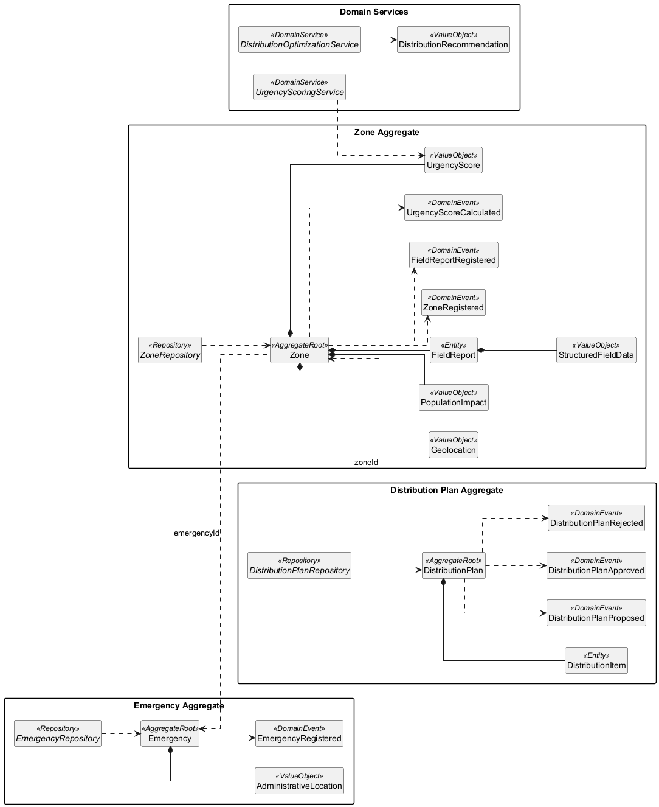

| Clase | Categoría | Propósito |
|---|---|---|
| `Emergency` | Aggregate Root | Agrupa las zonas afectadas por un mismo desastre y controla si la emergencia sigue activa. |
| `Zone` | Aggregate Root | Guarda el impacto, el score de urgencia y el estado de atención de una zona. |
| `FieldReport` | Entity | Reporte de campo en lenguaje natural, interno al aggregate `Zone`. |
| `DistributionPlan` | Aggregate Root | Propuesta de distribución de recursos para una zona, sujeta a aprobación. |
| `DistributionItem` | Entity | Cantidad de un recurso dentro de un plan, interna al aggregate `DistributionPlan`. |
| `AdministrativeLocation` | Value Object | Departamento, provincia y distrito de la emergencia. |
| `Geolocation` | Value Object | Coordenadas de la zona. |
| `PopulationImpact` | Value Object | Población afectada de la zona y sus grupos vulnerables. |
| `UrgencyScore` | Value Object | Score de urgencia con sus variables explicativas y la versión del modelo. |
| `StructuredFieldData` | Value Object | Resultado de la estructuración NLP de un reporte de campo. |
| `DistributionRecommendation` | Value Object | Recomendación que devuelve el servicio de optimización. |
| `EmergencyType`, `EmergencyStatus`, `ZoneStatus`, `DamageLevel`, `PriorityLevel`, `ReportSource`, `DistributionPlanStatus` | Enumeration | Valores cerrados del lenguaje ubicuo del contexto. |
| `UrgencyScoringService` | Domain Service (interfaz) | Calcula el score de urgencia de una zona. |
| `DistributionOptimizationService` | Domain Service (interfaz) | Recomienda una distribución que no exceda el inventario disponible. |
| `EmergencyRepository`, `ZoneRepository`, `DistributionPlanRepository` | Repository (interfaz) | Persistencia de cada aggregate. |

**Aggregates y entities.** `Emergency`, `Zone` y `DistributionPlan` se referencian entre sí solo por identificador (`emergencyId`, `zoneId`). Así cada aggregate se guarda en su propia transacción, y actualizar una zona no bloquea a su emergencia ni a sus planes. `FieldReport` vive dentro de `Zone` porque un reporte de campo no tiene sentido fuera de su zona; se estructura una sola vez con `markProcessed()`, como pide US-02. `DistributionPlan` contiene sus `DistributionItem` y controla el ciclo `PROPOSED → APPROVED o REJECTED → EXECUTED`. El método `approve()` recibe obligatoriamente un `AuthorityId`: es la forma en que el modelo hace cumplir TS-C01.

**Value objects.** `UrgencyScore` guarda el valor, el nivel de prioridad, las variables que más pesaron en el cálculo (`topFeatures`) y la versión del modelo. Con esos datos la autoridad puede justificar por qué priorizó una zona, que es lo que pide US-05. `StructuredFieldData` guarda las variables extraídas del reporte y también las que no se pudieron identificar, para que queden marcadas para revisión (US-02). Los identificadores (`EmergencyId`, `ZoneId`, `FieldReportId`, `DistributionPlanId`, `DistributionItemId`) envuelven un `UUID` e impiden usar por error el identificador de un aggregate en lugar de otro. `AuthorityId` y `ResourceId` hacen lo mismo con las referencias a Identity Access y a Resource Management, e `InventorySnapshot` trae el inventario disponible desde Resource Management. En el diagrama de clases estos tipos aparecen solo como tipo de atributo.

**Domain services.** `UrgencyScoringService` y `DistributionOptimizationService` representan las dos decisiones centrales del contexto: priorizar zonas y recomendar cómo distribuir los recursos. El dominio define solo la interfaz. La implementación está en la capa de infraestructura y llama al AI Service a través de un Anti-Corruption Layer (TS-C04), así que un cambio en el contrato REST del servicio de IA solo afecta a ese adaptador.

**Repositories.** `EmergencyRepository`, `ZoneRepository` y `DistributionPlanRepository` definen cómo se guardan y se recuperan los aggregates, sin referencias a JPA ni a PostgreSQL.

**Domain events.** Los aggregates publican `EmergencyRegistered`, `ZoneRegistered`, `FieldReportRegistered`, `UrgencyScoreCalculated`, `DistributionPlanProposed`, `DistributionPlanApproved` y `DistributionPlanRejected`. `FieldReportRegistered` dispara dentro del mismo contexto la estructuración del reporte y el recálculo del score. Citizen Transparency usa los eventos para actualizar la vista pública, Resource Management reacciona a `DistributionPlanApproved` para asignar personal y la auditoría registra cada decisión.

#### Diccionario de clases

Las tablas siguientes detallan los miembros de cada clase con su tipo y su visibilidad, tal como aparecen en el diagrama de la sección 5.1.7.1.

**`Emergency`** (Aggregate Root)

| Miembro | Tipo | Visibilidad | Descripción |
|---|---|---|---|
| `id` | `EmergencyId` | private | Identificador de la emergencia. |
| `name` | `String` | private | Nombre de la emergencia, por ejemplo "Huaico Chosica 2026". |
| `type` | `EmergencyType` | private | Tipo de desastre. |
| `description` | `String` | private | Descripción libre. |
| `location` | `AdministrativeLocation` | private | Departamento, provincia y distrito. |
| `status` | `EmergencyStatus` | private | Indica si la emergencia está activa o cerrada. |
| `startDate` | `LocalDate` | private | Fecha de inicio del desastre. |
| `register(String, EmergencyType, String, AdministrativeLocation, LocalDate)` | `Emergency` | public static | Crea la emergencia en estado `ACTIVE`. |
| `close()` | `void` | public | Cierra la emergencia; desde ese momento no admite nuevas zonas. |
| `isActive()` | `boolean` | public | Indica si la emergencia sigue activa. |

**`Zone`** (Aggregate Root)

| Miembro | Tipo | Visibilidad | Descripción |
|---|---|---|---|
| `id` | `ZoneId` | private | Identificador de la zona. |
| `emergencyId` | `EmergencyId` | private | Emergencia a la que pertenece. |
| `name` | `String` | private | Nombre o referencia de la zona. |
| `geolocation` | `Geolocation` | private | Latitud y longitud. |
| `populationImpact` | `PopulationImpact` | private | Población afectada y grupos vulnerables. |
| `damageLevel` | `DamageLevel` | private | Nivel de daño reportado. |
| `urgencyScore` | `UrgencyScore` | private | Score de urgencia vigente; está vacío hasta que se calcula. |
| `status` | `ZoneStatus` | private | Estado de atención de la zona. |
| `fieldReports` | `List<FieldReport>` | private | Reportes de campo de la zona. |
| `lastAidReceivedAt` | `LocalDateTime` | private | Fecha de la última entrega confirmada. |
| `register(EmergencyId, String, Geolocation, PopulationImpact, DamageLevel)` | `Zone` | public static | Registra la zona en estado `REGISTERED`. |
| `attachFieldReport(FieldReport)` | `void` | public | Agrega un reporte de campo a la zona. |
| `updateUrgencyScore(UrgencyScore)` | `void` | public | Aplica un nuevo score y pasa la zona a `PRIORITIZED`. |
| `markAidReceived()` | `void` | public | Pasa la zona a `SERVED` cuando se confirma una entrega. |
| `hasSufficientDataForScoring()` | `boolean` | public | Indica si hay variables suficientes para calcular el score (US-04). |

**`FieldReport`** (Entity)

| Miembro | Tipo | Visibilidad | Descripción |
|---|---|---|---|
| `id` | `FieldReportId` | private | Identificador del reporte. |
| `rawText` | `String` | private | Texto del reporte tal como se registró. |
| `source` | `ReportSource` | private | Quién envió el reporte. |
| `reportedAt` | `LocalDateTime` | private | Fecha de registro. |
| `structuredData` | `StructuredFieldData` | private | Resultado de la estructuración NLP; está vacío hasta que se procesa. |
| `register(String, ReportSource)` | `FieldReport` | public static | Registra un reporte sin procesar. |
| `markProcessed(StructuredFieldData)` | `void` | public | Guarda el resultado de la estructuración NLP. |
| `isProcessed()` | `boolean` | public | Indica si el reporte ya fue estructurado. |

**`DistributionPlan`** (Aggregate Root)

| Miembro | Tipo | Visibilidad | Descripción |
|---|---|---|---|
| `id` | `DistributionPlanId` | private | Identificador del plan. |
| `emergencyId` | `EmergencyId` | private | Emergencia asociada. |
| `zoneId` | `ZoneId` | private | Zona a la que se destina el plan. |
| `items` | `List<DistributionItem>` | private | Recursos y cantidades propuestas. |
| `status` | `DistributionPlanStatus` | private | Estado del plan. |
| `justification` | `String` | private | Explicación que devuelve el servicio de optimización. |
| `modelVersion` | `String` | private | Versión del modelo de optimización. |
| `approvedBy` | `AuthorityId` | private | Autoridad que aprobó o rechazó el plan. |
| `approvedAt` | `LocalDateTime` | private | Fecha de la decisión. |
| `rejectedReason` | `String` | private | Motivo del rechazo, si lo hubo. |
| `propose(EmergencyId, ZoneId, List<DistributionItem>, String, String)` | `DistributionPlan` | public static | Crea el plan en estado `PROPOSED`. |
| `approve(AuthorityId)` | `void` | public | Aprueba el plan; requiere una autoridad (TS-C01). |
| `reject(AuthorityId, String)` | `void` | public | Rechaza el plan con un motivo obligatorio. |
| `markExecuted()` | `void` | public | Pasa el plan a `EXECUTED` cuando Traceability confirma la entrega. |
| `isApproved()` | `boolean` | public | Indica si el plan está aprobado. |

**`DistributionItem`** (Entity)

| Miembro | Tipo | Visibilidad | Descripción |
|---|---|---|---|
| `id` | `DistributionItemId` | private | Identificador de la línea. |
| `resourceId` | `ResourceId` | private | Recurso del catálogo de Resource Management (Shared Kernel). |
| `quantity` | `int` | private | Cantidad propuesta. |
| `of(ResourceId, int)` | `DistributionItem` | public static | Crea una línea de distribución. |

**Value Objects**

| Clase | Miembros | Descripción |
|---|---|---|
| `AdministrativeLocation` | `-department: String`, `-province: String`, `-district: String`, `+getFullName(): String` | Ubicación administrativa de la emergencia. |
| `Geolocation` | `-latitude: double`, `-longitude: double` | Coordenadas de la zona. |
| `PopulationImpact` | `-familiesAffected: int`, `-peopleAffected: int`, `-children: int`, `-elderlyPeople: int`, `-disabledPeople: int`, `+getVulnerablePopulation(): int` | Impacto poblacional. `getVulnerablePopulation()` suma niños, adultos mayores y personas con discapacidad. |
| `UrgencyScore` | `-value: double`, `-level: PriorityLevel`, `-topFeatures: List<String>`, `-modelVersion: String`, `-calculatedAt: LocalDateTime`, `+isCritical(): boolean` | Score de urgencia con su explicación (US-05). |
| `StructuredFieldData` | `-extractedIndicators: Map<String, String>`, `-missingVariables: List<String>`, `+hasMissingVariables(): boolean` | Resultado de la estructuración NLP (US-02). |
| `DistributionRecommendation` | `-items: List<DistributionItem>`, `-justification: String`, `-modelVersion: String`, `+isEmpty(): boolean` | Recomendación que devuelve `DistributionOptimizationService`. |

**Enumeraciones**

| Enumeración | Valores |
|---|---|
| `EmergencyType` | `EARTHQUAKE`, `FLOOD`, `LANDSLIDE`, `FIRE`, `OTHER` |
| `EmergencyStatus` | `ACTIVE`, `CLOSED` |
| `ZoneStatus` | `REGISTERED`, `PRIORITIZED`, `SERVED` |
| `DamageLevel` | `LOW`, `MODERATE`, `SEVERE`, `CRITICAL` |
| `PriorityLevel` | `LOW`, `MEDIUM`, `HIGH`, `CRITICAL` |
| `ReportSource` | `AUTHORITY`, `VOLUNTEER`, `CITIZEN` |
| `DistributionPlanStatus` | `PROPOSED`, `APPROVED`, `REJECTED`, `EXECUTED` |

**Domain Services y Repositories**

| Interfaz | Categoría | Métodos |
|---|---|---|
| `UrgencyScoringService` | Domain Service | `+calculateScore(Zone): UrgencyScore` |
| `DistributionOptimizationService` | Domain Service | `+recommend(Zone, InventorySnapshot): DistributionRecommendation` |
| `EmergencyRepository` | Repository | `+save(Emergency): Emergency`, `+findById(EmergencyId): Optional<Emergency>`, `+findActive(): List<Emergency>` |
| `ZoneRepository` | Repository | `+save(Zone): Zone`, `+findById(ZoneId): Optional<Zone>`, `+findByEmergencyId(EmergencyId): List<Zone>` |
| `DistributionPlanRepository` | Repository | `+save(DistributionPlan): DistributionPlan`, `+findById(DistributionPlanId): Optional<DistributionPlan>`, `+findByZoneId(ZoneId): List<DistributionPlan>` |

**Relaciones entre clases**

| Origen | Relación | Destino | Multiplicidad | Descripción |
|---|---|---|---|---|
| `Zone` | Asociación (pertenece a) | `Emergency` | 0..* a 1 | Cada zona pertenece a una emergencia y la referencia por `emergencyId`. |
| `DistributionPlan` | Asociación (destinada a) | `Zone` | 0..* a 1 | Cada plan se destina a una zona y la referencia por `zoneId`. |
| `Emergency` | Composición | `AdministrativeLocation` | 1 a 1 | La emergencia contiene su ubicación. |
| `Zone` | Composición | `FieldReport` | 1 a 0..* | Los reportes de campo son internos a la zona. |
| `Zone` | Composición | `Geolocation`, `PopulationImpact` | 1 a 1 | La zona contiene su ubicación y su impacto poblacional. |
| `Zone` | Composición | `UrgencyScore` | 1 a 0..1 | La zona tiene como máximo un score vigente. |
| `FieldReport` | Composición | `StructuredFieldData` | 1 a 0..1 | El reporte guarda su resultado NLP una vez procesado. |
| `DistributionPlan` | Composición | `DistributionItem` | 1 a 1..* | El plan contiene al menos una línea. |
| `DistributionRecommendation` | Agregación | `DistributionItem` | 1 a 1..* | La recomendación propone las líneas que tomará el plan. |
| `Emergency`, `Zone`, `FieldReport`, `UrgencyScore`, `DistributionPlan` | Asociación | Enumeraciones | 1 a 1 | Tipo, estado, nivel de daño, origen del reporte y nivel de prioridad. |
| `UrgencyScoringService` | Dependencia (calcula) | `UrgencyScore` | No aplica | Calcula el score de una zona. |
| `DistributionOptimizationService` | Dependencia (produce) | `DistributionRecommendation` | No aplica | Genera la recomendación a partir de la zona y del inventario. |
| `EmergencyRepository`, `ZoneRepository`, `DistributionPlanRepository` | Dependencia (persiste) | `Emergency`, `Zone`, `DistributionPlan` | No aplica | Cada repositorio persiste su aggregate. |

### 5.1.2. Interface Layer

La capa de interfaz expone Emergency Management con cuatro controladores REST y un consumidor de eventos. Los controladores no contienen reglas de negocio: validan la petición, arman el comando o la consulta, la envían al handler que corresponde y devuelven el recurso de respuesta. Los endpoints que modifican datos exigen un JWT emitido por Identity Access y validan el rol de la autoridad con `@PreAuthorize`.

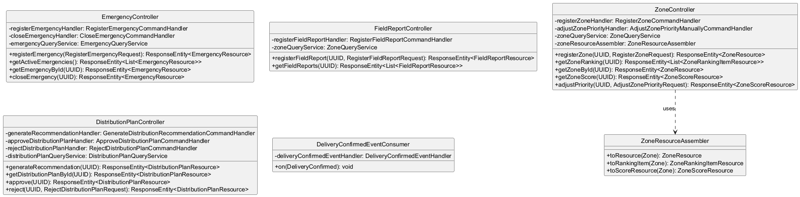

*   **EmergencyController:** `POST /api/v1/emergencies`, `GET /api/v1/emergencies`, `GET /api/v1/emergencies/{id}` y `PATCH /api/v1/emergencies/{id}/close`.
*   **ZoneController:** `POST /api/v1/emergencies/{emergencyId}/zones`, `GET /api/v1/emergencies/{emergencyId}/zones` (ranking por urgencia), `GET /api/v1/zones/{id}`, `GET /api/v1/zones/{id}/score` (score con sus variables explicativas, TS-02) y `PATCH /api/v1/zones/{id}/priority` (ajuste manual). Usa `ZoneResourceAssembler` para convertir el aggregate en sus tres recursos de salida.
*   **FieldReportController:** `POST /api/v1/zones/{zoneId}/field-reports` (TS-01) y `GET /api/v1/zones/{zoneId}/field-reports`.
*   **DistributionPlanController:** `POST /api/v1/zones/{zoneId}/distribution-plans` (TS-04), `GET /api/v1/distribution-plans/{id}`, `POST /api/v1/distribution-plans/{id}/approve` y `POST /api/v1/distribution-plans/{id}/reject`. La aprobación no lleva cuerpo, porque la autoridad se obtiene del JWT de la petición.
*   **DeliveryConfirmedEventConsumer:** recibe `DeliveryConfirmed` de Traceability con un listener interno de Spring (`@EventListener`). Como AuxIA es un monolito modular, no hace falta un broker de mensajería.

Los recursos de entrada son `RegisterEmergencyRequest`, `RegisterZoneRequest`, `RegisterFieldReportRequest`, `AdjustZonePriorityRequest` y `RejectDistributionPlanRequest`. Los de salida son `EmergencyResource`, `ZoneResource`, `ZoneRankingItemResource`, `ZoneScoreResource`, `FieldReportResource` y `DistributionPlanResource`.

### 5.1.3. Application Layer

La capa de aplicación tiene un Command Handler por caso de uso, dos Event Handlers y tres Query Services. Cada handler recibe los repositorios y puertos que necesita, carga el aggregate, llama al método de dominio que corresponde y guarda el resultado. Los puertos de salida (`FieldReportStructuringService`, `InventoryAvailabilityPort`, `ResourceReservationPort`, `AuthorizationPort` y `DomainEventPublisher`) se declaran en esta capa porque los handlers los usan para comunicarse con otros sistemas y no contienen reglas de negocio.

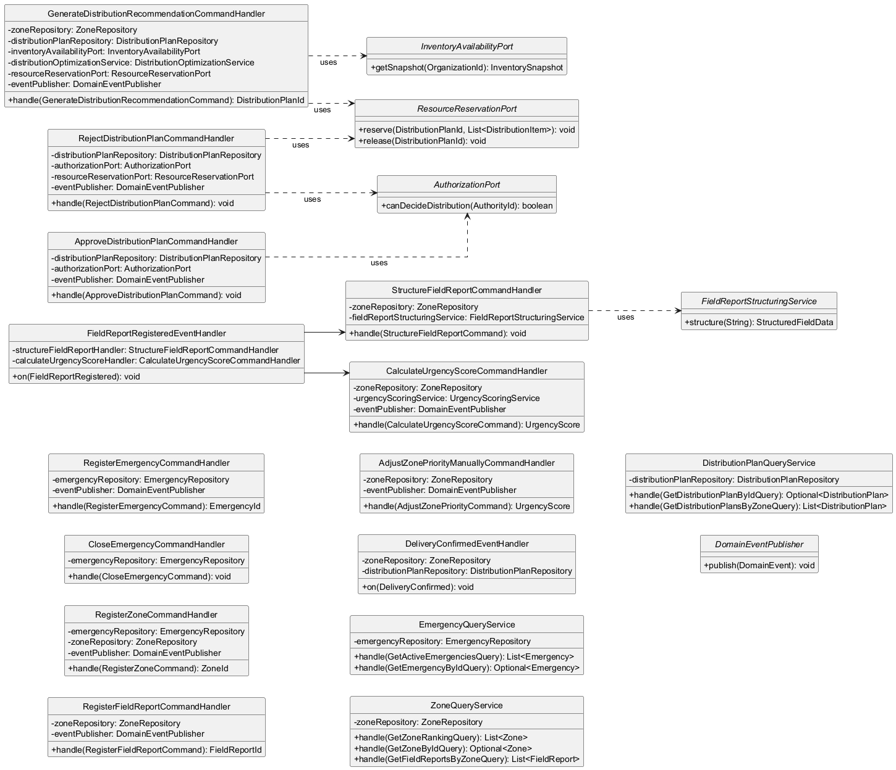

*   **Emergencias y zonas:** `RegisterEmergencyCommandHandler`, `CloseEmergencyCommandHandler` y `RegisterZoneCommandHandler`. Este último carga primero la emergencia para rechazar zonas nuevas en una emergencia cerrada.
*   **Reportes de campo y score:** `RegisterFieldReportCommandHandler` guarda el reporte y publica `FieldReportRegistered`. `FieldReportRegisteredEventHandler` reacciona a ese evento: llama a `StructureFieldReportCommandHandler`, que estructura el texto con NLP, y después a `CalculateUrgencyScoreCommandHandler`, que recalcula el score de la zona. Así el ranking se actualiza sin que la autoridad tenga que pedirlo, como en la policy correspondiente del EventStorming del Capítulo IV. `AdjustZonePriorityManuallyCommandHandler` permite a la autoridad reemplazar el score calculado y publica el cambio para que quede en la auditoría.
*   **Planes de distribución:** `GenerateDistributionRecommendationCommandHandler` obtiene con `InventoryAvailabilityPort` el inventario de la organización de la autoridad, que viene en su JWT, pide la recomendación a `DistributionOptimizationService`, crea el plan y reserva los recursos de forma provisional con `ResourceReservationPort`. `ApproveDistributionPlanCommandHandler` y `RejectDistributionPlanCommandHandler` consultan `AuthorizationPort` antes de decidir, porque el rol de la autoridad puede haber cambiado desde que se emitió su token (QAD-02). Cuando el plan se rechaza, el handler libera la reserva.
*   **Entregas:** `DeliveryConfirmedEventHandler` recibe la confirmación de Traceability, pasa la zona a `SERVED` y el plan a `EXECUTED`.
*   **Consultas:** `EmergencyQueryService`, `ZoneQueryService` y `DistributionPlanQueryService` resuelven las lecturas sin modificar ningún aggregate.

### 5.1.4. Infrastructure Layer

La capa de infraestructura implementa las interfaces del dominio y los puertos de salida de la capa de aplicación. Cada clase implementa una sola interfaz, así que cambiar una tecnología, por ejemplo el cliente HTTP del AI Service, solo afecta a su adaptador.

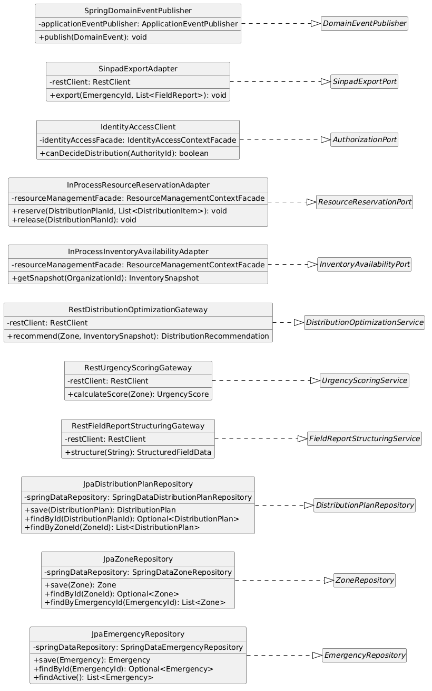

*   **Persistencia:** `JpaEmergencyRepository`, `JpaZoneRepository` y `JpaDistributionPlanRepository` implementan los repositorios del dominio. Cada uno usa un repositorio de Spring Data JPA sobre el schema `emergency_management` y convierte las entidades JPA en aggregates.
*   **AI Service:** `RestFieldReportStructuringGateway`, `RestUrgencyScoringGateway` y `RestDistributionOptimizationGateway` forman el Anti-Corruption Layer hacia el AI Service. Llaman a sus endpoints de NLP (TS-01), score (TS-02) y optimización (TS-04) con `RestClient` y traducen cada respuesta a un value object del dominio.
*   **Resource Management:** `InProcessInventoryAvailabilityAdapter` e `InProcessResourceReservationAdapter` llaman a `ResourceManagementContextFacade`, la fachada que Resource Management expone a los demás contextos. Como ambos corren en el mismo proceso, la llamada es directa y no pasa por HTTP (Shared Kernel).
*   **Identity Access:** `IdentityAccessClient` implementa `AuthorizationPort` consultando el Open Host Service de Identity Access.
*   **Eventos:** `SpringDomainEventPublisher` publica los domain events con el `ApplicationEventPublisher` de Spring para que los reciban Citizen Transparency, Resource Management y la auditoría.

### 5.1.6. Bounded Context Software Architecture Component Level Diagrams

El diagrama muestra cómo se descompone Emergency Management dentro del contenedor Backend API. Controladores, handlers, repositorios y adaptadores aparecen como componentes separados; los demás bounded contexts y el AI Service aparecen como sistemas externos. Se modeló en Structurizr DSL y se exportó desde Structurizr Local.

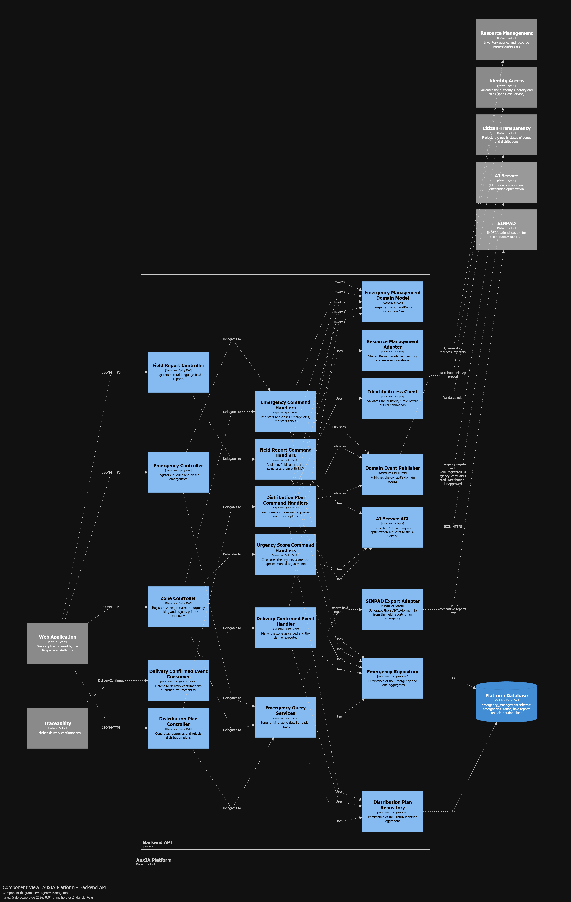

*   **Emergency, Zone, Field Report y Distribution Plan Controllers:** reciben las solicitudes JSON/HTTPS de la Web Application y las pasan a los Command Handlers o a los Query Services.
*   **Delivery Confirmed Event Consumer:** recibe `DeliveryConfirmed` de Traceability y lo pasa al Delivery Confirmed Event Handler.
*   **Command Handlers:** hay un grupo para emergencias y zonas, otro para reportes de campo, otro para el score de urgencia y otro para los planes de distribución.
*   **Emergency Query Services:** resuelven el ranking de zonas, el detalle de cada zona y el historial de planes.
*   **Emergency Management Domain Model:** contiene `Emergency`, `Zone`, `FieldReport` y `DistributionPlan`.
*   **Emergency Repository y Distribution Plan Repository:** persisten los aggregates en el schema `emergency_management` con Spring Data JPA.
*   **AI Service ACL:** traduce las llamadas de NLP, score y optimización al contrato del AI Service (TS-C04).
*   **Resource Management Adapter:** consulta el inventario disponible y pide la reserva o liberación de recursos (Shared Kernel).
*   **Identity Access Client:** verifica el rol de la autoridad antes de aprobar o rechazar un plan (TS-C01).
*   **Domain Event Publisher:** envía `EmergencyRegistered`, `ZoneRegistered`, `UrgencyScoreCalculated` y `DistributionPlanApproved` a Citizen Transparency, y `DistributionPlanApproved` también a Resource Management.

### 5.1.7. Bounded Context Software Architecture Code Level Diagrams

#### 5.1.7.1. Bounded Context Domain Layer Class Diagrams

El diagrama de clases se modeló en PlantUML e incluye las clases descritas en la sección 5.1.1, con la visibilidad de cada miembro y la multiplicidad de cada relación.

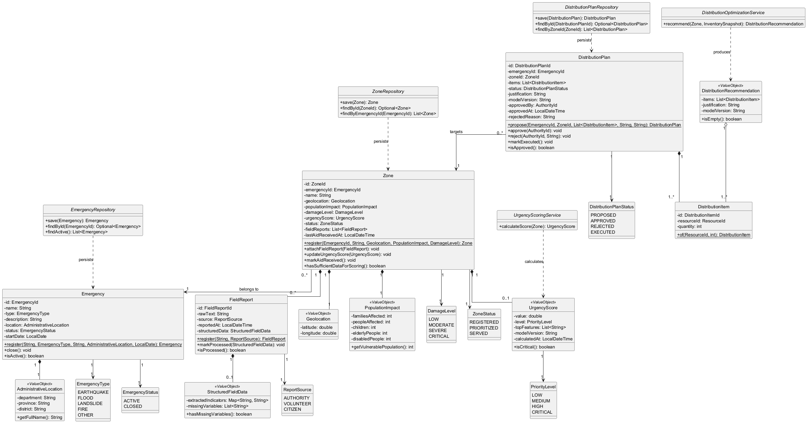

#### 5.1.7.2. Bounded Context Database Design Diagram

El schema `emergency_management` guarda los tres aggregates del contexto en cinco tablas: `emergencies`, `zones` con su tabla hija `field_reports`, y `distribution_plans` con su tabla hija `distribution_items`. El diagrama se generó con DataGrip sobre la base de datos PostgreSQL alojada en Neon.

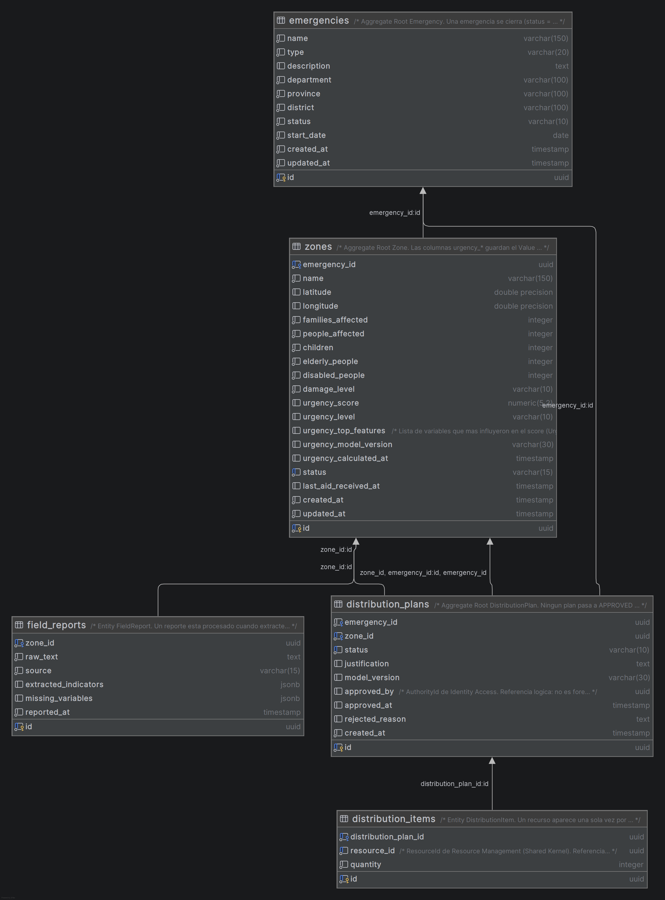

Las reglas del dominio también se aplican en la base de datos. `distribution_plans` se relaciona con `zones` mediante una foreign key compuesta `(zone_id, emergency_id)`, de modo que un plan no puede quedar asociado a una zona de otra emergencia. Un `CHECK` exige autoridad y fecha a todo plan aprobado, ejecutado o rechazado, y el motivo a todo plan rechazado (TS-C01). Otro `CHECK` obliga a que las columnas `urgency_*` de `zones` estén todas completas o todas vacías, igual que el value object `UrgencyScore`. Las emergencias y las zonas no se pueden borrar mientras tengan registros que dependan de ellas, porque en el dominio una emergencia se cierra y no se elimina.

Las columnas `approved_by` de `distribution_plans` y `resource_id` de `distribution_items` apuntan a datos de Identity Access y de Resource Management. No se declaran como foreign keys porque esos datos están en otros schemas, y una foreign key entre schemas uniría la base de datos de dos bounded contexts que deben poder cambiar por separado.

---

## 5.2. Bounded Context: Resource Management

Resource Management es un contexto Supporting. No decide qué zonas atender ni cuánto distribuir: ejecuta lo que decide Emergency Management. Mantiene el inventario de recursos humanitarios de cada organización y las brigadas que hacen las entregas. Cuando Emergency Management propone un plan, reserva el stock de forma provisional; cuando lo aprueba, asigna una brigada; y cuando Traceability confirma la entrega, descuenta del inventario lo que se entregó.

El contexto tiene los dos aggregates definidos en el Capítulo IV: Inventory y Staff. Staff se implementa con la raíz `Brigade`, porque en el EventStorming la unidad que se asigna a una entrega es la brigada y no una persona.

### 5.2.1. Domain Layer

La capa de dominio hace cumplir cuatro reglas del contexto: nunca se reserva más stock del disponible, la reserva de un plan se consume o se libera completa, una brigada tiene como máximo una asignación en curso, y cuando un recurso baja de su stock mínimo se genera una alerta.

El diagrama agrupa las clases por aggregate. Cada grupo contiene la raíz, sus entidades y value objects, el repositorio que lo persiste y los domain events que publica. Los atributos y métodos de cada clase están en el diccionario que sigue y en el diagrama de clases de la sección 5.2.7.1.

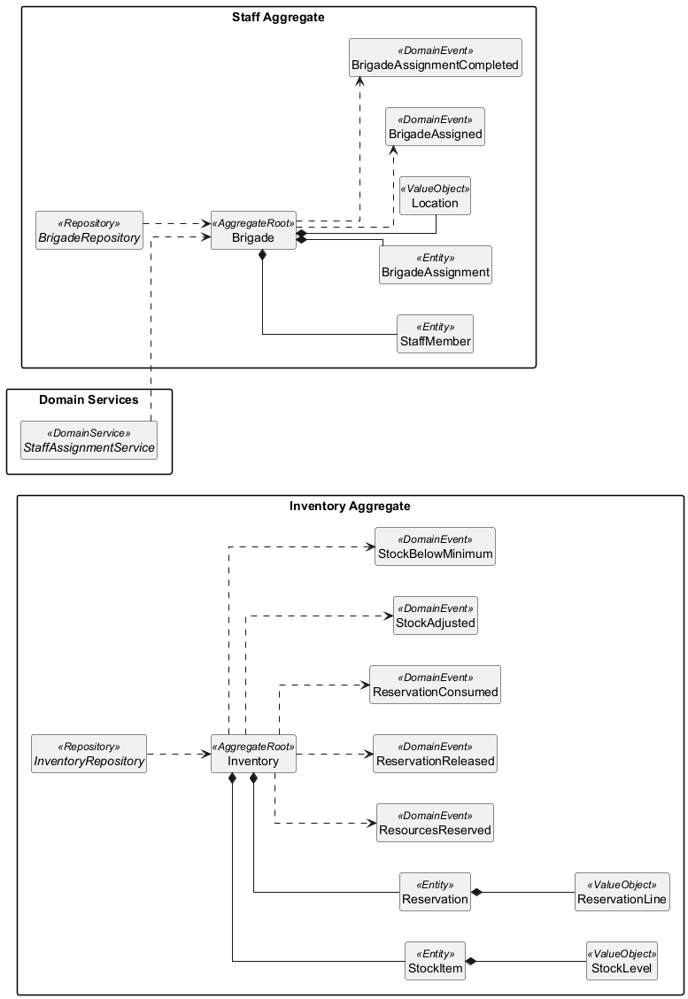

| Clase | Categoría | Propósito |
|---|---|---|
| `Inventory` | Aggregate Root | Stock de recursos de una organización y sus reservas. |
| `StockItem` | Entity | Un recurso del inventario con su cantidad física, reservada y mínima. |
| `Reservation` | Entity | Stock reservado para un plan de distribución. |
| `Brigade` | Aggregate Root | Brigada de campo con sus integrantes y sus asignaciones. |
| `StaffMember` | Entity | Integrante de una brigada. |
| `BrigadeAssignment` | Entity | Asignación de una brigada a un plan y a una zona. |
| `StockLevel` | Value Object | Cantidad física y reservada de un recurso. |
| `ReservationLine` | Value Object | Cantidad reservada de un recurso para un plan. |
| `Location` | Value Object | Coordenadas de la base de una brigada. |
| `ResourceCategory`, `UnitOfMeasure`, `ReservationStatus`, `BrigadeStatus`, `StaffRole`, `AssignmentStatus` | Enumeration | Valores cerrados del lenguaje ubicuo del contexto. |
| `StaffAssignmentService` | Domain Service (interfaz) | Elige la brigada que atenderá una zona. |
| `InventoryRepository`, `BrigadeRepository` | Repository (interfaz) | Persistencia de cada aggregate. |

**Aggregates y entities.** `Inventory` agrupa el stock de una organización. En el MVP cada organización tiene un solo inventario (TS-C08), así que la reserva de un plan modifica un único aggregate y se guarda en una sola transacción: se reservan todas las líneas del plan o ninguna. `StockItem` representa un recurso; su `resourceId` es el mismo identificador que Emergency Management guarda en cada `DistributionItem` (Shared Kernel). `Reservation` guarda las líneas reservadas para un plan y se cierra cuando se consume o se libera. `Brigade` contiene a sus `StaffMember` y registra cada asignación en un `BrigadeAssignment`. El método `assignTo()` rechaza la asignación si la brigada no está disponible o si no tiene un integrante con rol `LEADER`.

**Value objects.** `StockLevel` guarda la cantidad física (`onHand`) y la reservada (`reserved`); `available()` devuelve la diferencia, que es lo que la autoridad ve como stock disponible (US-09). `ReservationLine` indica cuánto de cada recurso se reservó para un plan. `Location` guarda la base de la brigada y calcula su distancia a una zona. Los identificadores (`InventoryId`, `ResourceId`, `ReservationId`, `BrigadeId`, `StaffMemberId`, `AssignmentId`) envuelven un `UUID`. `OrganizationId`, `DistributionPlanId` y `ZoneId` son referencias tipadas a Identity Access y a Emergency Management. En el diagrama de clases estos tipos aparecen solo como tipo de atributo.

**Domain services.** `StaffAssignmentService` elige, entre las brigadas disponibles, la que atenderá una zona según su cercanía, como se definió en el Escenario 3 del Domain Message Flow Modeling. El dominio define solo la interfaz; la implementación llama al AI Service a través de un Anti-Corruption Layer (TS-C04).

**Repositories.** `InventoryRepository` busca inventarios por organización, por recurso y por el plan que tienen reservado. `BrigadeRepository` busca las brigadas disponibles de una organización y la brigada asignada a un plan.

**Domain events.** `Inventory` publica `ResourcesReserved`, `ReservationReleased`, `ReservationConsumed`, `StockAdjusted` y `StockBelowMinimum`. `Brigade` publica `BrigadeAssigned` y `BrigadeAssignmentCompleted`. Traceability usa `BrigadeAssigned` para iniciar el expediente de entrega, `StockBelowMinimum` dispara la alerta de stock bajo y `StockAdjusted` deja registrado cada ajuste manual para la auditoría (QAD-03).

#### Diccionario de clases

Las tablas siguientes detallan los miembros de cada clase con su tipo y su visibilidad, tal como aparecen en el diagrama de la sección 5.2.7.1.

**`Inventory`** (Aggregate Root)

| Miembro | Tipo | Visibilidad | Descripción |
|---|---|---|---|
| `id` | `InventoryId` | private | Identificador del inventario. |
| `organizationId` | `OrganizationId` | private | Organización dueña del inventario. |
| `name` | `String` | private | Nombre del almacén, por ejemplo "Almacén Central Lima". |
| `stockItems` | `List<StockItem>` | private | Recursos del inventario. |
| `reservations` | `List<Reservation>` | private | Reservas hechas para planes de distribución. |
| `create(OrganizationId, String)` | `Inventory` | public static | Crea un inventario vacío para una organización. |
| `registerResource(String, ResourceCategory, UnitOfMeasure, int)` | `ResourceId` | public | Agrega un recurso con su stock mínimo. |
| `restock(ResourceId, int)` | `void` | public | Suma una cantidad recibida, por ejemplo una donación. |
| `adjustStock(ResourceId, int, String)` | `void` | public | Corrige la cantidad física con un motivo obligatorio. |
| `reserve(DistributionPlanId, List<ReservationLine>)` | `void` | public | Reserva todas las líneas de un plan; falla si alguna supera el stock disponible. |
| `releaseReservation(DistributionPlanId)` | `void` | public | Devuelve al disponible el stock reservado para un plan. |
| `consumeReservation(DistributionPlanId, List<ReservationLine>)` | `void` | public | Descuenta lo entregado y libera lo que se reservó y no se entregó. |
| `availableQuantityOf(ResourceId)` | `int` | public | Devuelve el stock disponible de un recurso. |

**`StockItem`** (Entity)

| Miembro | Tipo | Visibilidad | Descripción |
|---|---|---|---|
| `resourceId` | `ResourceId` | private | Identificador del recurso, compartido con Emergency Management. |
| `name` | `String` | private | Nombre del recurso, por ejemplo "Agua 2.5 L". |
| `category` | `ResourceCategory` | private | Categoría del recurso. |
| `unit` | `UnitOfMeasure` | private | Unidad en que se cuenta. |
| `stockLevel` | `StockLevel` | private | Cantidad física y reservada. |
| `minimumStock` | `int` | private | Cantidad disponible por debajo de la cual se genera una alerta. |
| `increase(int)` | `void` | public | Aumenta la cantidad física. |
| `reserve(int)` | `void` | public | Pasa una cantidad de disponible a reservada. |
| `release(int)` | `void` | public | Devuelve una cantidad reservada al disponible. |
| `consume(int)` | `void` | public | Descuenta una cantidad reservada de la cantidad física. |
| `isBelowMinimum()` | `boolean` | public | Indica si el disponible está por debajo del mínimo. |

**`Reservation`** (Entity)

| Miembro | Tipo | Visibilidad | Descripción |
|---|---|---|---|
| `id` | `ReservationId` | private | Identificador de la reserva. |
| `distributionPlanId` | `DistributionPlanId` | private | Plan de Emergency Management al que pertenece la reserva. |
| `lines` | `List<ReservationLine>` | private | Recursos y cantidades reservadas. |
| `status` | `ReservationStatus` | private | Estado de la reserva. |
| `reservedAt` | `LocalDateTime` | private | Fecha de la reserva. |
| `closedAt` | `LocalDateTime` | private | Fecha en que se consumió o se liberó. |
| `release()` | `void` | public | Pasa la reserva a `RELEASED`. |
| `consume()` | `void` | public | Pasa la reserva a `CONSUMED`. |
| `isActive()` | `boolean` | public | Indica si la reserva sigue abierta. |

**`Brigade`** (Aggregate Root)

| Miembro | Tipo | Visibilidad | Descripción |
|---|---|---|---|
| `id` | `BrigadeId` | private | Identificador de la brigada. |
| `organizationId` | `OrganizationId` | private | Organización a la que pertenece. |
| `name` | `String` | private | Nombre de la brigada. |
| `baseLocation` | `Location` | private | Ubicación de su base. |
| `status` | `BrigadeStatus` | private | Disponibilidad de la brigada. |
| `members` | `List<StaffMember>` | private | Integrantes de la brigada. |
| `assignments` | `List<BrigadeAssignment>` | private | Historial de asignaciones. |
| `create(OrganizationId, String, Location)` | `Brigade` | public static | Crea la brigada en estado `AVAILABLE`. |
| `addMember(StaffMember)` | `void` | public | Agrega un integrante. |
| `removeMember(StaffMemberId)` | `void` | public | Retira un integrante. |
| `assignTo(DistributionPlanId, ZoneId)` | `void` | public | Asigna la brigada a un plan y la pasa a `ASSIGNED`. |
| `completeAssignment(DistributionPlanId)` | `void` | public | Cierra la asignación y devuelve la brigada a `AVAILABLE`. |
| `changeAvailability(BrigadeStatus)` | `void` | public | Cambia entre `AVAILABLE` y `OFF_DUTY` cuando no hay asignación en curso. |
| `isAvailable()` | `boolean` | public | Indica si la brigada puede recibir una asignación. |

**`StaffMember`** (Entity)

| Miembro | Tipo | Visibilidad | Descripción |
|---|---|---|---|
| `id` | `StaffMemberId` | private | Identificador del integrante. |
| `fullName` | `String` | private | Nombre completo. |
| `role` | `StaffRole` | private | Rol dentro de la brigada. |
| `phone` | `String` | private | Teléfono de contacto. |
| `register(String, StaffRole, String)` | `StaffMember` | public static | Registra un integrante. |
| `isLeader()` | `boolean` | public | Indica si el integrante lidera la brigada. |

**`BrigadeAssignment`** (Entity)

| Miembro | Tipo | Visibilidad | Descripción |
|---|---|---|---|
| `id` | `AssignmentId` | private | Identificador de la asignación. |
| `distributionPlanId` | `DistributionPlanId` | private | Plan que ejecuta la brigada. |
| `zoneId` | `ZoneId` | private | Zona de destino. |
| `status` | `AssignmentStatus` | private | Estado de la asignación. |
| `assignedAt` | `LocalDateTime` | private | Fecha de la asignación. |
| `completedAt` | `LocalDateTime` | private | Fecha en que se confirmó la entrega. |
| `complete()` | `void` | public | Pasa la asignación a `COMPLETED`. |
| `isInProgress()` | `boolean` | public | Indica si la asignación sigue en curso. |

**Value Objects**

| Clase | Miembros | Descripción |
|---|---|---|
| `StockLevel` | `-onHand: int`, `-reserved: int`, `+available(): int` | Cantidad física y reservada; `available()` devuelve `onHand - reserved`. |
| `ReservationLine` | `-resourceId: ResourceId`, `-quantity: int` | Cantidad reservada o entregada de un recurso. |
| `Location` | `-latitude: double`, `-longitude: double`, `+distanceTo(Location): double` | Coordenadas de la base de una brigada. |

**Enumeraciones**

| Enumeración | Valores |
|---|---|
| `ResourceCategory` | `WATER`, `FOOD`, `SHELTER`, `HYGIENE`, `MEDICINE`, `OTHER` |
| `UnitOfMeasure` | `UNIT`, `KG`, `LITER`, `KIT` |
| `ReservationStatus` | `ACTIVE`, `CONSUMED`, `RELEASED` |
| `BrigadeStatus` | `AVAILABLE`, `ASSIGNED`, `OFF_DUTY` |
| `StaffRole` | `LEADER`, `DRIVER`, `MEDIC`, `VOLUNTEER` |
| `AssignmentStatus` | `IN_PROGRESS`, `COMPLETED` |

**Domain Services y Repositories**

| Interfaz | Categoría | Métodos |
|---|---|---|
| `StaffAssignmentService` | Domain Service | `+suggestBrigade(List<Brigade>, Location): BrigadeId` |
| `InventoryRepository` | Repository | `+save(Inventory): Inventory`, `+findById(InventoryId): Optional<Inventory>`, `+findByOrganizationId(OrganizationId): Optional<Inventory>`, `+findByResourceId(ResourceId): Optional<Inventory>`, `+findByReservationPlanId(DistributionPlanId): Optional<Inventory>` |
| `BrigadeRepository` | Repository | `+save(Brigade): Brigade`, `+findById(BrigadeId): Optional<Brigade>`, `+findAvailableByOrganizationId(OrganizationId): List<Brigade>`, `+findByAssignedPlanId(DistributionPlanId): Optional<Brigade>` |

**Relaciones entre clases**

| Origen | Relación | Destino | Multiplicidad | Descripción |
|---|---|---|---|---|
| `Inventory` | Composición | `StockItem` | 1 a 0..* | El inventario contiene sus recursos. |
| `Inventory` | Composición | `Reservation` | 1 a 0..* | El inventario contiene las reservas hechas sobre su stock. |
| `StockItem` | Composición | `StockLevel` | 1 a 1 | Cada recurso tiene su cantidad física y reservada. |
| `Reservation` | Composición | `ReservationLine` | 1 a 1..* | Una reserva tiene al menos una línea. |
| `Brigade` | Composición | `StaffMember` | 1 a 0..* | La brigada contiene a sus integrantes. |
| `Brigade` | Composición | `BrigadeAssignment` | 1 a 0..* | La brigada guarda su historial de asignaciones. |
| `Brigade` | Composición | `Location` | 1 a 1 | La brigada tiene una base. |
| `StockItem`, `Reservation`, `Brigade`, `StaffMember`, `BrigadeAssignment` | Asociación | Enumeraciones | 1 a 1 | Categoría, unidad, estado y rol. |
| `StaffAssignmentService` | Dependencia (selects) | `Brigade` | No aplica | Elige una brigada entre las disponibles. |
| `InventoryRepository`, `BrigadeRepository` | Dependencia (persists) | `Inventory`, `Brigade` | No aplica | Cada repositorio persiste su aggregate. |

### 5.2.2. Interface Layer

La capa de interfaz tiene dos controladores REST para el Administrador de Organización, una fachada que Emergency Management llama dentro del mismo proceso y dos consumidores de eventos. Los endpoints que modifican datos exigen el rol de administrador en el JWT emitido por Identity Access.

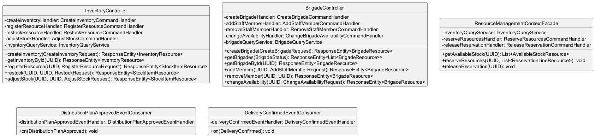

*   **InventoryController:** `POST /api/v1/inventories`, `GET /api/v1/inventories/{id}` (stock disponible y reservado de cada recurso, US-09), `POST /api/v1/inventories/{id}/resources`, `POST /api/v1/inventories/{id}/resources/{resourceId}/restock` y `PATCH /api/v1/inventories/{id}/resources/{resourceId}/adjustment` (ajuste manual con motivo).
*   **BrigadeController:** `POST /api/v1/brigades`, `GET /api/v1/brigades?status={status}`, `GET /api/v1/brigades/{id}`, `POST /api/v1/brigades/{id}/members`, `DELETE /api/v1/brigades/{id}/members/{memberId}` y `PATCH /api/v1/brigades/{id}/availability`.
*   **ResourceManagementContextFacade:** la usan los adaptadores de Emergency Management para consultar el stock disponible de una organización, reservar los recursos de un plan y liberar esa reserva. Recibe y devuelve identificadores `UUID` y recursos simples, así Emergency Management no depende de las clases del dominio de este contexto.
*   **DistributionPlanApprovedEventConsumer:** recibe `DistributionPlanApproved` de Emergency Management, con el plan, la zona y sus coordenadas.
*   **DeliveryConfirmedEventConsumer:** recibe `DeliveryConfirmed` de Traceability, con el plan y las cantidades entregadas de cada recurso.

Los recursos de entrada son `CreateInventoryRequest`, `RegisterResourceRequest`, `RestockRequest`, `AdjustStockRequest`, `CreateBrigadeRequest`, `AddStaffMemberRequest` y `ChangeAvailabilityRequest`. Los de salida son `InventoryResource`, `StockItemResource`, `BrigadeResource`, `AvailableStockResource` y `ReservationLineResource`.

### 5.2.3. Application Layer

La capa de aplicación tiene un Command Handler por caso de uso, tres Event Handlers y dos Query Services. Cada handler carga el aggregate, llama al método de dominio que corresponde y lo guarda. Declara dos puertos de salida: `StockAlertNotifier`, para enviar las alertas de stock bajo, y `DomainEventPublisher`, para publicar los domain events.

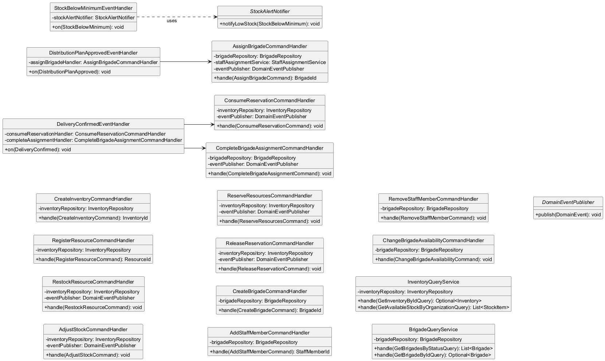

*   **Inventario:** `CreateInventoryCommandHandler`, `RegisterResourceCommandHandler`, `RestockResourceCommandHandler` y `AdjustStockCommandHandler`. El ajuste manual exige un motivo y publica `StockAdjusted` para la auditoría.
*   **Reservas:** `ReserveResourcesCommandHandler` se ejecuta cuando Emergency Management propone un plan (Escenario 1). `ReleaseReservationCommandHandler` se ejecuta cuando el plan se rechaza (Escenario 5). `ConsumeReservationCommandHandler` se ejecuta cuando se confirma la entrega (Escenario 4): descuenta lo entregado y libera lo que se reservó y no se entregó, de modo que el inventario refleja lo que realmente salió del almacén.
*   **Brigadas:** `CreateBrigadeCommandHandler`, `AddStaffMemberCommandHandler`, `RemoveStaffMemberCommandHandler` y `ChangeBrigadeAvailabilityCommandHandler` mantienen las brigadas. `AssignBrigadeCommandHandler` obtiene las brigadas disponibles de la organización, pide a `StaffAssignmentService` la más adecuada para la zona, la asigna y publica `BrigadeAssigned`. `CompleteBrigadeAssignmentCommandHandler` cierra la asignación y deja la brigada disponible otra vez.
*   **Eventos:** `DistributionPlanApprovedEventHandler` llama a `AssignBrigadeCommandHandler`. `DeliveryConfirmedEventHandler` llama a `ConsumeReservationCommandHandler` y a `CompleteBrigadeAssignmentCommandHandler`. `StockBelowMinimumEventHandler` envía la alerta con `StockAlertNotifier`.
*   **Consultas:** `InventoryQueryService` devuelve el inventario y el stock disponible de una organización, y `BrigadeQueryService` devuelve las brigadas filtradas por estado.

### 5.2.4. Infrastructure Layer

La capa de infraestructura implementa las interfaces del dominio y los puertos de salida de la capa de aplicación. Cada clase implementa una sola interfaz.

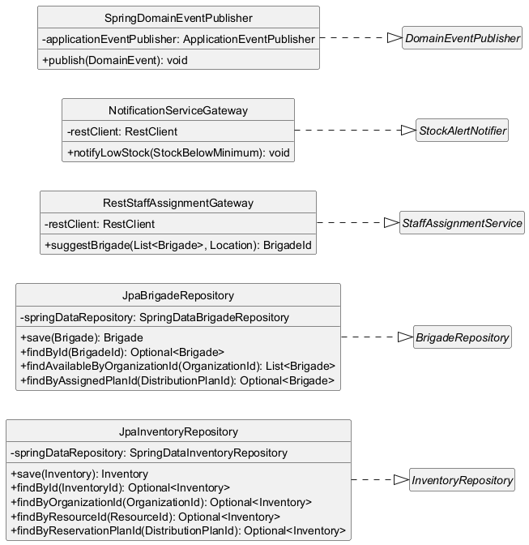

*   **Persistencia:** `JpaInventoryRepository` y `JpaBrigadeRepository` implementan los repositorios del dominio con Spring Data JPA sobre el schema `resource_management`.
*   **AI Service:** `RestStaffAssignmentGateway` es el Anti-Corruption Layer hacia el AI Service. Envía las brigadas disponibles y la ubicación de la zona, y traduce la respuesta al `BrigadeId` elegido.
*   **Notificaciones:** `NotificationServiceGateway` implementa `StockAlertNotifier` con una llamada al Servicio de Notificaciones externo definido en el System Landscape Diagram del Capítulo IV.
*   **Eventos:** `SpringDomainEventPublisher` publica los domain events con el `ApplicationEventPublisher` de Spring para que los reciban Traceability y la auditoría.

### 5.2.6. Bounded Context Software Architecture Component Level Diagrams

El diagrama muestra cómo se descompone Resource Management dentro del contenedor Backend API. Emergency Management, Traceability, el AI Service y el Servicio de Notificaciones aparecen como sistemas externos. Se modeló en Structurizr DSL y se exportó desde Structurizr Local.

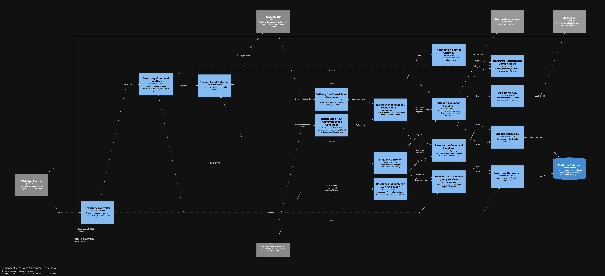

*   **Inventory Controller y Brigade Controller:** reciben las solicitudes JSON/HTTPS del Administrador de Organización.
*   **Resource Management Context Facade:** recibe las consultas de stock y las reservas de Emergency Management (Shared Kernel).
*   **Distribution Plan Approved y Delivery Confirmed Event Consumers:** reciben los eventos de Emergency Management y de Traceability.
*   **Command Handlers:** hay un grupo para el inventario, otro para las reservas y otro para las brigadas.
*   **Resource Management Event Handlers:** asignan una brigada al aprobarse un plan, consumen la reserva y cierran la asignación al confirmarse la entrega, y envían la alerta de stock bajo.
*   **Resource Management Query Services:** resuelven el inventario de una organización y las brigadas por estado.
*   **Resource Management Domain Model:** contiene `Inventory`, `StockItem`, `Reservation`, `Brigade` y `StaffMember`.
*   **Inventory Repository y Brigade Repository:** persisten los aggregates en el schema `resource_management` con Spring Data JPA.
*   **AI Service ACL:** traduce la solicitud de sugerencia de brigada al contrato del AI Service.
*   **Notification Service Gateway:** envía las alertas de stock bajo al Servicio de Notificaciones.
*   **Domain Event Publisher:** envía `BrigadeAssigned` a Traceability.

### 5.2.7. Bounded Context Software Architecture Code Level Diagrams

#### 5.2.7.1. Bounded Context Domain Layer Class Diagrams

El diagrama de clases se modeló en PlantUML e incluye las clases descritas en la sección 5.2.1, con la visibilidad de cada miembro y la multiplicidad de cada relación.

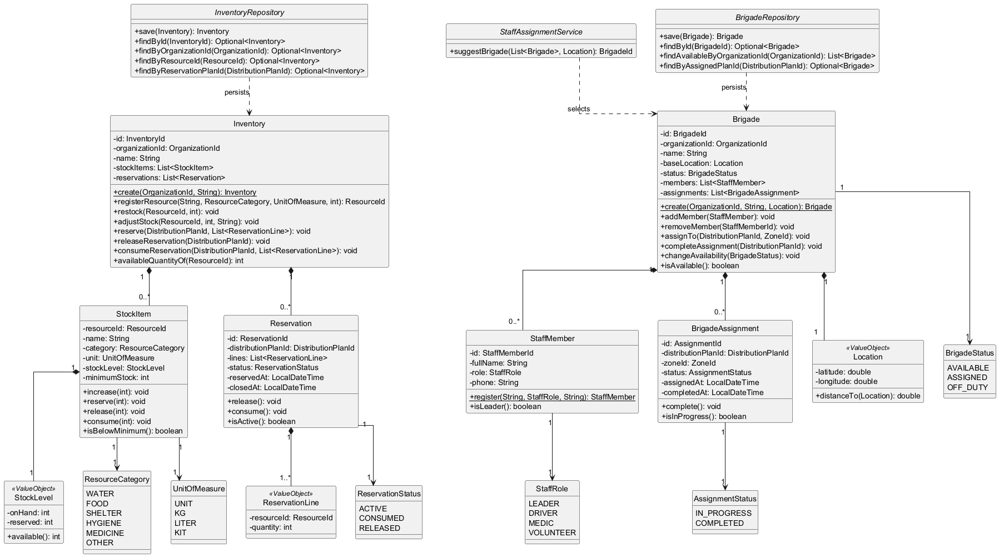

#### 5.2.7.2. Bounded Context Database Design Diagram

El schema `resource_management` guarda los dos aggregates del contexto en siete tablas: `inventories` con sus tablas hijas `stock_items`, `reservations` y `reservation_lines`, y `brigades` con sus tablas hijas `staff_members` y `brigade_assignments`. El diagrama se generó con DataGrip sobre la base de datos PostgreSQL alojada en Neon.

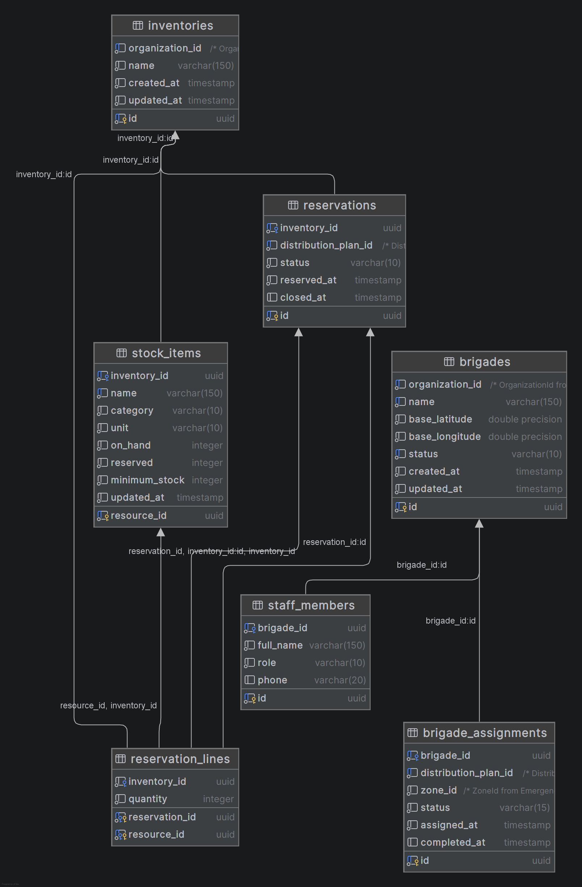

Las reglas del dominio también se aplican en la base de datos. Un `CHECK` impide que la cantidad reservada de un recurso supere su cantidad física. `reservation_lines` referencia a `reservations` y a `stock_items` mediante foreign keys compuestas que incluyen `inventory_id`, de modo que una reserva no puede incluir un recurso de otro inventario. Cada plan tiene como máximo una reserva y una asignación de brigada, y un índice único parcial impide que una brigada tenga dos asignaciones en curso. Las reservas y las asignaciones solo tienen fecha de cierre cuando están cerradas.

Las columnas `organization_id`, `distribution_plan_id` y `zone_id` apuntan a datos de Identity Access y de Emergency Management. No se declaran como foreign keys porque esos datos están en otros schemas.

---

## 5.3. Bounded Context: Traceability

Traceability es el segundo contexto Core de AuxIA. Resource Management administra recursos internos; Traceability, en cambio, certifica hechos del mundo físico: que una entrega ocurrió, qué se entregó y que su evidencia no fue alterada después. Responde a los problemas de trazabilidad de evidencias y de entregas duplicadas identificados en el needfinding (FD-03, QAD-01).

Su aggregate es Delivery, el mismo del Capítulo IV. Una entrega pasa por tres estados. Se inicia cuando Resource Management asigna una brigada, queda registrada cuando la brigada la confirma con evidencia y se certifica cuando su hash queda guardado en Blockchain. La separación entre entrega iniciada y entrega registrada es la que se definió en el Escenario 3 del Domain Message Flow Modeling.

### 5.3.1. Domain Layer

La capa de dominio hace cumplir cuatro reglas del contexto:
- Ninguna entrega se registra sin evidencia (US-15).
- Cada plan tiene una sola entrega.
- Lo que se envía a Blockchain es solo un hash calculado sobre un registro sin datos personales (TS-C02).
- La información completa de la entrega se queda en PostgreSQL (TS-C03).

El diagrama agrupa las clases del aggregate con su repositorio y los domain events que publica. Los atributos y métodos de cada clase están en el diccionario que sigue y en el diagrama de clases de la sección 5.3.7.1.

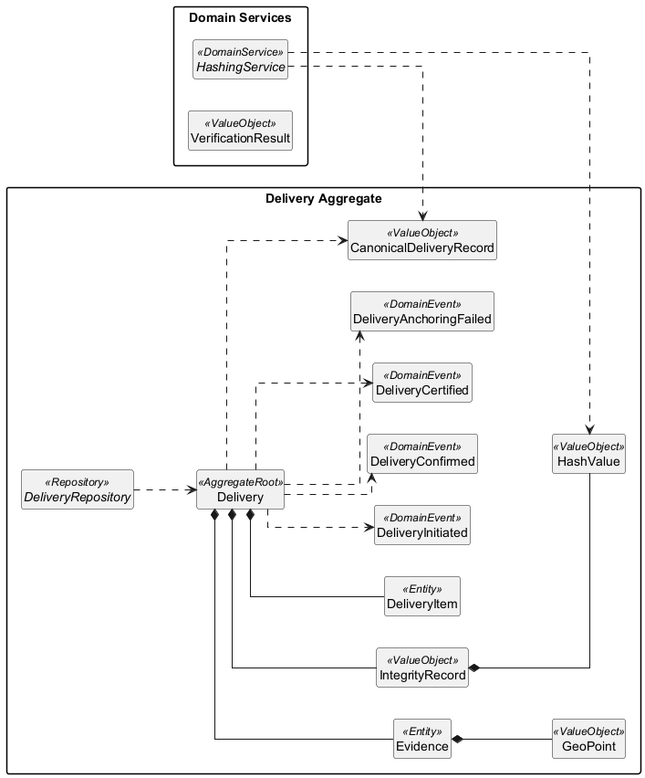

| Clase | Categoría | Propósito |
|---|---|---|
| `Delivery` | Aggregate Root | Expediente de una entrega, desde su inicio hasta su certificación en Blockchain. |
| `DeliveryItem` | Entity | Cantidad entregada de un recurso. |
| `Evidence` | Entity | Foto o documento que respalda la entrega, con el hash de su contenido. |
| `IntegrityRecord` | Value Object | Hash del registro y estado de su anclaje en Blockchain. |
| `CanonicalDeliveryRecord` | Value Object | Registro de la entrega que se usa para calcular el hash, sin datos personales. |
| `HashValue` | Value Object | Hash SHA-256 en hexadecimal. |
| `GeoPoint` | Value Object | Coordenadas donde se capturó una evidencia. |
| `VerificationResult` | Value Object | Resultado de comparar el hash de la base de datos con el de Blockchain. |
| `DeliveryStatus`, `AnchorStatus`, `EvidenceType` | Enumeration | Valores cerrados del lenguaje ubicuo del contexto. |
| `HashingService` | Domain Service (interfaz) | Calcula el hash del registro y de cada archivo de evidencia. |
| `DeliveryRepository` | Repository (interfaz) | Persistencia del aggregate. |

**Aggregate y entities.** `Delivery` se crea con `initiate()` en estado `INITIATED`, a partir de la asignación de brigada. El método `register()` recibe los recursos entregados, las evidencias, el usuario que registra y la fecha de entrega. Rechaza el registro si no hay al menos una evidencia o si la entrega ya no está en `INITIATED`. Al terminar, calcula el hash del registro con `HashingService` y deja la entrega en `REGISTERED`. `markAnchored()` guarda la transacción de Blockchain y pasa la entrega a `CERTIFIED`; `markAnchoringFailed()` deja el anclaje en `FAILED` para reintentarlo. `DeliveryItem` guarda lo que realmente se entregó, que puede ser menos de lo planificado. `Evidence` guarda la URL del archivo en Azure Blob Storage y el hash de su contenido, así que alterar la foto después del registro también se detecta.

**Value objects.** `CanonicalDeliveryRecord` es la pieza que hace cumplir TS-C02. Se construye con una lista cerrada de campos: identificadores de la entrega, del plan y de la zona, recursos y cantidades, hashes de las evidencias y fecha de entrega. Como no incluye nombres, documentos ni datos de los beneficiarios, esos datos no pueden llegar al hash ni a Blockchain. `toCanonicalJson()` ordena los campos siempre de la misma forma, para que el mismo registro produzca siempre el mismo hash. `IntegrityRecord` guarda ese hash, el estado del anclaje, la transacción y el número de intentos. `VerificationResult` devuelve los dos hashes comparados y si coinciden. Los identificadores (`DeliveryId`, `DeliveryItemId`, `EvidenceId`) envuelven un `UUID`. `DistributionPlanId`, `ZoneId`, `BrigadeId`, `ResourceId` y `UserId` son referencias tipadas a Emergency Management, Resource Management e Identity Access. En el diagrama de clases aparecen solo como tipo de atributo.

**Domain services.** `HashingService` calcula el SHA-256 del registro canónico y de cada archivo de evidencia. El dominio define la interfaz para que el algoritmo quede fuera del modelo.

**Repositories.** `DeliveryRepository` busca entregas por plan, por zona y las que tienen el anclaje pendiente o fallido.

**Domain events.** `Delivery` publica cuatro eventos:
- **`DeliveryInitiated`:** se abre el expediente de la entrega; Citizen Transparency muestra la ayuda en camino.
- **`DeliveryConfirmed`:** lo reciben Resource Management, que descuenta el inventario, Emergency Management, que marca la zona como atendida, y Citizen Transparency, que muestra la ayuda como entregada.
- **`DeliveryCertified`:** lo recibe Citizen Transparency, que muestra la entrega como verificada.
- **`DeliveryAnchoringFailed`:** avisa que Blockchain rechazó o no respondió, para que se reintente.

#### Diccionario de clases

Las tablas siguientes detallan los miembros de cada clase con su tipo y su visibilidad, tal como aparecen en el diagrama de la sección 5.3.7.1.

**`Delivery`** (Aggregate Root)

| Miembro | Tipo | Visibilidad | Descripción |
|---|---|---|---|
| `id` | `DeliveryId` | private | Identificador de la entrega. |
| `distributionPlanId` | `DistributionPlanId` | private | Plan de Emergency Management que ejecuta la entrega. |
| `zoneId` | `ZoneId` | private | Zona de destino. |
| `brigadeId` | `BrigadeId` | private | Brigada asignada por Resource Management. |
| `status` | `DeliveryStatus` | private | Estado de la entrega. |
| `items` | `List<DeliveryItem>` | private | Recursos y cantidades entregadas. |
| `evidences` | `List<Evidence>` | private | Evidencias adjuntas. |
| `registeredBy` | `UserId` | private | Integrante de la brigada que registró la entrega. |
| `deliveredAt` | `LocalDateTime` | private | Fecha de la entrega según el dispositivo, aunque se haya registrado sin conexión. |
| `receivedAt` | `LocalDateTime` | private | Fecha en que el servidor recibió el registro. |
| `integrityRecord` | `IntegrityRecord` | private | Hash del registro y estado de su anclaje; vacío mientras la entrega no se registre. |
| `initiate(DistributionPlanId, ZoneId, BrigadeId)` | `Delivery` | public static | Abre el expediente en estado `INITIATED`. |
| `register(List<DeliveryItem>, List<Evidence>, UserId, LocalDateTime, HashingService)` | `void` | public | Registra la entrega con al menos una evidencia y calcula el hash del registro. |
| `markAnchored(String, LocalDateTime)` | `void` | public | Guarda la transacción de Blockchain y pasa la entrega a `CERTIFIED`. |
| `markAnchoringFailed()` | `void` | public | Deja el anclaje en `FAILED` y suma un intento. |
| `toCanonicalRecord()` | `CanonicalDeliveryRecord` | public | Construye el registro sin datos personales que se usa para el hash. |
| `isRegistered()` | `boolean` | public | Indica si la entrega ya fue registrada. |

**`DeliveryItem`** (Entity)

| Miembro | Tipo | Visibilidad | Descripción |
|---|---|---|---|
| `id` | `DeliveryItemId` | private | Identificador de la línea. |
| `resourceId` | `ResourceId` | private | Recurso entregado. |
| `quantity` | `int` | private | Cantidad entregada. |
| `of(ResourceId, int)` | `DeliveryItem` | public static | Crea una línea de entrega. |

**`Evidence`** (Entity)

| Miembro | Tipo | Visibilidad | Descripción |
|---|---|---|---|
| `id` | `EvidenceId` | private | Identificador de la evidencia. |
| `type` | `EvidenceType` | private | Foto o documento. |
| `storageUrl` | `String` | private | Ubicación del archivo en Azure Blob Storage. |
| `contentHash` | `HashValue` | private | SHA-256 del contenido del archivo. |
| `capturedAt` | `LocalDateTime` | private | Fecha de captura. |
| `location` | `GeoPoint` | private | Coordenadas de captura, si el dispositivo las registró. |
| `attach(EvidenceType, String, HashValue, LocalDateTime, GeoPoint)` | `Evidence` | public static | Crea la evidencia a partir del archivo ya guardado. |

**Value Objects**

| Clase | Miembros | Descripción |
|---|---|---|
| `IntegrityRecord` | `-recordHash: HashValue`, `-status: AnchorStatus`, `-transactionHash: String`, `-anchoredAt: LocalDateTime`, `-attempts: int`, `+isAnchored(): boolean` | Hash del registro y estado de su anclaje en Blockchain. |
| `CanonicalDeliveryRecord` | `-deliveryId: DeliveryId`, `-distributionPlanId: DistributionPlanId`, `-zoneId: ZoneId`, `-items: List<DeliveryItem>`, `-evidenceHashes: List<HashValue>`, `-deliveredAt: LocalDateTime`, `+toCanonicalJson(): String` | Registro sin datos personales, con los campos siempre en el mismo orden. |
| `HashValue` | `-value: String`, `+matches(HashValue): boolean` | SHA-256 de 64 caracteres hexadecimales. |
| `GeoPoint` | `-latitude: double`, `-longitude: double` | Coordenadas de captura. |
| `VerificationResult` | `-databaseHash: HashValue`, `-blockchainHash: HashValue`, `-transactionHash: String`, `-verified: boolean`, `-checkedAt: LocalDateTime`, `+of(HashValue, HashValue, String): VerificationResult` | Resultado de la verificación de integridad. |

**Enumeraciones**

| Enumeración | Valores |
|---|---|
| `DeliveryStatus` | `INITIATED`, `REGISTERED`, `CERTIFIED` |
| `AnchorStatus` | `PENDING`, `ANCHORED`, `FAILED` |
| `EvidenceType` | `PHOTO`, `DOCUMENT` |

**Domain Services y Repositories**

| Interfaz | Categoría | Métodos |
|---|---|---|
| `HashingService` | Domain Service | `+hashRecord(CanonicalDeliveryRecord): HashValue`, `+hashContent(byte[]): HashValue` |
| `DeliveryRepository` | Repository | `+save(Delivery): Delivery`, `+findById(DeliveryId): Optional<Delivery>`, `+findByDistributionPlanId(DistributionPlanId): Optional<Delivery>`, `+findByZoneId(ZoneId): List<Delivery>`, `+findPendingAnchoring(): List<Delivery>` |

**Relaciones entre clases**

| Origen | Relación | Destino | Multiplicidad | Descripción |
|---|---|---|---|---|
| `Delivery` | Composición | `DeliveryItem` | 1 a 0..* | La entrega contiene lo entregado; está vacía mientras la entrega está en `INITIATED`. |
| `Delivery` | Composición | `Evidence` | 1 a 0..* | La entrega contiene sus evidencias; `register()` exige al menos una. |
| `Delivery` | Composición | `IntegrityRecord` | 1 a 0..1 | La entrega tiene un registro de integridad desde que se registra. |
| `Delivery` | Dependencia (builds) | `CanonicalDeliveryRecord` | No aplica | La entrega construye su registro canónico. |
| `Evidence` | Composición | `HashValue`, `GeoPoint` | 1 a 1 y 1 a 0..1 | La evidencia contiene el hash de su archivo y, si existe, su ubicación. |
| `IntegrityRecord` | Composición | `HashValue` | 1 a 1 | El registro de integridad contiene el hash del registro. |
| `CanonicalDeliveryRecord` | Agregación | `DeliveryItem` | 1 a 1..* | El registro canónico incluye las líneas entregadas. |
| `Delivery`, `Evidence`, `IntegrityRecord` | Asociación | Enumeraciones | 1 a 1 | Estado de la entrega, tipo de evidencia y estado del anclaje. |
| `HashingService` | Dependencia (produces) | `HashValue` | No aplica | Calcula los hashes. |
| `DeliveryRepository` | Dependencia (persists) | `Delivery` | No aplica | Persiste el aggregate. |

### 5.3.2. Interface Layer

La capa de interfaz tiene dos controladores REST y un consumidor de eventos. El registro de entregas lo usa la aplicación de campo; la consulta y la verificación las usa la aplicación web.

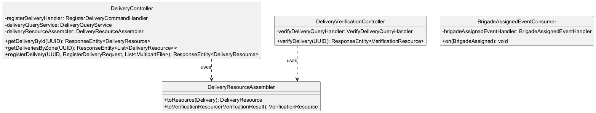

*   **DeliveryController:** `GET /api/v1/deliveries/{id}`, `GET /api/v1/deliveries?zoneId={zoneId}` y `POST /api/v1/deliveries/{id}/registration` (TS-05). El registro llega como `multipart/form-data`, con los datos de la entrega y los archivos de evidencia en la misma petición. La aplicación de campo guarda la entrega en una cola local cuando no hay señal y la envía al reconectarse (TS-C06), así que el endpoint es idempotente: si la entrega ya está registrada, devuelve su estado actual en lugar de fallar o duplicarla.
*   **DeliveryVerificationController:** `GET /api/v1/deliveries/{id}/verify` (US-16). Es público, porque el ciudadano también puede verificar una entrega. Solo devuelve los dos hashes, la transacción y si coinciden, sin datos de la entrega.
*   **BrigadeAssignedEventConsumer:** recibe `BrigadeAssigned` de Resource Management, con el plan, la zona y la brigada.

El recurso de entrada es `RegisterDeliveryRequest`, con los recursos entregados, la fecha y las coordenadas. Los de salida son `DeliveryResource` y `VerificationResource`, que arma `DeliveryResourceAssembler`.

### 5.3.3. Application Layer

La capa de aplicación tiene tres Command Handlers, dos Event Handlers, un Scheduler y dos manejadores de consultas. Declara cuatro puertos de salida:
- **`EvidenceStoragePort`:** guarda los archivos de evidencia.
- **`BlockchainLedgerPort`:** registra y lee hashes en Blockchain.
- **`AuthorizationPort`:** valida el rol de quien registra una entrega.
- **`DomainEventPublisher`:** publica los domain events.

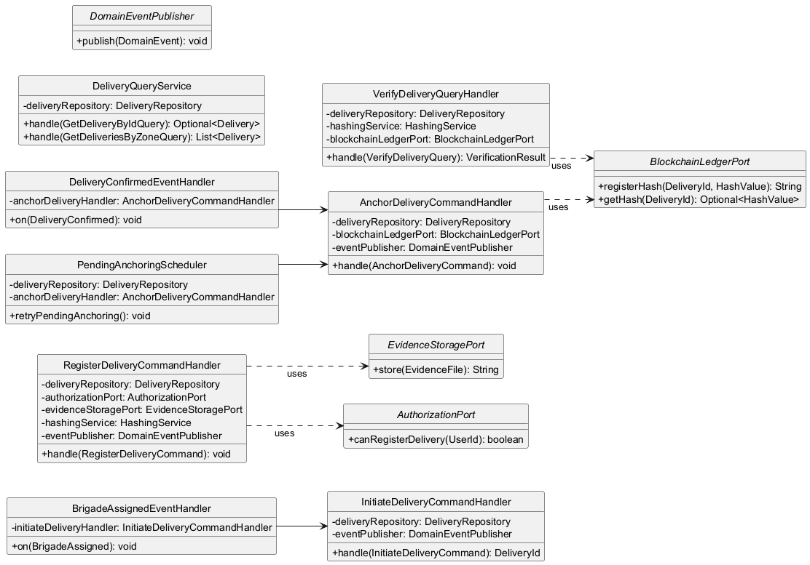

*   **Inicio de la entrega:** `BrigadeAssignedEventHandler` llama a `InitiateDeliveryCommandHandler`, que abre el expediente en `INITIATED`.
*   **Registro:** `RegisterDeliveryCommandHandler` hace cinco pasos:
    1. Consulta `AuthorizationPort`, porque el canvas de Identity Access define "Registrar entrega" como comando crítico que se valida al ejecutarse.
    2. Guarda cada archivo con `EvidenceStoragePort`.
    3. Calcula el hash de su contenido.
    4. Llama a `Delivery.register()`.
    5. Publica `DeliveryConfirmed`.
*   **Anclaje en Blockchain:** `DeliveryConfirmedEventHandler` llama a `AnchorDeliveryCommandHandler`, que envía el hash con `BlockchainLedgerPort` y pasa la entrega a `CERTIFIED`. El anclaje se ejecuta después de confirmar la transacción del registro. Así, si la red Blockchain tarda o falla, la brigada no espera y la entrega no se pierde. Si el anclaje falla, la entrega queda en `FAILED` y `PendingAnchoringScheduler` la reintenta periódicamente. Esto responde a la pregunta del refinamiento R-02 sobre qué hacer si Blockchain rechaza la transacción.
*   **Consultas y verificación:** `DeliveryQueryService` resuelve las consultas por entrega y por zona. `VerifyDeliveryQueryHandler` recalcula el hash a partir de los datos actuales en PostgreSQL, lee el hash guardado en Blockchain y devuelve un `VerificationResult`. Si alguien modifica una cantidad en la base de datos, por ejemplo de 100 a 900 botellas, los hashes dejan de coincidir y la verificación devuelve `verified: false`.

### 5.3.4. Infrastructure Layer

La capa de infraestructura implementa la interfaz del dominio y los puertos de salida de la capa de aplicación. Cada clase implementa una sola interfaz.

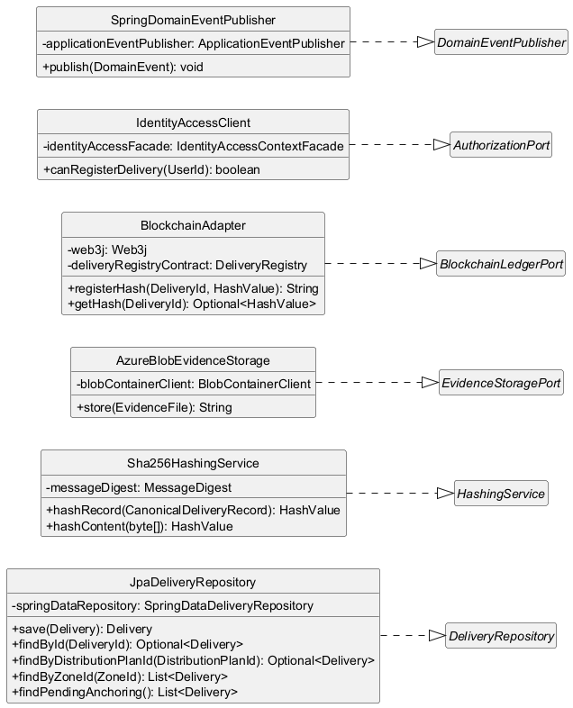

*   **Persistencia:** `JpaDeliveryRepository` implementa `DeliveryRepository` con Spring Data JPA sobre el schema `traceability`.
*   **Hash:** `Sha256HashingService` implementa `HashingService` con `MessageDigest` de Java.
*   **Evidencias:** `AzureBlobEvidenceStorage` implementa `EvidenceStoragePort` y guarda los archivos en Azure Blob Storage, el almacenamiento de evidencia definido en el Container Diagram del Capítulo IV.
*   **Blockchain:** `BlockchainAdapter` implementa `BlockchainLedgerPort` con Web3j. Llama a las funciones `registerDelivery(deliveryId, hash)` y `getDeliveryHash(deliveryId)` del smart contract `DeliveryRegistry`. Traceability adopta el modelo del contrato sin traducirlo, como se decidió en el Context Mapping (Conformist).
*   **Identity Access:** `IdentityAccessClient` implementa `AuthorizationPort` consultando el Open Host Service de Identity Access.
*   **Eventos:** `SpringDomainEventPublisher` publica los domain events con el `ApplicationEventPublisher` de Spring para Resource Management, Emergency Management y Citizen Transparency.

### 5.3.6. Bounded Context Software Architecture Component Level Diagrams

El diagrama muestra cómo se descompone Traceability dentro del contenedor Backend API. La aplicación de campo, la aplicación web, los demás bounded contexts y la red Blockchain aparecen como sistemas externos; Azure Blob Storage y la base de datos aparecen como contenedores de AuxIA. Se modeló en Structurizr DSL y se exportó desde Structurizr Local.

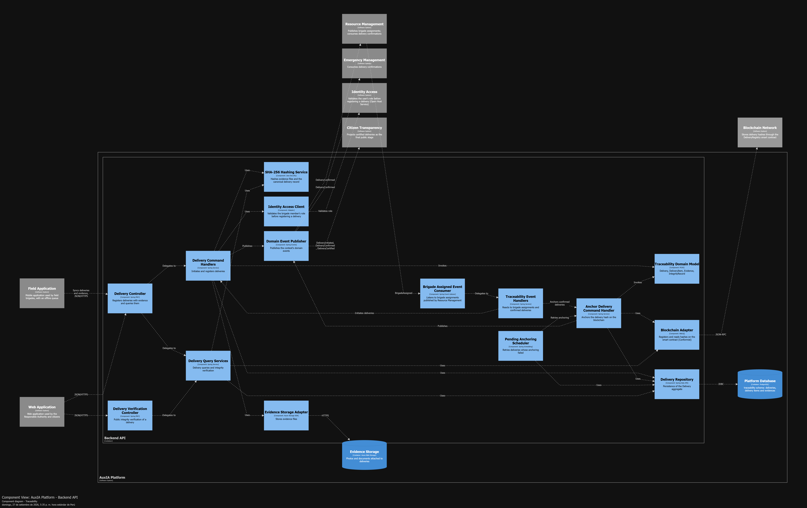

*   **Delivery Controller:** recibe los registros sincronizados desde la aplicación de campo y las consultas de la aplicación web.
*   **Delivery Verification Controller:** atiende la verificación pública de integridad.
*   **Brigade Assigned Event Consumer:** recibe las asignaciones de brigada de Resource Management.
*   **Delivery Command Handlers y Anchor Delivery Command Handler:** registran la entrega y anclan su hash.
*   **Traceability Event Handlers:** inician la entrega al asignarse una brigada y lanzan el anclaje al confirmarse la entrega.
*   **Pending Anchoring Scheduler:** reintenta los anclajes fallidos.
*   **Delivery Query Services:** resuelven las consultas y la verificación de integridad.
*   **Traceability Domain Model:** contiene `Delivery`, `DeliveryItem`, `Evidence` e `IntegrityRecord`.
*   **Delivery Repository:** persiste el aggregate en el schema `traceability` con Spring Data JPA.
*   **SHA-256 Hashing Service:** calcula los hashes del registro y de las evidencias.
*   **Evidence Storage Adapter:** guarda los archivos en Azure Blob Storage.
*   **Blockchain Adapter:** registra y lee hashes en el smart contract `DeliveryRegistry` (Conformist).
*   **Identity Access Client:** valida el rol de quien registra una entrega.
*   **Domain Event Publisher:** envía `DeliveryConfirmed` a Resource Management y a Emergency Management, y `DeliveryInitiated`, `DeliveryConfirmed` y `DeliveryCertified` a Citizen Transparency.

### 5.3.7. Bounded Context Software Architecture Code Level Diagrams

#### 5.3.7.1. Bounded Context Domain Layer Class Diagrams

El diagrama de clases se modeló en PlantUML e incluye las clases descritas en la sección 5.3.1, con la visibilidad de cada miembro y la multiplicidad de cada relación.

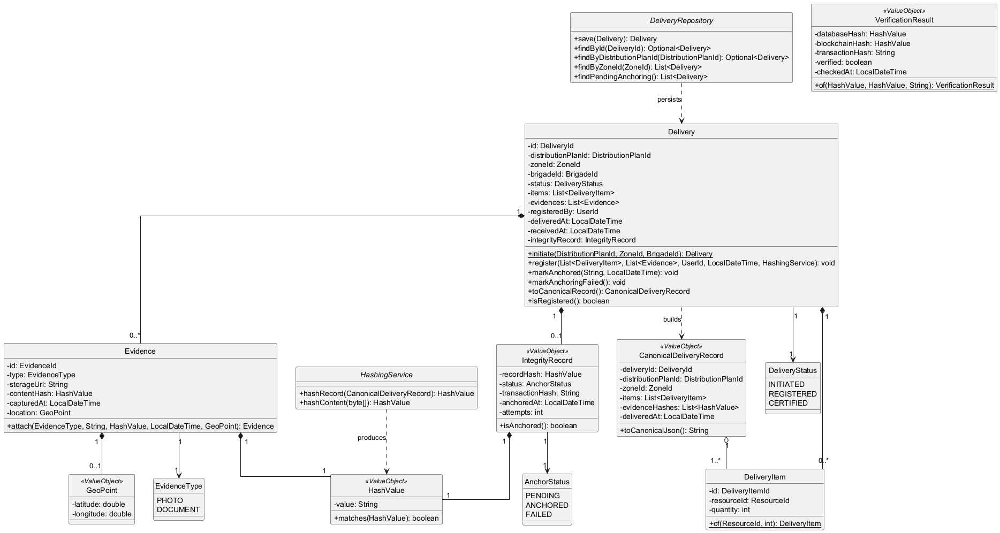

#### 5.3.7.2. Bounded Context Database Design Diagram

El schema `traceability` guarda el aggregate en tres tablas: `deliveries` y sus tablas hijas `delivery_items` y `evidences`. El diagrama se generó con DataGrip sobre la base de datos PostgreSQL alojada en Neon.

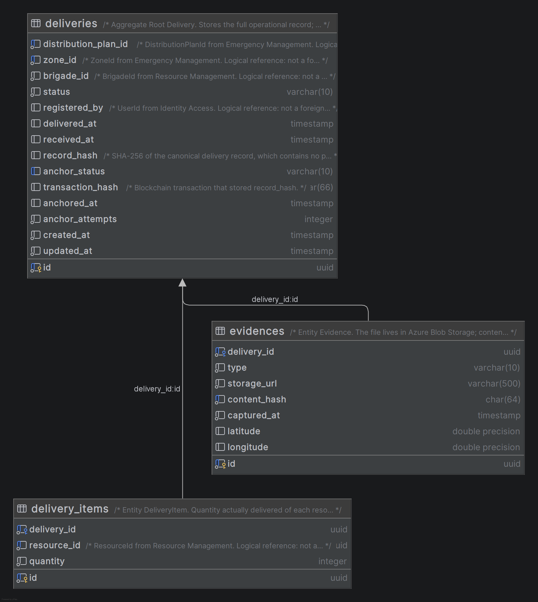

Las reglas del dominio también se aplican en la base de datos:
- **Ciclo de vida:** un `CHECK` sobre `deliveries` exige lo que corresponde a cada estado. Una entrega en `INITIATED` no tiene datos de registro ni hash. Una en `REGISTERED` tiene quién la registró, las dos fechas y el hash, con el anclaje `PENDING` o `FAILED`. Una en `CERTIFIED` tiene además la transacción y la fecha de anclaje.
- **Formato:** los hashes deben tener el formato de un SHA-256 en hexadecimal, y la transacción el de una transacción de Blockchain.
- **Unicidad:** cada plan tiene una sola entrega, y una evidencia no puede repetirse dentro de la misma entrega.
- **Reintentos:** un índice parcial sobre `anchor_status` acelera la búsqueda de anclajes pendientes que hace el scheduler.

La base de datos no puede exigir con un `CHECK` que una entrega registrada tenga al menos una evidencia, porque esa regla involucra dos tablas; la garantiza `Delivery.register()`.

Las columnas `distribution_plan_id`, `zone_id`, `brigade_id`, `registered_by` y `resource_id` apuntan a datos de Emergency Management, Resource Management e Identity Access. No se declaran como foreign keys porque esos datos están en otros schemas.

---

## 5.4. Bounded Context: Identity Access

Identity Access es un contexto Generic. Gestiona las organizaciones que usan AuxIA, sus usuarios, sus roles y el inicio de sesión. No participa en la atención de la emergencia, pero los demás contextos dependen de él para proteger sus comandos críticos (QAD-02). Tal como se decidió en el Capítulo IV, no se construye desde cero: la autenticación usa Spring Security, BCrypt para las contraseñas y JWT para los tokens. El System Landscape Diagram no incluye un proveedor de identidad externo, así que estas bibliotecas corren dentro del Backend API.

Los demás contextos lo usan de dos maneras:
- **Token JWT:** cada petición al Backend API lleva un JWT que incluye el usuario, su organización y su rol. Emergency Management y Resource Management leen de ahí el `organizationId`.
- **Consulta síncrona:** antes de un comando crítico, como aprobar un plan o registrar una entrega, Emergency Management y Traceability consultan a Identity Access. Así la validación considera los cambios de rol o de estado que ocurrieron después de emitido el token (Open Host Service).

El Capítulo IV definió Organization como aggregate. En el diseño táctico se agrega `UserAccount` como un segundo aggregate: una organización puede tener muchos usuarios, y guardarlos dentro de `Organization` obligaría a cargar y bloquear toda la organización para cambiar el rol de una sola persona.

### 5.4.1. Domain Layer

La capa de dominio hace cumplir las reglas del canvas del Capítulo IV:
- Cada usuario pertenece a una sola organización.
- Un inicio de sesión fallido no revela qué dato fue incorrecto (US-21).
- Un usuario solo supera una validación de rol si su cuenta y su organización están activas.
- Después de cinco intentos fallidos seguidos, la cuenta se bloquea hasta que un administrador la desbloquee.

El diagrama agrupa las clases por aggregate. Cada grupo contiene la raíz, sus value objects, el repositorio que lo persiste y los domain events que publica. Los atributos y métodos de cada clase están en el diccionario que sigue y en el diagrama de clases de la sección 5.4.7.1.

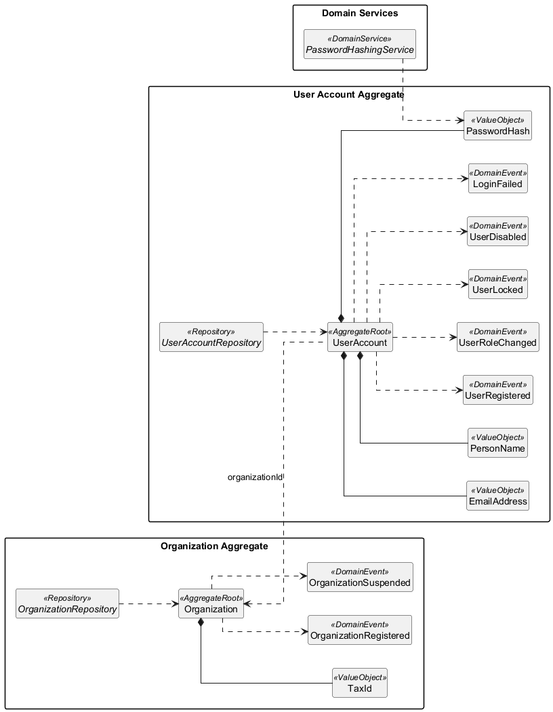

| Clase | Categoría | Propósito |
|---|---|---|
| `Organization` | Aggregate Root | Entidad pública, ONG o privada que usa AuxIA. |
| `UserAccount` | Aggregate Root | Cuenta de un usuario, con su rol y su estado. |
| `TaxId` | Value Object | RUC de la organización. |
| `EmailAddress` | Value Object | Correo con el que el usuario inicia sesión. |
| `PasswordHash` | Value Object | Hash de la contraseña y su algoritmo. |
| `PersonName` | Value Object | Nombres y apellidos del usuario. |
| `OrganizationType`, `OrganizationStatus`, `Role`, `AccountStatus` | Enumeration | Valores cerrados del lenguaje ubicuo del contexto. |
| `PasswordHashingService` | Domain Service (interfaz) | Calcula y verifica el hash de una contraseña. |
| `OrganizationRepository`, `UserAccountRepository` | Repository (interfaz) | Persistencia de cada aggregate. |

**Aggregates.** `Organization` se crea con `register()` en estado `ACTIVE` y se puede suspender o reactivar. Cuando una organización está suspendida, sus usuarios no pueden iniciar sesión ni superar una validación de rol, aunque sus cuentas sigan activas. `UserAccount` guarda el `organizationId` al registrarse y no lo cambia después; eso es lo que asegura que cada usuario pertenezca a una sola organización. El método `authenticate()` compara la contraseña con `PasswordHashingService`. Si coincide, reinicia los intentos fallidos; si no, suma un intento y bloquea la cuenta al quinto. En los dos casos solo devuelve verdadero o falso, así la capa de aplicación puede responder con un único mensaje genérico, como pide US-21. `changeRole()`, `disable()` y `unlock()` los usa el Administrador de Organización.

**Value objects.** `EmailAddress` guarda el correo en minúsculas y rechaza los formatos inválidos. Como el correo es único en toda la plataforma, iniciar sesión no requiere indicar la organización. `PasswordHash` guarda el hash y el algoritmo, nunca la contraseña. `TaxId` valida que el RUC tenga 11 dígitos. `PersonName` agrupa nombres y apellidos. Los identificadores `OrganizationId` y `UserId` envuelven un `UUID`. Son los mismos que usan los demás contextos: el `AuthorityId` de Emergency Management y el `UserId` de Traceability corresponden a un `UserId` de este contexto. En el diagrama de clases aparecen solo como tipo de atributo.

**Domain services.** `PasswordHashingService` mantiene fuera del dominio el algoritmo de hash de las contraseñas.

**Repositories.** `OrganizationRepository` busca organizaciones por identificador y verifica que el RUC no esté registrado. `UserAccountRepository` busca usuarios por correo, por identificador y por organización.

**Domain events.** `Organization` publica `OrganizationRegistered` y `OrganizationSuspended`. `UserAccount` publica `UserRegistered`, `UserRoleChanged`, `UserLocked`, `UserDisabled` y `LoginFailed`. La auditoría usa estos eventos para registrar los cambios de acceso y los intentos fallidos (R-05).

#### Diccionario de clases

Las tablas siguientes detallan los miembros de cada clase con su tipo y su visibilidad, tal como aparecen en el diagrama de la sección 5.4.7.1.

**`Organization`** (Aggregate Root)

| Miembro | Tipo | Visibilidad | Descripción |
|---|---|---|---|
| `id` | `OrganizationId` | private | Identificador de la organización. |
| `name` | `String` | private | Nombre, por ejemplo "COER Lima". |
| `type` | `OrganizationType` | private | Tipo de organización. |
| `taxId` | `TaxId` | private | RUC de la organización. |
| `status` | `OrganizationStatus` | private | Indica si la organización está activa o suspendida. |
| `register(String, OrganizationType, TaxId)` | `Organization` | public static | Crea la organización en estado `ACTIVE`. |
| `suspend()` | `void` | public | Suspende la organización y el acceso de todos sus usuarios. |
| `reactivate()` | `void` | public | Devuelve la organización a `ACTIVE`. |
| `isActive()` | `boolean` | public | Indica si la organización está activa. |

**`UserAccount`** (Aggregate Root)

| Miembro | Tipo | Visibilidad | Descripción |
|---|---|---|---|
| `id` | `UserId` | private | Identificador del usuario. |
| `organizationId` | `OrganizationId` | private | Organización a la que pertenece; no cambia después del registro. |
| `email` | `EmailAddress` | private | Correo de inicio de sesión. |
| `passwordHash` | `PasswordHash` | private | Hash de la contraseña. |
| `name` | `PersonName` | private | Nombres y apellidos. |
| `role` | `Role` | private | Rol del usuario. |
| `status` | `AccountStatus` | private | Estado de la cuenta. |
| `failedLoginAttempts` | `int` | private | Intentos fallidos seguidos. |
| `lastLoginAt` | `LocalDateTime` | private | Fecha del último inicio de sesión exitoso. |
| `register(OrganizationId, EmailAddress, PersonName, Role, PasswordHash)` | `UserAccount` | public static | Crea la cuenta en estado `ACTIVE`. |
| `authenticate(String, PasswordHashingService)` | `boolean` | public | Verifica la contraseña, actualiza los intentos fallidos y bloquea la cuenta al quinto. |
| `changeRole(Role)` | `void` | public | Cambia el rol del usuario. |
| `changePassword(PasswordHash)` | `void` | public | Reemplaza la contraseña. |
| `disable()` | `void` | public | Deshabilita la cuenta. |
| `unlock()` | `void` | public | Desbloquea la cuenta y reinicia los intentos fallidos. |
| `hasRole(Role)` | `boolean` | public | Indica si el usuario tiene un rol. |
| `isActive()` | `boolean` | public | Indica si la cuenta está activa. |

**Value Objects**

| Clase | Miembros | Descripción |
|---|---|---|
| `TaxId` | `-value: String`, `+getValue(): String` | RUC de 11 dígitos. |
| `EmailAddress` | `-value: String`, `+getValue(): String` | Correo en minúsculas con formato válido. |
| `PasswordHash` | `-value: String`, `-algorithm: String` | Hash de la contraseña y algoritmo usado. |
| `PersonName` | `-firstName: String`, `-lastName: String`, `+getFullName(): String` | Nombres y apellidos. |

**Enumeraciones**

| Enumeración | Valores |
|---|---|
| `OrganizationType` | `GOVERNMENT`, `NGO`, `PRIVATE` |
| `OrganizationStatus` | `ACTIVE`, `SUSPENDED` |
| `Role` | `ORGANIZATION_ADMIN`, `AUTHORITY`, `FIELD_BRIGADE`, `AUDITOR` |
| `AccountStatus` | `ACTIVE`, `LOCKED`, `DISABLED` |

**Domain Services y Repositories**

| Interfaz | Categoría | Métodos |
|---|---|---|
| `PasswordHashingService` | Domain Service | `+hash(String): PasswordHash`, `+matches(String, PasswordHash): boolean` |
| `OrganizationRepository` | Repository | `+save(Organization): Organization`, `+findById(OrganizationId): Optional<Organization>`, `+existsByTaxId(TaxId): boolean` |
| `UserAccountRepository` | Repository | `+save(UserAccount): UserAccount`, `+findById(UserId): Optional<UserAccount>`, `+findByEmail(EmailAddress): Optional<UserAccount>`, `+existsByEmail(EmailAddress): boolean`, `+findByOrganizationId(OrganizationId): List<UserAccount>` |

**Relaciones entre clases**

| Origen | Relación | Destino | Multiplicidad | Descripción |
|---|---|---|---|---|
| `UserAccount` | Asociación (belongs to) | `Organization` | 0..* a 1 | Cada usuario pertenece a una organización y la referencia por `organizationId`. |
| `Organization` | Composición | `TaxId` | 1 a 1 | La organización tiene un RUC. |
| `UserAccount` | Composición | `EmailAddress`, `PasswordHash`, `PersonName` | 1 a 1 | La cuenta contiene su correo, su contraseña y su nombre. |
| `Organization`, `UserAccount` | Asociación | Enumeraciones | 1 a 1 | Tipo, estado y rol. |
| `UserAccount` | Dependencia (uses) | `PasswordHashingService` | No aplica | Verifica la contraseña con el servicio. |
| `PasswordHashingService` | Dependencia (produces) | `PasswordHash` | No aplica | Calcula el hash. |
| `OrganizationRepository`, `UserAccountRepository` | Dependencia (persists) | `Organization`, `UserAccount` | No aplica | Cada repositorio persiste su aggregate. |

### 5.4.2. Interface Layer

La capa de interfaz tiene tres controladores REST y la fachada que consultan los demás contextos.

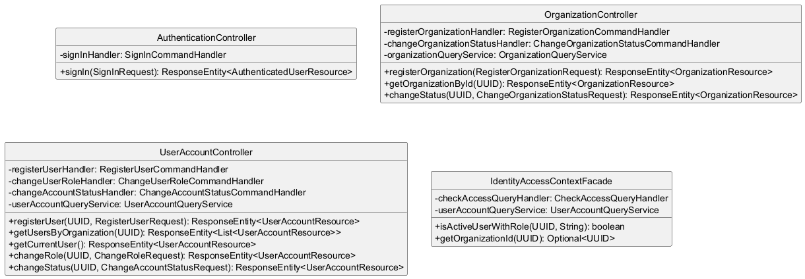

*   **AuthenticationController:** `POST /api/v1/auth/sign-in` (US-21). Devuelve el token, su expiración, el rol y la organización del usuario. Si las credenciales no son válidas o la cuenta está bloqueada, responde siempre con el mismo error, sin indicar qué falló.
*   **OrganizationController:** `POST /api/v1/organizations`, `GET /api/v1/organizations/{id}` y `PATCH /api/v1/organizations/{id}/status`. El registro crea la organización junto con su primer administrador.
*   **UserAccountController:** `POST /api/v1/organizations/{id}/users`, `GET /api/v1/organizations/{id}/users`, `GET /api/v1/users/me`, `PATCH /api/v1/users/{id}/role` y `PATCH /api/v1/users/{id}/status`. Salvo `users/me`, estos endpoints exigen el rol `ORGANIZATION_ADMIN`, y el administrador solo puede gestionar usuarios de su propia organización.
*   **IdentityAccessContextFacade:** es el Open Host Service del contexto. `isActiveUserWithRole(UUID, String)` confirma, en el momento de ejecutar un comando, que el usuario existe, que su cuenta y su organización están activas y que tiene el rol pedido. `getOrganizationId(UUID)` devuelve la organización del usuario. Emergency Management la usa para validar el rol `AUTHORITY` antes de aprobar o rechazar un plan, y Traceability para validar el rol `FIELD_BRIGADE` antes de registrar una entrega.

Los recursos de entrada son `SignInRequest`, `RegisterOrganizationRequest`, `ChangeOrganizationStatusRequest`, `RegisterUserRequest`, `ChangeRoleRequest` y `ChangeAccountStatusRequest`. Los de salida son `AuthenticatedUserResource`, `OrganizationResource` y `UserAccountResource`.

### 5.4.3. Application Layer

La capa de aplicación tiene seis Command Handlers, un manejador de consultas para la validación de acceso y dos Query Services. No consume eventos de otros contextos, porque Identity Access solo les provee información. Declara dos puertos de salida: `TokenIssuer`, que emite el token de acceso, y `DomainEventPublisher`.

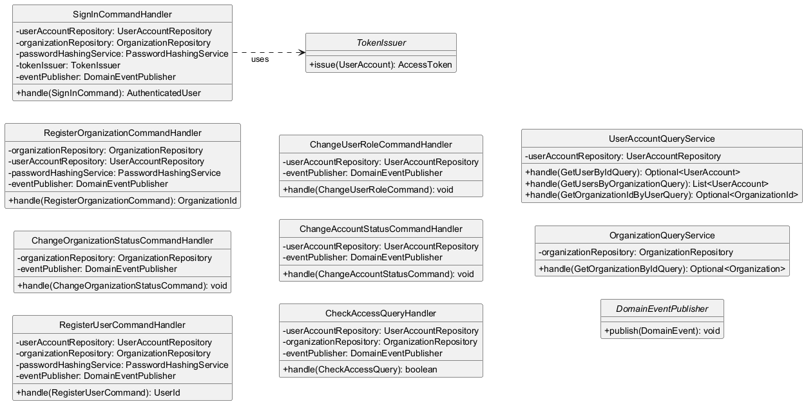

*   **Inicio de sesión:** `SignInCommandHandler` busca la cuenta por correo, verifica que la organización esté activa y llama a `UserAccount.authenticate()`. Si todo es válido, pide el token a `TokenIssuer`; si no, publica `LoginFailed` y devuelve el error genérico.
*   **Organizaciones:** `RegisterOrganizationCommandHandler` crea la organización y su primer `ORGANIZATION_ADMIN` en la misma transacción. Es el único caso en que un handler crea dos aggregates juntos, porque una organización sin administrador no podría gestionarse. `ChangeOrganizationStatusCommandHandler` la suspende o la reactiva.
*   **Usuarios:** `RegisterUserCommandHandler` verifica que el correo no exista y que la organización esté activa antes de crear la cuenta. `ChangeUserRoleCommandHandler` cambia el rol y `ChangeAccountStatusCommandHandler` deshabilita o desbloquea la cuenta.
*   **Validación de acceso:** `CheckAccessQueryHandler` es el que usa la fachada. Carga la cuenta y la organización en cada consulta en lugar de guardarlas en caché, para que un cambio de rol o una suspensión se apliquen de inmediato. Eso responde a una de las preguntas del refinamiento R-05. Cuando la respuesta es negativa, publica un evento `AccessDenied` para la auditoría.
*   **Consultas:** `UserAccountQueryService` devuelve el usuario actual, los usuarios de una organización y la organización de un usuario. `OrganizationQueryService` devuelve el detalle de una organización.

### 5.4.4. Infrastructure Layer

La capa de infraestructura implementa las interfaces del dominio y los puertos de salida de la capa de aplicación. También contiene la configuración de seguridad que usa todo el Backend API.

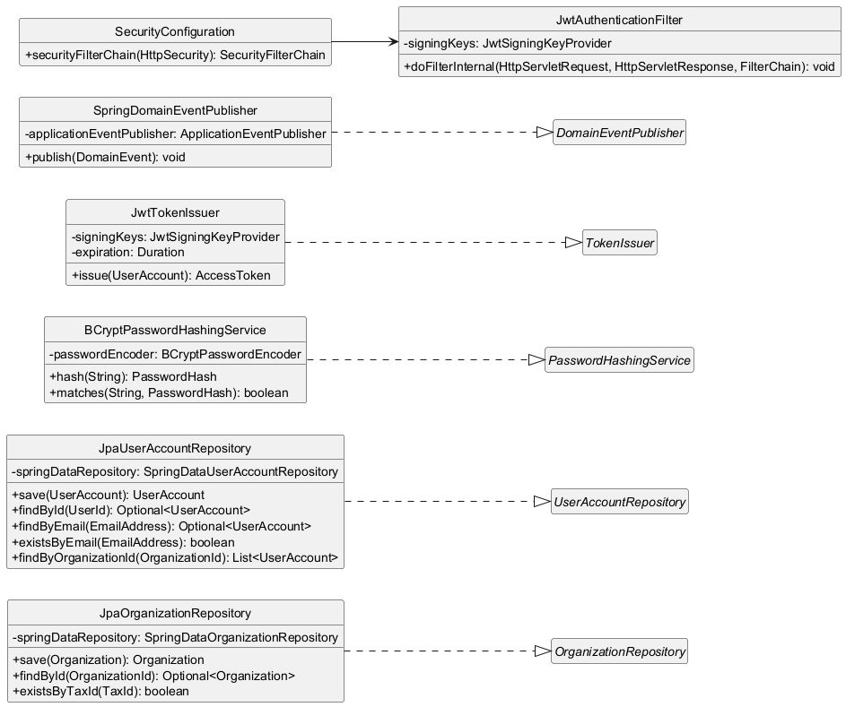

*   **Persistencia:** `JpaOrganizationRepository` y `JpaUserAccountRepository` implementan los repositorios con Spring Data JPA sobre el schema `identity_access`.
*   **Contraseñas:** `BCryptPasswordHashingService` implementa `PasswordHashingService` con el `BCryptPasswordEncoder` de Spring Security.
*   **Tokens:** `JwtTokenIssuer` implementa `TokenIssuer`. Firma el token con la librería JJWT e incluye el usuario, la organización y el rol. Obtiene las claves de `JwtSigningKeyProvider`, que identifica cada clave con un `kid`. Así se puede agregar una clave nueva sin invalidar los tokens firmados con la anterior, que es la rotación sin reinicio que pide el refinamiento R-05.
*   **Seguridad del Backend API:** `JwtAuthenticationFilter` valida la firma y la expiración del token en cada petición, de cualquier bounded context, y deja el usuario autenticado en el contexto de Spring Security. `SecurityConfiguration` registra el filtro y define qué endpoints son públicos: el inicio de sesión, la verificación de entregas y la consulta ciudadana.
*   **Eventos:** `SpringDomainEventPublisher` publica los domain events con el `ApplicationEventPublisher` de Spring para la auditoría.

### 5.4.6. Bounded Context Software Architecture Component Level Diagrams

El diagrama muestra cómo se descompone Identity Access dentro del contenedor Backend API. Las aplicaciones web y de campo, Emergency Management y Traceability aparecen como sistemas externos. Se modeló en Structurizr DSL y se exportó desde Structurizr Local.

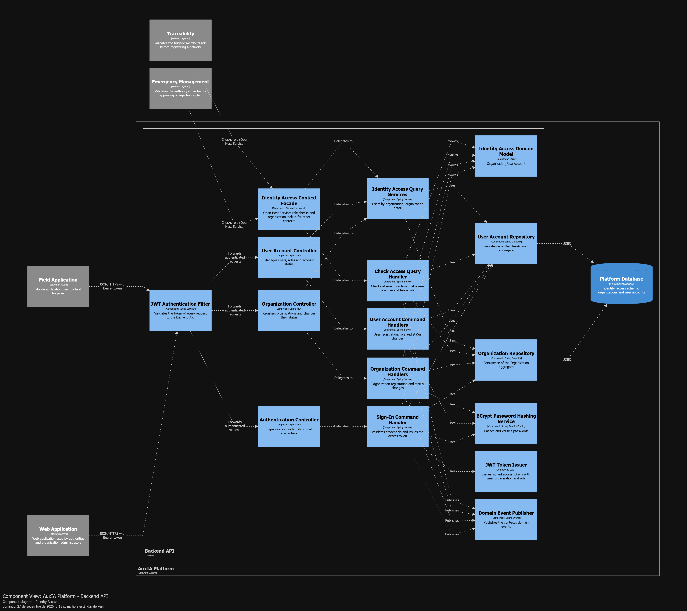

*   **JWT Authentication Filter:** valida el token de cada petición de la aplicación web y de la aplicación de campo antes de que llegue a cualquier controlador.
*   **Authentication, Organization y User Account Controllers:** atienden el inicio de sesión y la gestión de organizaciones y usuarios.
*   **Identity Access Context Facade:** recibe las validaciones de rol de Emergency Management y de Traceability (Open Host Service).
*   **Sign-In Command Handler, Organization Command Handlers y User Account Command Handlers:** orquestan el inicio de sesión y la gestión de organizaciones y usuarios.
*   **Check Access Query Handler:** valida en el momento de la consulta que el usuario esté activo y tenga el rol pedido.
*   **Identity Access Query Services:** resuelven las consultas de usuarios y organizaciones.
*   **Identity Access Domain Model:** contiene `Organization` y `UserAccount`.
*   **Organization Repository y User Account Repository:** persisten los aggregates en el schema `identity_access` con Spring Data JPA.
*   **BCrypt Password Hashing Service:** calcula y verifica los hashes de las contraseñas.
*   **JWT Token Issuer:** emite los tokens firmados.
*   **Domain Event Publisher:** publica los domain events para la auditoría.

### 5.4.7. Bounded Context Software Architecture Code Level Diagrams

#### 5.4.7.1. Bounded Context Domain Layer Class Diagrams

El diagrama de clases se modeló en PlantUML e incluye las clases descritas en la sección 5.4.1, con la visibilidad de cada miembro y la multiplicidad de cada relación.

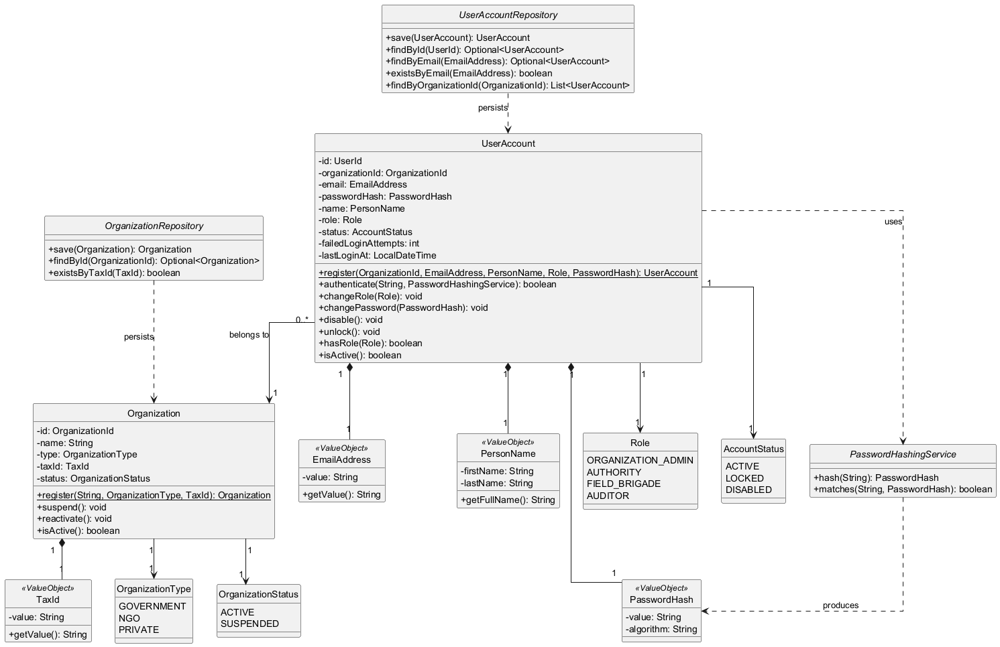

#### 5.4.7.2. Bounded Context Database Design Diagram

El schema `identity_access` guarda los dos aggregates en dos tablas: `organizations` y `user_accounts`. Como los dos aggregates están en el mismo schema, `user_accounts.organization_id` sí se declara como foreign key, igual que las referencias entre aggregates de Emergency Management. El diagrama se generó con DataGrip sobre la base de datos PostgreSQL alojada en Neon.

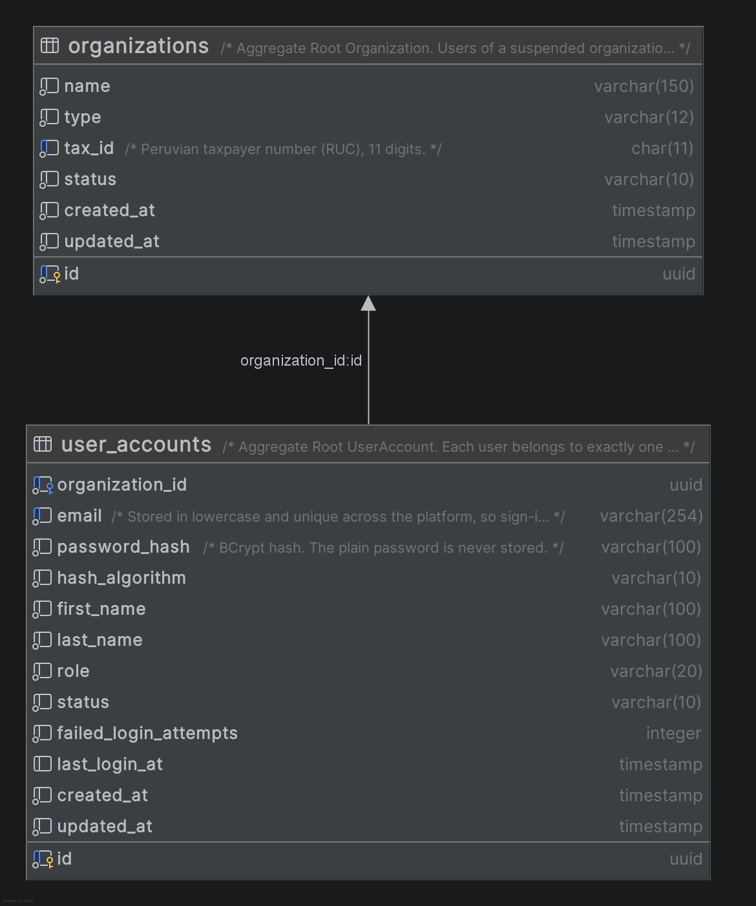

Las reglas del dominio también se aplican en la base de datos:
- **Formato del RUC:** un `CHECK` exige 11 dígitos, y cada RUC se registra una sola vez.
- **Correo:** se guarda en minúsculas, con formato válido, y es único en toda la plataforma.
- **Bloqueo:** los intentos fallidos van de 0 a 5, y una cuenta en `LOCKED` tiene exactamente 5.
- **Organización:** no se puede borrar mientras tenga usuarios, y un usuario no puede apuntar a una organización inexistente.

La tabla no tiene columna para la contraseña en texto plano: solo guarda su hash BCrypt.

---

## 5.5. Bounded Context: Citizen Transparency

Citizen Transparency es un contexto Supporting que cumple el rol de read model. Permite que un ciudadano afectado consulte, sin iniciar sesión, en qué etapa de atención está su zona (EP-08, US-24). No recibe comandos ni publica eventos propios: escucha los eventos de Emergency Management y de Traceability y los proyecta en una vista pública, tal como se definió en su Bounded Context Canvas del Capítulo IV.

Por eso no tiene aggregates. Sus clases principales son dos read models: `EmergencyPublicView`, con los datos públicos de cada emergencia, y `ZonePublicStatus`, con la etapa de atención de cada zona. La vista pública no incluye datos personales, evidencias ni el score de urgencia (TS-C02, R-04).

### 5.5.1. Domain Layer

La capa de dominio define cinco etapas públicas, en el orden del refinamiento R-04: `REGISTERED`, `PRIORITIZED`, `AID_APPROVED`, `AID_IN_TRANSIT` y `AID_DELIVERED`. También define las reglas para pasar de una etapa a otra. La regla principal es que una zona no retrocede de etapa dentro de un mismo plan de distribución. Los eventos llegan después de confirmada la transacción que los produjo y pueden llegar tarde o repetidos. Sin esta regla, un `DistributionPlanApproved` atrasado podría devolver a "ayuda aprobada" una zona que ya figuraba como "ayuda entregada".

El diagrama muestra los dos read models, sus repositorios y los eventos de otros contextos que los actualizan. Los atributos y métodos de cada clase están en el diccionario que sigue y en el diagrama de clases de la sección 5.5.7.1.

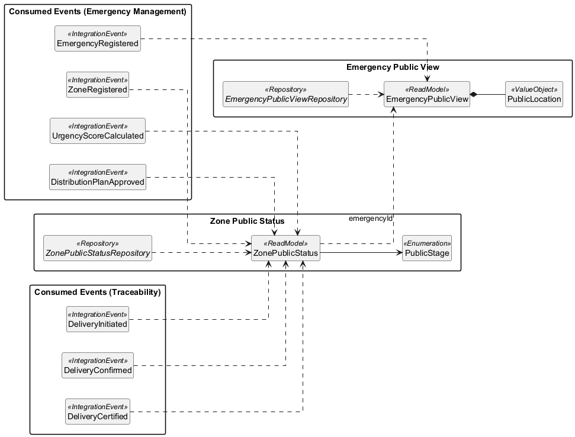

| Clase | Categoría | Propósito |
|---|---|---|
| `ZonePublicStatus` | Read Model | Etapa pública de atención de una zona y sus entregas. |
| `EmergencyPublicView` | Read Model | Datos públicos de una emergencia: nombre, tipo, ubicación y fecha de inicio. |
| `PublicLocation` | Value Object | Departamento, provincia y distrito de la emergencia. |
| `PublicStage` | Enumeration | Etapas de atención que ve el ciudadano. |
| `ZonePublicStatusRepository`, `EmergencyPublicViewRepository` | Repository (interfaz) | Persistencia de cada read model. |

**Read models.** `EmergencyPublicView` se crea con `project()` cuando llega `EmergencyRegistered` y guarda solo lo que el ciudadano necesita para reconocer la emergencia. `ZonePublicStatus` se crea cuando llega `ZoneRegistered` y avanza con los eventos siguientes:

| Evento | Contexto de origen | Efecto en `ZonePublicStatus` |
|---|---|---|
| `ZoneRegistered` | Emergency Management | Crea la zona en `REGISTERED`. |
| `UrgencyScoreCalculated` | Emergency Management | Pasa la zona a `PRIORITIZED`, sin guardar el valor del score. |
| `DistributionPlanApproved` | Emergency Management | Pasa la zona a `AID_APPROVED` y guarda el plan en curso. |
| `DeliveryInitiated` | Traceability | Pasa la zona a `AID_IN_TRANSIT` y guarda la entrega en curso. |
| `DeliveryConfirmed` | Traceability | Pasa la zona a `AID_DELIVERED` y suma una entrega completada. |
| `DeliveryCertified` | Traceability | Marca la última entrega como verificada en Blockchain. |

Cada método `mark...()` consulta el método privado `canMoveTo()` antes de cambiar la etapa. Dentro del mismo plan solo se avanza. Un plan nuevo puede reiniciar el ciclo desde `AID_APPROVED`, porque una zona puede recibir varias entregas a lo largo de la emergencia. `markAidDelivered()` no suma dos veces la misma entrega si el evento llega repetido. Un plan rechazado no cambia la etapa pública: la zona sigue como priorizada hasta que otro plan se apruebe.

**Value objects.** `PublicLocation` agrupa departamento, provincia y distrito; el ciudadano busca su zona por esos datos. Los identificadores `ZoneId`, `EmergencyId`, `DistributionPlanId` y `DeliveryId` son los mismos de Emergency Management y Traceability, copiados por la proyección. En el diagrama de clases aparecen solo como tipo de atributo.

**Repositories.** `ZonePublicStatusRepository` busca la vista de una zona por su identificador, por emergencia, por el plan o la entrega en curso, que es como la encuentran las proyecciones al recibir un evento, y por distrito y nombre para la búsqueda del ciudadano. `EmergencyPublicViewRepository` devuelve una emergencia o todas.

**Domain services y domain events.** El contexto no tiene domain services ni publica domain events. Toda su lógica está en las reglas de avance de `ZonePublicStatus`.

#### Diccionario de clases

Las tablas siguientes detallan los miembros de cada clase con su tipo y su visibilidad, tal como aparecen en el diagrama de la sección 5.5.7.1.

**`ZonePublicStatus`** (Read Model)

| Miembro | Tipo | Visibilidad | Descripción |
|---|---|---|---|
| `zoneId` | `ZoneId` | private | Identificador de la zona, el mismo de Emergency Management. |
| `emergencyId` | `EmergencyId` | private | Emergencia a la que pertenece la zona. |
| `zoneName` | `String` | private | Nombre de la zona. |
| `stage` | `PublicStage` | private | Etapa pública de atención. |
| `currentDistributionPlanId` | `DistributionPlanId` | private | Plan aprobado en curso. |
| `currentDeliveryId` | `DeliveryId` | private | Entrega en curso o última entrega. |
| `deliveriesCompleted` | `int` | private | Número de entregas completadas en la zona. |
| `lastDeliveryAt` | `LocalDateTime` | private | Fecha de la última entrega. |
| `lastDeliveryVerified` | `boolean` | private | Indica si la última entrega ya está verificada en Blockchain. |
| `updatedAt` | `LocalDateTime` | private | Fecha de la última actualización de la vista. |
| `project(ZoneId, EmergencyId, String)` | `ZonePublicStatus` | public static | Crea la vista de la zona en `REGISTERED`. |
| `markPrioritized()` | `void` | public | Pasa la zona a `PRIORITIZED`. |
| `markAidApproved(DistributionPlanId)` | `void` | public | Pasa la zona a `AID_APPROVED` para un plan. |
| `markAidInTransit(DistributionPlanId, DeliveryId)` | `void` | public | Pasa la zona a `AID_IN_TRANSIT`. |
| `markAidDelivered(DeliveryId, LocalDateTime)` | `void` | public | Pasa la zona a `AID_DELIVERED` y suma la entrega una sola vez. |
| `markDeliveryVerified(DeliveryId)` | `void` | public | Marca la última entrega como verificada. |
| `canMoveTo(PublicStage, DistributionPlanId)` | `boolean` | private | Impide retroceder de etapa dentro de un mismo plan. |

**`EmergencyPublicView`** (Read Model)

| Miembro | Tipo | Visibilidad | Descripción |
|---|---|---|---|
| `emergencyId` | `EmergencyId` | private | Identificador de la emergencia, el mismo de Emergency Management. |
| `name` | `String` | private | Nombre de la emergencia. |
| `type` | `String` | private | Tipo de desastre. |
| `location` | `PublicLocation` | private | Departamento, provincia y distrito. |
| `startDate` | `LocalDate` | private | Fecha de inicio. |
| `project(EmergencyId, String, String, PublicLocation, LocalDate)` | `EmergencyPublicView` | public static | Crea la vista a partir de `EmergencyRegistered`. |

**Value Objects y enumeraciones**

| Clase | Miembros o valores | Descripción |
|---|---|---|
| `PublicLocation` | `-department: String`, `-province: String`, `-district: String`, `+getFullName(): String` | Ubicación pública de la emergencia. |
| `PublicStage` | `REGISTERED`, `PRIORITIZED`, `AID_APPROVED`, `AID_IN_TRANSIT`, `AID_DELIVERED` | Etapas de atención que ve el ciudadano. |

**Repositories**

| Interfaz | Métodos |
|---|---|
| `ZonePublicStatusRepository` | `+save(ZonePublicStatus): ZonePublicStatus`, `+findByZoneId(ZoneId): Optional<ZonePublicStatus>`, `+findByEmergencyId(EmergencyId): List<ZonePublicStatus>`, `+findByDistributionPlanId(DistributionPlanId): Optional<ZonePublicStatus>`, `+findByDeliveryId(DeliveryId): Optional<ZonePublicStatus>`, `+searchByDistrictAndName(String, String): List<ZonePublicStatus>` |
| `EmergencyPublicViewRepository` | `+save(EmergencyPublicView): EmergencyPublicView`, `+findById(EmergencyId): Optional<EmergencyPublicView>`, `+findAll(): List<EmergencyPublicView>` |

**Relaciones entre clases**

| Origen | Relación | Destino | Multiplicidad | Descripción |
|---|---|---|---|---|
| `ZonePublicStatus` | Asociación (belongs to) | `EmergencyPublicView` | 0..* a 1 | Cada zona pertenece a una emergencia y la referencia por `emergencyId`. |
| `ZonePublicStatus` | Asociación | `PublicStage` | 1 a 1 | Cada zona está en una etapa. |
| `EmergencyPublicView` | Composición | `PublicLocation` | 1 a 1 | La emergencia contiene su ubicación. |
| `ZonePublicStatusRepository`, `EmergencyPublicViewRepository` | Dependencia (persists) | `ZonePublicStatus`, `EmergencyPublicView` | No aplica | Cada repositorio persiste su read model. |

### 5.5.2. Interface Layer

La capa de interfaz tiene un controlador REST público y dos consumidores de eventos.

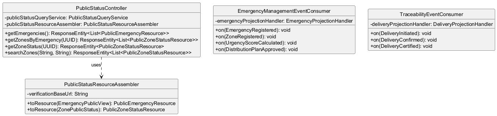

*   **PublicStatusController:** `GET /api/v1/public/emergencies`, `GET /api/v1/public/emergencies/{id}/zones`, `GET /api/v1/public/zones/{id}` y `GET /api/v1/public/zones?district={district}&name={name}`. Ninguno requiere autenticación. Si la zona no está registrada, responde 404 con el mensaje de que no hay información disponible (US-24, escenario 2).
*   **PublicStatusResourceAssembler:** arma los recursos públicos. Cuando la última entrega está verificada, agrega el enlace a `GET /api/v1/deliveries/{id}/verify` de Traceability, para que el ciudadano compruebe la entrega por su cuenta.
*   **EmergencyManagementEventConsumer y TraceabilityEventConsumer:** reciben con listeners internos de Spring los eventos de esos dos contextos y los pasan a las proyecciones.

Los recursos de salida son `PublicEmergencyResource` y `PublicZoneStatusResource`. Este último incluye la etapa, el número de entregas, la fecha de la última entrega y si está verificada. No incluye el score, la posición en el ranking ni los recursos entregados, porque combinar esos datos entre zonas permitiría deducir las decisiones internas de priorización, el riesgo de inferencia que señala el refinamiento R-04.

### 5.5.3. Application Layer

La capa de aplicación no tiene Command Handlers, porque el contexto no recibe comandos. Tiene dos manejadores de proyecciones y un servicio de consultas.

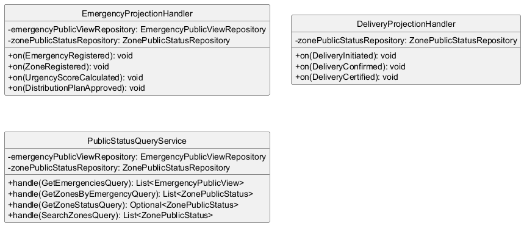

*   **EmergencyProjectionHandler:** crea la vista de la emergencia con `EmergencyRegistered` y la de la zona con `ZoneRegistered`. Luego aplica `UrgencyScoreCalculated` y `DistributionPlanApproved` sobre `ZonePublicStatus`.
*   **DeliveryProjectionHandler:** aplica `DeliveryInitiated`, `DeliveryConfirmed` y `DeliveryCertified`. Encuentra la zona por el plan o la entrega en curso.
*   **PublicStatusQueryService:** resuelve las cuatro consultas públicas.

Las proyecciones se ejecutan después de confirmada la transacción del contexto de origen. Por eso la vista pública puede tardar unos instantes en reflejar un cambio: es la consistencia eventual que el refinamiento R-04 ya aceptaba para este contexto.

### 5.5.4. Infrastructure Layer

La capa de infraestructura implementa los dos repositorios y configura la caché de las respuestas públicas.

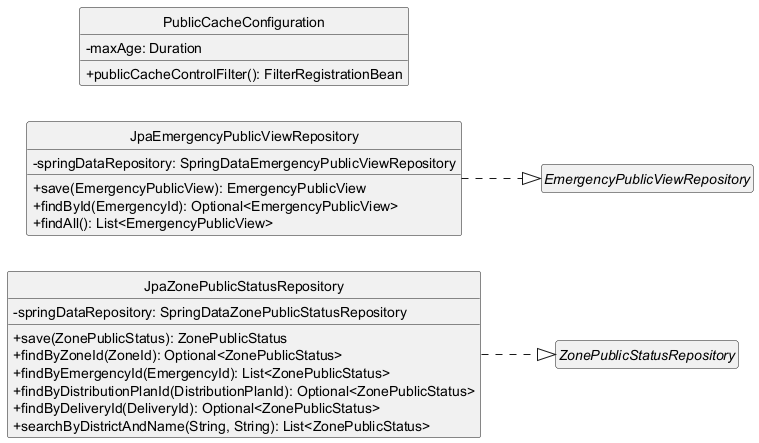

*   **Persistencia:** `JpaZonePublicStatusRepository` y `JpaEmergencyPublicViewRepository` implementan los repositorios con Spring Data JPA sobre el schema `citizen_transparency`.
*   **Caché:** `PublicCacheConfiguration` agrega la cabecera `Cache-Control` a las respuestas de `/api/v1/public/**`, con una vigencia corta de 60 segundos. Así una CDN o el navegador pueden responder las consultas repetidas sin llegar al Backend API, que es lo que plantea el refinamiento R-04 para los picos de consultas ciudadanas. Un cambio de etapa se ve, como máximo, un minuto después.

### 5.5.6. Bounded Context Software Architecture Component Level Diagrams

El diagrama muestra cómo se descompone Citizen Transparency dentro del contenedor Backend API. La sección pública de la aplicación web, Emergency Management y Traceability aparecen como sistemas externos. Se modeló en Structurizr DSL y se exportó desde Structurizr Local.

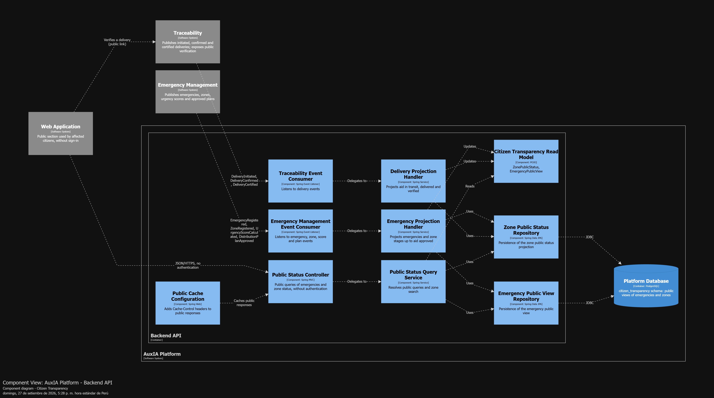

*   **Public Status Controller:** atiende las consultas públicas, sin autenticación.
*   **Emergency Management Event Consumer y Traceability Event Consumer:** reciben los eventos de esos dos contextos.
*   **Emergency Projection Handler y Delivery Projection Handler:** actualizan la vista pública según cada evento.
*   **Public Status Query Service:** resuelve las consultas y la búsqueda de zonas.
*   **Citizen Transparency Read Model:** contiene `ZonePublicStatus` y `EmergencyPublicView`.
*   **Zone Public Status Repository y Emergency Public View Repository:** persisten los read models en el schema `citizen_transparency`.
*   **Public Cache Configuration:** agrega la cabecera de caché a las respuestas públicas.

### 5.5.7. Bounded Context Software Architecture Code Level Diagrams

#### 5.5.7.1. Bounded Context Domain Layer Class Diagrams

El diagrama de clases se modeló en PlantUML e incluye las clases descritas en la sección 5.5.1, con la visibilidad de cada miembro y la multiplicidad de cada relación.

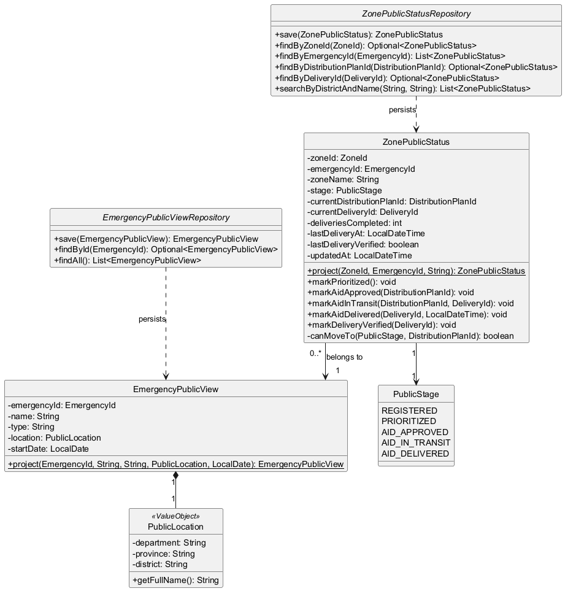

#### 5.5.7.2. Bounded Context Database Design Diagram

El schema `citizen_transparency` guarda los dos read models en dos tablas: `emergency_public_views` y `zone_public_statuses`. Sus claves primarias no se generan en este contexto: son los mismos identificadores de Emergency Management, copiados por la proyección. El diagrama se generó con DataGrip sobre la base de datos PostgreSQL alojada en Neon.

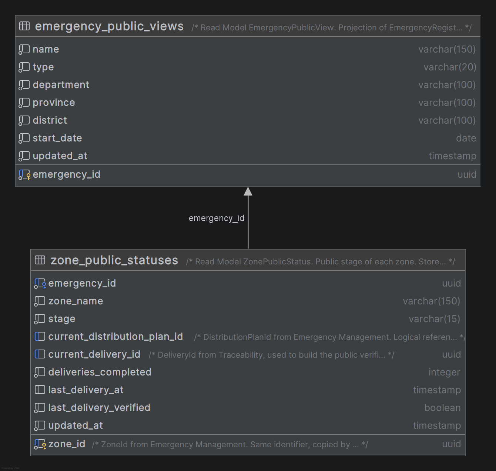

Las reglas de la vista pública también se aplican en la base de datos:
- **Plan en curso:** una zona en `AID_APPROVED`, `AID_IN_TRANSIT` o `AID_DELIVERED` debe tener un plan.
- **Entrega en curso:** en `AID_IN_TRANSIT` o `AID_DELIVERED` debe tener también una entrega.
- **Historial de entregas:** si no hay entregas completadas, no hay fecha de última entrega ni entrega verificada.
- **Emergencia proyectada:** `zone_public_statuses.emergency_id` es una foreign key hacia `emergency_public_views`, porque las dos tablas están en el mismo schema.

La tabla no tiene columnas para datos personales, evidencias ni score. Esa ausencia es la forma más directa de asegurar que la consulta pública no los expone.

---
