# Capítulo VI: Solution UX Design

En esta sección se aborda el planteamiento integral de la propuesta de diseño de experiencia de usuario (UX) e interfaz de usuario (UI) para las aplicaciones y plataformas digitales que componen el ecosistema de AuxIA. La propuesta visual e interactiva está diseñada para respaldar directamente los flujos de trabajo clave definidos en las Historias de Usuario (*User Stories*), optimizando la toma de decisiones críticas en entornos de alta incertidumbre y estrés. Asimismo, se incorporan de manera explícita las decisiones de arquitectura de software previamente establecidas asegurando que la interfaz transmita confianza, claridad y eficiencia tanto a las autoridades de gestión de desastres como a los ciudadanos afectados.

## 6.1. Style Guidelines

Con el objetivo de garantizar una presentación visual coherente, escalable y enfocada en la usabilidad, el equipo de desarrollo ha establecido este repositorio central de pautas de estilo (*Design System*). Estas directrices unifican los activos de marca, patrones tipográficos, componentes de interfaz, esquemas cromáticos y principios de diagramación que serán utilizados por todos los diseñadores y desarrolladores del proyecto. Al centralizar estas normas, se asegura la integridad visual en todas las plataformas digitales de AuxIA (web y móvil), facilitando el desarrollo modular, acelerando la incorporación de nuevas funcionalidades y reduciendo la carga cognitiva de los usuarios en situaciones de emergencia.

### 6.1.1. General Style Guidelines

A continuación, se justifican y detallan las decisiones visuales y conceptuales que articulan el lenguaje gráfico de AuxIA, tomando como fundamento los principios de la teoría del diseño, la psicología del color, la legibilidad en pantallas y la comunicación centrada en el usuario.


#### Branding (Logo & Icon)

El ecosistema visual de AuxIA proyecta una identidad tecnológica moderna, humana y altamente funcional, orientada a transmitir seguridad y capacidad de respuesta inmediata.

<p align="center">
  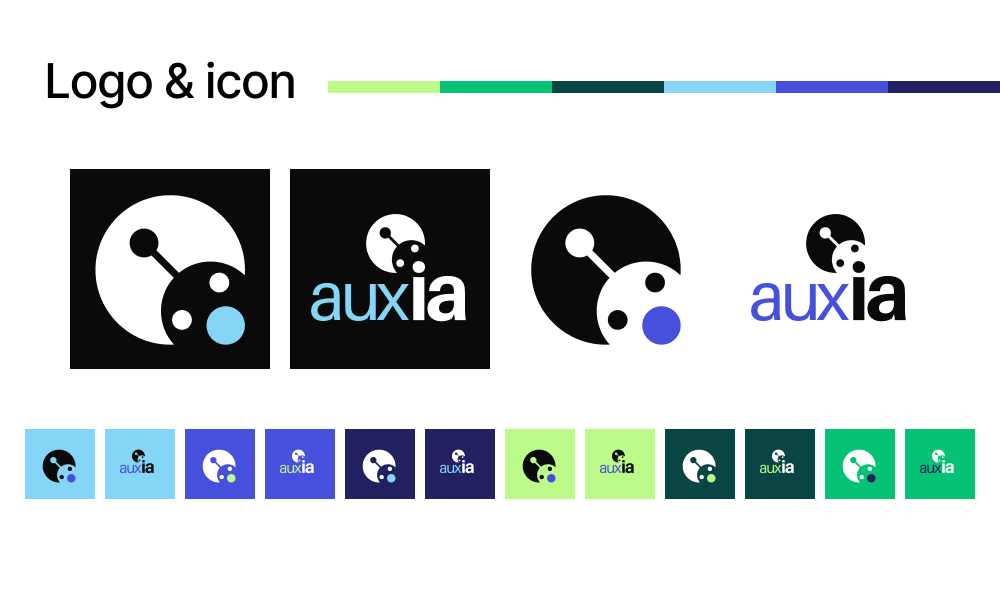
</p>

* **Isotipo (Icono):** Representa la figura estilizada de un robot o asistente inteligente. En la parte superior cuenta con una antena que simboliza la conectividad, el procesamiento algorítmico y la presencia de la Inteligencia Artificial. La expresión facial del robot muestra dos ojos y una boca redonda y abierta (destacada con un punto cromático de color), la cual emula la gestualidad humana de emitir un llamado de alerta o "pedir auxilio" ante una emergencia. El marco circular posterior otorga solidez visual, simulando el casco del asistente o la central de mando desde la que se gestiona la ayuda.
* **Logotipo:** Compuesto por la tipografía en caja baja `auxia`, lo cual aporta accesibilidad y cercanía. La construcción semántica divide visualmente la palabra: el prefijo `aux` (asociado al auxilio y soporte humano) y el sufijo `ia` (Inteligencia Artificial), destacando la sinergia entre la tecnología algorítmica y la respuesta ante emergencias.
* **Variantes y Adaptabilidad:** Como se observa en la especificación de marca, el identificador se ha adaptado a múltiples fondos de contraste (modos claro y oscuro) utilizando combinaciones de la paleta oficial (Azul Noche, Celeste, Verde Lima, Verde Esmeralda y Verde Oscuro). Esto garantiza legibilidad y reconocibilidad instantánea tanto en pantallas de escritorio en centros de mando como en dispositivos móviles bajo condiciones extremas de iluminación en campo.

---

#### Typography

Para todo el sistema digital de AuxIA se ha seleccionado la tipografía **Inter**, una familia tipográfica *sans-serif* de código abierto especialmente diseñada para interfaces de usuario en pantallas digitales.

<p align="center">
  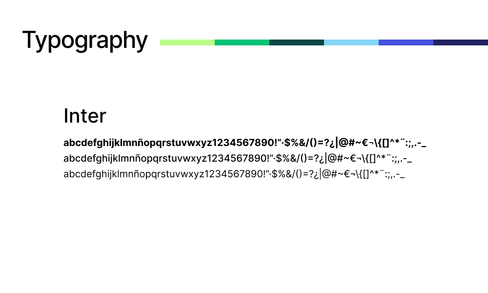
</p>

* **Sustento y Justificación:**
  * **Legibilidad a Pequeña Escala:** Inter cuenta con una altura de x (*x-height*) elevada y aperturas amplias en sus caracteres, lo que previene la distorsión visual cuando la aplicación se consulta en pantallas móviles pequeñas o en dispositivos de baja resolución utilizados por brigadistas.
  * **Claridad Numérica y de Símbolos:** En la gestión de desastres, la interpretación precisa de datos numéricos (coordenadas GPS, cantidades de kits de víveres, número de personas afectadas y porcentajes de inventario) es crítica. Inter incluye numerales y caracteres especiales con un espaciado métrico neutro que evita errores de lectura.
  * **Jerarquía Tipográfica:** Se emplean diferentes pesos del conjunto tipográfico (Bold, Semibold, Medium y Regular) para establecer una jerarquía visual clara. Los pesos más gruesos (*Bold/Semibold*) se destinan a encabezados, alertas de alta urgencia y métricas clave, mientras que los pesos *Regular/Medium* se reservan para bloques de texto instructivo, tablas de datos y formularios.

---

#### Colors

La selección de la paleta cromática de AuxIA se fundamenta en la teoría del color y en la psicología aplicada a entornos de crisis, donde cada tono cumple un rol funcional para guiar la atención del usuario sin generar pánico.

<p align="center">
  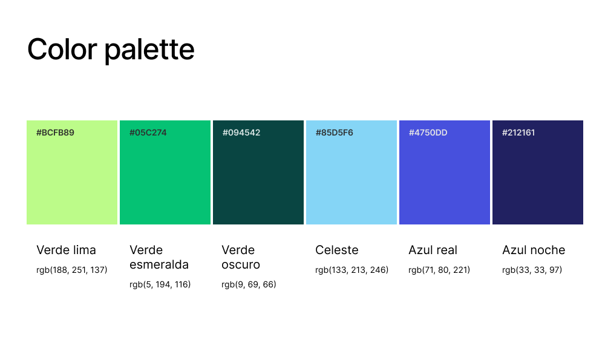
</p>

* **Azul Noche (`#212161` | `rgb(33, 33, 97)`):** 
  * *Significado y Función:* Representa la profundidad, la estabilidad, la autoridad institucional y el rigor técnico. Se utiliza como color estructural primario para fondos de modo oscuro, barras de navegación, encabezados principales y texto de alto contraste. Transmite serenidad y profesionalismo.
* **Azul Real (`#4750DD` | `rgb(71, 80, 221)`):**
  * *Significado y Función:* Evoca confianza, tecnología avanzada, precisión y seguridad. Funciona como color primario de marca y de acción (botones principales, componentes interactivos seleccionados y enlaces), destacando elementos de interacción sin la agresividad visual de otros tonos.
* **Celeste (`#85D5F6` | `rgb(133, 213, 246)`):**
  * *Significado y Función:* Transmite claridad, aire, tranquilidad, transparencia y esperanza. Se utiliza en estados informativos, resaltados secundarios, fondos de tarjetas (*cards*) y elementos de soporte gráfico que requieren diferenciar información sin recargar la vista.
* **Verde Oscuro (`#094542` | `rgb(9, 69, 66)`):**
  * *Significado y Función:* Asociado a la firmeza, la solidez, la resiliencia y la estabilidad del entorno. Se aplica en contenedores de datos de infraestructura, tarjetas de estado operativo y componentes estructurales secundarios en interfaces de mando.
* **Verde Esmeralda (`#05C274` | `rgb(5, 194, 116)`):**
  * *Significado y Función:* Simboliza la validación, el éxito, la seguridad y la confirmación de operaciones. Es el color principal para indicar estados de entregas completadas, registros blockchain validados, niveles óptimos de stock y confirmaciones del sistema.
* **Verde Lima (`#BCFB89` | `rgb(188, 251, 137)`):**
  * *Significado y Función:* Aporta alta visibilidad, energía vital, dinamismo y alerta positiva. Se emplea como color de acento de alto impacto (*focal point*) para llamar la atención sobre indicadores urgentes, botones de acción crítica en campo, notificaciones activas y métricas prioritarias en los tableros de control.


#### Base Color (Tonos básicos generales)

<p align="center">
  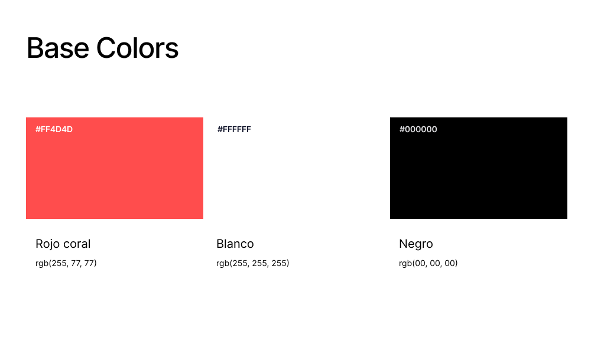
</p>

* **Rojo Coral (`#FF4D4D` / `rgb(255, 77, 77)`):** Reservado para Alertas Críticas, Estados de Emergencia Máxima (SOS), indicadores de Urgencia Crítica en el mapa GIS y botones de Alarma General.
* **Blanco (`#FFFFFF` / `rgb(255, 255, 255)`):** Texto primario de alto contraste sobre superficies oscuras, iconos activos e indicadores luminosos.
* **Negro (`#000000` / `rgb(0, 0, 0)`):** Sombras de elevación, bordes de alto contraste y fondos absolutos.

#### Supporting Colors (Escalas y Tonos de Soporte)

<p align="center">
  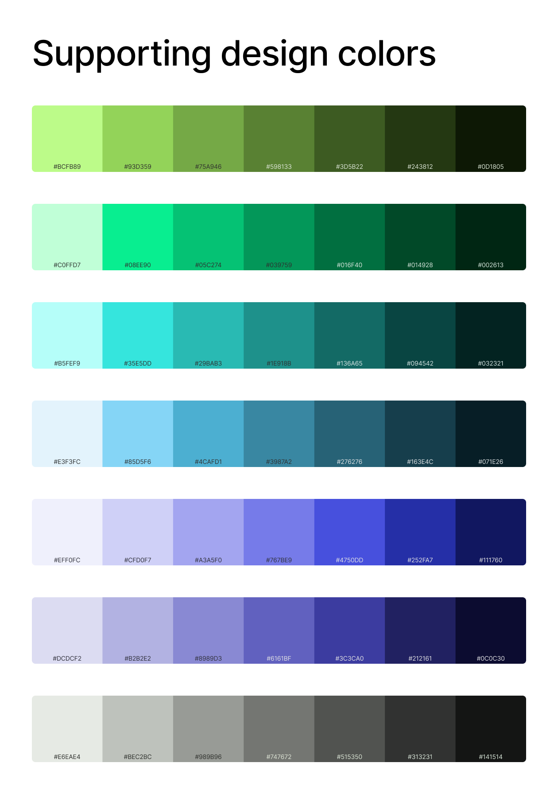
</p>

Para garantizar la flexibilidad técnica del sistema de diseño y la correcta construcción de componentes en plataformas web y móviles, la paleta principal se extiende en rampas tonales (*tints* y *shades*) derivadas de cada color base, acompañadas por una escala de neutros funcionales.

* **Sustento y Justificación:**
  * **Accesibilidad y Contraste (WCAG 2.1):** Las variantes más claras de la escala (tonos pastel e iluminados como `#E3F3FC`, `#EFF0FC` o `#C0FFD7`) se utilizan como fondos de tarjetas (*cards*), contenedores de alertas y bloques informativos. Por su parte, los tonos más oscuros y profundos (`#071E26`, `#111760`, `#0D1805`) aseguran un contraste óptimo para tipografías y bordes sobre fondos claros, garantizando la legibilidad para usuarios con visión reducida o bajo luz solar directa en campo.
  * **Estados Interactivos y Microinteracciones:** Los matices intermedios de cada rampa permiten definir con precisión los estados dinámicos de la interfaz (reposo, *hover*, presión/*pressed*, enfoque/*focus* y deshabilitado/*disabled*) en botones, selecciones y elementos navegables sin romper la armonía cromática de la marca.
  * **Visualización de Datos y Niveles de Riesgo:** En tableros de control de desastres, los mapas de calor y los gráficos de inventario requieren gradaciones continuas para representar densidad de afectados, niveles de urgencia o disponibilidad de stock. Estas escalas tonales permiten construir visualizaciones de datos complejas e intuitivas sin necesidad de saturar la interfaz con colores disonantes.
  * **Escala Neutra Funcional (Grises):** Abarca desde el gris claro de soporte (`#E6EAE4`) hasta el gris profundo (`#141514`). Se destina a divisores de sección, bordes de formularios, estados inactivos y bloques de lectura extensa, evitando el uso del negro puro (`#000000`) para reducir la fatiga visual durante jornadas prolongadas de monitoreo.

---

#### Espaciado (Spacing & Grid)

El sistema de espaciado de AuxIA se rige por un **Grid de 8 puntos (8pt Spatial System)**, donde todas las dimensiones de márgenes, rellenos (*paddings*), distancias inter-elementos y tamaños de componentes son múltiplos de 8px (utilizando 4px de forma excepcional para micro-ajustes).

* **Sustento y Justificación:**
  * **Eficiencia de Layout y Proporción:** Permite una alineación visual armónica y predecible entre diferentes plataformas y resoluciones de pantalla.
  * **Usabilidad Táctil en Campo:** Garantiza que los objetivos de toque (*touch targets*) en la aplicación móvil tengan un tamaño mínimo de 48x48px (6 unidades de 8px). Esto es vital para las autoridades y brigadistas que operan en el campo bajo condiciones adversas, con guantes de protección o en movimiento.
  * **Reducción de Carga Cognitiva:** Un espaciado holgado e interactivo ayuda a separar con claridad la información densa (listas de damnificados, tablas de recursos, gráficos de prioridad), evitando errores de manipulación en momentos de estrés.

---

#### Tono de Comunicación y Lenguaje Aplicado

El tono de comunicación del ecosistema AuxIA ha sido calibrado en cuatro dimensiones fundamentales para adaptarse a la sensibilidad de las emergencias humanitarias y a la rigurosidad requerida por las autoridades:

[Divertido]   0 --------------------|---- 10  [Serio]           -> Posición: 9/10 <br>
[Casual]      0 ----------------|-------- 10  [Formal]          -> Posición: 7/10 <br>
[Irreverente] 0 ------------------------| 10  [Respetuoso]      -> Posición: 10/10 <br>
[Entusiasta]  0 --------------|---------- 10  [Sereno]          -> Posición: 8/10 <br>

1. **Serio vs. Divertido (9 / 10 - Orientado a lo Serio):** Dada la naturaleza de la plataforma (atención de crisis, distribución de ayuda y salvaguarda de vidas), el lenguaje descarta cualquier matiz humorístico o superfluo. Se prioriza un mensaje directo, sobrio y enfocado puramente en la resolución de problemas.
2. **Formal vs. Casual (7 / 10 - Moderadamente Formal / Profesional Accesible):** Concilia la autoridad institucional de los organismos de defensa civil con la simplicidad necesaria para el ciudadano afectado. Emplea un lenguaje técnico preciso pero exento de burocracia innecesaria, mediante frases cortas, voz activa e instrucciones claras.
3. **Respetuoso vs. Irreverente (10 / 10 - Estrictamente Respetuoso y Empático):** La comunicación demuestra consideración absoluta por la dignidad humana, la privacidad de los datos sensibles y el estado emocional de las personas en situación de vulnerabilidad.
4. **Sereno vs. Entusiasta (8 / 10 - Sereno y Asegurador):** El tono evita términos alarmistas o sensacionalistas que incrementen la ansiedad. En su lugar, transmite control, calma, certeza operativa y transparencia respecto al estado de las solicitudes y la ayuda en camino.

En cuanto al idioma utilizado para AuxIA, se propone lo siguiente:

* **Idioma Principal (Nativo):** La aplicación está concebida y desarrollada primordialmente en **Español**, garantizando una perfecta adaptación cultural, semántica y terminológica para las regiones hispanohablantes donde se desplegarán las principales operaciones de respuesta ante desastres.
* **Internacionalización (i18n - Inglés):** El sistema incorpora soporte de arquitectura para **internacionalización (i18n)**, permitiendo a los usuarios alternar la interfaz dinámicamente al **Inglés**. Esta funcionalidad asegura la interoperabilidad con brigadas internacionales, organizaciones no gubernamentales (ONG) globales y organismos multilaterales de apoyo en crisis humanitarias.


### 6.1.2. Web & Mobile Style Guidelines

En esta sección se detallan las directrices de diseño e interacción adaptadas a las plataformas **Web Responsive** y **Móvil Nativa** del ecosistema AuxIA. Dado que cada entorno responde a contextos de uso radicalmente opuestos —el trabajo estratégico en centros de mando frente a la operación de emergencia en campo—, las interfaces han sido optimizadas para ofrecer la máxima usabilidad, accesibilidad y velocidad de respuesta en sus respectivos dispositivos.

<p align="center">
  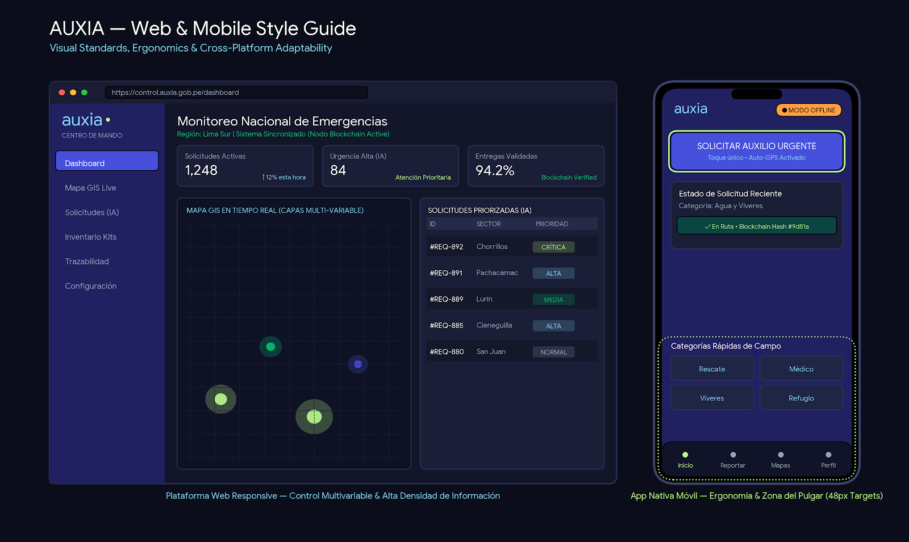
</p>

#### 1. Native Mobile Interfaces (Aplicación Móvil) 

La interfaz móvil nativa está diseñada para **ciudadanos, voluntarios y brigadistas de rescate**. Su enfoque principal es la simplicidad operativa, la velocidad de ejecución bajo situaciones de estrés y el soporte nativo para capacidades del dispositivo (GPS, cámara, almacenamiento local para conectividad *offline-first*).

***A. Ergonomía y Zona del Pulgar (Thumb Zone)***
* **Distribución de Controles:** Los elementos de interacción principal (botones de emergencia, envío de reportes, confirmación de entrega) se ubican en la **Zona Natural de Alcance** (tercio inferior de la pantalla) para facilitar el uso con una sola mano.
* **Navegación Inferior (Bottom Navigation Bar):** Barra fija con tres accesos principales por rol (máximo cinco si se amplían las funciones), con iconos claros de 24px y etiquetas tipográficas.
* **Hojas Inferiores (Bottom Sheets):** Se prioriza el uso de modales deslizables desde la parte inferior para formularios rápidos, detalles de incidentes y filtros, evitando diálogos flotantes centrados que obstruyan la pantalla.

***B. Tamaño de Objetivos Táctiles (Touch Targets)***
* **Dimensión Mínima:** Todos los componentes interactivos (botones, checks, iconos accionables) tienen un área mínima de toque de **48x48 px** (respetando la cuadrícula de 8pt), garantizando su accionamiento aun usando guantes de protección o en condiciones de movimiento.
* **Espaciado Mínimo:** Distancia de al menos 8px entre controles interactivos adyacentes para prevenir toques accidentales.

***C. Patrones de Interacción y Feedback Háptico***
* **Indicadores Visuales Offline-First:**
  * **Badge de Conectividad:** Un indicador discreto pero visible en la barra superior muestra el estado de conexión. *"Modo Offline Activo"* se presenta en Verde Esmeralda, porque la aplicación sigue operativa y guarda los datos localmente, mientras que *"Sin señal"* se presenta en Rojo Coral cuando ningún canal de sincronización está disponible.
  * **Feedback de Sincronización:** Barra de progreso sutil cuando los datos guardados localmente se sincronizan automáticamente al recuperar la señal.
* **Respuesta Háptica (Vibración):** Confirmación táctil inmediata al enviar un reporte de emergencia, escanear un código QR de entrega o validar una transacción registrada en blockchain.

---

#### 2. Responsive Web Interfaces (Panel de Control y Centro de Mando)

La plataforma web está orientada a **autoridades de defensa civil, administradores de logística y analistas de crisis**. Diseñada para pantallas grandes, prioriza el monitoreo multivariable, el análisis de datos masivos y la toma de decisiones estratégicas.

***A. Breakpoints y Layout Adaptativo***
El sistema de retícula (*grid*) responsive para la web utiliza un modelo flexible basado en los siguientes puntos de interrupción:

* **Desktop Extra Large (≥ 1440px):** Layout de 12 columnas. Espacio optimizado para mapas GIS interactivos a pantalla completa con paneles laterales colapsables de métricas en tiempo real.
* **Desktop Standard / Laptop (1024px – 1439px):** Layout de 12 columnas. Ajuste automático de tablas de datos y reducción de paneles secundarios a pestañas navegables.
* **Tablet Horizontal / Pantallas Pequeñas (768px – 1023px):** Layout de 8 columnas. Menú lateral (Sidebar) colapsable automáticamente en un menú tipo "Hamburguesa" o riel compacto de iconos.

***B. Alta Densidad de Información y Monitoreo***
* **Tablas de Datos Avanzadas:** Soporte nativo para ordenamiento, filtrado múltiple, paginación dinámica y exportación. Filas con altura optimizada para lectura rápida y estados visuales resaltados según el nivel de prioridad de la IA.
* **Visualización de Mapas y Capas:** Controles flotantes sobre mapas interactivos para alternar capas de calor (zonas afectadas, refugios, rutas bloqueadas y flota de vehículos de auxilio).
* **Compatibilidad con Centros de Control (Modo Oscuro Predeterminado):** Opción de conmutación a tema oscuro optimizado (`#212161` Azul Noche) para pantallas de proyección continua en salas de mando, reduciendo la fatiga visual de los operadores en turnos nocturnos.

***C. Navegación por Teclado y Puntero***
* **Estados Hover y Focus Visibles:** Todos los elementos interactivos cuentan con un anillo de enfoque (*focus ring*) de alto contraste de 2px para navegación accesible mediante teclado (`Tab` / `Enter`).
* **Atajos de Teclado (Keyboard Shortcuts):** Habilitación de comandos rápidos para operadores avanzados (ej. `CTRL + F` para búsqueda global de solicitudes, `ESC` para cerrar paneles laterales).

---

#### 3. Matriz de Adaptación de Componentes (Web vs. Móvil)

Para mantener la coherencia de la marca mientras se respeta la naturaleza de cada plataforma, los componentes principales adaptan su estructura según el dispositivo:

| Componente | Comportamiento en Web (Desktop) | Comportamiento en Móvil (Native) |
| :--- | :--- | :--- |
| **Navegación Principal** | Menú lateral vertical (*Sidebar*) fijo con jerarquía expandible. | Barra de navegación inferior (*Bottom Bar*) fija con tres secciones clave por rol. |
| **Tablas y Listados** | Tabla de datos con múltiples columnas, ordenamiento y acciones en línea. | Tarjetas verticales (*Cards*) resumidas con detalles expandibles en *Bottom Sheet*. |
| **Formularios de Reporte** | Formularios multicolumna en modales centrados o pestañas dedicadas. | Formularios paso a paso (*Wizard*) de una sola columna con botones fijos al pie. |
| **Filtros de Búsqueda** | Barra superior de filtros desplegables y rangos de fechas visibles. | Botón flotante de filtro que despliega una hoja inferior (*Bottom Sheet*) completa. |
| **Alertas del Sistema** | Notificaciones tipo *Toast* en la esquina superior derecha con autocierre. | Banner superior (*Snackbar*) o alerta a pantalla completa para emergencias críticas. |

## 6.2. Information Architecture

La arquitectura de información de **AuxIA** organiza los contenidos y funcionalidades de la Landing Page, Web App y aplicación móvil de acuerdo con los diferentes perfiles de usuario y contextos de uso. El diseño prioriza la claridad, rapidez de acceso y reducción de la carga cognitiva, especialmente en situaciones de emergencia.

La estructura considera tres entornos principales:

* **Landing Page:** presenta la propuesta de valor, funcionamiento y beneficios de AuxIA.
* **Web App – Centro de Mando:** orientada a autoridades, coordinadores, auditores y administradores de la organización, con acceso mediante inicio de sesión institucional.
* **Web App – Consulta pública:** orientada a ciudadanos que consultan, sin iniciar sesión, el estado de atención de su zona y la validez de una entrega.
* **Mobile App:** orientada principalmente a ciudadanos, voluntarios y brigadistas, con funcionamiento *offline-first*.

### 6.2.1. Organization Systems

Los sistemas de organización determinan cómo se agrupa y estructura la información dentro de AuxIA. Se utilizan principalmente estructuras **jerárquicas, secuenciales y matriciales**, dependiendo del contexto y de la tarea que debe realizar el usuario.

#### Organización jerárquica

La organización jerárquica se utiliza cuando existe una relación de niveles entre la información. En la Landing Page, el contenido se presenta desde la propuesta de valor general hacia información cada vez más específica:

1. Propuesta de valor de AuxIA.
2. Indicadores y beneficios.
3. Módulos principales.
4. Funcionamiento de la solución.
5. Llamados a la acción.
6. Información complementaria y legal.

Esta estructura permite que el usuario comprenda inicialmente qué es AuxIA y posteriormente conozca cómo funciona y qué acciones puede realizar.

En el Centro de Mando, la jerarquía se organiza alrededor de las principales funciones operativas:

* Dashboard.
* Mapa GIS.
* Priorización IA.
* Inventario.
* Brigadas (logística de campo y creación de misiones).
* Trazabilidad Blockchain.
* Configuración (administración de la organización, usuarios y roles).

Dentro de esta jerarquía, dos pantallas se abren desde una acción y no desde el menú: el **Plan de distribución**, al que se llega desde "Asignar Brigada" para que la autoridad apruebe la recomendación antes de asignar recursos, y la **Exportación SINPAD**, a la que se llega desde "Exportar" en Priorización IA.

La jerarquía responde a las necesidades de autoridades y coordinadores que requieren pasar de una visión general de la emergencia hacia información específica para tomar decisiones.

#### Organización secuencial

La organización secuencial se utiliza cuando el usuario debe completar una serie de pasos en un orden determinado.

En la Landing Page, la sección **How It Works** presenta tres etapas:

1. **Reporte en Campo.**
2. **Priorización e IA.**
3. **Despacho y Entrega Validada.**

En la aplicación móvil también se utiliza una estructura secuencial para el reporte de emergencias. El ciudadano puede:

1. Seleccionar su rol.
2. Configurar red y almacenamiento.
3. Realizar un reporte SOS.
4. Agregar información adicional de manera opcional.
5. Guardar el reporte localmente.
6. Sincronizarlo cuando exista conectividad.
7. Recibir los estados de procesamiento y atención.

El flujo contempla los estados **Guardado → Transmitiendo → Priorizado por IA → Brigada en camino**.

Para el brigadista, el proceso también es secuencial:

1. Registro y selección del rol.
2. Validación de credenciales.
3. Aprobación por el Centro de Mando.
4. Consulta de misiones.
5. Navegación hacia la misión.
6. Verificación de la entrega.
7. Escaneo del QR.
8. Registro de firma y fotografía.
9. Confirmación del hash.
10. Finalización de la misión.

En el Centro de Mando, la autoridad sigue una secuencia que garantiza la aprobación humana antes de mover recursos:

1. Iniciar sesión con credenciales institucionales.
2. Revisar el Dashboard y el Mapa GIS.
3. Analizar la priorización y su explicación en Priorización IA.
4. Seleccionar "Asignar Brigada", que abre el Plan de distribución.
5. Revisar los recursos propuestos frente al inventario disponible y reservado.
6. Aprobar, modificar o rechazar el plan con motivo.
7. Despachar la brigada desde Logística de Campo.

En la Consulta pública, el ciudadano busca su distrito y zona, revisa la etapa de atención y, si cuenta con un código de entrega, verifica su validez.

#### Organización matricial

La organización matricial se utiliza principalmente en el Centro de Mando, donde el usuario debe relacionar diferentes dimensiones de información.

Por ejemplo, el sistema permite analizar solicitudes considerando variables como:

* Nivel de urgencia.
* Estado de sincronización.
* Tipo de asistencia.
* Ubicación o zona de incidencia.
* Estado de atención.

Asimismo, el mapa GIS permite combinar diferentes capas de información, como:

* Zonas de inundación.
* Cobertura celular.
* Ubicación de brigadas.
* Clústeres de incidentes.
* Nivel de **Urgency Score**.

Esto permite que los usuarios institucionales puedan analizar la situación desde diferentes perspectivas.

#### Esquemas de categorización

| Esquema                      | Aplicación en AuxIA                                                           |
| ---------------------------- | ----------------------------------------------------------------------------- |
| **Por temas**                | Producto, Recursos, Legal, Dashboard, Mapa GIS, Priorización IA, Inventario, Brigadas y Trazabilidad Blockchain. |
| **Por audiencia**            | Ciudadanos, brigadistas, autoridades, coordinadores, auditores y administradores de la organización. |
| **Cronológico / secuencial** | Reporte → Priorización → Aprobación del plan → Despacho → Entrega validada.   |
| **Por prioridad**            | Clasificación de incidentes mediante el Urgency Score.                        |
| **Por estado**               | Reportes (Guardado, Transmitiendo, Priorizado por IA, Brigada en camino), planes (Propuesto, Aprobado, Rechazado), cuentas (Activa, Bloqueada, Deshabilitada) y etapas públicas de la zona. |

La categorización por audiencia es especialmente importante debido a que la solución contempla diferentes perfiles y contextos de uso.

### 6.2.2. Labeling Systems

El sistema de etiquetado define cómo se representan las funcionalidades, contenidos y estados dentro de AuxIA. Los nombres deben ser **simples, directos, breves y consistentes**, considerando que la plataforma puede utilizarse bajo situaciones de presión y emergencia.

Siguiendo el tono definido en la sección 6.1.1, las etiquetas usan una comunicación directa, con instrucciones claras, frases cortas y voz activa.

#### Etiquetas de la Landing Page

| Sección / Acción         | Etiqueta                       |
| ------------------------ | ------------------------------ |
| Inicio                   | **Inicio**                     |
| Producto                 | **Producto**                   |
| Recursos                 | **Recursos**                   |
| Legal                    | **Legal**                      |
| Demostración             | **Ver Demo**                   |
| Aplicación               | **Descargar App**              |
| Centro de Mando          | **Acceder al Centro de Mando** |
| Despliegue institucional | **Solicitar despliegue**       |
| Contacto                 | **Contactar**                  |

Estas etiquetas se relacionan directamente con las categorías y llamados a la acción definidos para la Landing Page.

#### Etiquetas del Web App

| Funcionalidad          | Etiqueta             |
| ---------------------- | -------------------- |
| Vista general          | **Dashboard**        |
| Sistema geográfico     | **Mapa GIS**         |
| Priorización           | **Priorización IA**  |
| Existencias            | **Inventario**       |
| Coordinación operativa | **Brigadas**         |
| Auditoría              | **Trazabilidad Blockchain** |
| Preferencias           | **Configuración**    |
| Nivel de urgencia      | **Urgency Score**    |
| Crear operación        | **Crear misión**     |
| Asignación             | **Asignar brigada**  |
| Seguimiento            | **Ver trazabilidad** |
| Acceso institucional   | **Iniciar sesión** / **Ingresar** |
| Decisión sobre el plan | **Aprobar plan** / **Modificar cantidades** / **Rechazar con motivo** |
| Gestión de cuentas     | **Registrar usuario** / **Cambiar rol** / **Desbloquear cuenta** |
| Integración externa    | **Exportar archivo SINPAD** |
| Acceso ciudadano       | **Consulta pública** / **Verificar** |

Las etiquetas se relacionan con las funcionalidades descritas para el Centro de Mando, incluyendo GIS, priorización explicable, aprobación de planes de distribución, inventario, logística, trazabilidad mediante Blockchain, administración de la organización y exportación a SINPAD.

#### Etiquetas de la Mobile App

| Funcionalidad     | Etiqueta                 |
| ----------------- | ------------------------ |
| Rol ciudadano     | **Ciudadano**            |
| Rol brigadista    | **Brigadista**           |
| Emergencia        | **SOS**                  |
| Asistencia médica | **Médico**               |
| Rescate           | **Rescate**              |
| Alimentación      | **Víveres**              |
| Misiones          | **Misiones**             |
| Reportes enviados | **Mis reportes**         |
| Entrega           | **Entrega**              |
| Configuración     | **Ajustes**              |
| Sincronización    | **Sincronización**       |
| Conectividad      | **Red y almacenamiento** |

En la aplicación móvil, las etiquetas se acompañan de iconos y controles táctiles grandes, considerando un tamaño mínimo de 48 × 48 px para los elementos interactivos.

#### Etiquetas de estados

Para comunicar claramente el estado de los procesos se utilizan etiquetas concretas:

* **Guardado**
* **Transmitiendo**
* **Priorizado por IA**
* **Brigada en camino**
* **Pendiente de aprobación**
* **Hash confirmado**
* **Integridad verificada**
* **Propuesto** (plan de distribución pendiente de decisión)
* **Activa**, **Bloqueada** y **Deshabilitada** (cuentas de usuario)
* **Registrada**, **Priorizada**, **Ayuda aprobada**, **Ayuda en camino** y **Ayuda entregada** (etapas públicas de una zona)

Estas etiquetas permiten que el usuario conozca rápidamente el estado de una solicitud, misión, plan, cuenta o proceso de validación.

### 6.2.3. SEO Tags and Meta Tags / ASO Elements

La Landing Page requiere metadatos que permitan describir el contenido y facilitar su identificación en motores de búsqueda. Del mismo modo, la Web App y la aplicación móvil requieren metadatos y elementos de App Store Optimization (ASO). Los valores siguientes se definieron a partir del contenido y la propuesta de valor de AuxIA.

#### SEO – Landing Page

| Elemento             | Propuesta                                                                                                                                                                       |
| -------------------- | ------------------------------------------------------------------------------------------------------------------------------------------------------------------------------- |
| **Title**            | `AuxIA \| Inteligencia Artificial para la Gestión de Emergencias`                                                                                                               |
| **Meta Description** | `AuxIA integra inteligencia artificial, GIS y Blockchain para coordinar la atención de emergencias, priorizar incidentes y garantizar la trazabilidad de la ayuda humanitaria.` |
| **Keywords**         | `gestión de emergencias, inteligencia artificial, respuesta ante desastres, GIS, Blockchain, ayuda humanitaria`                                                                 |
| **Author**           | `AuxIA`                                                                                                                                                                         |

La propuesta se encuentra alineada con la Landing Page, cuyo contenido comunica el uso de IA y Blockchain para la coordinación de emergencias y presenta funcionalidades como monitoreo GIS, priorización y trazabilidad de ayuda humanitaria.

#### SEO – Web App

| Elemento             | Propuesta                                                                                                                                        |
| -------------------- | ------------------------------------------------------------------------------------------------------------------------------------------------ |
| **Title**            | `AuxIA Centro de Mando \| Gestión de Emergencias`                                                                                                |
| **Meta Description** | `Centro de Mando AuxIA para monitoreo GIS, priorización de incidentes mediante IA, coordinación de brigadas, inventario y auditoría Blockchain.` |
| **Keywords**         | `centro de mando, emergencias, GIS, priorización IA, brigadas, inventario, Blockchain`                                                           |
| **Author**           | `AuxIA`                                                                                                                                          |

#### ASO – Mobile App

| Elemento            | Propuesta                                                                                                                                                                                                                                                |
| ------------------- | -------------------------------------------------------------------------------------------------------------------------------------------------------------------------------------------------------------------------------------------------------- |
| **App Title**       | `AuxIA – Emergencias`                                                                                                                                                                                                                                    |
| **App Subtitle**    | `Auxilio y coordinación offline`                                                                                                                                                                                                                         |
| **App Keywords**    | `emergencias, SOS, auxilio, desastres, brigadistas, ayuda, offline`                                                                                                                                                                                      |
| **App Description** | `AuxIA permite reportar emergencias, solicitar ayuda y coordinar misiones incluso sin conexión. Los ciudadanos pueden enviar reportes SOS y los brigadistas pueden consultar misiones, navegar hacia incidentes y validar entregas mediante Blockchain.` |

La descripción de la aplicación se basa en las funcionalidades móviles definidas en la sección 6.1.2 y en esta arquitectura de información, especialmente el funcionamiento *offline-first*, los reportes SOS, las misiones de brigadistas y la validación de entregas.

### 6.2.4. Searching Systems

Los sistemas de búsqueda permiten localizar y filtrar información dentro del Centro de Mando, especialmente cuando existe una gran cantidad de solicitudes, incidentes, recursos o registros.

#### Búsqueda y filtrado de solicitudes

En el módulo de **Priorización IA**, las solicitudes pueden visualizarse mediante una tabla de alta densidad y filtrarse según:

* Rango de urgencia.
* Estado de sincronización.
* Tipo de asistencia.
* Información relacionada con la incidencia.

Al seleccionar un registro, un panel lateral permite consultar la explicación del **Urgency Score** y tomar acciones como asignar una brigada o realizar un ajuste justificado.

#### Búsqueda mediante GIS

El mapa GIS funciona también como mecanismo de exploración de información. El usuario puede trabajar con diferentes capas:

* Zonas de inundación.
* Cobertura celular.
* Ubicación de brigadas.
* Clústeres de incidentes.

Al seleccionar un incidente, el sistema muestra información contextual sobre la prioridad calculada por IA y los recursos asignados.

#### Búsqueda de trazabilidad Blockchain

La auditoría Blockchain permite localizar registros mediante diferentes identificadores:

* QR.
* ID del donante.
* Hash criptográfico.

La información obtenida permite seguir la trazabilidad desde la donación hasta la entrega final y verificar la integridad de la operación.

#### Búsqueda de inventario

El módulo de inventario permite localizar información relacionada con existencias, almacenes y movimientos de recursos. Los elementos críticos se identifican mediante alertas de stock y tarjetas de inventario.

#### Búsqueda en la Consulta pública

El ciudadano localiza su zona escribiendo el **distrito** y el **nombre de la zona**, sin iniciar sesión. Si la zona no está registrada, el sistema indica que no existe información disponible. La misma pantalla permite verificar una entrega ingresando su **código**, y responde si el registro es válido o si el código no corresponde a ninguna entrega.

#### Filtros de administración y exportación

La pantalla de Administración lista los usuarios de la organización con su rol y el estado de su cuenta. La Exportación SINPAD filtra los reportes por **emergencia**, **periodo** y **formato**, y marca los que tienen campos obligatorios incompletos antes de generar el archivo.

#### Presentación de resultados

Los resultados de búsqueda y filtrado se presentan según el tipo de información:

| Tipo de información | Presentación                        |
| ------------------- | ----------------------------------- |
| Solicitudes         | Tablas con filtros y ordenamiento   |
| Incidentes          | Mapa GIS y clústeres                |
| Explicación de IA   | Panel lateral                       |
| Inventario          | Tarjetas y registros de movimientos |
| Trazabilidad        | Registro Blockchain                 |
| Misiones            | Tarjetas y mapa                     |
| Estado de una zona  | Etapas públicas y resumen de entregas |
| Usuarios            | Tabla con rol y estado de la cuenta |
| Reportes a exportar | Vista previa con validación de campos |

En dispositivos móviles, la búsqueda se simplifica para reducir la carga cognitiva, utilizando mapas, tarjetas y filtros contextuales. Los filtros móviles se presentan mediante un botón flotante que abre un **bottom sheet**.

### 6.2.5. Navigation Systems

El sistema de navegación permite que los usuarios recorran la información y funcionalidades de AuxIA de acuerdo con su perfil y contexto de uso.

#### Navegación de la Landing Page

La navegación principal de la Landing Page se organiza mediante:

* **Inicio**
* **Producto**
* **Recursos**
* **Legal**
* **Acceder al Centro de Mando**
* **Ver Demo**
* **Descargar App**

El usuario puede recorrer la página desde la propuesta de valor inicial hacia los indicadores, módulos, explicación del funcionamiento y llamados a la acción.

El footer mantiene accesos organizados en las categorías **Product, Resources y Legal**, además de las líneas de emergencia.

#### Navegación del Web App

Para el Centro de Mando se utiliza una **barra lateral vertical fija y expandible**, adecuada para pantallas grandes y para el acceso constante a múltiples módulos.

La estructura propuesta es:

```text
Iniciar sesión
└── Centro de Mando
    ├── Dashboard
    ├── Mapa GIS
    ├── Priorización IA
    │   ├── Asignar Brigada → Plan de distribución
    │   └── Exportar → Exportación SINPAD
    ├── Inventario
    ├── Brigadas
    ├── Trazabilidad Blockchain
    └── Configuración → Administración de la organización

Consulta pública (sin iniciar sesión)
└── Acceso institucional → Iniciar sesión
```

Esta navegación permite pasar de una vista general de la emergencia hacia herramientas específicas de análisis, coordinación y auditoría. El Plan de distribución se abre también desde "Asignar Brigada" en el Dashboard y en el Mapa GIS; al aprobarlo, la navegación continúa a Brigadas, y al rechazarlo vuelve a Priorización IA.

Además, se utiliza navegación contextual mediante:

* Paneles laterales.
* Modales.
* Tabs.
* Popups en el mapa.
* Acciones dentro de tablas.
* Controles de capas GIS.

Por ejemplo, desde un incidente ubicado en el mapa GIS, el usuario puede consultar su prioridad, revisar la información explicativa y posteriormente asignar una brigada.

#### Navegación de la Mobile App

En dispositivos móviles se utiliza una **barra de navegación inferior fija con tres secciones principales por rol**, acompañada de iconos y etiquetas claras.

La navegación se adapta al rol:

**Ciudadano**

```text
Inicio
├── SOS
├── Mis reportes
└── Ajustes
```

**Brigadista**

```text
Inicio
├── Misiones
├── Entrega
└── Ajustes
```

El ciudadano puede iniciar rápidamente un reporte SOS y consultar su estado de sincronización en Mis reportes. El brigadista accede a sus misiones, cuyo mapa con la ruta de navegación está integrado en la misma sección, y registra la entrega correspondiente. En ambos roles, Ajustes agrupa la configuración de red y almacenamiento.

#### Navegación basada en estados

La navegación también se encuentra condicionada por el estado de los procesos. Por ejemplo, un reporte ciudadano puede avanzar mediante:

```text
Guardado
   ↓
Transmitiendo
   ↓
Priorizado por IA
   ↓
Brigada en camino
```

Mientras que una misión de brigadista puede avanzar desde la asignación hasta la validación de la entrega:

```text
Misión asignada
   ↓
Navegación hacia incidente
   ↓
Entrega
   ↓
QR + Firma + Fotografía
   ↓
Hash confirmado
   ↓
Misión completada
```

Este enfoque permite que el usuario conozca en todo momento dónde se encuentra dentro del proceso y qué acción corresponde realizar a continuación.

## 6.3. Landing Page UI Design

En esta sección se presenta la propuesta de interfaz de usuario (UI) para la landing page de AuxIA, la cual traduce de manera directa las decisiones de diseño y la arquitectura de información definidas previamente en un sistema visual cohesivo y de alto impacto. El diseño se estructura para comunicar con claridad la propuesta de valor tecnológica de la plataforma —combinando Inteligencia Artificial y trazabilidad Blockchain— a través de un esquema visual en modo oscuro que optimiza el contraste, una jerarquía tipográfica rigurosa y componentes visuales diseñados para guiar orgánicamente al usuario desde la comprensión del sistema hasta las llamadas a la acción (CTAs) clave.

### 6.3.1. Landing Page Wireframes

En esta sección se exponen los wireframes estructurales de la landing page para navegadores Web Desktop y Mobile Web Browser. La propuesta diagrama la arquitectura de información y el flujo de navegación en esquemas de baja y media fidelidad, evidenciando la aplicación de principios fundamentales de diseño UX/UI, como la jerarquía visual, la consistencia y la alineación. Asimismo, se integran criterios de diseño inclusivo y accesibilidad (adaptabilidad responsive, contraste adecuado y zonas de interacción optimizadas para pantallas táctiles), garantizando una experiencia clara, fluida e intuitiva tanto para ciudadanos en dispositivos móviles como para autoridades y organismos en entornos de escritorio.

#### Wireframe 1: Encabezado y Sección Principal (Hero Section)

<p align="center">
  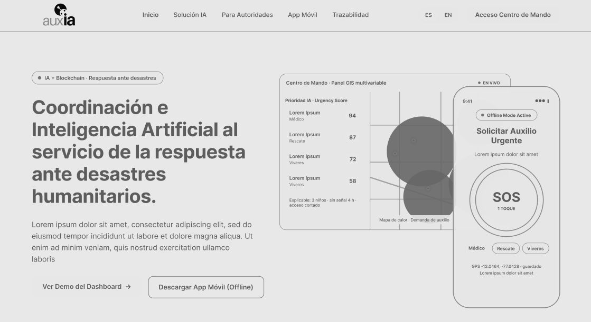
</p>

Este esquema define la cabecera con navegación principal, cambio de idioma (ES/EN) y botón de acceso al centro de mando. En la sección *Hero*, destaca la propuesta de valor centrada en la coordinación ante desastres mediante IA y Blockchain, acompañada de acciones clave (*CTAs*) para ver la demo del tablero y descargar la aplicación móvil. En el costado derecho, integra la visualización combinada del panel GIS web de mando y la interfaz móvil con botón SOS para reportes *offline*.

#### Wireframe 2: Indicadores de Impacto y Módulos Clave

<p align="center">
  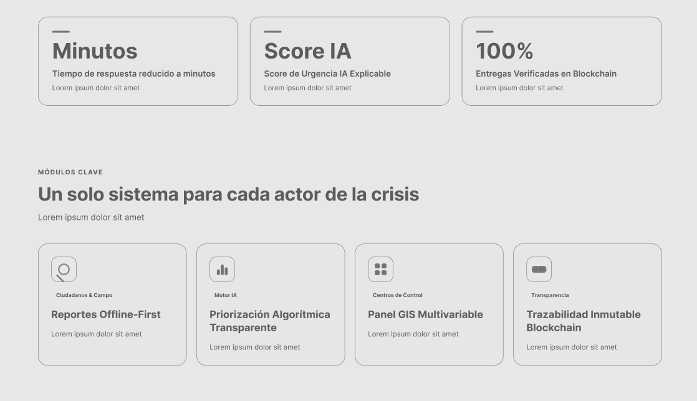
</p>

Este *wireframe* presenta en su parte superior una cinta con tres métricas clave (tiempo de respuesta, *Urgency Score* explicable y validación por Blockchain). A continuación, organiza una retícula de cuatro tarjetas representativas de los módulos principales para cada actor del sistema: captura de reportes *offline-first*, priorización algorítmica transparente, monitoreo multivariable GIS y trazabilidad inmutable de ayuda humanitaria.

#### Wireframe 3: Flujo del Proceso (How it Works) y Banner Institucional

<p align="center">
  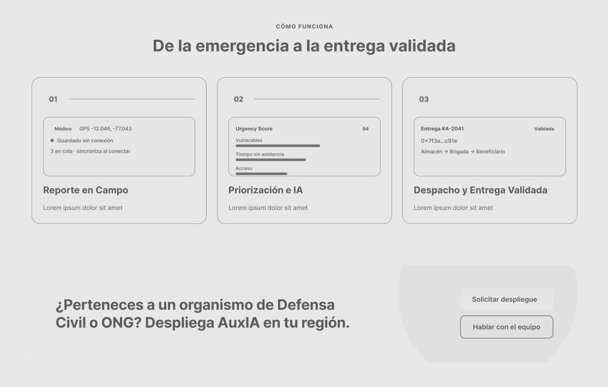
</p>

La sección diagrama un flujo de trabajo estructurado en tres pasos secuenciales que explican el camino de la atención: el reporte en campo, la priorización mediante inteligencia artificial y la entrega validada del suministro. En la parte inferior, incorpora un bloque de llamada a la acción de alto impacto enfocado en captar organismos de Defensa Civil y ONGs mediante botones directos de solicitud de despliegue y contacto.

#### Wireframe 4: Pie de Página (Footer)

<p align="center">
  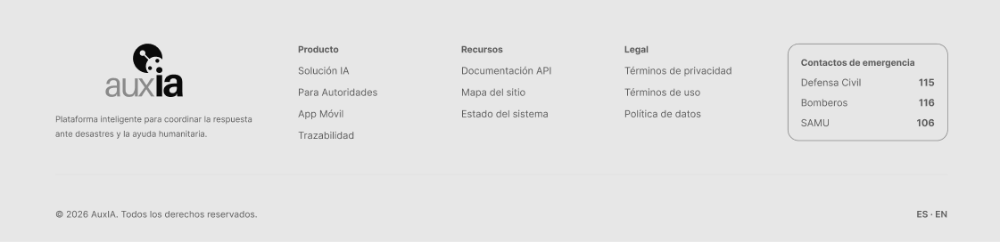
</p>

Este esquema organiza el *footer* en columnas temáticas para estructurar los enlaces de Producto, Recursos y Marco Legal, incluyendo la identidad de marca y derechos reservados. Destaca de forma accesible e inclusiva un módulo de accesos rápidos a líneas telefónicas de emergencia clave (Defensa Civil, Bomberos y SAMU), ofreciendo máxima utilidad operacional para cualquier usuario en situación de crisis.

### 6.3.2. Landing Page Mock-ups

A continuación se presentan y detallan los mock-ups de alta fidelidad para la landing page de AuxIA. Esta propuesta traduce de manera rigurosa el Design System establecido para la plataforma, aplicando un esquema visual en modo oscuro (Dark Mode) fundamentado en tonos azul noche, acentos en verde lima y azul real para maximizar la legibilidad y transmitir la urgencia operacional propia de la gestión de crisis. A lo largo de cada componente se evidencia la aplicación de principios de jerarquía visual, diseño inclusivo y accesibilidad (WCAG 2.1), así como una arquitectura de información orientada a guiar eficientemente al usuario desde la comprensión de las capacidades clave del sistema hasta la conversión de autoridades, brigadistas y ciudadanos.

#### Mockup 1: Encabezado y Sección Principal (Hero Section)

<p align="center">
  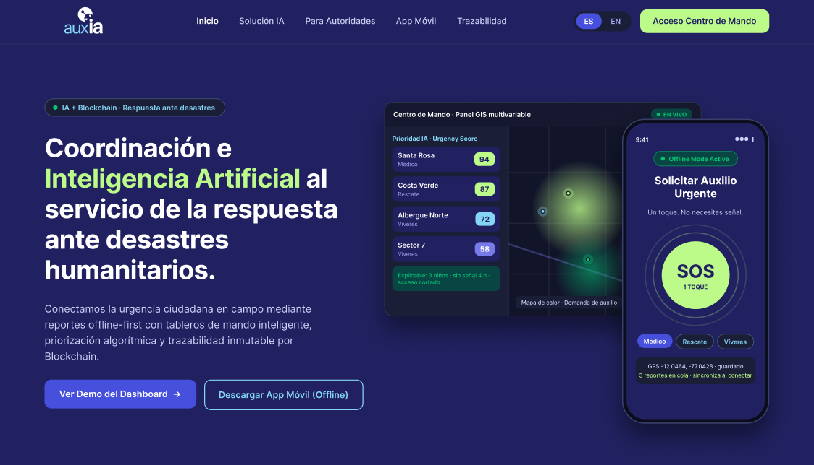
</p>

Este *mock-up* materializa la sección principal de la *landing page* aplicando el *Design System* en modo oscuro. La cabecera integra el logotipo institucional de AuxIA, navegación estructurada, selector de idioma (ES/EN) y un botón destacado de alto contraste (*Acceso Centro de Mando*) en verde lima. El *Hero* combina una tipografía de gran escala con acentos en verde para resaltar las tecnologías clave (IA y Blockchain), acompañado de dos llamadas a la acción (*CTAs*) primarias. En el costado derecho, una composición flotante contrapone la interfaz del centro de mando GIS con la app móvil en modo *offline* ("SOS 1 Toque"), evidenciando visualmente la integración multinivel entre el ciudadano en campo y las autoridades.

#### Mockup 2: Indicadores de Impacto y Módulos Clave

<p align="center">
  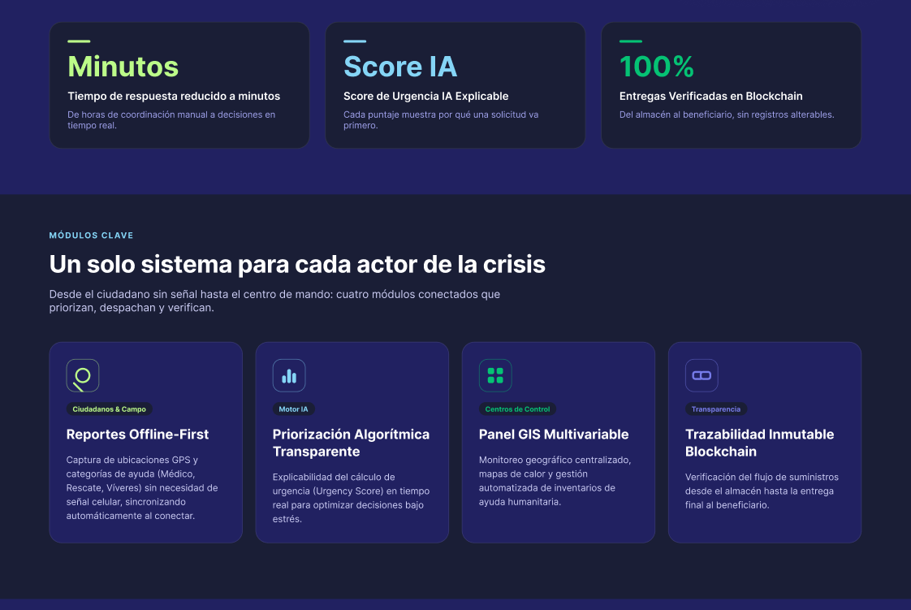
</p>

Esta vista presenta los componentes de validación técnica y propuesta funcional del sistema. La cinta superior destaca tres indicadores métricos esenciales (reducción de tiempos a minutos, *Score* de Urgencia explicable y 100% de entregas verificadas) con acentos visuales en verde lima. La sección posterior organiza cuatro tarjetas modulares en retícula que representan las soluciones específicas para cada actor de la crisis (*Reportes Offline-First*, *Priorización Algorítmica*, *Panel GIS Multivariable* y *Trazabilidad Blockchain*), empleando etiquetas de categoría por rol e iconografía clara para facilitar el escaneo visual y la comprensión del producto.

#### Mockup 3: Flujo del Proceso (How it Works) y Banner Institucional

<p align="center">
  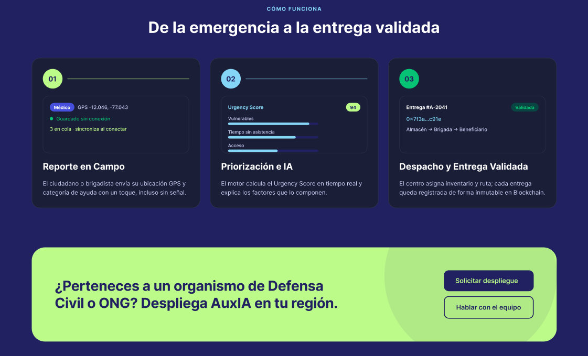
</p>

El *mock-up* ilustra la narrativa operacional de la plataforma dividida en tres fases secuenciales numeradas (*Reporte en Campo*, *Priorización e IA*, y *Despacho y Entrega Validada*), incorporando *previews* de la interfaz real en cada paso (coordenadas GPS, indicador de *Urgency Score* y código hash de validación). En la parte inferior, un banner promocional de alto impacto con fondo verde lima capta la atención de organismos de Defensa Civil y ONGs, ofreciendo botones directos de interacción (*Solicitar despliegue* y *Hablar con el equipo*) para impulsar la adopción institucional.

#### Mockup 4: Pie de Página (Footer)

<p align="center">
  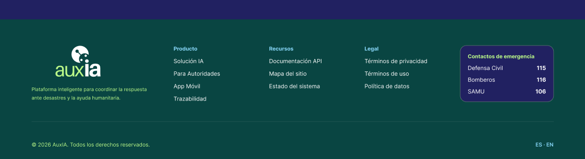
</p>

Este esquema de cierre consolida la estructura de navegación secundaria mediante columnas categóricas (*Producto*, *Recursos* y *Legal*) sobre un fondo azul/verde oscuro de tono sobrio. Aplicando principios de diseño inclusivo y utilidad operacional en situaciones de desastre, el pie de página integra un módulo de rápido acceso con las líneas telefónicas directas de emergencia nacional (Defensa Civil 115, Bomberos 116 y SAMU 106). Finalmente, la barra inferior incluye los derechos reservados y la conmutación de idioma, cerrando la experiencia de navegación con coherencia estética e institucional.

## 6.4. Applications UX/UI Design

### 6.4.1. Applications Wireframes

### Wireframes de la Web App

En esta sección se presentan los esquemas estructurales (*wireframes*) para el Centro de Mando Web de AuxIA, diseñados para validar la arquitectura de información, la densidad de datos y la navegación operacional de la plataforma. Esta estructura garantiza un flujo de trabajo enfocado en la toma de decisiones informadas para autoridades y coordinadores de emergencia, integrando análisis geográfico, gestión de suministros, coordinación de brigadas y trazabilidad inmutable mediante inteligencia artificial explicable y blockchain.

#### Wireframe 1: Dashboard Principal (Centro de Mando)

<p align="center">
  
</p>

Este *wireframe* presenta la pantalla de inicio operacional, estructurada para brindar un diagnóstico integral e inmediato de la crisis mediante cuatro indicadores métricos clave en la parte superior: solicitudes activas, casos críticos, brigadas desplegadas y nivel de verificación en blockchain. El área central combina un visor sintético del mapa GIS con mapas de calor y un panel en tiempo real con el feed de priorización por *Urgency Score*, complementado en la franja inferior por una tabla de trazabilidad de los despachos de ayuda más recientes.

#### Wireframe 2: Mapa GIS Multivariable

<p align="center">
  
</p>

Esta vista despliega el visor cartográfico a pantalla completa para el análisis territorial detallado de la emergencia, ofreciendo herramientas de dibujo y un panel flotante para controlar la opacidad y capas de datos como zonas de inundación, cobertura celular y posición GPS de brigadas. El esquema integra la agrupación interactiva de incidentes en *clusters* numéricos con ventanas emergentes que justifican la prioridad de la IA y permiten despachar recursos a la zona.

#### Wireframe 3: Bandeja de Priorización e IA Explicable

<p align="center">
  
</p>

El *wireframe* de priorización organiza la totalidad de las solicitudes en una tabla de alta densidad filtrable por rango de urgencia, estado de sincronización *offline* y tipo de asistencia requerida. Al seleccionar un registro, la interfaz despliega un *drawer* lateral de explicabilidad que transparenta la ponderación del *Urgency Score* y ofrece acciones para asignar brigadas o anular el puntaje con justificación.

#### Wireframe 4: Gestión de Inventario y Almacenes Humanitarios

<p align="center">
  
</p>

Esta interfaz concentra el control de insumos en centros de acopio, incorporando un banner superior de alertas preventivas por desabastecimiento próximo y tarjetas de estado de stock con indicadores visuales de nivel crítico. La vista estructura una bitácora detallada de movimientos de entrada y salida junto con una columna lateral de acciones rápidas para ejecutar el reabastecimiento de insumos.

#### Wireframe 5: Logística de Campo y Creador de Misiones

<p align="center">
  
</p>

Diseñado para la gestión operativa de personal en campo, este esquema presenta un panel izquierdo para monitorear el estado de las brigadas, un contenedor central interactivo ("Creador de Misiones") para estructurar hojas de ruta arrastrando solicitudes priorizadas, y un panel derecho con la ficha del equipo.

#### Wireframe 6: Auditoría y Trazabilidad Blockchain

<p align="center">
  
</p>

El *wireframe* del módulo *blockchain* establece la estructura de auditoría inmutable mediante un libro mayor (*ledger*) de transacciones en tiempo real, filtrable por código QR, ID de donante o *hash* criptográfico. La sección derecha muestra la ficha de trazabilidad paso a paso desde la donación en almacén hasta la entrega final al beneficiario validada con firma digital y coordenadas GPS.

---

### Wireframes de la Mobile App

En esta sección se presentan los esquemas estructurales (*wireframes*) para la aplicación móvil de AuxIA, diseñados para garantizar la usabilidad y operatividad en situaciones de desastre tanto para ciudadanos como para brigadistas en campo. La interfaz está optimizada para el funcionamiento *offline-first*, facilitando el reporte inmediato de emergencias, el seguimiento transparente de la asistencia, la gestión logística en terreno y la validación inmutable de entregas mediante blockchain.

#### Wireframe 1: Registro y Selección de Rol

<p align="center">
  
</p>

Es la primera pantalla de la app. El usuario ingresa su nombre y teléfono, y elige entre Ciudadano y Brigadista con tarjetas que resumen qué podrá hacer cada rol. El Brigadista indica que requiere aprobación del Centro de Mando.

#### Wireframe 2: Registro Brigadista · Credencial

<p align="center">
  
</p>

Solo la ve quien eligió Brigadista. Pide el organismo, el código de brigada y el escaneo del carnet institucional. Muestra el estado "Pendiente de aprobación", aclara que se valida al sincronizar aunque no haya señal, y lista qué podrá y qué no podrá hacer.

#### Wireframe 3: SOS 1-Toque (Ciudadano Offline)

<p align="center">
  
</p>

Es la pantalla principal del ciudadano. Tiene un botón SOS gigante con pulso, un banner de "Modo Offline Activo", tres categorías de ayuda (Médico, Rescate, Víveres) y el GPS con el contador de reportes en cola. Permite pedir auxilio en menos de dos segundos, sin señal.

#### Wireframe 4: Detalle de Emergencia

<p align="center">
  
</p>

Es un formulario opcional para dar más datos si hay tiempo. Incluye contadores de niños, adultos mayores y heridos, casillas de estado de acceso (vía bloqueada, sin agua), grabación de audio de 5 s y foto rápida. El botón final guarda y envía todo.

#### Wireframe 5: Estado y Cola de Sincronización

<p align="center">
  
</p>

Muestra al ciudadano qué pasó con cada reporte. Cada uno avanza por cuatro pasos: guardado, transmitiendo, priorizado por IA (con su Urgency Score) y brigada en camino. Arriba muestra los canales de red disponibles y el botón "Forzar reintento de sincronización".

#### Wireframe 6: Configuración de Red y Almacenamiento (Ciudadano)

<p align="center">
  
</p>

Permite descargar mapas offline por región, ver el espacio usado y revisar el estado de la base de datos local. También muestra el perfil con su etiqueta de rol y un botón para sincronizar manualmente.

#### Wireframe 7: Brigadista · Misiones y Mapa

<p align="center">
  
</p>

Es el tablero del rescatista. Tiene un mapa simplificado con marcadores numerados según el Urgency Score y la ruta de navegación, y debajo las tarjetas de misión con ubicación, vulnerables y el botón "Iniciar navegación". Solo ve las misiones que le asignó el Centro de Mando.

#### Wireframe 8: Brigadista · Verificación y Entrega Blockchain

<p align="center">
  
</p>

Sirve para confirmar la entrega física de la ayuda. El brigadista escanea el QR del paquete, captura la firma del beneficiario y una foto de recepción. Al final aparece el sello "Validado e Inmutable en Blockchain" con un hash.

#### Wireframe 9: Configuración de Red y Almacenamiento (Brigadista)

<p align="center">
  
</p>

Es la versión de campo de Configuración. Muestra los mapas de la zona asignada, las misiones locales, las evidencias por subir y las transacciones Blockchain en cola. Tiene sus propias pestañas: Misiones, Entrega y Ajustes.

### 6.4.2. Applications Wireflow Diagrams

#### Segmento 1: Ciudadano / Población Afectada

***User Goal*** <br>
Como ciudadano afectado por un desastre, quiero solicitar auxilio urgente aun sin señal de red y monitorear el estado de la ayuda para saber que mi pedido fue recibido y que una brigada va en camino.

**Task flow:**
<p align="center">
  
</p>


**Wireflow:**
<p align="center">
  
</p>

Para solicitar auxilio con AuxIA, la persona afectada abre la aplicación y selecciona el rol Ciudadano en la pantalla de Registro y Selección de Rol (A_01). El sistema la lleva a la pantalla de Configuración de Red y Almacenamiento (A_06), donde descarga mapas y base de datos local mientras aún pueda hacerlo, lo que habilita el funcionamiento posterior sin conectividad. Desde allí accede a la pantalla SOS 1-Toque (A_03), que muestra el botón de emergencia, las categorías y el estado del GPS. Con un solo toque sobre SOS y la selección de la categoría, el reporte queda listo para enviarse en menos de 2 segundos.

En este punto el sistema ofrece dos caminos. La persona puede enviar solo el SOS, o puede agregar detalle en la pantalla Detalle de Emergencia (A_04), donde indica presencia de personas vulnerables, estado de las vías, un audio de 5 segundos y una foto. Ambos caminos convergen en la pantalla Estado y Cola de Sincronización (A_05), que muestra primero el estado Guardado local, persistido en SQLite. Si no hay enlace Mesh o satélite, el reporte permanece en cola con reintentos automáticos. Cuando el enlace está disponible, la pantalla cambia a Transmitiendo, luego a Priorizado por IA al recibir la confirmación del centro, y finalmente a Brigada en camino cuando se asigna una brigada. Cada paso es un estado distinto de la misma pantalla, lo que da a la persona una señal verificable de que su pedido no se perdió.

#### Segmento 2: Institucional y de Respuesta

***User Goal para Brigadista***<br>
Como brigadista de campo, quiero recibir mi credencial, consultar mis misiones priorizadas y registrar entregas verificadas en blockchain para operar sin conexión y dejar evidencia inmutable de cada ayuda entregada.

**Task flow:**
<p align="center">
  
</p>


**Wireflow:**
<p align="center">
  
</p>

El brigadista abre la aplicación y selecciona el rol Brigadista en A_01, lo que lo dirige al Registro Brigadista · Credencial (A_02). Allí envía su credencial y la pantalla pasa al estado Pendiente de aprobación, donde permanece hasta que la institución la valide; la credencial queda disponible sin conexión. Una vez aprobada, accede a Configuración de Red y Almacenamiento del brigadista (A_09) para ajustar mapas y datos locales antes de salir a terreno.

Desde allí entra a Misiones y Mapa (A_07), que en su primer estado lista las misiones con su Urgency Score. Al tocar una tarjeta, la pantalla cambia al estado Misión activa con ruta, que muestra el trayecto hacia el destino. Al llegar, toca "Verificar entrega" y pasa a Verificación y Entrega Blockchain (A_08), que evoluciona por tres estados: escaneo del código QR del paquete, captura de firma y foto, y finalmente Hash 0x confirmado. Separar estos estados impide confirmar una entrega sin evidencia completa. Al terminar, A_07 vuelve a mostrarse con la misión como completada.


### 6.4.3. Applications Mock-ups

### Mockups de la Web App

Los mockups de la Web App (Centro de Mando) traducen los wireframes estructurales a una interfaz de alta fidelidad visual integrando la paleta de colores oficial, diseñada específicamente para optimizar la toma de decisiones críticas en tiempo real. La aplicación cromática utiliza fondos neutros de alto contraste para reducir la fatiga visual en pantallas de monitoreo continuo, combinados con códigos de color de emergencia (Rojo Coral para incidentes críticos con alto Urgency Score, alertas de desabastecimiento y la Alarma General; Verde Lima para acciones principales y scores destacados; y Verde Esmeralda para brigadas desplegadas, stock en nivel seguro o transacciones validadas en blockchain). Esta jerarquía cromática resalta de forma intuitiva los indicadores métricos, los mapas de calor GIS y las ventanas de explicabilidad de IA sin saturar la atención del operador.

#### Mockup 1: Dashboard Principal (Centro de Mando)

<p align="center">
  
</p>

La vista de inicio muestra la crisis activa en la barra lateral y cuatro indicadores en la parte superior: solicitudes activas, casos críticos con score mayor a 85, brigadas desplegadas y porcentaje de suministros validados en Blockchain. El mapa de calor con capas de zonas inundadas, cobertura y brigadas GPS convive con el panel de Priorización IA, donde cada caso explica "por qué esta prioridad" y ofrece el botón "Asignar Brigada". La tabla inferior resume los últimos despachos con su hash de transacción y su estado (Validado o En camino).

#### Mockup 2: Mapa GIS Multivariable

<p align="center">
  
</p>

El mapa ocupa toda el área de trabajo. Un panel flotante activa o desactiva las capas (mapa de calor de solicitudes, zonas inundadas o bloqueadas, cobertura celular y brigadas GPS) y regula su opacidad, y la barra superior ofrece herramientas de dibujo y medición. Las solicitudes se agrupan en clusters numerados; al seleccionar uno se abre una ficha con su score, el motivo de la prioridad, el tipo de ayuda, el canal y las coordenadas, junto con las acciones "Asignar Brigada" y "Ver detalle". La leyenda inferior traduce la escala cromática de demanda baja a crítica.

#### Mockup 3: Bandeja de Priorización e IA Explicable

<p align="center">
  
</p>

La bandeja lista las solicitudes ordenadas por Urgency Score, con búsqueda, filtro por rango de score y pestañas para todas, críticas, offline sin sincronizar y asignadas. Al seleccionar una solicitud se abre un panel lateral de explicabilidad que descompone el puntaje en sus variables (presencia de menores, tiempo sin señal, aislamiento y tiempo sin atención) y muestra los datos del reporte. Desde ese panel la autoridad puede asignar una brigada o anular el score con justificación.

#### Mockup 4: Gestión de Inventario y Almacenes Humanitarios

<p align="center">
  
</p>

La pantalla muestra la disponibilidad de suministros del almacén seleccionado. Un banner en Rojo Coral anticipa el próximo desabastecimiento y cuatro tarjetas presentan el stock de cada recurso con su nivel frente al mínimo seguro y una etiqueta de estado (Crítico, Bajo u OK). Debajo se ubican la bitácora de movimientos de entrada y salida con su origen o destino, y el panel de alertas de desabastecimiento con la acción "Reabastecer". Los botones superiores registran entradas y salidas de inventario.

#### Mockup 5: Logística de Campo y Creador de Misiones

<p align="center">
  
</p>

La vista se divide en tres columnas. A la izquierda, las brigadas activas con su estado (En Ruta, En Atención, En Almacén o Standby). Al centro, el Creador de Misiones, donde las solicitudes priorizadas se arrastran a la hoja de ruta de la brigada con su tiempo y distancia estimados. A la derecha, la ficha de la brigada con sus miembros y roles, el vehículo asignado y el canal directo de comunicación. Las acciones "Despachar brigada" y "Guardar borrador" cierran la planificación.

#### Mockup 6: Auditoría y Trazabilidad Blockchain

<p align="center">
  
</p>

El ledger en tiempo real lista cada transacción con su hash, tipo (donación, despacho o entrega), origen y destino, hora y estado, y puede filtrarse por hash, ID de donante o código QR. Al seleccionar una transacción, la ficha de trazabilidad muestra paso a paso el recorrido del suministro, desde la donación hasta la verificación de entrega, con la firma del beneficiario, las coordenadas GPS y el código QR del paquete. El auditor puede descargar la ficha en PDF o exportar un informe de auditoría pública.

---

### Mockups de la Mobile App

Los mockups de la Mobile App aplican la misma identidad visual en un diseño ergonómico y simplificado, pensado para su lectura rápida en condiciones extremas de campo (como luz solar directa o baja visibilidad). La paleta cromática enfatiza el botón SOS de 1-Toque con un tono de alerta vibrante y un patrón de pulso visual que guía al ciudadano en momentos de pánico, mientras que utiliza distintivos cromáticos diferenciados para etiquetar los roles (Ciudadano vs. Brigadista), los canales de sincronización offline (Mesh, Satelital, Celular) y el sello inmutable de verificación blockchain. Esto permite que tanto el usuario afectado como el rescatista identifiquen el estado de cada reporte y misión de un solo vistazo.

Los mockups siguen la numeración de los wireframes de la sección 6.4.1 (A_01 a A_09), que es la que usan los wireflows y user flows.

<table align="center">
<tr>
<td align="center"><br><b>A_01. Registro y Selección de Rol</b></td>
<td align="center"><br><b>A_02. Registro Brigadista · Credencial</b></td>
<td align="center"><br><b>A_03. SOS 1-Toque (Ciudadano)</b></td>
</tr>
<tr>
<td align="center"><br><b>A_04. Detalle de Emergencia</b></td>
<td align="center"><br><b>A_05. Estado y Cola de Sincronización</b></td>
<td align="center"><br><b>A_06. Red y Almacenamiento (Ciudadano)</b></td>
</tr>
<tr>
<td align="center"><br><b>A_07. Brigadista · Misiones y Mapa</b></td>
<td align="center"><br><b>A_08. Brigadista · Verificación y Entrega</b></td>
<td align="center"><br><b>A_09. Red y Almacenamiento (Brigadista)</b></td>
</tr>
</table>

### 6.4.4 Applications User Flow Diagrams

#### Segmento 1: Ciudadano / Población Afectada
**Contexto del User Persona (Carla Quispe):** Ella es una estudiante de 20 años que vive en Chosica con su familia, una zona altamente expuesta a huaicos e inundaciones. En situaciones de crisis opera bajo alta incertidumbre y baja conectividad. Necesita una herramienta móvil simple que funcione con mala señal para solicitar auxilio en segundos, confirmar que su zona fue considerada para la ayuda y recibir información oficial clara que reduzca la angustia de su familia frente a rumores de redes sociales.

***User Goal*** <br>
Como ciudadano en una zona de riesgo, quiero configurar la red y el almacenamiento de mi dispositivo, y verificar la cola de sincronización, para asegurarme de que la aplicación funcione sin conexión cuando ocurra una emergencia.

**Task flow:**
<p align="center">
  
</p>


**Userflow:**
<p align="center">
  
</p>

Para preparar la aplicación antes de perder la conectividad, la persona accede desde la pantalla SOS 1-Toque (A_03) a la sección de Configuración de Red y Almacenamiento (A_06). Allí revisa los ajustes de comunicación Mesh y satélite, que son los canales alternativos que usará la app cuando no haya señal celular. Luego descarga los mapas y la base de datos local, de modo que la navegación y el registro de reportes funcionen sin Internet.

El sistema evalúa si el dispositivo tiene espacio suficiente. Si no lo tiene, la pantalla permanece en el estado de descarga hasta que la persona libere espacio. Si lo tiene, A_06 pasa al estado Configuración guardada y la persona vuelve a A_03, donde confirma que el botón SOS está listo y el GPS fijo.

Como verificación final, entra al Estado y Cola de Sincronización (A_05) para comprobar si quedan reportes pendientes. Si los hay, la pantalla pasa al estado Reintento de envío, que intenta transmitirlos apenas haya enlace. Si no los hay, el dispositivo queda listo para operar sin conexión.


#### Segmento 2: Institucional y de Respuesta
**Contexto del User Persona (Luis Salazar):** Él es un ingeniero civil y autoridad responsable de coordinar la atención de emergencias en Lima. Trabaja bajo la presión de actuar rápido mientras gestiona información dispersa (WhatsApp, Excel, radio). Necesita una plataforma centralizada que le permita priorizar sectores según vulnerabilidad y aislamiento, coordinar brigadas de campo sin duplicar beneficiarios y generar evidencia inmutable (fotos geolocalizadas, trazabilidad) lista para auditorías.

***User Goal para Coordinador***<br>
Como Comandante de Operaciones del Centro de Mando, quiero analizar los incidentes en el mapa GIS, revisar la priorización explicable de la IA y despachar brigadas para asignar recursos con una decisión justificada y rápida.

**Task flow:**
<p align="center">
  
</p>


**Userflow:**
<p align="center">
  
</p>

El Comandante ingresa al Dashboard Principal (W_01) y abre una alerta crítica, lo que lo lleva al Mapa GIS Multivariable (W_02). Allí, con las capas activas, selecciona un cluster de incidentes y la pantalla cambia al estado Cluster seleccionado, que habilita el acceso a la Bandeja de Priorización e IA Explicable (W_03). La bandeja ordena los incidentes por Urgency Score; al abrir uno, el estado Justificación IA abierta muestra las razones de la puntuación, de modo que el coordinador puede auditar el criterio antes de decidir.

Si no valida la prioridad, la ajusta y permanece en la bandeja. Si la valida, selecciona "Crear misión" y pasa a Logística de Campo y Creador de Misiones (W_05), que evoluciona por tres estados: Misión en borrador, Brigada asignada y Misión despachada. El despacho actualiza los indicadores del Dashboard (W_01) y entrega la misión a la aplicación móvil del brigadista (A_07), cerrando el ciclo entre ambas aplicaciones.

---

***User Goal para Auditor***<br>
Como auditor o coordinador del Centro de Mando, quiero monitorear el inventario de los almacenes y verificar la trazabilidad de los insumos en blockchain para detectar desabastecimiento y garantizar que la ayuda entregada sea inalterable.

**Task flow:**
<p align="center">
  
</p>


**Userflow:**
<p align="center">
  
</p>

Desde el Dashboard (W_01), el auditor entra al menú Inventario y llega a Gestión de Inventario y Almacenes Humanitarios (W_04), que muestra el stock por almacén. Cuando un insumo cruza el umbral definido, la pantalla pasa al estado Alerta de stock crítico, y al seleccionar el almacén afectado muestra el Detalle del almacén. Desde allí, la opción "Ver trazabilidad" lo lleva a Auditoría y Trazabilidad Blockchain (W_06), donde el ledger lista las transacciones y la ficha de paquete expone el historial de cada insumo.

Al verificar el hash del paquete contra el ledger, el sistema bifurca el flujo. Si coincide, la pantalla muestra Integridad verificada y el auditor puede exportar el informe. Si no coincide, muestra Alerta de manipulación y la acción pasa a ser escalar la incidencia. Ambos caminos terminan en un informe de auditoría.


## 6.5. Applications Prototyping

