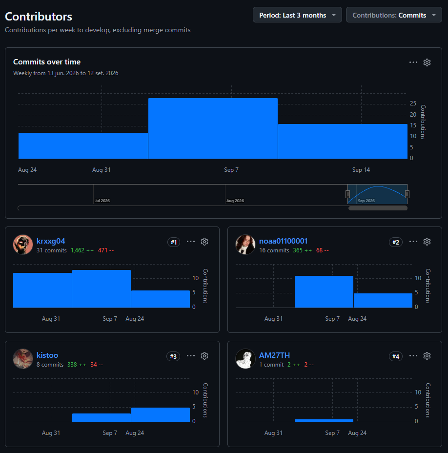
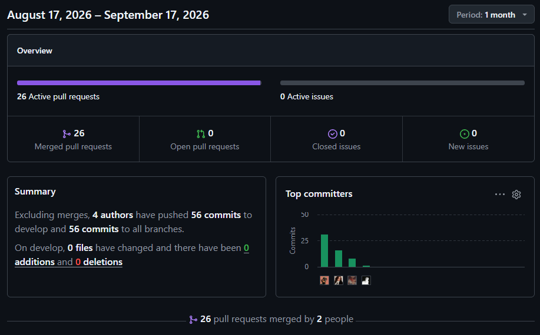
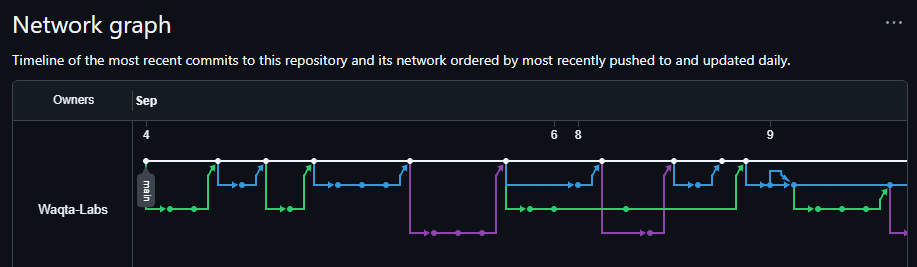
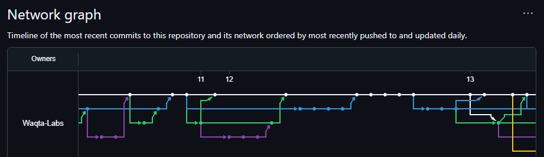
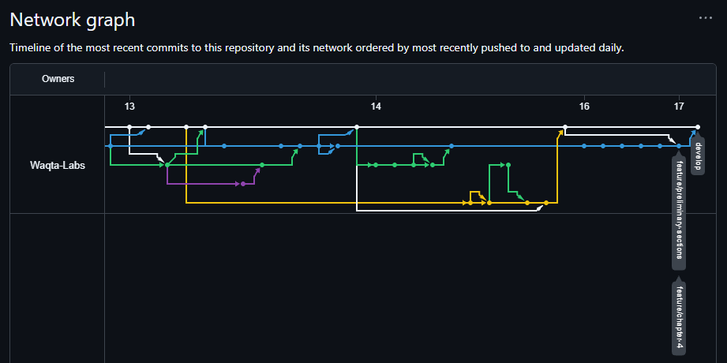

# Registro de Versiones del Informe

| Versión | Fecha      | Autor          | Descripción de modificación                                                                                                                    |
|---------|------------|----------------|------------------------------------------------------------------------------------------------------------------------------------------------|
| 0.0.1   | 04/09/2026 | Iker Barturen  | Estructuración inicial del informe de proyecto (carátula, registro de versiones, contenido, Student Outcome y estructura modular de los Capítulos I al VII y conclusiones). |
| 0.0.2   | 04/09/2026 | Iker Barturen  | Depuración de los Capítulos I al VII y Conclusiones, dejando únicamente la jerarquía de encabezados exigida por el Statement.                  |
| 0.0.3   | 04/09/2026 | Iker Barturen  | Configuración de la carátula con los datos del curso, docente, startup (Waqta Labs) y producto (Auxilio Inteligente - AuxIA).                  |
| 0.0.4   | 04/09/2026 | Iker Barturen  | Corrección de enlaces internos en README.md, content.md y outcome.md tras eliminar archivos no utilizados.                                     |
| 0.0.5   | 04/09/2026 | Iker Barturen  | Adaptación de la sección 1.1 Startup Profile, incluye descripción de la startup y perfiles de los integrantes del equipo.                      |
| 0.0.6   | 04/09/2026 | Iker Barturen  | Adaptación de la sección 1.2.1 Antecedentes y Problemática, incluye aplicación de la técnica 5W + 2H, enunciado del problema, objetivos y restricciones. |
| 0.0.7   | 04/09/2026 | Iker Barturen  | Adaptación de la sección 1.3 Segmentos Objetivo, incluye descripción de los segmentos de ciudadanos afectados y autoridades responsables.      |
| 0.0.8   | 04/09/2026 | Iker Barturen  | Adaptación de la sección 1.2.2 Lean UX Process, incluye Problem Statements, Assumptions e Hypothesis Statements.                               |
| 0.0.9   | 04/09/2026 | Iker Barturen  | Adaptación de la sección 1.2.2.4 Lean UX Canvas, incluye elaboración y documentación del canvas en Figma.                                      |
| 0.0.10  | 08/09/2026 | Iker Barturen  | Corrección del Capítulo I según feedback: ampliación de 5W + 2H, problem statement en forma de pregunta, objetivos, restricciones y sustento estadístico. |
| 0.0.11  | 09/09/2026 | Iker Barturen  | Registro de entrevistas y ajuste de visualización de fotografías de integrantes del equipo.                                    |
| 0.0.12  | 09/09/2026 | Iker Barturen  | Incorporación de User Personas y User Task Matrix para los segmentos objetivo del Capítulo II.                                                |
| 0.0.13  | 09/09/2026 | Iker Barturen  | Incorporación de Empathy Mapping para los User Personas de los segmentos objetivo del Capítulo II.                                            |
| 0.0.14  | 09/09/2026 | Iker Barturen  | Incorporación de la sección 2.1 Competidores del Capítulo II: Competitive Analysis Landscape (Overview, Perfil de Marketing, Perfil de Producto, Análisis SWOT) de AuxIA frente a INDECI, Sahana Eden y WFP Building Blocks, con logos y estrategias de diferenciación. |
| 0.0.15  | 12/09/2026 | Iker Barturen  | Incorporación de la sección As-Is Scenario Mapping para los User Personas de los segmentos objetivo del Capítulo II.                    |
| 0.0.16  | 12/09/2026 | Iker Barturen  | Incorporación de la sección 2.4 Ubiquitous Language del Capítulo II, con los términos y definiciones del dominio de AuxIA.             |
| 0.0.17  | 12/09/2026 | Iker Barturen  | Creación del archivo Bibliografía y Anexos, trasladando las referencias bibliográficas desde Conclusiones y enlazándolo en el Contenido. |
| 0.0.18  | 12/09/2026 | Iker Barturen  | Incorporación de los enlaces de Figma (Lean UX Canvas, As-Is Scenario Map) y UXPressia (Needfinding) en los Capítulos I y II, y en Anexos. |
| 0.0.19  | 13/09/2026 | Iker Barturen  | Incorporación de la sección 3.2 User Stories del Capítulo III, incluyendo epics e historias para landing page, aplicación web, aplicación móvil y servicios web de AuxIA. |
| 0.0.20  | 14/09/2026 | Iker Barturen  | Desarrollo de las secciones 4.1.1 Design Purpose y 4.1.2.1 Primary Functionality / Primary User Stories del Capítulo IV, alineadas con el proceso de Attribute-Driven Design de AuxIA. |
| 0.0.21  | 14/09/2026 | Iker Barturen  | Incorporación de las secciones 4.1.2.2 Quality Attribute Scenarios y 4.1.2.3 Constraints del Capítulo IV, con escenarios medibles y restricciones técnicas para AuxIA. |
| 0.0.22  | 14/09/2026 | Iker Barturen  | Ajuste de la tabla 4.1.2.1 Primary Functionality / Primary User Stories, incorporando criterios de aceptación para las Epics y relación consistente con sus Epic ID. |
| 0.0.23  | 14/09/2026 | Iker Barturen  | Desarrollo de las secciones 4.1.3 Architectural Drivers Backlog y 4.1.4 Architectural Design Decisions del Capítulo IV, incluyendo drivers funcionales, atributos de calidad, constraints y matriz de patrones candidatos. |
| 0.0.24  | 14/09/2026 | Iker Barturen  | Incorporación de la sección 2.2.3 Análisis de entrevistas, depuración de entrevistas pendientes en el registro y corrección de enlaces de Anexos (Miro) para As-Is y To-Be Scenario Mapping. |
| 0.0.25  | 17/09/2026 | Iker Barturen  | Incorporación de la sección Project Report Collaboration Insights, reestructuración de la tabla de contenido a 4 niveles y desarrollo del Student Outcome para la entrega TB1. |
| 0.0.26  | 17/09/2026 | Iker Barturen  | Avance de Conclusiones y recomendaciones para la entrega TB1, y corrección de formato en Bibliografía y Anexos (viñetas y anexo lettered). |
| 0.0.27  | 17/09/2026 | Ainhoa Castillo | Revisión y ajuste del registro de entrevistas del segmento ciudadanos afectados y de los User Personas del Capítulo II, incorporando correcciones de redacción. |
| 0.0.28  | 17/09/2026 | Tomio Nakamurakare | Revisión y ajuste del registro de entrevistas del segmento autoridades responsables, y de las User Stories / Technical Stories del Capítulo III. |
| 0.0.30  | 18/09/2026 | Alex Trillo    | Incorporación de las secciones 4.2 Strategic-Level Domain-Driven Design (EventStorming, Candidate Context Discovery, Domain Message Flow Modeling, Bounded Context Canvases, Context Mapping) y 4.3 Software Architecture (System Landscape, Context Level, Container Level, Deployment Diagrams con imágenes C4/Structurizr) del Capítulo IV. |
| 0.0.29  | 17/09/2026 | Anghel Trillo | Revisión y ajuste de la sección 2.1 Competidores del Capítulo II y de las secciones 3.3 Impact Mapping y 3.4 Product Backlog del Capítulo III. |

## Project Report Collaboration Insights

**Repositorio del Project Report:** https://github.com/Waqta-Labs/ase-report

Para esta primera entrega (TB1), la elaboración del informe se organizó siguiendo GitFlow: cada sección o subsección se desarrolló en una rama `feature/*` propia (por ejemplo, `feature/chapter1-startup-profile`, `feature/chapter2-interview-analysis`, `feature/chapter3-user-stories`, `feature/chapter4-attribute-driven-design`), integrada mediante Pull Request hacia `develop` una vez revisada. Los mensajes de commit siguen Conventional Commits (`docs:`, `feat:`, `fix:`, `style:`), lo que permite identificar el tipo de cambio realizado en cada aporte. Los cuatro integrantes del equipo registraron commits propios en el repositorio del informe durante este periodo.

A continuación se presentan las capturas de los analíticos de colaboración de GitHub para el repositorio del informe, correspondientes al periodo de la entrega TB1.

**Contributors:** distribución de commits por integrante sobre la rama `develop`.

**Pulse:** resumen de actividad del repositorio durante el último mes, incluyendo pull requests fusionados y los principales autores de commits.

**Network graph:** línea de tiempo de los commits más recientes y sus ramas asociadas, ordenados por fecha de actualización.

