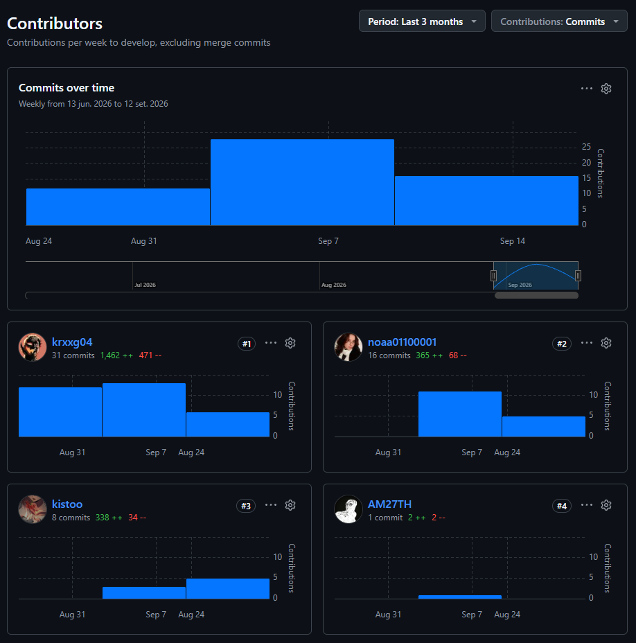
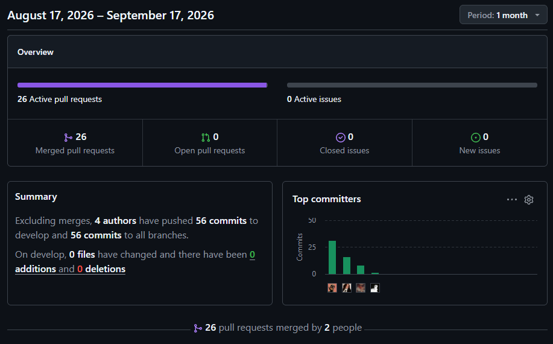
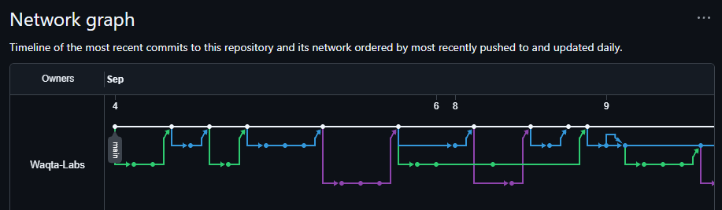
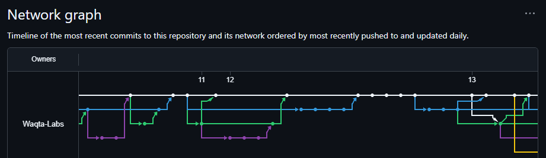
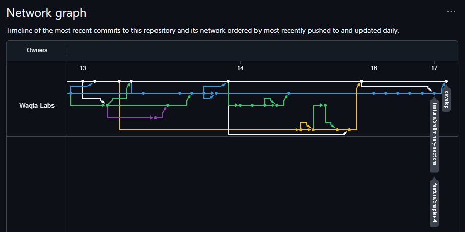
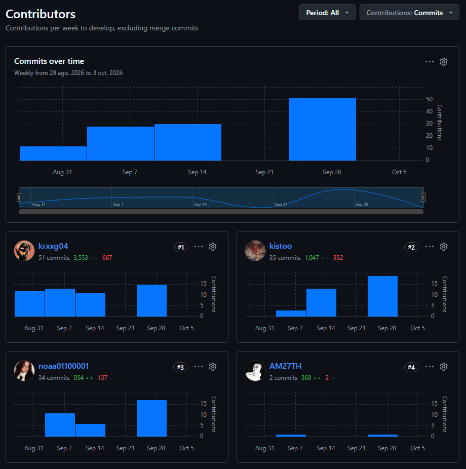
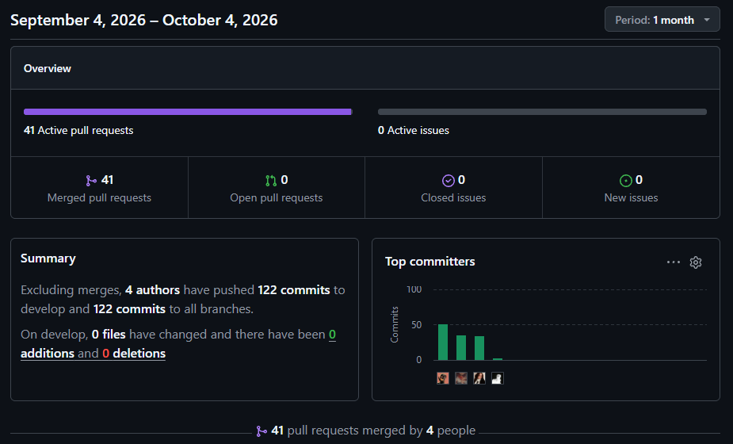
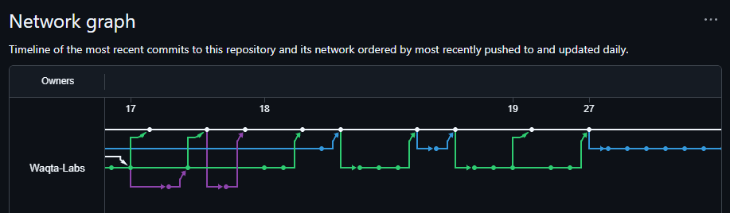
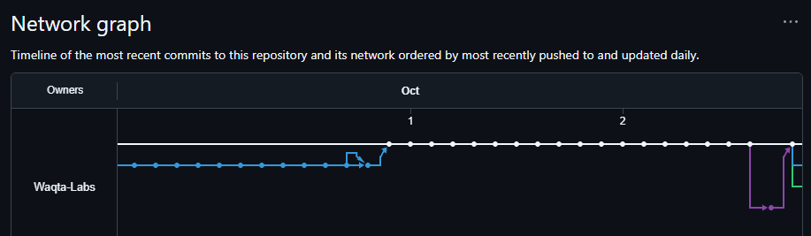
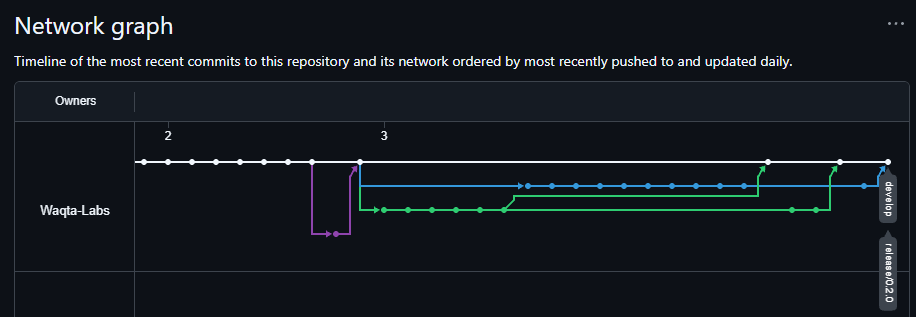

# Registro de Versiones del Informe

| Versión | Fecha      | Autor          | Descripción de modificación                                                                                                                    |
|---------|------------|----------------|------------------------------------------------------------------------------------------------------------------------------------------------|
| 0.0.1   | 04/09/2026 | Iker Barturen  | Estructuración inicial del informe de proyecto (carátula, registro de versiones, contenido, Student Outcome y estructura modular de los Capítulos I al VII y conclusiones). |
| 0.0.2   | 04/09/2026 | Iker Barturen  | Depuración de los Capítulos I al VII y Conclusiones, dejando únicamente la jerarquía de encabezados exigida por el Statement.                  |
| 0.0.3   | 04/09/2026 | Iker Barturen  | Configuración de la carátula con los datos del curso, docente, startup (Waqta Labs) y producto (Auxilio Inteligente - AuxIA).                  |
| 0.0.4   | 04/09/2026 | Iker Barturen  | Corrección de enlaces internos en README.md, content.md y outcome.md tras eliminar archivos no utilizados.                                     |
| 0.0.5   | 04/09/2026 | Iker Barturen  | Adaptación de la sección 1.1 Startup Profile, incluye descripción de la startup y perfiles de los integrantes del equipo.                      |
| 0.0.6   | 04/09/2026 | Iker Barturen  | Adaptación de la sección 1.2.1 Antecedentes y Problemática, incluye aplicación de la técnica 5W + 2H, enunciado del problema, objetivos y restricciones. |
| 0.0.7   | 04/09/2026 | Iker Barturen  | Adaptación de la sección 1.3 Segmentos Objetivo, incluye descripción de los segmentos de ciudadanos afectados y autoridades responsables.      |
| 0.0.8   | 04/09/2026 | Iker Barturen  | Adaptación de la sección 1.2.2 Lean UX Process, incluye Problem Statements, Assumptions e Hypothesis Statements.                               |
| 0.0.9   | 04/09/2026 | Iker Barturen  | Adaptación de la sección 1.2.2.4 Lean UX Canvas, incluye elaboración y documentación del canvas en Figma.                                      |
| 0.0.10  | 08/09/2026 | Iker Barturen  | Corrección del Capítulo I según feedback: ampliación de 5W + 2H, problem statement en forma de pregunta, objetivos, restricciones y sustento estadístico. |
| 0.0.11  | 09/09/2026 | Iker Barturen  | Registro de entrevistas y ajuste de visualización de fotografías de integrantes del equipo.                                    |
| 0.0.12  | 09/09/2026 | Iker Barturen  | Incorporación de User Personas y User Task Matrix para los segmentos objetivo del Capítulo II.                                                |
| 0.0.13  | 09/09/2026 | Iker Barturen  | Incorporación de Empathy Mapping para los User Personas de los segmentos objetivo del Capítulo II.                                            |
| 0.0.14  | 09/09/2026 | Iker Barturen  | Incorporación de la sección 2.1 Competidores del Capítulo II: Competitive Analysis Landscape (Overview, Perfil de Marketing, Perfil de Producto, Análisis SWOT) de AuxIA frente a INDECI, Sahana Eden y WFP Building Blocks, con logos y estrategias de diferenciación. |
| 0.0.15  | 12/09/2026 | Iker Barturen  | Incorporación de la sección As-Is Scenario Mapping para los User Personas de los segmentos objetivo del Capítulo II.                    |
| 0.0.16  | 12/09/2026 | Iker Barturen  | Incorporación de la sección 2.4 Ubiquitous Language del Capítulo II, con los términos y definiciones del dominio de AuxIA.             |
| 0.0.17  | 12/09/2026 | Iker Barturen  | Creación del archivo Bibliografía y Anexos, trasladando las referencias bibliográficas desde Conclusiones y enlazándolo en el Contenido. |
| 0.0.18  | 12/09/2026 | Iker Barturen  | Incorporación de los enlaces de Figma (Lean UX Canvas, As-Is Scenario Map) y UXPressia (Needfinding) en los Capítulos I y II, y en Anexos. |
| 0.0.19  | 13/09/2026 | Iker Barturen  | Incorporación de la sección 3.2 User Stories del Capítulo III, incluyendo epics e historias para landing page, aplicación web, aplicación móvil y servicios web de AuxIA. |
| 0.0.20  | 14/09/2026 | Iker Barturen  | Desarrollo de las secciones 4.1.1 Design Purpose y 4.1.2.1 Primary Functionality / Primary User Stories del Capítulo IV, alineadas con el proceso de Attribute-Driven Design de AuxIA. |
| 0.0.21  | 14/09/2026 | Iker Barturen  | Incorporación de las secciones 4.1.2.2 Quality Attribute Scenarios y 4.1.2.3 Constraints del Capítulo IV, con escenarios medibles y restricciones técnicas para AuxIA. |
| 0.0.22  | 14/09/2026 | Iker Barturen  | Ajuste de la tabla 4.1.2.1 Primary Functionality / Primary User Stories, incorporando criterios de aceptación para las Epics y relación consistente con sus Epic ID. |
| 0.0.23  | 14/09/2026 | Iker Barturen  | Desarrollo de las secciones 4.1.3 Architectural Drivers Backlog y 4.1.4 Architectural Design Decisions del Capítulo IV, incluyendo drivers funcionales, atributos de calidad, constraints y matriz de patrones candidatos. |
| 0.0.24  | 14/09/2026 | Iker Barturen  | Incorporación de la sección 2.2.3 Análisis de entrevistas, depuración de entrevistas pendientes en el registro y corrección de enlaces de Anexos (Miro) para As-Is y To-Be Scenario Mapping. |
| 0.0.25  | 17/09/2026 | Iker Barturen  | Incorporación de la sección Project Report Collaboration Insights, reestructuración de la tabla de contenido a 4 niveles y desarrollo del Student Outcome para la entrega TB1. |
| 0.0.26  | 17/09/2026 | Iker Barturen  | Avance de Conclusiones y recomendaciones para la entrega TB1, y corrección de formato en Bibliografía y Anexos (viñetas y anexo lettered). |
| 0.0.27  | 17/09/2026 | Ainhoa Castillo | Revisión y ajuste del registro de entrevistas del segmento ciudadanos afectados y de los User Personas del Capítulo II, incorporando correcciones de redacción. |
| 0.0.28  | 17/09/2026 | Tomio Nakamurakare | Revisión y ajuste del registro de entrevistas del segmento autoridades responsables, y de las User Stories / Technical Stories del Capítulo III. |
| 0.0.29  | 17/09/2026 | Anghel Trillo | Revisión y ajuste de la sección 2.1 Competidores del Capítulo II y de las secciones 3.3 Impact Mapping y 3.4 Product Backlog del Capítulo III. |
| 0.0.30  | 17/09/2026 | Iker Barturen  | Incorporación del enlace y timing de las Entrevistas 1 registradas para ambos segmentos objetivo en la sección 2.2.2 del Capítulo II. |
| 0.0.31  | 18/09/2026 | Iker Barturen  | Ajustes de formato para exportación a PDF (release 0.1.0): carátula centrada con logo local, tabla de Student Outcome y tablas con saltos de línea de los Capítulos III y IV convertidas a HTML para renderizar correctamente en Typora. |
| 0.0.32  | 18/09/2026 | Alex Trillo    | Incorporación de las secciones 4.2 Strategic-Level Domain-Driven Design (EventStorming, Candidate Context Discovery, Domain Message Flow Modeling, Bounded Context Canvases, Context Mapping) y 4.3 Software Architecture (System Landscape, Context Level, Container Level, Deployment Diagrams con imágenes C4/Structurizr) del Capítulo IV. |
| 0.0.33  | 18/09/2026 | Alex Trillo    | Incorporación de la sección 4.1.5 Quality Attribute Scenario Refinements (5 refinamientos: Score de Urgencia, Entrega+Blockchain, Distribución+Inventario, Transparencia Pública, Identidad/Acceso) con formato tabular completo. |
| 0.0.34  | 18/09/2026 | Tomio Nakamurakare | Revisión de consistencia de nomenclatura entre las Epics y las User Stories del Capítulo III previa a la entrega TB1. |
| 0.0.35  | 18/09/2026 | Tomio Nakamurakare | Verificación de los enlaces públicos citados en Anexos (Figma, UXPressia, Miro) para confirmar accesibilidad antes de la entrega. |
| 0.0.36  | 18/09/2026 | Tomio Nakamurakare | Revisión de la sección 4.3 Software Architecture para validar consistencia entre los diagramas C4 y los Bounded Contexts definidos en 4.2. |
| 0.0.37  | 18/09/2026 | Ainhoa Castillo | Revisión de consistencia entre los User Personas y el User Task Matrix del Capítulo II. |
| 0.0.38  | 18/09/2026 | Ainhoa Castillo | Corrección ortográfica y de redacción del Capítulo II completo previa a la entrega TB1. |
| 0.0.39  | 18/09/2026 | Ainhoa Castillo | Verificación de las capturas referenciadas en Empathy Mapping y As-Is/To-Be Scenario Mapping para confirmar que cargan correctamente en el informe. |
| 0.0.40  | 18/09/2026 | Anghel Trillo  | Revisión final de consistencia entre el Product Backlog y las User Stories del Capítulo III previa a la entrega TB1. |
| 0.1.1   | 27/09/2026 | Iker Barturen  | Estructura del Capítulo V para los cinco bounded contexts y desarrollo de la sección 5.1 Emergency Management: Domain Layer con diccionario de clases, Interface Layer, Application Layer e Infrastructure Layer. Actualización de la tabla de contenido. |
| 0.1.2   | 27/09/2026 | Iker Barturen  | Incorporación de los diagramas de Emergency Management: Component Level Diagram en Structurizr, diagrama de clases de la capa de dominio y diagramas UML de las cuatro capas en PlantUML. |
| 0.1.3   | 27/09/2026 | Iker Barturen  | Incorporación del Database Design Diagram del schema `emergency_management`, generado en DataGrip sobre PostgreSQL (Neon). |
| 0.1.4   | 27/09/2026 | Iker Barturen  | Desarrollo de la sección 5.2 Resource Management del Capítulo V: Domain Layer con diccionario de clases, Interface Layer, Application Layer e Infrastructure Layer. Ajuste de los puertos de Emergency Management hacia Resource Management y actualización de la tabla de contenido. |
| 0.1.5   | 27/09/2026 | Iker Barturen  | Incorporación de los diagramas de Resource Management: Component Level Diagram en Structurizr, diagrama de clases de la capa de dominio y diagramas UML de las cuatro capas en PlantUML. Actualización de los diagramas de aplicación e infraestructura de Emergency Management. |
| 0.1.6   | 27/09/2026 | Iker Barturen  | Incorporación del Database Design Diagram del schema `resource_management`, generado en DataGrip sobre PostgreSQL (Neon). |
| 0.1.7   | 27/09/2026 | Iker Barturen  | Desarrollo de la sección 5.3 Traceability del Capítulo V: Domain Layer con diccionario de clases, Interface Layer, Application Layer e Infrastructure Layer, incluyendo el registro con evidencia, el anclaje del hash en Blockchain y la verificación de integridad. Actualización de la tabla de contenido. |
| 0.1.8   | 27/09/2026 | Iker Barturen  | Incorporación de los diagramas de Traceability: Component Level Diagram en Structurizr, diagrama de clases de la capa de dominio y diagramas UML de las cuatro capas en PlantUML. |
| 0.1.9   | 27/09/2026 | Iker Barturen  | Incorporación del Database Design Diagram del schema `traceability`, generado en DataGrip sobre PostgreSQL (Neon). |
| 0.1.10  | 27/09/2026 | Iker Barturen  | Desarrollo de la sección 5.4 Identity Access del Capítulo V: Domain Layer con diccionario de clases, Interface Layer, Application Layer e Infrastructure Layer, incluyendo el inicio de sesión, la validación de roles para otros contextos y la seguridad JWT del Backend API. Actualización de la tabla de contenido. |
| 0.1.11  | 27/09/2026 | Iker Barturen  | Incorporación de los diagramas de Identity Access: Component Level Diagram en Structurizr, diagrama de clases de la capa de dominio y diagramas UML de las cuatro capas en PlantUML. Actualización de los Component Level Diagrams de Resource Management y Traceability, este último con el componente Identity Access Client. |
| 0.1.12  | 27/09/2026 | Iker Barturen  | Incorporación del Database Design Diagram del schema `identity_access`, generado en DataGrip sobre PostgreSQL (Neon). |
| 0.1.13  | 27/09/2026 | Iker Barturen  | Desarrollo de la sección 5.5 Citizen Transparency del Capítulo V: read models, proyección de eventos en etapas públicas, consulta ciudadana sin autenticación y caché de respuestas. Corrección de los eventos que Emergency Management y Traceability envían a Citizen Transparency. Actualización de la tabla de contenido. |
| 0.1.14  | 27/09/2026 | Iker Barturen  | Incorporación de los diagramas de Citizen Transparency: Component Level Diagram en Structurizr, diagrama de clases y diagramas UML de las cuatro capas en PlantUML. Actualización de los Component Level Diagrams de Emergency Management y Traceability con los eventos enviados a Citizen Transparency. |
| 0.1.15  | 27/09/2026 | Iker Barturen  | Incorporación del Database Design Diagram del schema `citizen_transparency`, generado en DataGrip sobre PostgreSQL (Neon). |
| 0.1.16  | 01/10/2026 | Ainhoa Castillo | Introducción del Capítulo VI y desarrollo de la sección 6.1.1 General Style Guidelines: branding (logo e isotipo), tipografía Inter, paleta de colores, sistema de espaciado de 8 pt y tono de comunicación. |
| 0.1.17  | 01/10/2026 | Ainhoa Castillo | Desarrollo de la sección 6.1.2 Web & Mobile Style Guidelines, con pautas para interfaces móviles nativas, interfaces web responsive y la matriz de adaptación de componentes. |
| 0.1.18  | 01/10/2026 | Ainhoa Castillo | Incorporación de las secciones 6.3.1 Landing Page Wireframes y 6.3.2 Landing Page Mock-ups, con cuatro vistas cada una (hero, indicadores y módulos, flujo del proceso y footer). |
| 0.1.19  | 02/10/2026 | Ainhoa Castillo | Actualización de los colores base de la paleta e incorporación de la sección 6.4.1 Applications Wireframes: seis wireframes de la Web App y nueve de la aplicación móvil. |
| 0.1.20  | 02/10/2026 | Ainhoa Castillo | Incorporación de la primera versión de los mock-ups de la Web App y de la aplicación móvil en la sección 6.4.3. |
| 0.1.21  | 02/10/2026 | Ainhoa Castillo | Incorporación de la sección 6.4.2 Applications Wireflow Diagrams con sus task flows y de la sección 6.4.4 Applications User Flow Diagrams para los segmentos ciudadano e institucional. |
| 0.1.22  | 02/10/2026 | Anghel Trillo  | Desarrollo de la sección 6.2 Information Architecture: Organization Systems, Labeling Systems, SEO Tags and Meta Tags / ASO Elements, Searching Systems y Navigation Systems para la Landing Page, la Web App y la aplicación móvil. |
| 0.1.23  | 03/10/2026 | Tomio Nakamurakare | Renumeración de las secciones de Component Level y Code Level Diagrams del Capítulo V y alineación de los cinco bounded contexts con las User Stories y los constraints. |
| 0.1.24  | 03/10/2026 | Tomio Nakamurakare | Corrección del Capítulo III: criterios de aceptación para US-32 a US-35 y ajuste de US-25 a la vista pública del estado de una zona. |
| 0.1.25  | 03/10/2026 | Tomio Nakamurakare | Alineación del Context Mapping del Capítulo IV con el diseño táctico del Capítulo V y corrección de los enlaces del Capítulo IV en la tabla de contenido. |
| 0.1.26  | 03/10/2026 | Tomio Nakamurakare | Revisión del Capítulo VI: corrección ortográfica y de redacción, alineación de las Web & Mobile Style Guidelines con los mock-ups, texto alternativo en los diagramas de flujo y numeración de los mock-ups móviles según los códigos de los wireframes. |
| 0.1.27  | 03/10/2026 | Tomio Nakamurakare | Actualización de la Information Architecture de la Web App y descripción de sus mock-ups. Incorporación de los mock-ups de inicio de sesión, plan de distribución, consulta pública, administración de la organización y exportación SINPAD (W_07 a W_11), del inicio de sesión móvil (A_10) y de la aprobación del plan en el user flow del coordinador. |
| 0.1.28  | 03/10/2026 | Tomio Nakamurakare | Incorporación de la sección 6.5 Applications Prototyping con los prototipos de Figma de la Web App y la aplicación móvil, y de los Capítulos VI y VII en la tabla de contenido. |
| 0.1.29  | 03/10/2026 | Tomio Nakamurakare | Ajustes del Capítulo V (modificación de planes de distribución antes de su aprobación y exportación SINPAD como adaptador de salida de Emergency Management) y rediseño de la escala del tono de comunicación en la sección 6.1.1. |
| 0.1.30  | 04/10/2026 | Iker Barturen  | Actualización para la entrega TP1 (release 0.2.0): Registro de Versiones, Project Report Collaboration Insights, Student Outcome, avance de Conclusiones, Bibliografía y Anexos. |
| 0.1.31 | 05/10/2026 | Iker Barturen | Incorporación del adaptador de exportación a SINPAD en el Component Level Diagram y en la capa de infraestructura de Emergency Management, con su descripción en las secciones 5.1.3, 5.1.4 y 5.1.5. |

## Project Report Collaboration Insights

**Repositorio del Project Report:** https://github.com/Waqta-Labs/ase-report

### Entrega TB1

Para esta primera entrega (TB1), la elaboración del informe se organizó siguiendo GitFlow: cada sección o subsección se desarrolló en una rama `feature/*` propia (por ejemplo, `feature/chapter1-startup-profile`, `feature/chapter2-interview-analysis`, `feature/chapter3-user-stories`, `feature/chapter4-attribute-driven-design`), integrada mediante Pull Request hacia `develop` una vez revisada. Los mensajes de commit siguen Conventional Commits (`docs:`, `feat:`, `fix:`, `style:`), lo que permite identificar el tipo de cambio realizado en cada aporte. Los cuatro integrantes del equipo registraron commits propios en el repositorio del informe durante este periodo.

A continuación se presentan las capturas de los analíticos de colaboración de GitHub para el repositorio del informe, correspondientes al periodo de la entrega TB1.

**Contributors:** distribución de commits por integrante sobre la rama `develop`.

**Pulse:** resumen de actividad del repositorio durante el último mes, incluyendo pull requests fusionados y los principales autores de commits.

**Network graph:** línea de tiempo de los commits más recientes y sus ramas asociadas, ordenados por fecha de actualización.

### Entrega TP1

Para la entrega TP1 el equipo mantuvo el mismo flujo: ramas `feature/*` por capítulo, Pull Request hacia `develop` y mensajes de commit con Conventional Commits. El trabajo se repartió en dos frentes: el Capítulo V primero y el Capítulo VI después, seguido de una revisión de consistencia entre capítulos.

Iker Barturen redactó el diseño táctico de los cinco bounded contexts, con sus diagramas de componentes, de clases y de base de datos, en la rama `feature/chapter5-tactical-design`, integrada con los Pull Requests #36 y #37. Ainhoa Castillo elaboró las Style Guidelines y los artefactos de UX: wireframes y mock-ups de la Landing Page y de las aplicaciones, task flows, wireflows y user flows. Estos commits se registraron directamente sobre `develop` entre el 1 y el 2 de octubre, como se ve en la segunda captura del Network graph. Anghel Trillo redactó la sección 6.2 Information Architecture en `feature/chapter-6`, integrada con el Pull Request #38.

Tomio Nakamurakare revisó la consistencia entre capítulos. En `feature/chapter-5` corrigió las User Stories del Capítulo III, el Context Mapping del Capítulo IV y el Capítulo V según el diseño táctico (Pull Requests #39 y #40). En `feature/chapter-6` revisó el Capítulo VI, completó los mock-ups que faltaban y redactó la sección 6.5 Applications Prototyping (Pull Request #41). Al cierre del periodo se creó la rama `release/0.2.0` a partir de `develop`, siguiendo GitFlow y Semantic Versioning.

Para TB2, todos los aportes se integrarán a `develop` mediante Pull Request desde su rama `feature/*`, sin commits directos.

A continuación se presentan las capturas de los analíticos de colaboración de GitHub para el repositorio del informe, correspondientes al periodo de la entrega TP1.

**Contributors:** commits por integrante sobre la rama `develop` desde el inicio del proyecto. El pico de la semana del 28 de septiembre corresponde al desarrollo de los Capítulos V y VI.

**Pulse:** actividad del repositorio entre el 4 de septiembre y el 4 de octubre de 2026. Registra 41 Pull Requests fusionados y 122 commits de 4 autores, sin contar los merges.

**Network graph:** ramas y commits de la entrega TP1. La primera captura enlaza con el cierre de TB1 y el trabajo del 27 de septiembre sobre el Capítulo V. La segunda muestra la integración del 1 y 2 de octubre. La tercera muestra las correcciones del 3 de octubre y la creación de `release/0.2.0`.

